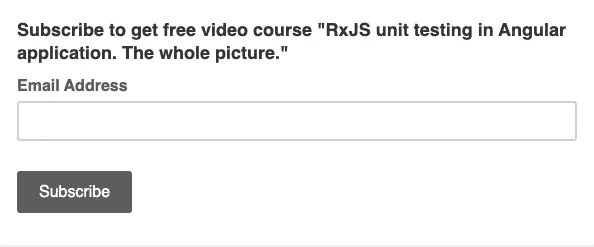

# 在 Stackblitz 上运行角度项目单元测试

> 原文：<https://medium.com/hackernoon/running-angular-project-unit-tests-on-stackblitz-bc091abbfcc9>

*我不是 Stackblitz 团队的一员，所以这不是一篇推广文章:-)我只是认为****stack blitz****是向文章读者展示你的代码的一个很好的方式。但是长期以来，我忽略了一个小特性:如何在 stackblitz* *上运行 Angular 项目，然后切换同一个项目来运行单元测试。感兴趣吗？继续读！*


Switch Stachblitz Angular project to unit test run. (Pic by [Mikkel Bech](https://unsplash.com/@bechbox)0

## 为什么我应该在 stackblits 中运行角度项目单元测试？

嗯，有几次我需要单元测试运行来学习，或者创建一些操场链接来参考技术文章。所以…

## 在 stackblitz 开始您的 GitHub 项目

每个人都知道如何从 GitHub 的 stack blitz*开始 Angular CLI 项目。下面是一段来自官方文件的引文:*

> 从 Github 导入
> 
> 您可以在 Github 上运行任何公共回购，只需提供用户名+回购名称，如下所示:
> 
> `stackblitz.com/github/{GH_USERNAME}/{REPO_NAME}`

例如，下面是我的回购链接:

```
https://github.com/kievsash/NoSniffOptionTest
```

并且相应的*堆栈宽度*链接将为:

```
https://stackblitz.com/github/kievsash/NoSniffOptionTest
```

在这里，您可以看到项目正常运行:

## 让它运行我们的单元测试

好，很好，是我先开始的。但是如何对它进行测试呢？对我来说并不明显，直到我发现

> stackblitz 刚刚运行 **main.ts** 文件

(有一件事情，当你知道的时候，它看起来很简单:-)。

因此，要在 *stackblits* 中开始 Jasmin 测试，我们需要将所有单元测试引导代码放入 **main.ts** 文件中。因此，让我们将当前的 main.ts 重命名为 main.bck，并创建一个新的 main.ts 文件。

为了用 main.ts 中的 Jasmin 运行我们的单元测试，我们接下来应该做:

1.  导入并初始化浏览器模块的 jasmine 和 jasmine
2.  导入 zone.js 模块进行测试
3.  导入出 ***.spec.ts*** 文件
4.  自举角度测试环境

好吧，让我们这样做:

下面是 *stackblitz* 的例子:

**main.ts** file for starting unit tests

## 结论

现在，如果您需要为 Github repo 的某个 Angular CLI 项目提供 playground 运行单元测试，您知道如何做！

请在评论中留下你的*stack blitz*Angular gotches！

如果你喜欢这篇文章— [**发微博说说吧**](https://clicktotweet.com/Lu2aU) 🤓

关注我 [**twitter**](https://twitter.com/El_Extremal) 获取更多 Angular 和 RxJS 文章！

[](http://eepurl.com/gHF0av)