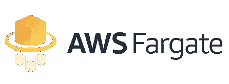

# 在 AWS Fargate 上运行 Laravel Artisan 命令

> 原文：<https://medium.com/hackernoon/running-laravel-artisan-commands-on-aws-fargate-6c0e95f8e72b>



我最近发表了我关于在 AWS VPC 背后运行一个[可扩展、高可用的 Laravel 项目的想法。在这篇文章中，我想谈谈在 Fargate 上运行 Laravel Artisan 命令。](https://hackernoon.com/the-challenges-of-running-laravel-on-aws-9f4480b46cf6)

## 介绍

AWS Fargate 是一项 AWS 托管服务，允许我们在 ECS 上部署 Docker 容器，而无需管理底层基础设施(EC2 集群)。这意味着不再可能使用 bastion 主机获得对容器实例之一的 shell 访问并通过`docker exec`与容器交互。

允许`artisan`在 Fargate 上运行的一个关键概念是 Docker 命令，它负责执行给容器一个存在理由的命令。例如，在 alpine 映像上运行 Apache 时，命令将是`httpd -DFOREGROUND`。这个命令保持容器无限期运行，因为它的实现是一个事件循环，应该永远不会结束。如果我们准备一个带有命令`php artisan my:command`的 Docker 映像，那么这个命令将在容器一启动就被执行。如果命令以状态代码 0 结束，这意味着它成功执行，容器现在准备好正常关闭。这非常好，因为 AWS Fargate 是按分钟收费的，这意味着我们可以在命令执行的几分钟内启动一个容器并付费。

## 履行

实现 Docker 镜像以在 Fargate 上运行`artisan`的第一步是 Docker 多阶段构建。以下 Dockerfile 分为**基础**、**依赖**、**工匠**和 **App** 。

```
+--------------+------------------------------------------------+
|    Layer     |                  Description                   |
+--------------+------------------------------------------------+
|     base     | Operating System dependencies / PHP Extensions |
| dependencies | Application Dependencies / Composer            |
|   artisan    | Layer used for running Artisan commands        |
|     app      | Web Application                                |
+--------------+------------------------------------------------+
```

通过使用多阶段构建，我们可以选择要将哪些阶段推送到 AWS 弹性容器注册中心(ECR)。以下代码片段是 AWS CodeBuild 结合 AWS CodePipeline 使用的`buildspec.yaml`的示例。

注意，AWS ECR 现在有两个图像，一个用于`app`，另一个用于`artisan`。

*注意:AWS ECR、CodeBuild 和 CodePipeline 的配置超出了本文的范围。* ***下面的*** ***步骤假设已经为工匠形象创建了任务定义。***

为 Artisan 图像创建任务定义后，可以使用 AWS CLI 启动一个容器来运行一个`artisan`注册的命令。确保填写`your_cluster_name`、`your_task_definition_name-artisan`、`your_aws_profile`以及**网络配置**文件的正确路径。下面你会找到一个`network.json`的样本。

## 使用

您现在可以通过`sh artisan.sh my:command`运行命令。通过发出这个命令，bash 脚本将指示 AWS CLI 在 Fargate 上使用 Docker 命令覆盖启动一个新容器，该命令覆盖运行`php /app/artisan $1`，其中`$1`是第一个参数，在本例中是`my:command`。Amazon 将使用这个命令在您的 ECS 集群上启动一个容器，命令一完成，容器就会退出。您应该能够将来自 stderr 和 stdout 的任何信息重定向到 CloudWatch，以便能够找出该命令给出的任何输出消息。

您希望运行的命令应该已经包含在被推送到 AWS ECR 的源代码中，并带有`-artisan`后缀。这意味着一旦您编写了自定义命令，您就必须首先推送您的代码更改，然后才运行 bash 脚本。

## 结论

正如我在上一篇文章中提到的，这对于不受 HTTP 请求限制的长时间运行的流程尤为重要。它还在能够在您的生产 VPC 上运行任意命令之前强制执行一个适当的部署过程，如果您的工作场所在推向生产之前有一个良好建立的代码审查过程，这将很好地工作。在一个发布周期之后，不必编写 API 端点来运行一次性流程，这极大地改进了我的开发过程，特别是因为我可以轻松地使用 Artisan 提供的简单控制台命令的 Laravel 思维模式。

这个过程将允许一个团队在生产环境中运行`php artisan migrate`,而不必在 VPC 之外打开 Amazon RDS。然而，由于`migrate`是一个在每个版本中不断执行的命令，我计划写另一篇文章解释如何准备一个专用于迁移的任务定义，它将在每次部署后自动启动。

如果你喜欢阅读我如何在 VPC 背后的 AWS Fargate 上部署微服务，请关注我的[https://hackernoon.com/@deleugpn](https://hackernoon.com/@deleugpn)和[https://twitter.com/@deleugyn](https://twitter.com/@deleugyn)。