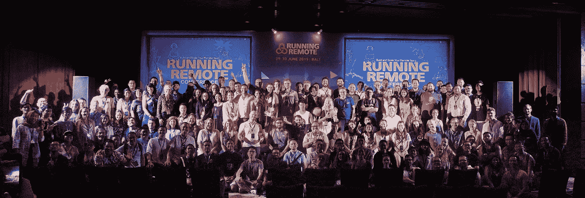
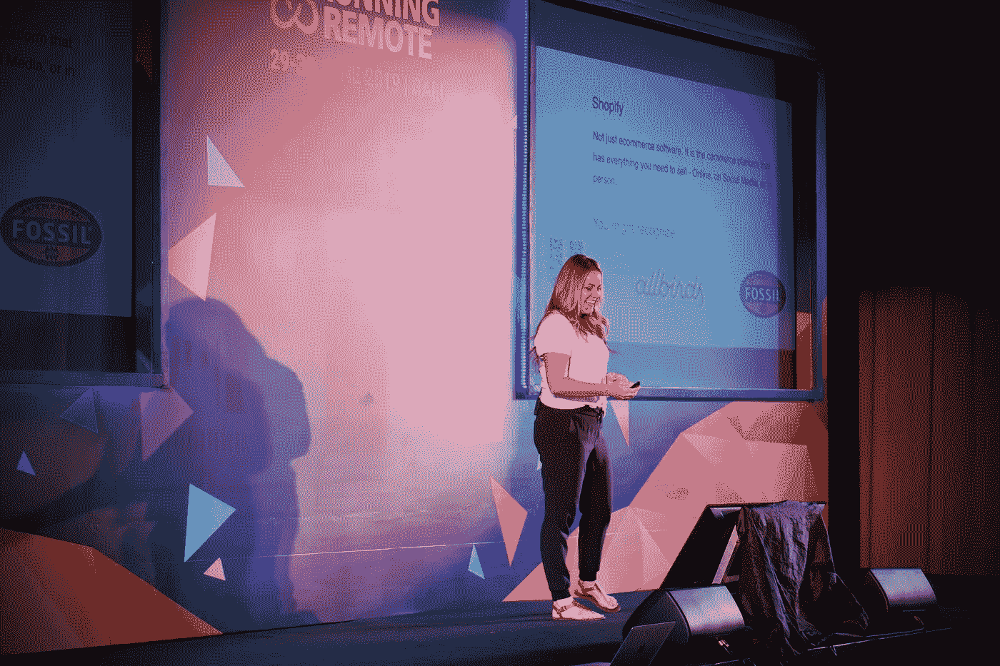
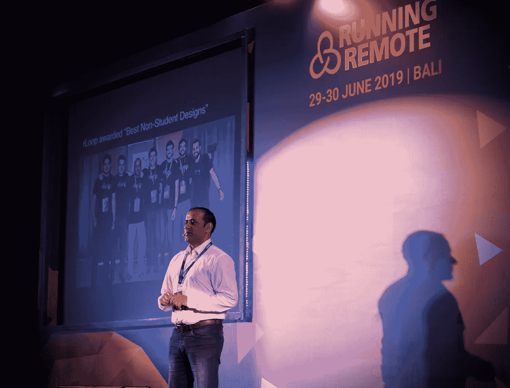
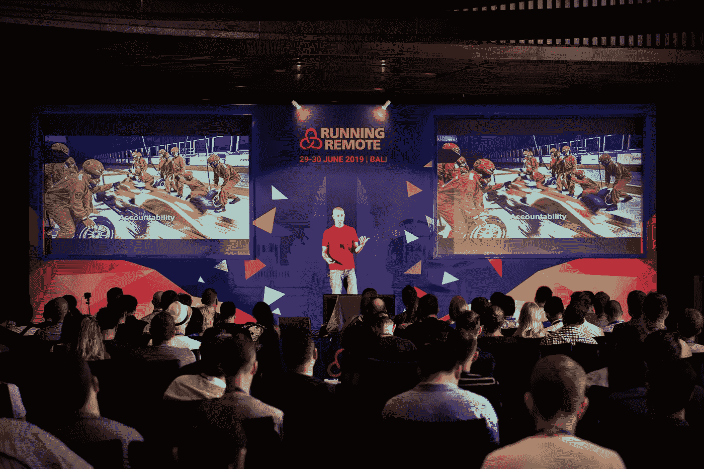
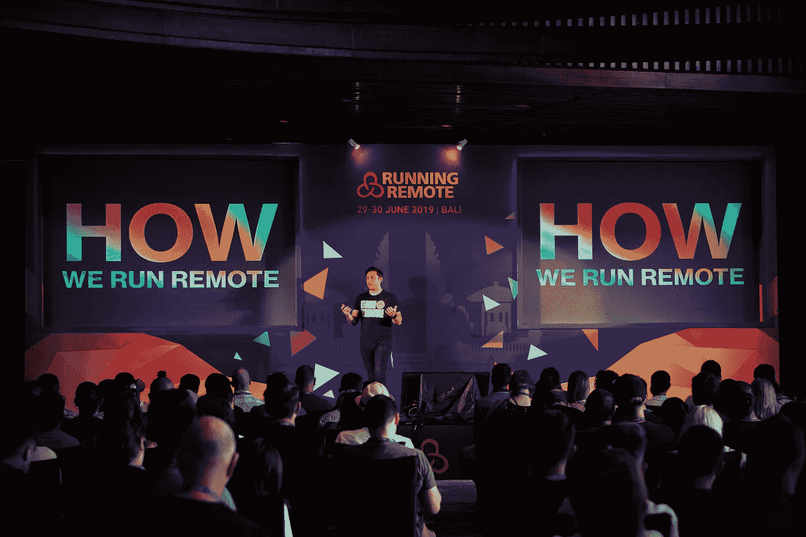
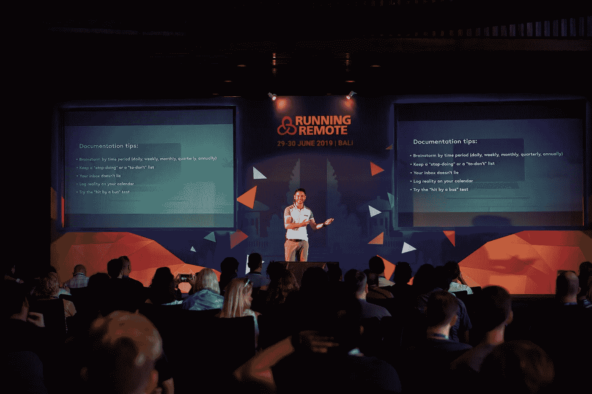

# 运行远程 2019 摘要:未来分散的分布式劳动力

> 原文：<https://medium.com/hackernoon/running-remote-2019-recap-decentralized-distributed-workforces-of-the-future-38b9cd8cff6>

the people behind Running Remote

## 这是六月最后几天在巴厘岛举行的[远程跑步](https://runningremote.com/)会议的简短回顾。

*很短，原因如下:首先，我没有亲自出席活动，其次，在活动真正开始之前，我几乎没有时间熟悉这里的人和活动。尽管如此，我还是从会议中收集了一些最棒的图片，花了几个小时阅读了会议的 Twist 频道，采访了一些人，并在这篇文章中综合了所有这些，这是我在分享我所学到的东西方面的一次谦卑的尝试。我会用大量的图片来编织我的作品，因为它们能表达一千个单词，对吗？*

首先，让我说几句关于大会的话。[远程跑步](https://runningremote.com)是世界上最大的远程工作活动，已经举办了好几年了；这一次，聚集了来自 35 个国家的多达 400 名与会者。

在这场活动中，28 位演讲者中有 [**扎克·奥尼斯科**](https://twitter.com/zack415) ， [Dribbble](https://dribbble.com/) ， [**阿米尔·萨利哈芬迪克**](https://twitter.com/amix3k) ， [Doist](https://doist.com/) ， [**创始人兼首席执行官玛茜·默里**，](https://twitter.com/marciecmurray)Shopify， [**安德鲁如果上面提到的人没有让你想起什么，那么，也许，你已经超过 60 岁了，这是极不可能的(开玩笑)。无论如何，**](https://twitter.com/AndrewWarner)**[演讲者的阵容](https://runningremote.com/conference-speakers/)确实令人印象深刻。**

yes, that’s Bali; jealous? credit: [Eddie Arrieta](https://twitter.com/Fishedinson)

每个人或多或少都明白巴厘岛是一个特别的地方。当你想到巴厘岛时，你会想到什么？沙滩、清澈的蓝天、赤脚舞者的无框风景，还是三者兼而有之？无需过多描述细节，就让我们接受巴厘岛是一个理想的会议场所:温暖的微风，火红的太阳，各种青色的海洋，翠绿的花朵——所有这些都激发了互动和交流的需求——完美的网络！因此，今年的[跑步远程](https://runningremote.com)场地完全合乎情理。

sunrise in Bali, in case you wonder how it looks

会议以在天堂般美丽的花园中建立联系开始，然后是开幕式，巴厘岛女孩穿着金色和酒红色的正宗服装跳舞。来自[的 Tammy Bjelland](https://twitter.com/TammyBjelland) 来自[的 Workplaceless](https://www.workplaceless.com/) ，感谢他们，所有与会者都收到了他们的学习计划，该计划巧妙地将每个演讲分成几个部分，包括一个地方来记下你自己的演讲要点。(需要记住的是，如果你将来打算组织会议，学习计划是一个非常好的主意。)

Balinese girls

在来自[时间医生](https://www.timedoctor.com/)的[利亚姆·马丁](https://twitter.com/vtamethodman)的开场演讲之后，舞台被[安德烈亚斯·克林格**的**和](https://twitter.com/andreasklinger)所占据，安德烈亚斯·克林格以前是 [Product Hunt](https://www.producthunt.com/) 的首席技术官，现在是 [AngelList](https://angel.co/) 的远程人力资源主管，他谈到了建设、管理和扩展工程团队。

之后有几场研讨会:第一场是由来自 [Flagtheory](https://flagtheory.com/) 的 [Edmund Lowell](https://www.linkedin.com/in/edmund-lowell/) 主持的关于金融的研讨会，第二场是由 [Tim Burgess](https://www.linkedin.com/in/burgesstim/) 和 [Duncan Macintosh](https://www.linkedin.com/in/macintoshduncan/) 主持的关于在遵守当地法规的同时进行国际招聘和避免政府官僚主义的研讨会。

来自 [Shopify](https://www.shopify.com/) 的 [**玛茜·默里**](https://twitter.com/marciecmurray) 讲述了她建立分布式团队的实践经验，并分享了一些关于利用全球人才库的重要经验。

Marcie on stage

也许，会议期间最令人期待的环节之一是风险投资小组，来自 [Mixergy](https://mixergy.com/) 、[、**安东尼·庞普利亚诺**、](https://twitter.com/apompliano)、来自[摩根克里克](https://www.morgancreekcap.com/)和[、](https://twitter.com/marvinliao)来自 [500 Startups](https://500.co/) 的马文·廖、[500 Startups](https://500.co/)的马文·廖，他们就如何获得资金进行了非常翔实的讨论

Andrew Warner smiling at something funny, obviously

我交谈和采访的几个人对掌管 HyperLoop 的公司 [rLoop](https://www.rloop.org/) 的创始人兼首席执行官 [**易勒雅斯·瓦利**](https://www.linkedin.com/in/ilyas-vali-a9a611b1/) 的演讲印象特别深刻。易勒雅斯滔滔不绝地讲述了他是如何将远程工作整合到如此庞大而雄心勃勃的项目中的。和突破性技术一样，每个人都对屏幕上的 rWing 个人飞行设备模拟感到惊讶，易勒雅斯在他的演示中展示了这一点。

Ilyas talks future

第二天由 [Hotjar](https://www.hotjar.com/) 的运营副总裁[Ken wearly](https://twitter.com/kenweary)开始，他讲述了自己先去远程办公的决定，并就如何解决与远程办公相关的常见瓶颈给出了建议。

Ken Weary rocking on stage

[**来自**](https://twitter.com/zack415)**[的扎克·奥尼斯科](https://dribbble.com/)** 讲述了他如何用一个不到 50 人的远程团队管理一个拥有数千万人口的社区。Zack 是打破硅谷规则的人，他在没有风险投资的情况下起步，并使用一个完全远程的团队来建立一个超级成功的企业，每个从事 web 开发的人都听说过。

Zack Onisko and his three principles: We have three principles 1) Stay Connected 2) Do Great Work 3) Have Fun.

第二天也特别值得纪念，因为乔纳森·兰齐奥是它的策划者。乔纳森是 Trainual 公司的 CMO，这家公司是他和哥哥共同创办的。作为一名冒险运动员、励志演说家和慈善家，他有很多关于他自己发展混合团队并将其注入到他们的过程文档和方法中的经验可以用来维护和扩展任何其他混合团队。

documentation and methodology are keys to successful remote work management, according to Jonathan Ranzio

[**来自**](https://twitter.com/amix3k) **[Doist](https://doist.com/) 的 Amir Salihefendic** 和 [**来自**](https://twitter.com/nickfrancis) **[Help Scout](https://www.helpscout.com/) 的 Nick Francis** 进行了一次总结性讨论，讨论异步和同步沟通，并讨论了他们构建同样成功的远程团队的不同方法。

Nick discussing the approaches to building remote business

有必要引用扎克·奥尼斯科在他的演讲中所说的话来结束这个简短的回顾:

> “大多数人希望有可能在他们想去的任何地方工作。允许他们这样做是强大的。”

远程工作应该是人类出生时就被赋予的少数不可或缺的权利之一。我们也许应该举办更多这样的活动，来传播远程就业的力量和灵活性，并普及其好处。

*我是一名文案在***，一个招聘网站开发者的平台:* [*招聘*](https://soshace.com/for-clients) *一名开发者或者* [*应聘*](https://soshace.com/for-developers) *远程工作。Soshace 是全球最大的远程工作赛事* [*跑远程*](https://runningremote.com/) *的媒体合作伙伴。如果你有有趣的故事要讲，请在 Twitter 上 ping 我@*[*MaryVorontsov*](https://twitter.com/MaryVorontsov)*我很乐意收到你的来信并分享你的故事。**