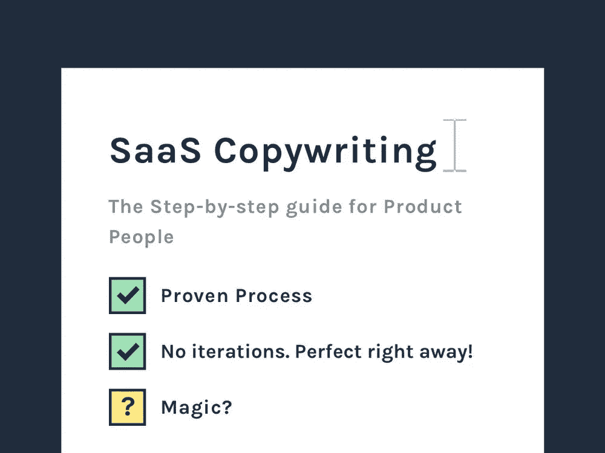
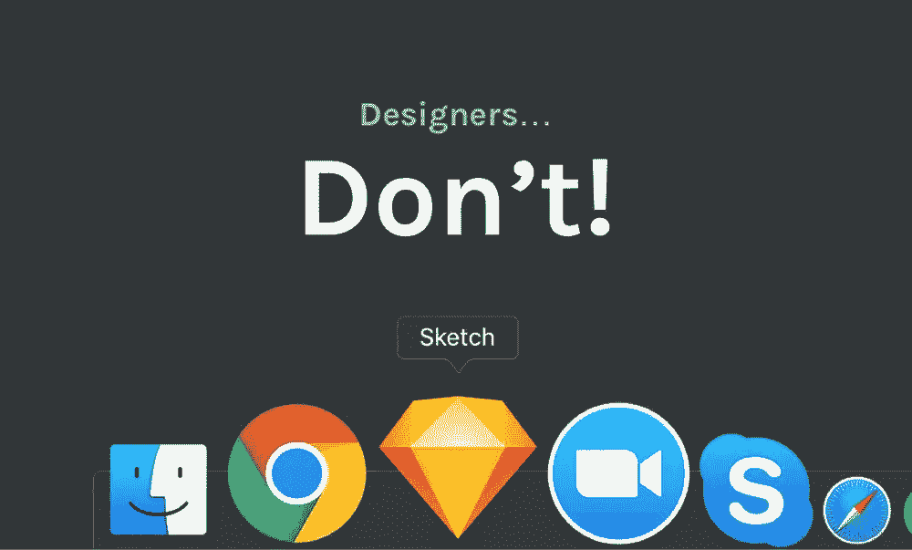
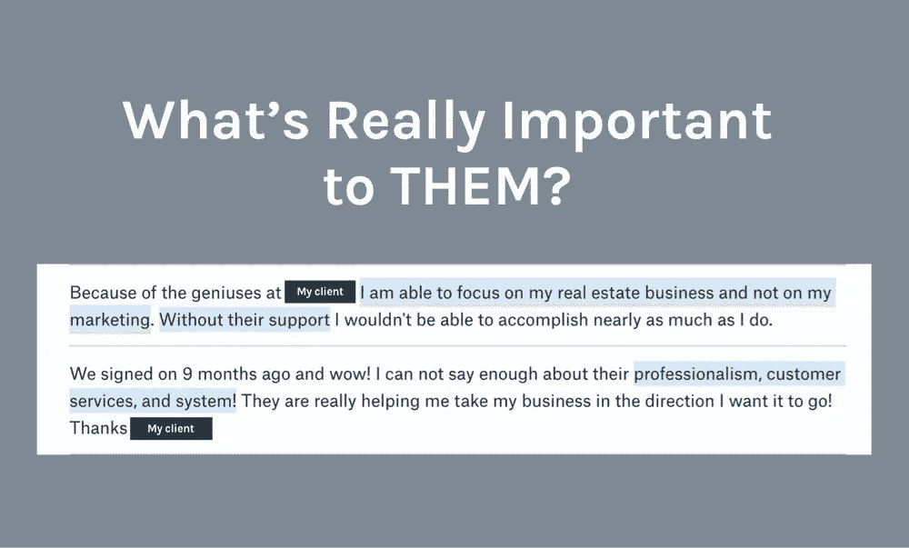
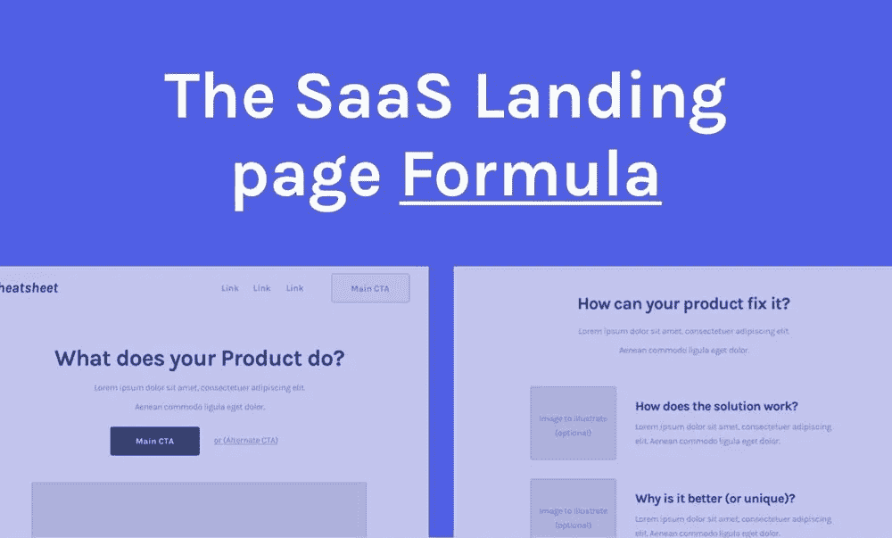
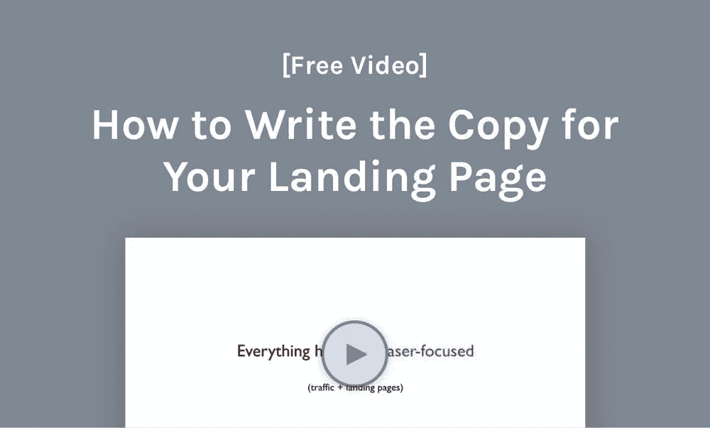

# SaaS 文案:如何让你的信息转化

> 原文：<https://medium.com/hackernoon/saas-copywriting-how-to-work-your-way-to-a-message-that-converts-823ce9f56f1b>

你觉得 SaaS [文案](https://hackernoon.com/tagged/copywriting)难吗？

作为一名产品人员，你可能倾向于过多地关注功能，或者只是努力尽可能有效地解释产品…

你是否也觉得很难去思考你应该写些什么？

页面上应该包含什么，不应该包含什么？

厌倦了你的页面听起来像个“机器人”？

或者只是不知道什么将会工作，并且在让副本工作之前必须经历一百万次迭代？

如果是这样，你就**不孤单**！

我帮助 [SaaS](https://hackernoon.com/tagged/saas) 的公司通过更好的产品解释/信息来转化更多的访问者，我也看到了产品人员努力的地方。

我将利用这些见解来创建这个**循序渐进的 SaaS 文案流程**，产品人员(设计师、营销人员或创始人)可以遵循这个流程来撰写他们的文案**，而无需无休止的迭代。**

就我个人而言，**我可以在大约 15 分钟内定义初稿的 80%**我也可以教你做同样的事情！:)

准备好开始了吗？💪

# 第一步:没人管！

没有人关心你的产品，他们只关心他们自己！

不要说你的特点…

不要谈你的好处…

不要谈论你认为它解决的问题…

**改为…**

谈谈他们的问题。

说说他们的好处。

以及他们会喜欢的功能。

**看出区别了吗？**

这就是你如何抓住他们的注意力。

这就是你让人们了解产品的方式。

如果他们明白如何从中获得价值，他们就会有真正的理由进行转化。

我将在本文的后面告诉您如何找到它们。

> ***现在想要那个教程吗？*** [*下面是视频版*](http://www.cortes.design/video-lp-breakdown) *。*

# 第二步:设计师，不要设计！

在遵循这个过程之前，不要打开你的设计程序。

(尚未)

我知道这种感觉…我是从设计师开始的！

你只是想打开 Sketch(或者 Figma 或者 Invision Studio 或者其他什么时髦的东西)并开始设计页面…

我知道！这对你来说是很自然的，但是当你学习 SaaS 的文案过程时，你需要抵制它。

相信我，它会节省你一堆时间和迭代。

问题是，如果你试图设计登陆页面太快，因此，**你将没有任何指导！**

你不会知道包括什么…

你不会知道不包括什么…

什么应该出现在开头、中间或结尾…

标题应该是什么…

或者你到底要如何取代所有那些“lorem ipsum”…

你甚至很难定义插图，因为你不知道它们的核心目的是什么…

**这就是为什么你需要一堆(无用的)迭代！:(**

不一定非要那样，你应该这样做:

首先定义所有的内容(使用下面的研究过程),然后一切都会为你准备好！

# 第三步:如果你这样做，你的副本将会为你排版！

想听点“疯狂”的吗？

> ***你的团队里没有人要写文案。***

不需要头脑风暴，模糊的角色列表和共享的谷歌文档…

为什么？

你不应该写副本，你应该从别人那里得到…

你需要从你的客户和潜在客户那里得到那份拷贝。

你看，人们已经告诉了你他们想听的。

他们希望你如何解释你的产品…

像您这样的产品，他们最看重的是什么…

最重要的是…你需要什么来改变他们！

你只是没有认真听，至少没有以正确的方式。；)

你需要知道的一切都在你的常见问题、异议、演示(如果你记录了的话)、评论甚至你的竞争对手的评论中！

我仅仅从评价中分析惊人的见解！因隐私而被审查…

人们会告诉你他们的问题是什么，他们重视什么好处，他们真正需要的功能以及你独特的卖点是什么。

所有的，都在那里！

你只需要知道如何**组织和优先处理它们**。

利用你所拥有的任何资源(从上面列出的资源中)，试着回答下面的问题。

一旦你这样做了，我会有一个公式，你可以用它来把它变成一个登陆页面[这里](http://www.cortes.design/video-lp-breakdown)。

# 我们有一个问题…太棒了！

你首先需要找到的是->他们的问题是什么？

你需要这样做有两个原因。

人们购买 SaaS 的产品来解决问题。如果他们不知道你的产品解决了哪个问题，他们为什么要转换呢？

T21:通过解释问题，你提醒他们这有多痛苦，让他们更有可能采取行动解决问题(通过改变)。

所以，想一想…

他们为什么需要你的 SaaS 产品？他们有什么问题？

哦，不是任何问题… **核心问题。**

他们真正愿意为之付费的问题(其他的远没有这么有效)。

这可能是节省他们的时间，有更多的收入，一个行之有效的流程，等等… **这就是你需要发现的。**

找到核心问题了吗？

太好了！现在回答这两个问题…

他们为什么不能自己修理呢？

这将让你清楚你需要如何解释产品，并只关注他们需要了解的事情，以便做出转换的决定。

**不修复它的代价是什么？**

这将有助于你了解你应该做什么来证明你的定价(特别是对于高票 B2B 公司)。

# 实实在在的好处，而不是“有就好”的好处！

SaaS 公司很少谈论真正的利益。

他们写下“它真的很快”、“它很安全”、“它对移动设备友好”…

你猜怎么着？**这还不够！**

这些都是表面的好处……你需要关注这些好处背后的“为什么”。

为什么您的客户需要“快速”、“安全”、移动友好的 it？

**这才是你需要重点关注的。**

最简单的方法是颠倒你解释他们问题的方式。

这样你就可以将产品定位为“完美的解决方案”。

我在这个视频中看了一些例子。

# 说他们的语言，而不是你的…

这是另一个惊人的 SaaS 文案的关键组成部分。

你不用你的术语来解释产品，**你用他们的！**

**注意他们如何描述他们的问题，以及他们将如何描述他们的理想解决方案……**

他们用什么术语？

我说的是用**完全一样的词！**

这就是为什么你知道他们会理解，因为这感觉就像他们自己在解释。

很酷吧？这是有史以来最好的文案之一…我可能顺便偷了它；)

# 第四步:遵循一个成熟的(SaaS 文案)公式

Overview of the SaaS Landing page I use with every project. [Here’s a full breakdown tutorial](http://www.cortes.design/video-lp-breakdown)

既然你已经知道什么对你的潜在客户来说是重要的，我们就用一个公式来组织一切。

我已经在我所有的客户项目中使用了这个公式，并取得了很好的效果！

**下面是公式的概述(** [**完整视频分解这里**](http://www.cortes.design/video-lp-breakdown) **):**

**1)模式中断**——通过逆向工程([加上这个过程](http://www.cortes.design/video-lp-breakdown))抓住访问者的注意力，完美的标题！

**2)介绍问题**——让人们觉得他们真的需要解决你的产品所解决的问题。

**3)将你的产品定位为完美的解决方案**(颠倒你解释问题的方式)。

**4)社会证明—** 不要写“普通的”推荐信……写一些人们能理解的推荐信([这是成功的关键](http://www.cortes.design/video-lp-breakdown))。

**5) CTA 的**——总是有一个主要的 CTA 和一个替代的 CTA，以便在购买者旅程的不同阶段转化人们。随着时间的推移，这可能会给你带来巨大的转化率增长。

我真的不能在一篇文章中很好地解释这一点，所以我创建了一个简短的[视频教程](http://www.cortes.design/video-lp-breakdown)分解整个公式(+真实的例子)。

> ***想要这个公式的逐步分解？*** [*这里有一个视频教程。*](http://www.cortes.design/video-lp-breakdown)

# 第五步:最终调整…

是的，你可能需要调整一些东西，但这很正常！

这就是为什么我咨询客户，帮助他们最大化他们的结果，减少 CAC，即使在我的重新设计完成后！

不要担心，随着时间的推移，你不需要任何重大的改变(除非你的产品或目标发生变化)。

你可能需要一个更好的标题，增加或删除一个部分和一些小的东西，以便在你从市场上获得反馈时获得尽可能好的结果。

就像我说的，如果你遵循正确的 SaaS 文案流程，你不需要很多迭代，你可以马上开始得到结果！

**如果你想了解更多**，并获得如何制作登陆页面的分步指南，那么[这个视频就是为你准备的](http://www.cortes.design/video-lp-breakdown)。

# [高级]免费视频揭示如何撰写 SaaS 登陆页面(一步一步)

**你可以在这里** **获得这个免费的分步视频教程** [**。**](http://www.cortes.design/video-lp-breakdown)

你大概了解了我的 SaaS 文案流程…

你想更进一步吗？

我制作了这个[短视频](http://www.cortes.design/video-lp-breakdown)教程来分解在你的页面的每一部分写些什么！

> ***分解完美 SaaS 的 5 步公式登陆页面****[*这里是你的免费视频。*](http://www.cortes.design/video-lp-breakdown)*

# *嘘…要我帮你做吗？*

*本文仅涵盖我的 SaaS 文案流程…*

*如果我有更多成熟的流程可以分享，会怎么样？*

*我可以在一篇文章里教你一些东西，但没有什么能取代我在数十家 SaaS 公司的经历，这些公司可能和你现在遇到的问题一样。*

***如果我能帮你很好地解释产品，让网站为你销售产品，会怎么样？***

*如果我能帮助你减少迭代次数，让你更快地获得更好的转化率，会怎么样？*

*让你的团队专注于其他地方，而我节省他们的时间，让你得到更好的结果？*

***这对你来说值多少钱？***

*让我们[预订一个自由时间](http://www.cortes.design/qualify)，看看你真正的问题是什么，我是否可以帮助你通过更好的转换实现你的收入目标。*

> ****想看看我们是否合适？*** [*你可以在这里算出来(在 30 秒内)*](http://www.cortes.design/qualify)*

**原载于*[*www . cortes . design*](https://www.cortes.design/post/saas-copywriting)*。**