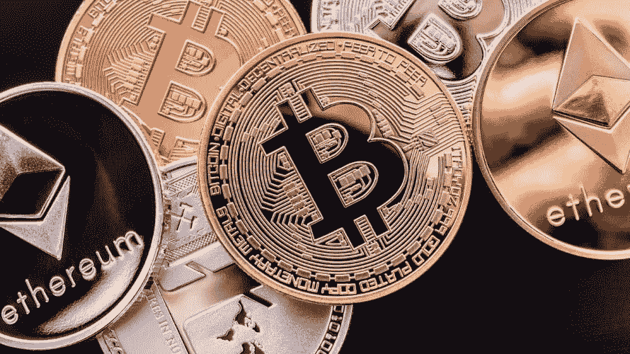

# 三星推出带加密钱包的 Galaxy S10，SEC 解决了对 Gladius ICO 的证券指控

> 原文：<https://medium.com/hackernoon/samsung-launches-galaxy-s10-with-crypto-wallet-and-sec-settles-securities-charges-against-gladius-6d2589856859>

**市场状况—2019 年 2 月 21 日** [**BTC**](https://berminal.com/coins/Bitcoin-BTC)**:3956.65 美元(-0.50%)** [**ETH**](https://berminal.com/coins/Ethereum-ETH)**:145.69 美元(-1.12%)** [**XRP**](https://berminal.com/coins/XRP-XRP)**:0.323143 美元(-1.92)**

在比特币和以太坊都未能突破阻力后，市场今天经历了一次小幅回调。如果这种情况持续下去，预计会出现更大范围的调整。比特币目前正在努力突破 4000 美元，而以太坊为 150 美元。然而，与前一天不同的是，昨日交易量大幅增加。所有十大加密货币现在都亮起了红灯，总市值在过去 24 小时内损失了约 10 亿美元。

其他新闻，[比特币基地钱包，一个由比特币基地加密货币交易所开发的受欢迎的移动钱包，宣布支持比特币现金](https://berminal.com/news/180943/Coinbase-Wallet-Adds-Support-For-Bitcoin-Cash)。该交易所为其客户提供比特币基地钱包作为存储他们自己的加密货币的解决方案。最初，该钱包仅支持以太坊(ETH)和 ERC-20 令牌。此外，Twitter 首席执行官杰克·多西已经通过 tippin.me 安装了闪电网络提示功能，并且已经收到了一些 satoshis。多尔西在推特上写道:“我搞定了这件事，已经有人给了我一些小费。”他展示了一张交易截图，交易金额为 12,362 satoshis，约合 0.49 美元。多尔西最近手持比特币火炬，最近似乎越来越多地参与加密社区。

**1)三星证实，其旗舰产品 Galaxy S10 智能手机将集成安全加密货币钱包。**一份新闻稿宣布，“Galaxy S10 采用国防级三星 Knox，以及由硬件支持的安全存储，其中包含区块链支持的移动服务的私钥。”迄今为止，三星是最大的为其手机添加加密存储选项的手机制造商，有关这一功能的传言从去年就开始流传。目前，HTC 的 Exodus 1 和 Sirin Labs 的 Finney 也提供加密存储功能，但两家公司都没有三星那样的广泛分布。这是一个发展中的故事，将随着更多信息的可用而更新。([阅读更多](https://berminal.com/news/181202/Samsung-Confirms-Galaxy-S10-will-Feature-Integrated-Crypto-Wallet))

**2) Gladius Network LLC 是一家加密初创公司，在 2017 年底持有 1270 万美元的 ICO，已与美国证券交易委员会(SEC)就持有未注册证券发行的指控达成和解。**美国证券交易委员会(SEC)周三宣布了和解，一份新闻稿解释说，ICO 没有根据联邦证券法注册，没有资格豁免当前的注册要求。该协议要求 Gladius 向任何要求退款的投资者返还资金，并且该公司必须根据 1934 年证券交易法将其代币注册为证券。格拉迪斯没有承认或否认任何不当行为。由于 Gladius 自行向监管机构报告了其象征性出售，SEC 决定不进行处罚，SEC 指出，Gladius“表示有兴趣采取迅速的补救措施。”([阅读更多](https://berminal.com/news/181095/SEC-Settles-Unregistered-Securities-Charges-Against-Gladius-ICO))

加密商业银行 Galaxy Digital 的创始人迈克尔·诺沃格拉茨(Michael Novogratz)表示，他是加密安全公司 CipherTrace 的融资伙伴。这家初创公司在由 Aspect Ventures 牵头的一轮融资中吸引了 1500 万美元。据报道，除了投资者之外，银河数码还是 CipherTrace 的客户。银河数码的格雷格·乏色曼说:“适当的反洗钱技术对于数字资产的主流采用至关重要。机构投资者越来越依赖 CipherTrace 这样的平台来监控与交易对手交易的完整性。”CipherTrace 参与“反洗钱(AML)、加密货币取证和区块链威胁情报”([阅读更多](https://berminal.com/news/181290/Michael-NovogratzLed-Firm-Backs-Crypto-Security-Startup-CipherTrace-in-15-Million-Fundraising-Round))

[***订阅百慕达简讯***](https://visitor.r20.constantcontact.com/d.jsp?llr=myyhdl6ab&p=oi&m=1131022639884&sit=9ar6aztmb&f=776989ec-8460-43a4-b86a-bcf8f2f1bca7)

[***免费下载百慕大 App***](https://berminal.app.link/medium-post)

*[***百慕大官方电报***](https://t.me/berminal)*

*[***伯明纳尔推特***](https://twitter.com/berminalapp)*

**