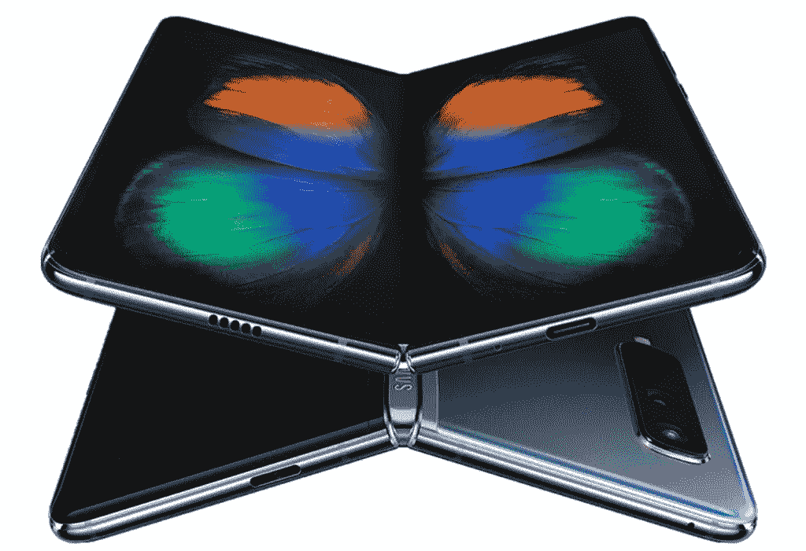

# 三星在可折叠手机上输给了华为

> 原文：<https://medium.com/hackernoon/samsung-lost-to-huawei-on-the-foldable-phone-fcacee141a>

三星是智能手机领域的游戏规则改变者。直到 Galaxy Note 7 这款产品，一切都很顺利。如你所知，这个产品伤害了三星对抗苹果和华为的强势地位。2013 年 i̇n，三星宣布正在研究可折叠智能手机产品。

华为在 2019 年 MWC 峰会上让三星担心该产品，两家公司的规模相同。他们在山顶面对面。三星将可折叠手机藏在受保护的玻璃面板中。另一方面，华为的首席执行官允许科技记者使用该设备。我很清楚三星的情况。华为为这款原型机感到自豪，因为它光滑、性感、有吸引力。三星的可折叠手机很好，尽管他们知道这对他们的用户群体来说还不够。

## 三星对他们的竞争对手有什么反应？

公司努力工作以求成功。我很欣赏华为和三星之间的每一次选拔赛。当华为正在生产 P30/P30 pro 产品时，竞争对手正在向开发者峰会介绍可折叠手机。

在活动中，谷歌正式宣布了 Android 对可折叠手机的支持，特别是对三星的支持。

***我给大家介绍几个产品测试的细节:*** *三星可折叠手机测试 10 万次。结果非常好。对两个屏幕都没有伤害，尤其是两个屏幕之间。可折叠手机设计看起来像一本书。当设备折叠时，场景并不流畅。
*测试人员同时尝试了三个不同的应用程序:在大量的测试过程中没有出现性能下降。在智能手机生产的同时，谷歌也在改变安卓系统的设置。尽管三星希望得到整个社区的支持，但它似乎并没有贿赂开发者。

经过长时间的研究和不眠不休，三星试图向世界上的一些科技记者发送原型产品。发生了什么事？显示屏上有一个无缝的屏幕保护层。测试人员自然地移除了该层。在一些框中有一个通知，比如:“你不应该关闭屏幕保护层。''结果是本季度最糟糕的。

三星开始在美国和其他国家召回可折叠手机的原型。不管我喜不喜欢三星这个品牌，都很可惜。华为是赢家，是能够挑战整个智能手机领域的人。该公司将生产一款通过欧盟测试的可折叠手机。工会批准了该产品的 CE 证书。祝他们下次挑战华为好运。