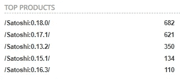
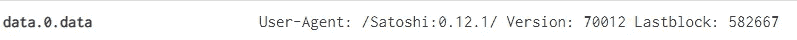
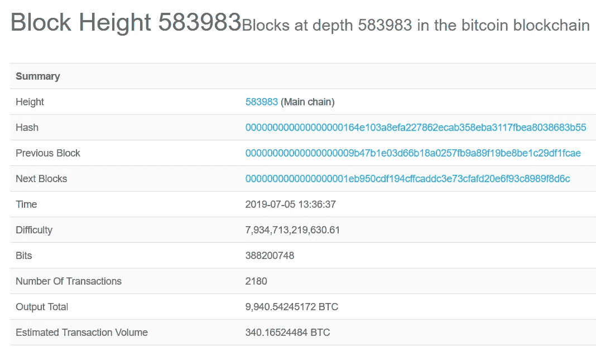
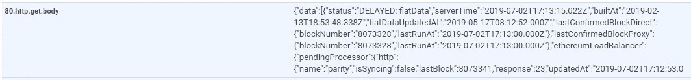
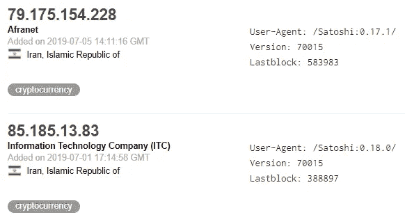
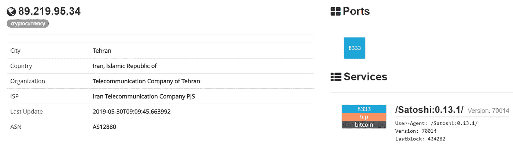
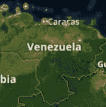
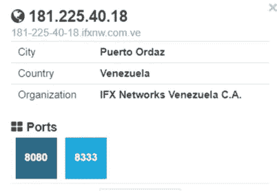
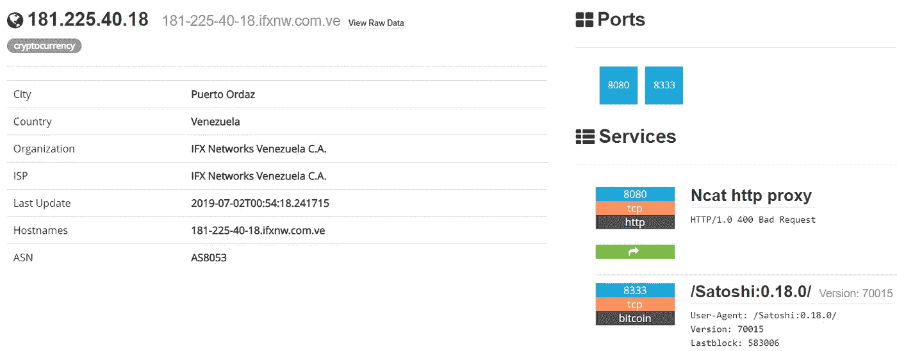

# 制裁 vs 比特币挖矿

> 原文：<https://medium.com/hackernoon/sanction-vs-bitcoin-mining-dd450e04b1e8>

不能用美元？请尝试加密货币

Always listen to Archer memes

对于有能力有效执行的国家来说，制裁是一个强有力的外交工具。美国财政部外国资产控制办公室是实施制裁的幕后力量，负责维护被制裁人员、国家和相关信息。每种情况都不同，OFAC 为关心的市民和企业发布了[指南](https://www.treasury.gov/resource-center/sanctions/Programs/Pages/faq_10_page.aspx)。然而，加密货币的分散性质使得冻结交易或披露要求变得复杂。

使用开源情报收集与互联网扫描和报告工具 [**Shodan.io**](http://shodan.io) 带付费账号和[**censys . io**](http://Censys.io)**带免费研究员账号。这些工具能够发现一些受制裁国家的比特币开采业务。如果使用 API 连接， [Shodan.io](http://Shodan.io) 和 [Censys.io](http://Censys.io) 都更有效；所有结果都以机器可读的格式返回，以便进行更有效的数据分析，建立各种关联和检测。 [**Censys.io**](http://Censys.io) 一个与 [Shodan.io](http://Shodan.io) 类似但不同的工具也可以用来寻找比特币和以太系统。然而， [Censys.io](http://Censys.io) 使用 web 或 API 接口扫描的端口并不多，要深入研究，您可以自己运行 [Censys.io](http://Censys.io) 后面的 ZMap 项目并调整端口。ZMap 可以从 [GitHub](https://github.com/zmap/zmap) 下载。**

**发现比特币和类似的加密货币挖掘系统是通过寻找挖掘硬币的软件和交流挖掘活动的端口来完成的。常见端口有 8333，8433，8778，8885，9595，常见软件 btcwire，Satoshi。还可以发现各种挖掘软件版本，因为应用程序在横幅中显示信息。一些版本的加密货币挖掘软件容易被各种工具利用，如 [XAttacker](https://github.com/Moham3dRiahi/XAttacker) 。此外，一些发现工具，如 [Shodan.io](http://shodan.io) 也用加密货币标记互联网连接系统的类型。为了传达正在开采什么，开采哪些区块，最后一个区块包含在开采系统的横幅中。这可以用来直接[跟踪交易](https://www.blockchain.com/explorer)。**

****

**Different versions of Satoshi mining software from Shodan.io**

****

**Lastblock displaying from Shodan.io scan**

**使用托管在卢森堡的[**Blockchain.com**](http://Blockchain.com)，基于 Lastblock 的交易很容易被发现。**

****

**Iranian Bitcoin mining operation information from Blockchain.com**

****

**Etherium in the HTTP body listing hte Lastblock fromCensys.io**

**大约从 20 世纪中期开始，伊朗就受到了许多限制。美国和伊朗政府玩这种猫捉老鼠的游戏的时间比我们大多数人活着的时间还要长。**

****

**Various versions of Bitcoin mining systems in Iran from Shodan.io**

****

**Older Iranian Bitcoin mining system connected to the internet via Shodan.io**

**[**委内瑞拉**](https://www.treasury.gov/resource-center/sanctions/Programs/pages/venezuela.aspx) 是一个新的受到严重制裁的国家，根据西方新闻媒体的报道，该国目前正面临常规货币短缺。然而，据报道几乎没有食物，干净的水和断断续续的电力供应。该国的比特币开采仍在继续。**

****

**Multiple Bitcoin mining operations in Venezuela from Shodan.io**

****

**Satoshi banner search in Shodan.io for Venezuela**

****

**Mining rig and a proxy from Shodan.io**

**许多国家被列入 OFAC 制裁名单，包括相关人员。这是一个不断发展的过程，美国和其他主要政府将继续利用这一过程来获得一种感知上的好处。一方面，加密货币无处不在的特性使得制裁变得极其困难。然而，为了在池中挖掘并与事务连接，系统必须至少定期连接到互联网。像[shod an . io](http://Shodan.io)&[censys . io](http://Censys.io)这样的工具可以让互联网剥离任何可感知的匿名性。**