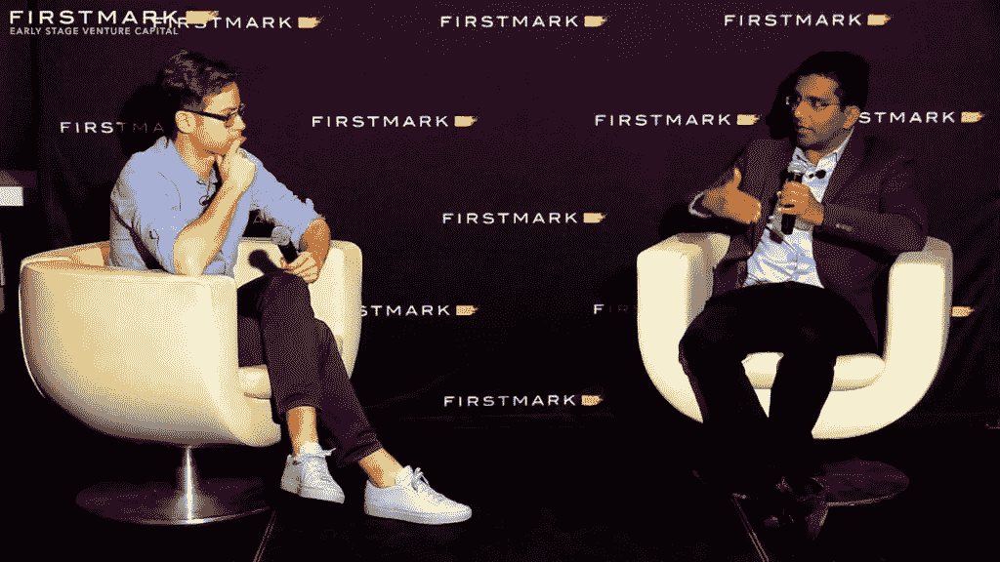

# 扩展人工智能初创公司

> 原文：<https://medium.com/hackernoon/scaling-ai-startups-e4f85e194eaf>

不久前，人工智能初创公司是每个人都感到兴奋的新的闪亮物体。这是一个看似前景无限的时代:人工智能不仅将重新定义商业中的一切，还将为企业家提供建立类别定义公司的机会。

几年后(以及数十亿美元的风险投资)，人工智能初创公司已经重新进入现实。是时候兑现最初的承诺了，并证明人工智能优先的初创公司可以成为令人敬畏的公司，具有长期的差异化和防御性。

换句话说，是时候从“开始”模式转向“扩展”模式了。

明确地说:我一如既往地看好人工智能领域。我相信人工智能是一种不同的、足够强大的技术，只要将其应用于正确的商业问题，就可以通过利用它来建立全新的行业领导者。

与此同时，在过去的三四年里，我作为人工智能初创公司的董事会成员，在数据驱动的纽约市的背景下与许多人工智能企业家交谈，学到了很多东西。我将在这里分享一些笔记。

这篇文章是我大约三年前在 O'Reilly 人工智能大会上发表的演讲的续篇，题为“[建立一家人工智能初创公司:现实&战术](http://mattturck.com/building-an-ai-startup/)”，其中涵盖了许多关于创办人工智能公司的核心想法:建立团队，获取数据，找到正确的市场定位。许多这些概念仍然适用，这篇文章将更多地关注关于扩展的具体经验。

**一些定义**

从语义上来说:作为过去几年市场炒作的结果，已经不清楚“人工智能创业公司”到底是什么了。

基本上有三类人工智能创业公司:

*   “人工智能优先”的初创公司是指其产品没有人工智能的核心就无法运作的初创公司，无论它们是服务于消费者还是企业。AI 在前面，左边和中间。
*   向其他创业公司和财富 1000 强客户提供 AI 工具和基础设施(软件和硬件)的创业公司；和
*   将人工智能作为更广泛的产品或技术堆栈的一部分的初创公司。这包括许多在当前围绕人工智能的热潮之前成立的公司，他们已经在现有的软件产品中添加了人工智能功能。

这篇文章主要是关于“人工智能优先”的初创公司，尽管一些经验可能适用于其他类别，或许也适用于一般的“深度技术”(或“前沿技术”)初创公司。

**哪些 AI 优先的创业公司实际上是规模化的？**

简而言之:不多，只是还没有。这是一项正在进行的工作。

如果你看看 CB Insights 最近公布的前 100 家人工智能公司的名单，大多数都处于 B 轮或 C 轮阶段。很少有人达到真正的大规模，尤其是在人工智能优先的类别中。

这是为什么呢？

这些公司中的大多数仍然非常年轻——可能只有 4 到 6 年的历史。当前这波人工智能创业公司真正开始是在 2012 年之后的某个时候(当时深度学习在年度 ImageNET 竞赛上展示了它的力量)。

当然，其中一些创业公司已经非常成功地筹集了大量资金，并因此雇佣了很多人，这无疑是衡量规模的一个标准。

然而，从收入的角度来看，我的感觉是，大多数人工智能优先的公司仍然处于合理的早期——也就是说，处于一般的 7 位数或 8 位数的 ARR 区间。(在上面提到的其他类别中，有几个更加深入，比如我非常熟悉的 Dataiku，或者 UI Path)。

**风险投资融资:深度技术挑战**

许多人工智能优先的创业公司尚未达到规模的另一个原因是，从本质上讲，它们是“深度技术”公司。

这是一个如今很容易被遗忘的现实。风险投资界的许多人已经得出结论，由于人工智能最终将成为每家公司的一部分，人工智能优先的公司没有什么特别或不同的。也许从长期来看，这是方向正确的，但至少目前来看，这个结论还为时过早。

当然，已经取得了大量的进展，这使得事情变得更容易——像 TensorFlow 这样的开源框架已经可用，云提供商提供快速改善的人工智能基础设施，等等。

我可能还会说，几年前每个人都担心的大问题——获取训练超级数据饥渴的人工智能算法所需的所有数据——已经证明比预期的更容易处理。是的，谷歌和脸书拥有强大的优势，但作为一家初创公司，你不需要世界上所有的数据，只需要解决你所追求的特定问题所需的数据(只要你已经足够狭义和/或垂直地定义了它)。看到人工智能优先的初创公司争先恐后地解决数据获取问题，这已经证明了企业家的足智多谋。这里有许多不同的策略，从与数据丰富的机构合作(例如，医院的放射影像)到创建自己的数据集(无论是合成的，还是通过手动上下旋转整个团队有效地创建，通常是在海外)。

无论如何，与常规的 SaaS(或消费者)创业公司相比，建立人工智能优先的创业公司仍然更加困难和耗时。你就是不能精益并快速迭代。优秀的 ML 工程师持续短缺。数据采集虽然容易处理，但仍然需要花费大量的时间和精力。将模型训练到可接受的性能水平也需要时间。TensorFlow 可能是开源的，但大规模部署它仍然需要罕见的专业知识。

因此，从筹资的角度来看，AI-first 的投资组合往往更接近于其深层技术兄弟公司(工业初创公司、物联网、空间技术、生物等)。).这意味着，在他们能够推出真正的人工智能产品之前，他们有很多 R&D 要解决，所以在每一轮中，在业务指标方面，他们都将落后于更灵活的同行。他们会带着几个飞行员出现在 A 系列赛上。在 B 系列中，他们通常有适合市场的产品，但没有成熟的上市机器。诸如此类。

早期投资者有时间适应这一现实，并逐渐形成了自己的投资标准(参见 Point Nine Capital 的 Louis Coppey 的这篇文章)。通常更注重指标的后期投资者现在开始了解这一代人工智能初创公司，并试图弄清楚如何利用它们。具有讽刺意味的是，“moonshot”人工智能公司(例如自动驾驶)可能更容易筹集到后期融资，因为不清楚应该对它们适用什么指标，所以深度技术叙事可能会让它们走得更远。对于其他人工智能初创公司来说，避免与常规消费者或企业软件公司进行比较将困难得多，因此不要落后太多很重要。

**R & D:知道何时停止**

为了避免落后太多，重要的是不要陷入 R&D 模式太久。

就像任何深度科技公司一样，人工智能优先的创业公司面临着“科学项目”风险。

一部分来自创始团队的 DNA。为了建立一个有趣的人工智能优先的公司，你需要许多真正聪明的工程师，他们喜欢决定性地解决真正困难的技术问题。“疯狂的工程师”的乐趣随之而来。

此外，人工智能的进展往往是反复无常的，并抵制明确的时间表。你会经常听到人们谈论他们是如何在几周或几个月内完成大部分工作的(比如 80%的准确率)，但之后却停滞不前，有时长达数年，试图达到 90%或 95%。有时，由于长期停滞不前，公司会花几个月的时间在一个完全不同的方法上，结果只有微小的改善。或者更糟糕的是，有时你会看到人工智能的性能实际上下降了，例如由于添加了新的数据集。

底线是，人们通常不知道他们的人工智能产品的下一次突破何时会发生(这就是为什么没有人知道第 5 级自动驾驶何时会实际发生)。

因此，即使对于有商业头脑的团队来说，也很容易陷入 R&D 循环。

有一些黑客攻击，但没有银弹。例如，你会看到初创公司为他们的产品构建一个 V1，其中没有任何实际的人工智能，而是与软件和人类一起工作。从客户那里获得真实的反馈是很棒的。但这基本上是在拖延时间。在某种程度上，你必须用一个“真的”人工智能 V2 来替换你的“假的”V1，然后事情就会变得很糟糕。你基本上是在飞行时试图改变引擎。

避免这种漫长的循环并不容易，但最终这是一个管理运输时间表和银行现金的领导力问题(从首席执行官开始)。

我还了解到，在人工智能优先的初创公司中尽早建立产品功能真的很有帮助，他们将为 R&D 团队提供一个很好的平衡。

**产品:创造超越 AI 的价值**

在产品方面有很多有趣的经验。

*坏消息:客户期望你的人工智能是超人*

尽管过去几年取得了惊人的进步，人工智能仍然是一项非常不完善的技术，经常失败。这在需要 100%准确执行的情况下(自动驾驶汽车、医疗诊断)尤为明显(也是有问题的)。

可惜客户不在乎。也许是所有炒作的结果，他们期望你的 AI 是超人。

人类行政助理经常搞砸会议，簿记员错误地对费用进行分类，医生误诊……当涉及人类时，我们不知何故已经接受了这一点，但一旦涉及机器，我们基本上就不能容忍错误。

更糟糕的是，我们大多数人都有一个很大的盲点:我们经常给 AI 错误的指令，导致它失败，但我们仍然会责怪机器！

*回路中的人类没有规模*

鉴于上述情况，很明显，人类经常需要参与进来，以使人工智能在现实世界中工作。

许多人工智能企业家很早就得出这个结论，并在幕后组建了一小群人与人工智能并肩工作。这对最终客户很有效(产品有效)。然而，从商业模式的角度来看，这对创业公司来说是一场灾难。当然，想法是人工智能会变得更好，并最终取代大多数相关人员，但现实是，如上所述，时间线是高度不可预测的。与此同时，你仍然处于负毛利润领域，这使得业务很难融资和增长。这是一个无法扩展的策略的典型例子。

*学会优雅地失败*

诀窍是让你的客户(而不是你的员工)成为“循环中的人”。

当然，谷歌已经这样做了几十年了。这些天，我们都花时间告诉 Google 相册，是的，这是那两张照片中的同一个孩子。你的计算机视觉系统无法解决这个问题，但我很高兴告诉你，并尽我的一点力量让你的算法变得更好。不客气，谷歌！

谷歌让它看起来很容易，但从产品的角度来看，很难确定这种“人工智能与人类的交接”。

很大一部分是为了让人工智能“优雅地失败”。也就是说，它需要在用户感到沮丧之前，或者更糟糕的是，在造成真正的损害之前，尽早明确地告知用户它已经失败了。

然后需要有一个非常清晰的工作流程，让人类来接手。从这个角度来看，简单的图形用户界面，比如为人们提供多种选择的按钮，已经被证明是非常有效的。

*掌握人工智能的社会动态*

确保广泛采用人工智能有一个非常有趣的社会方面，特别是在企业中。人类经常以某种程度的怀疑来看待人工智能(以及一般的自动化)，诀窍在于人工智能赋予员工权力，而不是威胁员工。

迄今为止的经验表明，当人类和人工智能被“并排”放置时，他们不会真正很好地合作。例如，在客户服务场景中，人工智能会实时向代表提出建议，告诉他们应该如何回复客户查询。这有效地将人工智能和人类置于竞争之中。我听说过员工因此破坏人工智能的案例。

相反，从社会采纳的角度来看，将人类放在一个他们可以纠正和改善人工智能的位置上会更好。当人工智能已经在头脑中建立了透明性和“可解释性”(人工智能的一个大趋势)时，这一点特别有效。

最好的公司更进一步，帮助他们的企业客户围绕管理和改善人工智能建立整个团队，通过授权确保一致性(见我们的投资组合公司 Ada Support，及其自动化客户体验团队)。

*向组合中添加 RPA*

最后，我见过的最成功的人工智能优先创业公司很早就明白，人工智能本身不应该是产品价值的唯一驱动力。

通常有一些低(或至少是低)挂的果实比人工智能本身更容易构建。

这些可以包括任何简单的功能(向日历添加缩放集成)、与其他系统的连接器(从企业中最常用的数据源获取数据)、与支付系统的集成(使客户能够在人工智能提出建议后购买)或简单、重复任务的“RPA”式自动化。

具有讽刺意味的是，这些集成或 RPA 功能对最终用户来说与所有人工智能支持的部分一样重要。有时，对最终客户的价值和工程复杂性可能会令人恼火地脱节。

**销售&营销:无需多此一举**

正如深度技术公司经常出现的情况一样，人工智能优先的创业公司对销售和营销表现出不情愿的态度并不罕见。一些公司对雇佣销售人员的想法很纠结，销售人员通常被认为智商不如工程师。有些人决定永远不雇佣任何销售人员，而是使用“前沿部署工程师模式”，即 la Palantir。许多人工智能创始人的最终幻想是一种基本上可以自我销售的产品，因为这项技术实在太棒了。

当然，对于任何想要大规模成功的创业公司来说，分销和产品一样重要。最成功的人工智能首席执行官很早就接受了这一现实，当他们的背景是纯技术时，就把掌握创业的所有业务方面作为一项使命。他们知道这不是一个需要从基本原则开始的领域，而是依靠他们积极招募和授权的高级销售和营销人员的经验。

工程团队的另一个常见问题是用“技术第一”的信息来领导销售和营销。就人工智能而言，这很有趣，因为在过去几年里，向潜在客户谈论人工智能实际上非常有效。每个人都对人工智能感到好奇，许多人会第一次参加会议(或尝试一种新的消费产品)，部分原因就在于此。我所熟悉的许多初创公司后来都正确地认识到，当涉及到实际的购买决策时，客户并不真正关心它是否是人工智能。一些公司已经有效地将人工智能从他们的营销和销售信息中移除。实际上，我认为人工智能的信息仍然有很多腿。虽然以人工智能为主题可能没有意义，但在产品和公司的整体展示中仍然融入人工智能是有价值的。

**结论**

如果这篇文章听起来像是建议人工智能优先的公司为了扩大规模而“减少人工智能公司”，那可能是因为它确实如此。

人工智能优先的创业公司的风险是，在“深度技术”模式下陷入太长时间，团队以工程为主，错过了所有让公司获得风投融资的里程碑。对于他们中的大多数人来说，通常有机会构建“足够好”的人工智能，可以通过更简单的软件和 RPA 类型的功能来补充和增强，并通过屡试不爽的营销和销售方法有效地分发，只要相关团队足够早地加入。

如果他们能做到以上几点，我非常相信人工智能优先的初创公司将真正扩大规模，成为类别领先，有时是类别定义的公司。我们仍然处于人工智能创业公司的创建浪潮的早期，有更多的机会，我很高兴看到这一切如何发展。

*封面图片:在数据驱动的纽约，与 Vicarious 首席技术官迪利普·乔治的对话。*