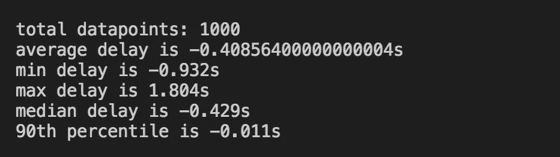
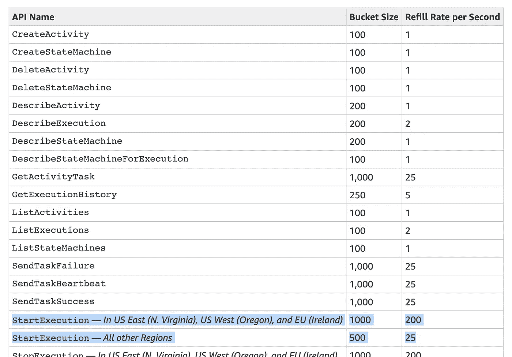
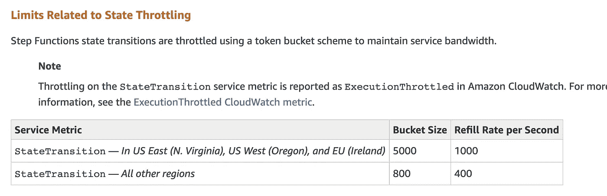
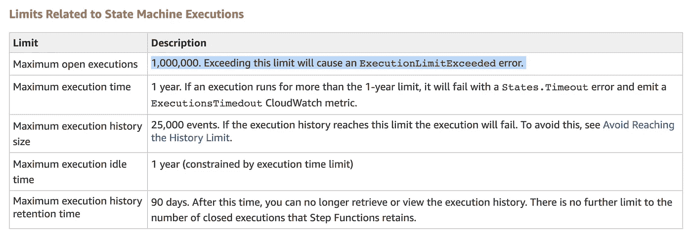
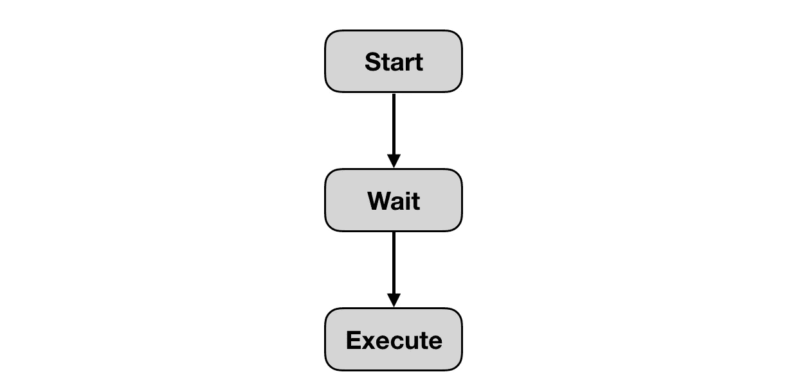

# 使用步骤功能调度临时任务

> 原文：<https://medium.com/hackernoon/schedule-ad-hoc-tasks-with-step-functions-87018a00822b>

我们之前讨论过如何使用 [DynamoDB TTL](https://theburningmonk.com/2019/03/dynamodb-ttl-as-an-ad-hoc-scheduling-mechanism/) 以及 [CloudWatch Events](https://theburningmonk.com/2019/05/using-cloudwatch-and-lambda-to-implement-ad-hoc-scheduling/) 来实现一个临时调度系统。现在，让我们看看如何使用 AWS Step 函数实现相同的系统，以及这种方法的优缺点。

和以前一样，我们将使用以下标准评估这种方法:

*   **精度**:任务的执行距离我的预定时间有多近？越近越好。
*   **Scale(未完成任务的数量)**:解决方案能否扩展以支持许多未完成的任务。即已调度但尚未执行的任务。
*   **扩展(热点):**该解决方案是否可以扩展为在大约同一时间执行许多任务？例如，数百万人设置了一个计时器来提醒自己观看超级碗，所以所有的计时器都在接近开球时间时启动。

# 使用阶跃函数等待

阶跃函数的一个低调的超能力是[等待状态](https://docs.aws.amazon.com/step-functions/latest/dg/amazon-states-language-wait-state.html)。它允许你暂停一个工作流程长达一整年！

通常情况下，Lambda 很难实现空闲等待。但是使用 Step 函数，就像几行 JSON 一样简单:

```
"wait_ten_seconds": {
  "Type": "Wait",
  "Seconds": 10,
  "Next": "NextState"
}
```

您也可以等到特定的 UTC 时间戳:

```
"wait_until" : {
  "Type": "Wait",
  "Timestamp": "2016-03-14T01:59:00Z",
  "Next": "NextState"
}
```

您也可以通过用`Seconds`替换`SecondsPath`，或者用`Timestamp`替换`TimestampPath`来参数化等待/直到多长时间。这允许您使用状态机输入来控制等待时间。

例如，我可以将一个`expiraydate`传递给状态机，并使用它来控制何时继续工作流。

```
"wait_until" : {
  "Type": "Wait",
  "TimestampPath": "$.expirydate",
  "Next": "NextState"
}
```

为了调度一个特别的任务，我可以启动一个状态机执行，并使用一个`wait`状态来暂停执行，直到指定的日期和时间。

## 精确

我启动了 1000 次状态机执行，每次等待 1 到 10 分钟来调用一个 Lambda 函数。这是将实际调用的时间戳与预期时间戳进行比较的结果。



如你所见，这种方法的精确度非常高。

## 可扩展性(热点)

如果您需要在突发中调度大量任务，那么您需要考虑 API 对`StartExecution`请求数量的限制。对于大多数地区来说，这是从 500 英镑开始，以每秒 25 英镑的速度补充。

是的，这是一个**软限注**，因此您可以通过支持中心请求提高限注。但鉴于违约限额如此之低，你不太可能大幅提高它们。因此，如果您需要支持每秒调度成千上万个任务，那么这种方法可能不适合您。



当`wait`状态到期时，我们的预定任务将会执行。但是，如果您已经安排了大量的任务同时执行，那么它们可能会受到限制。因为在状态转换的数量上有一个硬限制(见下文)。



如您所见，这个限制很宽松，对于大多数工作负载来说不会造成问题。但是，如果您需要安排倾向于聚集在一起的临时任务，那么您需要考虑这一点。例如，一个让用户安排特别提醒的系统可以体验围绕重要事件的大型热点——超级碗、总决赛、冠军联赛决赛等。

## 可扩展性(未完成任务的数量)

Step Functions 还有 1，000，000 个打开执行的硬限制，即已经开始但尚未完成的执行。这将是我们可以使用 Step 函数调度的最大未完成任务数。



对大多数人来说，一百万个开放任务应该足够了。但是，因为您可以等待长达一年的时间，所以它为您留下了一个很大的时间窗口，可以累积未完成的任务。有许多用例需要安排数百万个开放的任务。

幸运的是，这个限制有变通办法。我们可以将其用作“最后一英里”解决方案，而不是使用阶跃函数来提供端到端解决方案。大卫·威尔斯的这个好建议值得称赞。

这种变通方法还缓解了在突发事件中启动太多任务的规模限制。我们将把项目写到 DynamoDB(用 TTL ),而不是立即开始执行 Step 函数。

DynamoDB 具有很强的可扩展性，并且对打开的任务数量没有限制。它缺乏精确性(官方文档[仅确认数据通常在 48 小时内被删除)通过让步骤函数执行执行的“最后一英里”来解决。这种结合使得这两种方法可以很好地互补。](https://docs.aws.amazon.com/amazondynamodb/latest/developerguide/howitworks-ttl.html)

然而，它并不是防弹的。因为您使用阶跃函数来执行调度任务，所以您仍然受到状态转换的硬限制的约束。此外，如果所有任务都计划在 48 小时内执行(并且您关心精度)，那么您根本不能依赖 DynamoDB TTL。

# 费用

关于 Step 函数需要记住的另一个警告是，它是 AWS 上最昂贵的服务之一。一百万次状态转换将花费您 25 美元，这是 Lambda 调用成本的许多倍。

用于预定任务的最简单的状态机需要 3 次状态转换。因此，一百万个预定任务仅步骤函数就要花费你 75 美元！然后，你还必须考虑 Lambda 和其他外围服务(如 CloudWatch 日志)的成本。



# 摘要

在调度临时任务时，阶跃函数带来了很多好处:

*   您可以将任务安排在一年后执行
*   预定任务的时间非常精确
*   从 Step 函数中获得的所有常见的可视化、日志记录和审计功能

然而，它也不是没有局限性。阶跃函数有许多软限制和硬限制。虽然这些限制对于大多数用例来说应该足够高了，但这并不意味着您只能扩展到某个点。

但是，您可以解决其中一些问题:

*   对公开执行次数的限制
*   对`startExecutions` API 请求的限制

如果将阶跃函数与 DynamoDB TTL 结合使用。

最后，与其他方法不同，这种方法的成本是一个更大的问题。这是因为 Step 函数是一种相对昂贵的服务。这就是为什么我一般建议主要针对业务关键型工作负载使用阶跃函数。

# 阅读其他方法

*   [DynamoDB TTL 作为临时调度机制](https://theburningmonk.com/2019/03/dynamodb-ttl-as-an-ad-hoc-scheduling-mechanism/)
*   [使用 CloudWatch 和 Lambda 实现临时调度](https://theburningmonk.com/2019/05/using-cloudwatch-and-lambda-to-implement-ad-hoc-scheduling/)


嗨，我的名字是崔琰。我是一个 [**AWS 无服务器英雄**](https://aws.amazon.com/developer/community/heroes/yan-cui/) 和 [**量产无服务器**](https://bit.ly/production-ready-serverless) 的作者。我已经在 AWS 中运行了近 10 年的大规模生产工作负载，我是一名架构师或首席工程师，涉足从银行、电子商务、体育流媒体到移动游戏等多个行业。我目前是一名专注于 AWS 和无服务器的独立顾问。

你可以通过[邮箱](mailto:theburningmonk.com)、[推特](https://twitter.com/theburningmonk)和 [LinkedIn](https://www.linkedin.com/in/theburningmonk/) 联系我。

查看我的新课程，[**AWS 步骤功能完整指南**](https://theburningmonk.thinkific.com/courses/complete-guide-to-aws-step-functions) 。

在本课程中，我们将介绍有效使用 AWS Step Functions 服务所需了解的一切。包括基本概念、HTTP 和事件触发器、活动、设计模式和最佳实践。

点击获取您的副本[。](https://theburningmonk.thinkific.com/courses/complete-guide-to-aws-step-functions)


来了解 AWS Lambda: CI/CD 的操作性**最佳实践**，本地测试&调试功能、日志记录、监控、分布式跟踪、金丝雀部署、配置管理、认证&授权、VPC、安全性、错误处理等等。

还可以用代码 **ytcui** 获得**票面价格 4 折**。

点击获取您的副本[。](https://bit.ly/production-ready-serverless)

*原载于 2019 年 6 月 27 日*[*https://theburningmonk.com*](https://theburningmonk.com/2019/06/step-functions-as-an-ad-hoc-scheduling-mechanism/)*。*