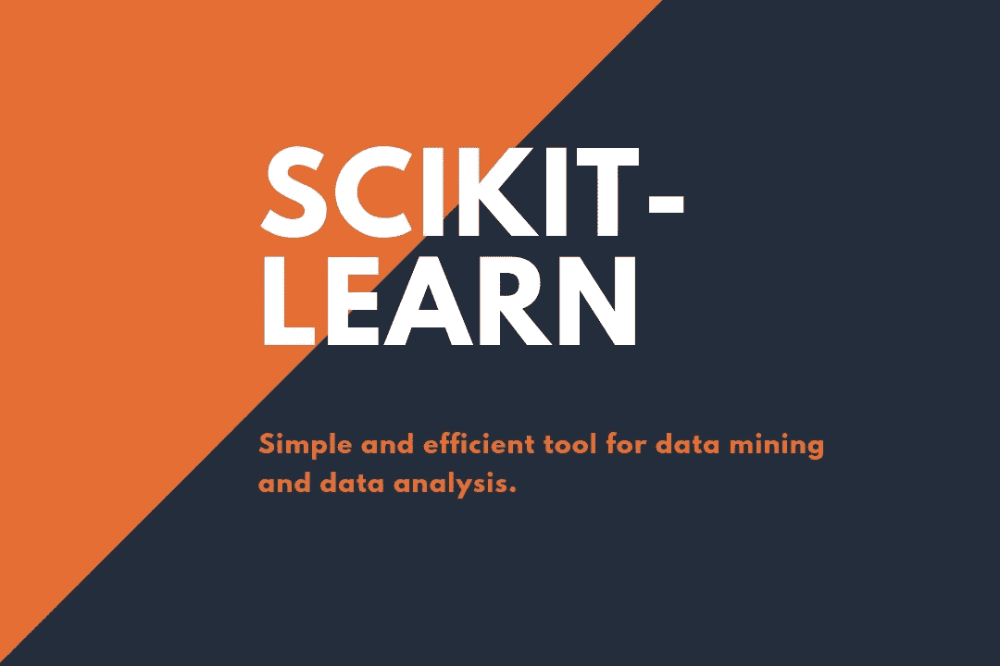
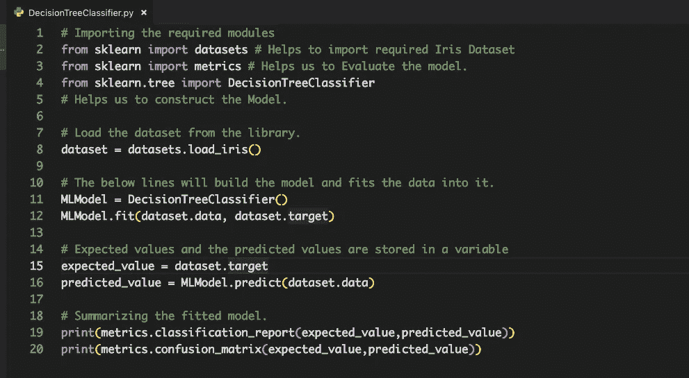
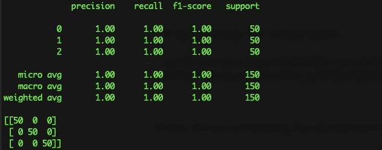

# scikit——用于机器学习的学习库

> 原文：<https://medium.com/hackernoon/scikit-learn-library-for-machine-learning-in-a-nutshell-35fead4b216d>

## Python 中健壮库(Scikit-learn)的完整概述，并附有示例。



Python 是机器学习、人工智能和深度学习中使用最广泛的编程语言之一。python 在数据科学领域的流行是由于其庞大的库。它提供了很棒的开源库，帮助开发人员非常容易地自动化他们的任务。大多数机器学习工程师用于数据预处理、分割数据集以进行测试和训练以及用于构建机器学习模型的最庞大的库之一是***Scikit-Learn:****简单高效的数据挖掘和数据分析工具* ***。***

Scikit-learn 通过一致的界面提供了大量的监督和非监督学习算法。这有助于工程师以一致的方式非常容易地构建模型。

# Scikit-Learn 库的实现

这个库是建立在 SciPy(科学 Python)之上的，在使用 Scikit-learn 之前必须安装 SciPy。该堆栈包括:

**熊猫**:数据结构与分析

**NumPy** :基本 n 维数组包

科学计算的基础库

**Matplotlib** :综合 2D/3D 绘图

**IPython** :增强型交互控制台

Sympy :符号数学

# Scikit-Learn 库的特点

它提供了几个特性和内置模型来减少开发时间。Scikit-learn 中提供的模型和功能有:

**监督学习模型**:支持以下模型实现算法，包括:

1.  线性模型
2.  分类模型
3.  支持向量机
4.  纳维·贝叶斯
5.  决策树

**降维:**用于减少数据中的属性数量，以便进行汇总、可视化和主成分分析等特征选择。

**交叉验证:**用于评估监督模型对未知数据的性能。

**特征选择:**用于识别有意义的属性，以创建监督模型。

**参数调整:**用于充分利用监督模型。

**流形学习:**用于总结和描绘复杂的多维数据。

> 这些是 Scikit-learn 库提供的各种功能。我想用一个简单的**决策树分类器**来演示这个库。

## 利用 Scikit-Learn 实现决策树分类器

Scikit learn 库不仅因内置的机器学习模型而闻名，也因内置的数据集而闻名。在这个演示示例中，我将使用内置的虹膜数据集。

每个机器学习模型都是从在程序中导入所需的库开始的。

```
# Importing the required modules
from sklearn import datasets # Helps to import required Iris Dataset
from sklearn import metrics # Helps us to Evaluate the model.
from sklearn.tree import DecisionTreeClassifier
# Helps us to construct the Model.
```

在导入所需的库之后，我们需要加载数据集来训练我们的模型。

```
# Load the dataset from the library.
dataset = datasets.load_iris()
```

现在我们需要通过选择所需的分类器来建立一个模型。在我们的例子中，它是决策树分类器。

```
# The below lines will build the model and fits the data into it.
MLModel = DecisionTreeClassifier()
MLModel.fit(dataset.data, dataset.target)
```

训练完模型后，我们需要根据我们的测试数据集测试模型，以进行预测并计算模型的准确性和性能。

```
# Expected values and the predicted values are stored in a variable
expected_value = dataset.target
predicted_value = MLModel.predict(dataset.data)
```

获取我们构建模型的总体指标这将在 Scikit-learn only 的帮助下完成。

```
# Summarizing the fitted model.print(metrics.classification_report(expected_value,predicted_value))print(metrics.confusion_matrix(expected_value,predicted_value))
```

最后，我们生成分类报告和混淆矩阵。

**混淆矩阵:**混淆矩阵是一个表格，通常用于描述一个分类模型(或“分类器”)对一组真实值已知的测试数据的性能。它允许算法性能的可视化。

执行上面的示例会产生如下所示的结果。



Overall Source Code in a SnapShot



Model Output.

# 结论

Scikit-learn 的能力非常惊人，因为我们可以用仅仅 10 行代码构建一个简单的模型，并且还有更多特性需要探索。与传统的建模方式相比，它可以让我们的生活变得更加轻松。

看看我的[推特](https://twitter.com/Sri_Programmer)、 [Github](https://github.com/srimani-programmer) 和[脸书](https://www.facebook.com/srimani.programmer)。🙂