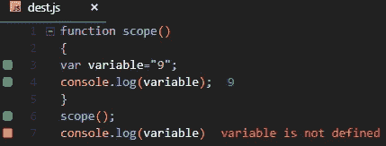
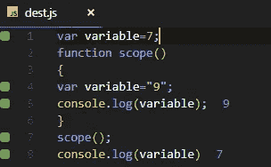
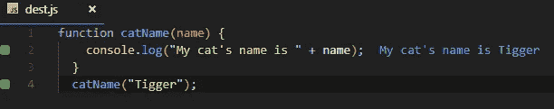
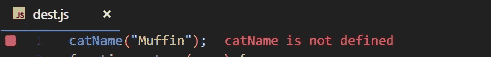
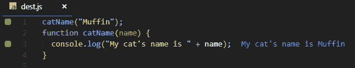
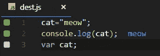
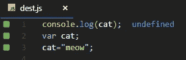
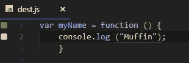

# JavaScript 中的范围和提升

> 原文：<https://medium.com/hackernoon/scope-hoisting-in-javascript-19b991babc4f>

理解提升需要很好地理解 JavaScript 中的作用域。所以我们将从示波器开始。


Photo by [Christopher Baumeister](https://unsplash.com/@c_baumeister?utm_source=medium&utm_medium=referral) on [Unsplash](https://unsplash.com?utm_source=medium&utm_medium=referral)

# 范围

**作用域**决定了 JavaScript 程序内部变量的可访问性。JavaScript 定义了两种范围

*   **功能范围**
*   **全球范围**
*   **阻塞范围**

## 功能范围

在函数作用域中，在函数内部声明的变量只能在该函数内部访问，或者只能被在该函数内部声明的其他函数访问。这些变量被称为局部变量。



在这个例子中，我们在函数范围内声明了一个变量，并输出了它的值。这是成功的，因为它在函数的范围内。当变量在范围之外打印时，我们得到的错误是变量没有被定义。



在这个例子中，当我们在函数作用域之外创建一个变量并打印变量的值时，我们会根据定义变量的作用域得到相同变量的不同值。

**全局范围**

在任何函数作用域之外、全局作用域之内定义的变量和函数称为全局变量/函数。该程序中的任何成员都可以访问和操作它们。


这与上面的例子相同，第一行中定义的变量在全局范围内。程序中的任何成员都可以访问和更改它。

通过这个例子，我们还可以推断出，函数内部的局部变量比全局变量具有更高的优先级。这是因为全局变量和局部变量具有相同的名称，但是当打印变量时，由于给予局部变量更高的优先级，所以打印局部变量的值。

## 块范围

ES6 之前的 JavaScript 没有块作用域的概念。当引入块范围时，还引入了两个新的关键字来加强范围行为。我们先来讨论一下它们。

**让&保持不变**

简而言之，let 和 const 的行为基本相同，主要区别在于，const 不能被重新赋值，而 let 可以。

当使用 let 或 const 关键字在块 **{}** 中定义一个变量时，它们在该块之外是不可访问的，而如果使用 var 定义了相同的变量，它仍然具有全局作用域(如果该块不在函数中)。

```
{ 
  let x = 70;
}
// x can NOT be used here{ 
  var x = 274;
}
// x can be used here
```

附:试抓**挡块**在 **ES6** 推出前**挡块**范围内。

因此，考虑到上面关于范围的部分，清除了基础知识，让我们继续进行**吊装**。

# 提升

以前提升是指一种机制，在代码执行之前，程序中的函数/变量声明被移动到它们作用域的顶部。这意味着无论函数/变量在哪里声明，它们都被移动到它们作用域的顶部，不管它们是全局作用域还是局部作用域。

这是外部的感觉，但内部的过程几乎没有什么不同。根据 MDN

> 在*编译*阶段，变量和函数声明被放入内存，但是停留在您在代码中键入它们的地方。

这有点令人困惑，不容易一读就明白。让我们看一些例子来了解这实际上意味着什么。



在任何编程语言中，像这样的函数定义和调用都是非常标准的，这里没有错误，我们得到我们的输出。


不支持提升的语言，或者如果我们禁用提升，上面的实现将抛出一个错误。



Error

再谈起重的定义

> 在*编译*阶段，变量和函数声明被放入内存，但是停留在您在代码中键入它们的地方。

在这里，函数声明在编译时放在内存中，所以从哪里调用函数并不重要，因为 JS 知道声明在内存中的确切位置。希望弄清楚，吊装究竟是什么。

让我们用例子来了解更多关于吊装的知识。

*   JavaScript 在执行任何代码段之前将函数声明放入内存，是因为它允许您在代码中声明函数之前使用它。这和上面的例子是一样的



*   提升让我们在声明变量之前使用初始化和使用变量。



*   JavaScript 只对该变量进行声明，而不是初始化/赋值。



因为只有声明被提升，在使用后初始化一个声明的变量会产生 undefined。

*   函数表达式不被提升。



这是一个关于在 JavaScript 中使用提升的简介。如果你喜欢你所读的，跟着拍手！


Google