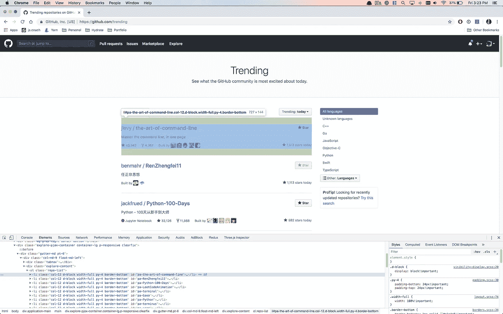

# 用 Node.js 抓取网页

> 原文：<https://medium.com/hackernoon/scraping-the-web-with-node-js-f7da67d2f734>

## 一个深入的指南，以建立一个最小的，强大的网页抓取提取结构化数据的互联网上。

Image courtesy of [Gerrie van der Walt](https://unsplash.com/@gitfo) ([Unsplash](https://unsplash.com/photos/m3TYLFI_mDo)).

Node.js 提供了一个完美的、动态的环境来快速试验和处理来自 web 的数据。

虽然如今视觉刮痧产品越来越多( [import.io](https://www.import.io/) 、 [Spider](https://tryspider.com) 、[scratching hub](https://scrapinghub.com/)、 [Apify](https://apify.com/) 、[Crawley](http://crawly.diffbot.com)、……)，但始终需要手工书写一次性刮痧的简单性和灵活性。

这篇文章旨在作为在 Node.js 中编写这些类型的数据提取脚本的教程，包括我多年来从编写几十个这类爬虫中所学到的一些微妙的最佳实践。

特别是，我们将逐步了解如何为 GitHub 的[趋势知识库列表](https://github.com/trending)创建一个刮板。如果您想跟随代码，请点击**查看回购** [刮痧趋势](https://github.com/transitive-bullshit/scrape-github-trending)。

# 积木

Node.js 最大的特点之一是它提供了非常全面的开源模块社区。对于这种类型的任务，我们将非常依赖两个模块: [**获得了**](https://github.com/sindresorhus/got) 来健壮地下载原始 HTML，以及 [**cheerio**](https://github.com/cheeriojs/cheerio) 提供了一个 jQuery 启发的 API 来解析和遍历这些页面。

Cheerio 非常适合快速和肮脏的网页抓取，在这种情况下，您只需要对原始的 HTML 进行操作。如果您正在处理更高级的场景，您希望您的爬虫尽可能接近地模仿真实用户或导航客户端脚本，您可能会希望使用 [**木偶师**](https://github.com/GoogleChrome/puppeteer) 。

与 cheerio 不同，puppeteer 是一个自动化无头 chrome 实例的包装器，这对于使用现代 JS 驱动的 spa 非常有用。由于您使用的是 Chrome 本身，它还具有同类最佳的解析/呈现/脚本一致性支持。无头 Chrome 仍然相对较新，但它可能会在未来几年逐步淘汰旧的方法，如 [PhantomJS](http://phantomjs.org/) 。

就 [**got**](https://github.com/sindresorhus/got) 而言，NPM 上有几十个可用的 HTTP 抓取库，其中一些更受欢迎的替代库是 [superagent](https://github.com/visionmedia/superagent) 、 [axios](https://github.com/axios/axios) 、 [unfetch](https://github.com/developit/unfetch) (同构===可从 Node.js 或浏览器使用)，以及最后的[request](https://yarnpkg.com/en/package/request)/[request-promise-native](https://github.com/request/request-promise-native)(目前最受欢迎的库，尽管维护者已经正式否决了任何未来)

# 入门指南

好的，在本教程中，我们将为 GitHub 的[趋势库列表](https://github.com/trending)编写一个刮刀。

编写 scraper 时，我做的第一件事是在 Chrome 中打开目标页面，看看所需数据在开发工具中是如何组织的。

Chrome Devtools is very handy for scraping 💯Also, I know I know I need to charge my laptop…. 😂

在`Console`和`Elements`选项卡之间来回切换，您可以使用控制台中的`$$(‘.repo-list li’)`选择器来选择所有趋势回购。

在创建这些 [CSS 选择器](https://adam-marsden.co.uk/css-cheat-sheet)时，你要寻找的是让它们尽可能简单，同时也让它们尽可能集中。通过浏览`Elements`选项卡并选择您感兴趣的元素，您通常会找到一些可能有用的选择器。下一步是使用`$$()`语法在`Console`选项卡中尝试它们，以确保您只选择了您想要选择的元素。这里的一个经验法则是尽量避免使用 HTML 结构或类的某些方面，这些方面在重构或代码重写中可能会更频繁地改变。

# 我们来写个刮刀吧！

现在，我们已经对一些将我们想要的数据作为目标的 CSS 选择器有了一个很好的想法，让我们将它们转换成 Node.js 脚本:

注意，我们在这里使用了 [async / await 语法](https://zeit.co/blog/async-and-await)来以看起来同步的方式处理外部网页的异步下载。

*   第 12 行:我们下载远程页面并提取它的文本`body` (HTML)。
*   第 14 行:我们将 HTML 加载到 cheerio 中，以便于遍历和操作。
*   第 15 行:我们使用之前的 CSS 选择器选择所有的存储库`li`元素，并映射它们。
*   第 16–32 行:我们将每个趋势报告的相关部分提取到一个普通的 JSON 对象中。
*   第 33 行:这里我们过滤掉任何解析失败或抛出错误的 repos。这些将是数组中的`undefined`，`[].filter(Boolean)`是过滤任何非真值的简写语法。

至此，我们已经成功抓取了一个网页并提取了一些相关数据。这里有一些 JSON 输出的例子:

Example of data scraped from single trending page.

# 爬得更深

既然我们已经探索了如何抓取单个页面，下一个合乎逻辑的步骤是扩展并抓取多个页面。您甚至可以从这一点开始递归地抓取链接，但现在我们将只专注于在这些数据中向下抓取一层，即存储库 URL 本身。

我们将遵循一个非常类似的方法来收集原始趋势列表。首先，在 Chrome 中加载一个示例 GitHub 存储库，查看 GitHub 公开的一些最有用的元数据，以及如何通过 CSS 选择器定位这些元素。

一旦您很好地处理了想要提取的数据，并且在`Console`中有了一些可用的选择器，就该编写 Node.js 函数来下载和解析单个 GitHub 存储库了。

这里与我们第一个抓取示例唯一真正的不同是，我们使用了一些不同的`cheerio`实用方法，如 [$。find()](https://github.com/cheeriojs/cheerio#findselector) 并做一些额外的字符串解析来强制数据满足我们的需求。

此时，我们能够分别提取关于每个回购的大量最有用的元数据，但我们需要一种方法来稳健地映射我们想要处理的所有回购。为此，我们将使用优秀的 [**p-map**](https://github.com/sindresorhus/p-map) 模块。大多数情况下，无论是限制网络带宽还是计算资源，您都希望对并行性设置一个实际的限制。这才是 [p 图](https://github.com/sindresorhus/p-map)真正出彩的地方。我 99%的时间都用它来替代`Promise.all(…)`，它不支持限制并行。

这里，我们映射每个存储库，一次最多并发 3 个请求。这大大有助于使您的爬虫更健壮地应对随机的网络和服务器问题。

如果您想在这里再增加一层健壮性，我建议将您的子抓取异步函数包装在 [p-retry](https://github.com/sindresorhus/p-retry) 和 [p-timeout](https://github.com/sindresorhus/p-timeout) 中。这就是[得到的](https://nicedoc.io/sindresorhus/got)实际上正在做的事情，以确保更健壮的 HTTP 请求。

# 现在都在一起

下面是完整的可执行 Node.js 代码。您还可以在 [scrape-github-trending](https://github.com/transitive-bullshit/scrape-github-trending) 找到完整的可复制项目。

[https://github.com/transitive-bullshit/scrape-github-trending](https://github.com/transitive-bullshit/scrape-github-trending)

以及相应的 JSON 输出示例:

Example of scraped JSON output.

# 结论

我已经在 Node.js 中的一次性抓取任务中使用了这个模式几十次了。它简单、健壮，并且非常容易定制成几乎任何目标抓取/抓取场景。

值得一提的是 [scrape-it](https://github.com/IonicaBizau/scrape-it) 看起来也是一个非常好的工程库，基本上完成了本文中的所有工作。

如果你的爬行用例需要一个更加分布式的工作流或者更加复杂的客户端解析，我强烈推荐你去看看[puppet er](https://github.com/GoogleChrome/puppeteer)，这是一个来自 Google 的改变游戏规则的库，用于自动化 headless Chrome。你可能还想查看在[awesome-puppeter](https://github.com/transitive-bullshit/awesome-puppeteer)中列出的相关爬行资源，例如 [headless-chrome-crawler](https://github.com/yujiosaka/headless-chrome-crawler) ，它提供了一个基于 puppeter 的分布式爬行解决方案。

然而，根据我的经验，在 95%的情况下，像本文中这样的简单的单文件脚本都可以很好地完成工作。而且，imho， [KISS](https://en.wikipedia.org/wiki/KISS_principle) 是软件工程中最重要的一条规则。

感谢您的时间&&祝您在未来的刮擦冒险中好运！

## 在你走之前…

*如果您喜欢这篇文章，请点击👏下面，星* [*回购*](https://github.com/transitive-bullshit/scrape-github-trending) *，或与他人分享，让他们也能享受。*