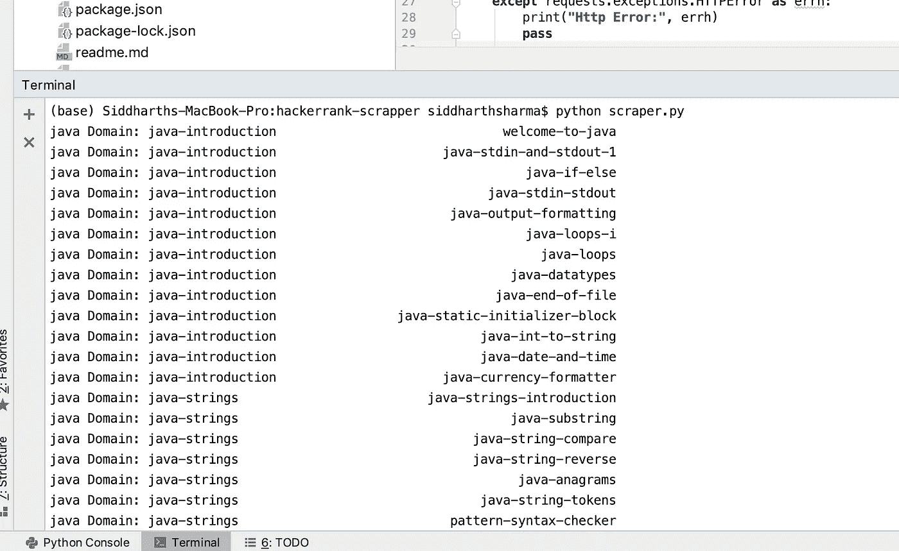
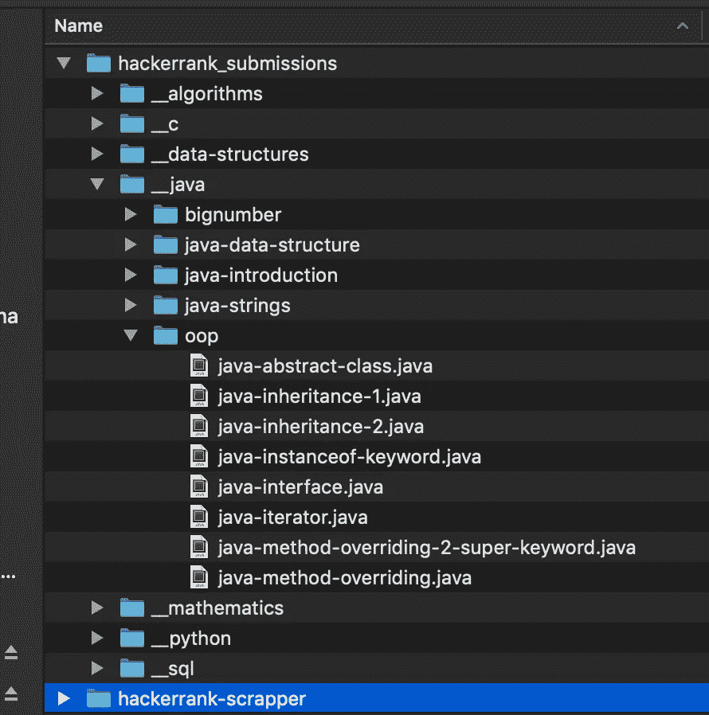

# 如何用 Python 废弃你的 HackerRank.com 提交

> 原文：<https://medium.com/hackernoon/scrapping-your-hackerrank-com-submissions-with-python-d409bdf516bb>


在 [github](http://github.com) 上有许多储存库，人们在那里上传他们在 [hackerrank](http://hackerrank.com) 上解决的问题的解决方案。当我开始在 [hackerrank](https://hackernoon.com/tagged/hackerrank) 上解决问题时，我也开始做同样的事情，因为它提供了一个地方来回顾我已经练习过的东西。但是随着我开始解决更多的问题，手动复制粘贴它们变得越来越困难，所以我写了一个 [python](https://hackernoon.com/tagged/python) 脚本来做同样的事情。

目前，该脚本被配置为通过 Java、Python 和更多轨迹进行废弃，并且可以被配置为通过在轨迹数组中添加轨迹来添加额外的轨迹。对于源代码，这里是存储库链接。

 [## hearsid/hackerrank-scrapper

### 这里有一篇文章，详细介绍了如何使用这种回购，以获得您已经解决的问题的解决方案…

github.com](https://github.com/hearsid/hackerrank-scrapper) 

以下是为您的帐户使用它的步骤

1.  克隆上面的存储库，或者可以复制所需的 python 文件。
2.  登录到您的 hackerrank 帐户，从任何 XHR 请求的标题中复制 CSRF 令牌和 cookie。(你可以在 chrome devtools 的网络标签中查看)
3.  在同一个文件夹中创建一个 credentials.py 文件，并在其中添加您的 CSRF 令牌和 cookie。第 6 点后给出的样本。
4.  转到 scraper.py 文件，在轨迹数组中添加要废弃的轨迹。
5.  转到 util.py 文件，并为曲目更新您想要保存文件的扩展名。
6.  运行`> python scraper.py`

```
# credentials.py
CSRF_TOKEN = "CVKP-XXXX-lYT7iQ=="
COOKIE = "hackerrank=ea729eb0–XXXX-3114"
```

运行该命令后，您将看到哪个问题的解决方案从哪个域下载，附上截图供参考。



一旦问题被下载，你会得到一个文件夹结构，就像这个下载的解决方案，你可以在你最喜欢的编辑器中打开它。



请创建一个问题，如果你发现任何不工作或想要求一个功能。