# Scrum 在 15 部漫画中变得疯狂

> 原文：<https://medium.com/hackernoon/scrum-gone-wild-in-15-cartoons-cca23937a183>

Scrum 是一种有助于分解庞大且不灵活的产品开发过程，并公开反馈的方法。它为产品团队引入了更快的评估周期。

然而，无论遵循 Scrum 框架有多好，每个团队有时都会偏离正道。最终，我们都是有偏见和不完美的人。没有意识到我们的反模式，可能会释放一只藏在羊皮中的瀑布狼。

我画了 15 幅讽刺虚假 Scrum 实现的漫画。通过漫画，我们以一种有趣的方式再现了颠簸的情况。意识到团队行为中的不完美是理解我们可以改进什么的关键。

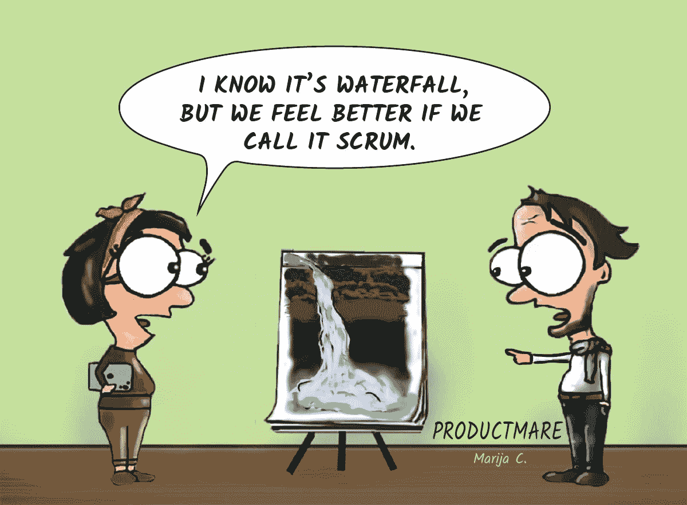

It’s a placebo Scrum.

# 每日脱口秀

关键是与你的团队分享正确的信息。还有你自己。

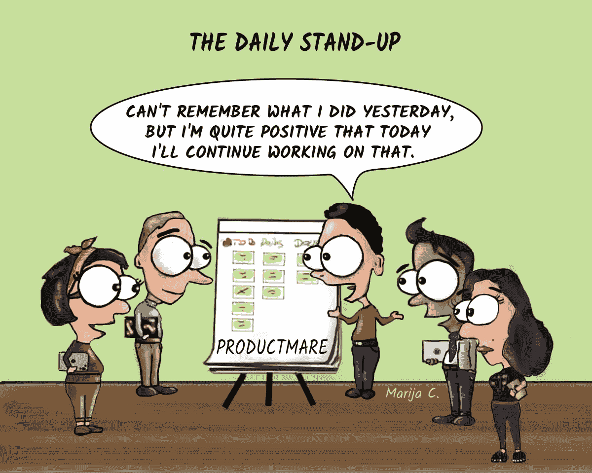

I’m sure you will.

你知道那些持续时间比永恒还长的日常会议。这里有一个如何在 15 分钟的时间框架内保持你的单口相声的提示。

We’ll untie him later.

# 冲刺回顾

当利益相关者不高兴时。

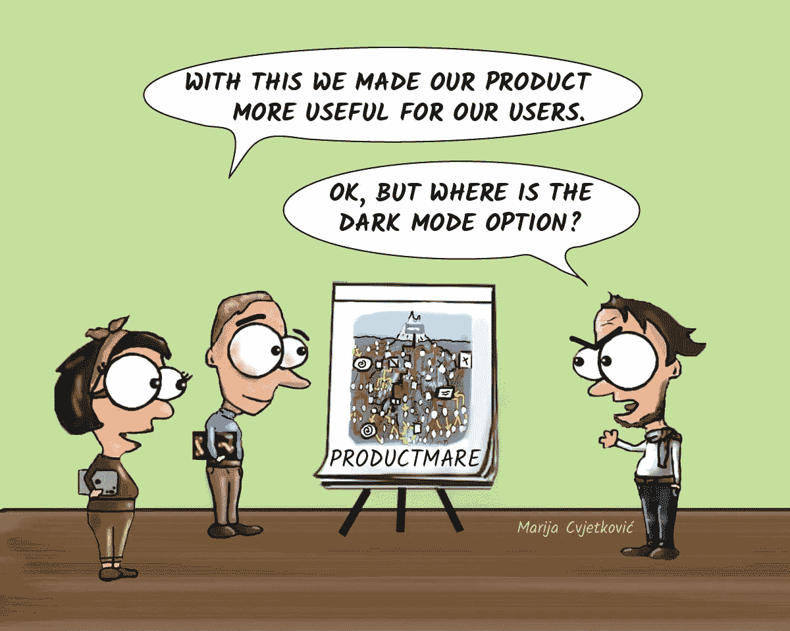

Turn the light switch off and there it is.

# 冲刺回顾

当你无话可说时。

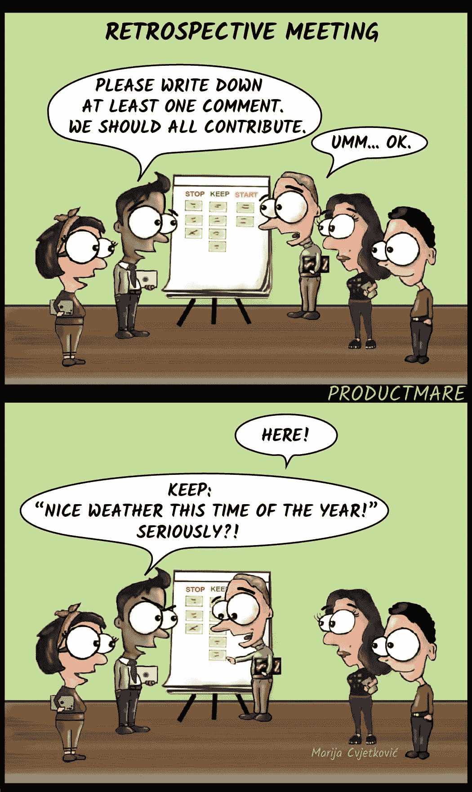

I was time pressured.

当你没有每天和你的团队公开交流，把所有的挫折留到回顾会上。

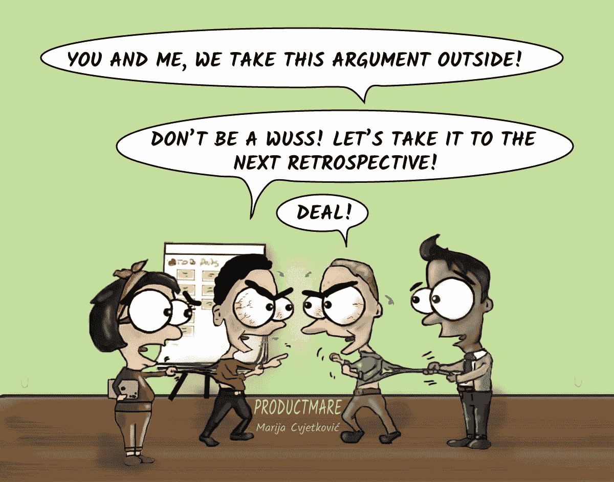

Scrum master gets to be a boxing match judge.

然后全部倒出来。

When someone asks why did the project fail.

# 冲刺规划

当产品负责人准备你的待办事项时。所有需要做的事，对吗？

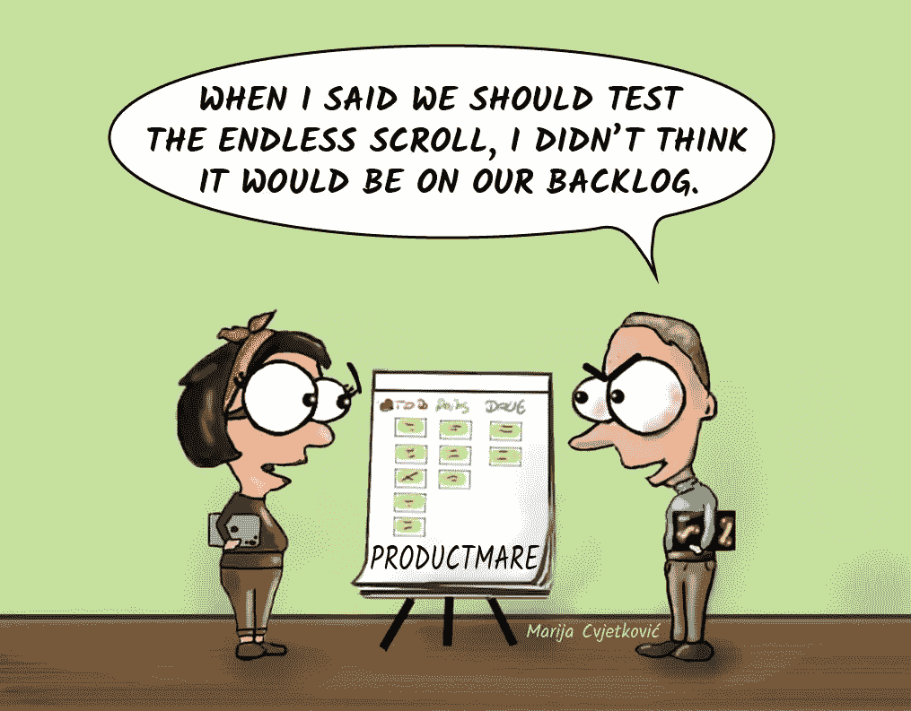

That’s one way to test it.

当开发人员准确估计任务的规模时。

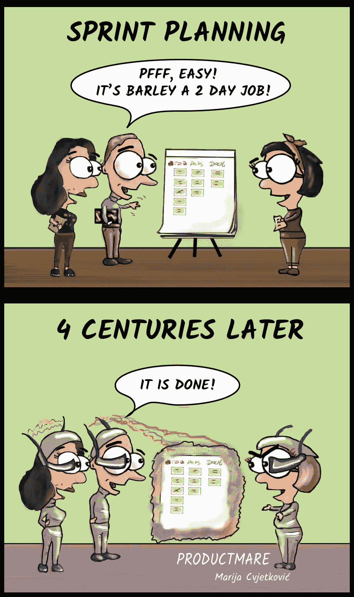

Luckily, we’re still alive.

当故事跨越多个冲刺时。

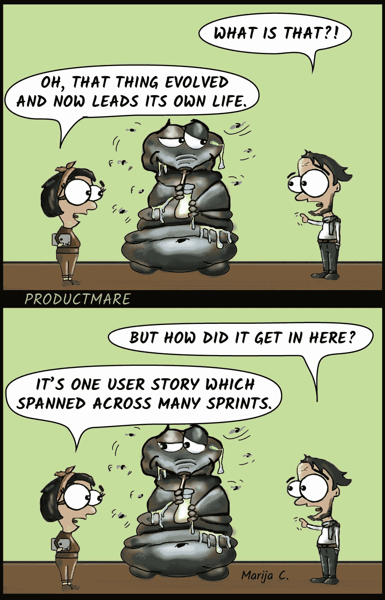

Split or suffer

# 要求

当产品负责人写下需求并倾注了她的心血和博士论文时。

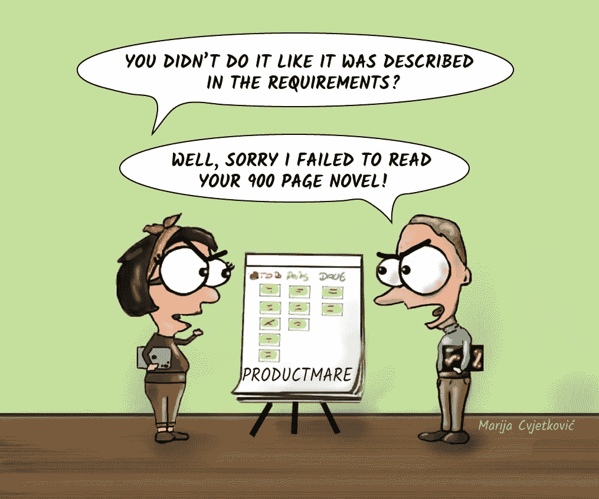

Dostoyevsky in Jira.

或者产品负责人只是忽略了文字，回到了传统的口头交流。人类已经靠口头讲述生存了很长时间，对吗？

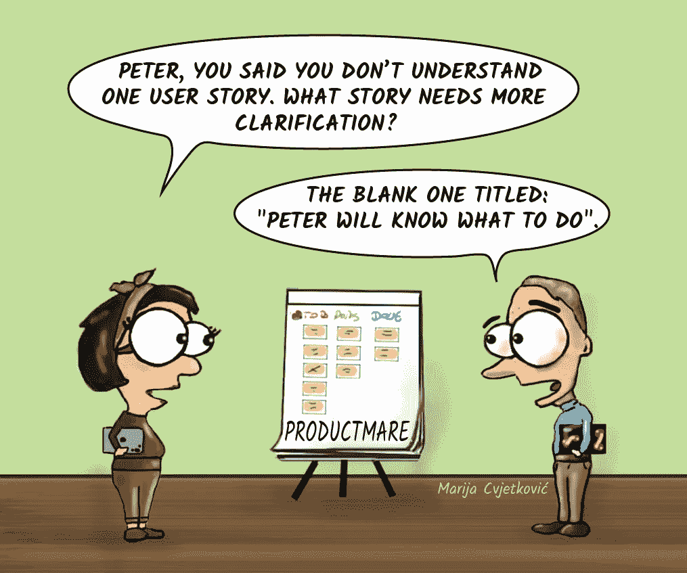

Why don’t you remember?

# 中断

但是我们刚刚制定了冲刺计划！

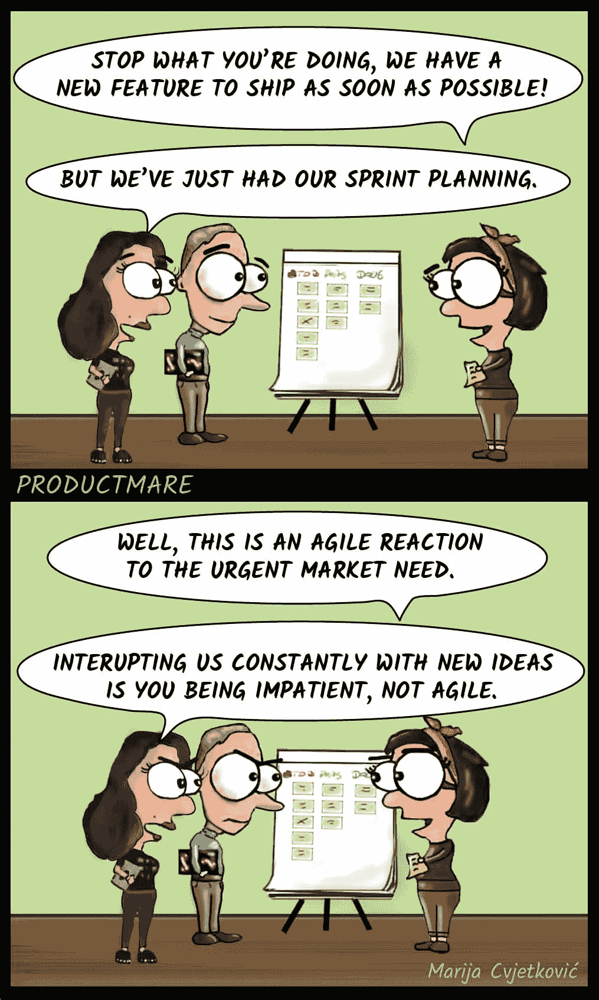

Just this one urgent thing.

当事情紧急，但缺少材料时。

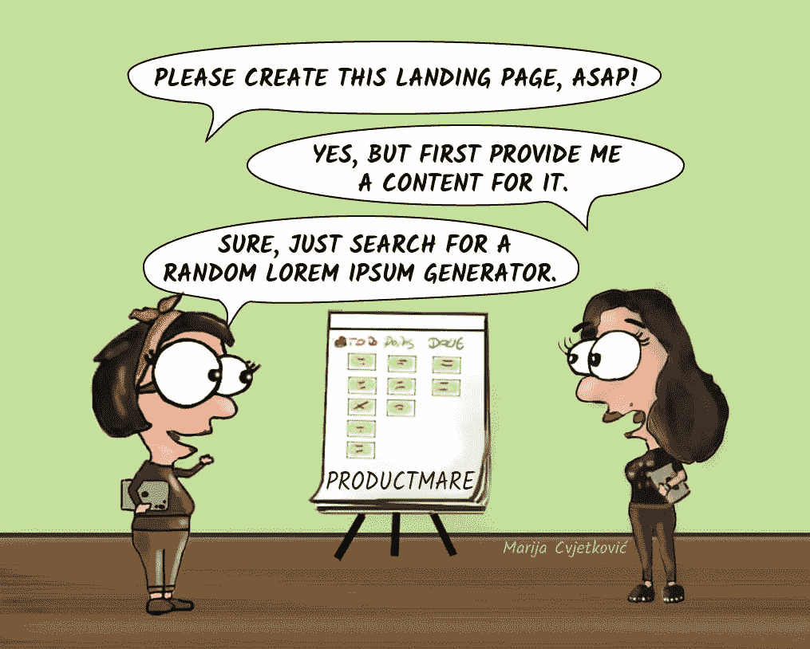

Such a useful tool.

# 产品卫生

当事情变得太杂乱时，打开玛丽·近藤的思维模式，清理你的产品作品是很有用的。

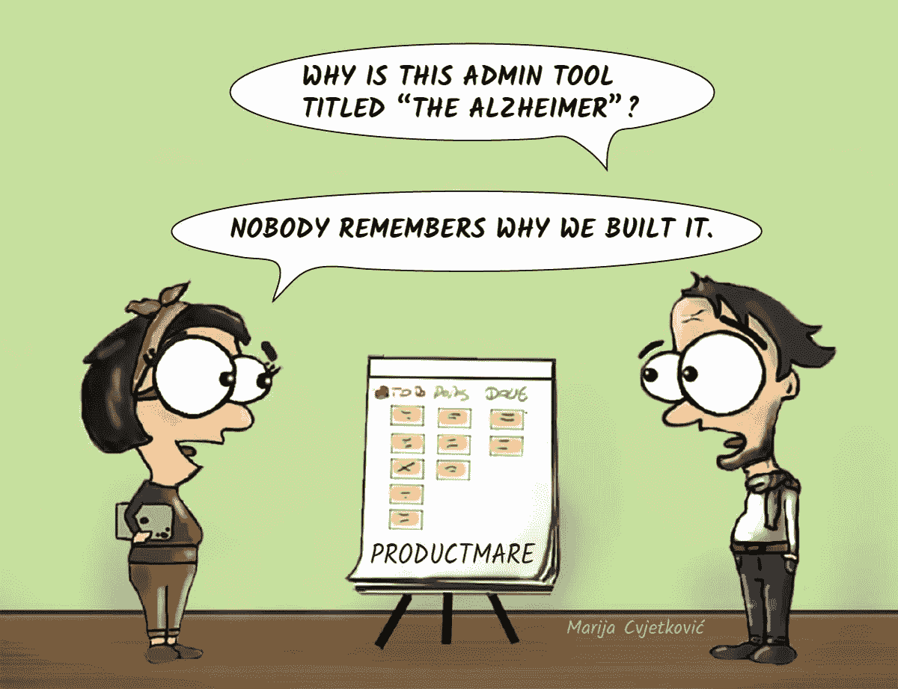

It doesn’t spark joy.

暂时就这样了。

如果你想看更多的 Productmare 漫画，可以看我的第一个故事《15 漫画中的[产品噩梦》。听说有一个团队把这个帖子的漫画打印出来，贴在他们的墙上作为提醒，我很受启发。](https://hackernoon.com/product-nightmares-in-15-comics-a28ae659cd4f)

感谢您的阅读。我觉得开发数码产品值得更多搞笑的漫画，所以这是我的贡献。在这个任务中帮助我，分享一些反馈，我将非常感激。