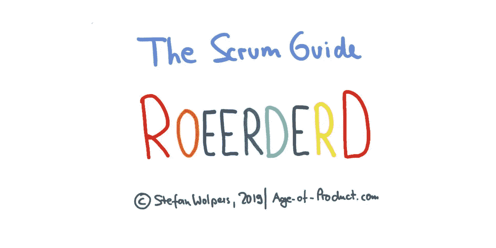
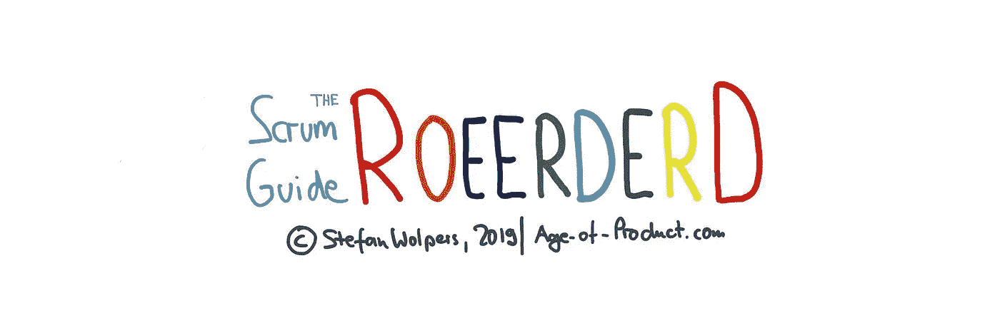

# Scrum 指南重新排序

> 原文：<https://medium.com/hackernoon/scrum-guide-69fe56a3c71d>

## TL；Scrum 指南重新排序了

重新排序的 Scrum 指南基于 2017 年 Scrum 指南约 90%的文本，通过添加额外的类别来扩展其原始结构。例如，你会在一个地方找到所有可以归因于 Scrum Master 角色的引用。

虽然 Scrum 指南主要集中在三个角色、五个事件和三个工件上，但是我也汇总了特定主题的引用，例如，关于自组织、财务或技术债务。

《Scrum 指南——重新排序》可以让你很快对 Scrum 相关的问题有一个初步的了解。例如，它擅长将一个特定的主题——比如“利益相关者”——与 Scrum first 原则联系起来，比如 Scrum 价值观，或者经验主义。

# Scrum 指南的起源被重新排序

Scrum 指南的重新排序是我准备通过 Scrum.org 的专业 Scrum Master III 认证的结果。

虽然重新排序的 Scrum 指南不能马上回答你可能有的所有问题，但我发现确定 Scrum 指南中使用的模式和原则非常有帮助。此外，这是一个与你的同龄人开始有意义的讨论的好工具。如果你喜欢尝试一下，我推荐，比如说，[技术债和 Scrum](https://age-of-product.com/technical-debt-scrum/) 的问题。

# 下载 Scrum 指南——重新排序

[下载免费的 Scrum 指南——重新排序](https://age-of-product.com/scrum-guide-reordered-download-free/) ，让你快速对 Scrum 相关问题有个初步了解。

Download The Scrum Guide — Reordered

# Scrum 指南的附加类别被重新排序

经过重新排序的 Scrum 指南包含以下附加类别:

1.  接受
2.  问责制/责任
3.  适应
4.  敏捷性/业务敏捷性
5.  体系结构
6.  疯狂的
7.  容量
8.  合作
9.  复杂性
10.  持续改进
11.  创造力
12.  交叉功能
13.  完成的定义
14.  就绪的定义
15.  偏差/差异
16.  出现
17.  经验主义
18.  工程实践
19.  估计
20.  伦理学
21.  特色团队
22.  反馈
23.  金融
24.  灵活性
25.  预测/计划/跟踪
26.  功能
27.  妨碍
28.  检查
29.  谈判
30.  组织/管理
31.  计划/规划
32.  可预测性
33.  优先级/优先顺序/排序/价值
34.  产品
35.  职业混战
36.  进度/生产率/趋势/跟踪
37.  质量
38.  释放；排放；发布
39.  要求
40.  风险
41.  缩放 Scrum
42.  范围
43.  Scrum 理论
44.  Scrum 价值观
45.  自组织
46.  服务型领导
47.  冲刺目标
48.  利益相关者
49.  技术债务
50.  测试
51.  透明度
52.  利用
53.  价值
54.  速度
55.  浪费。

# 版权声明

《Scrum 指南》由杰夫·萨瑟兰和肯·施瓦伯创作，并以[署名共享 4.0 国际版(CC BY-SA 4.0)](https://creativecommons.org/licenses/by-sa/4.0/) 许可的形式提供。

因此，重新排序的 Scrum Guide 也继承了 CC BY-SA 4.0 许可证。

通过使用重新排序的 Scrum 指南，您承认并同意您已经阅读并同意受知识共享的归属共享许可条款的约束。

**延伸阅读:**

> 2018 肯·施瓦伯和杰夫·萨瑟兰。根据知识共享署名的类似共享许可协议提供许可，可在[http://creativecommons.org/licenses/by-sa/4.0/legalcode](http://creativecommons.org/licenses/by-sa/4.0/legalcode)访问，也可在[http://creativecommons.org/licenses/by-sa/4.0/.](http://creativecommons.org/licenses/by-sa/4.0/.)以摘要形式描述
> 
> 通过使用本 Scrum 指南，您承认并同意您已经阅读并同意受知识共享的归属共享许可条款的约束。

**来源** : [Scrum 指南](https://www.scrumguides.org/scrum-guide.html#acknowledgements-history)。

# 下载 Scrum 指南——重新排序

[下载免费的 Scrum 指南——重新排序](https://age-of-product.com/scrum-guide-reordered-download-free/) ，让你快速对 Scrum 相关问题有一个初步的了解。

Download The Scrum Guide — Reordered

# 📺加入 Youtube 上 1350 多名敏捷同行

现已在 Youtube 产品年龄频道上发布:

*   [敏捷成熟度和敏捷评估:敏捷是时尚还是趋势？](https://www.youtube.com/watch?v=XtESMQ2wcm8)
*   [敏捷失败模式 2.0](https://www.youtube.com/watch?v=-RXQLVhIuJg&t=6s)
*   [产品所有者反模式](https://www.youtube.com/watch?v=VnopIzbRJ8k&t=12s)

# ✋不要错过，了解更多关于 Scrum 指南的内容:加入 5300 多人的“动手敏捷”Slack 社区

我邀请你加入[“手把手的敏捷”Slack 社区](https://goo.gl/forms/LObbRtSF9vvxN3CL2)，享受来自世界各地的敏捷实践者的快速增长、充满活力的社区带来的好处。

如果你现在想加入，你现在所要做的就是[通过这个谷歌表格](https://goo.gl/forms/LObbRtSF9vvxN3CL2)提供你的凭证，我会帮你注册。顺便说一句，**这是免费的。**

# Scrum 指南重新排序了相关链接

[免费下载“Scrum 反模式指南”](https://age-of-product.com/scrum-anti-patterns/)

[免费下载《敏捷过渡——实战指南》](https://age-of-product.com/download-agile-transition-hands-guide-trenches/)

《Scrum 指南》在 Age-of-Product.com 首次出版。