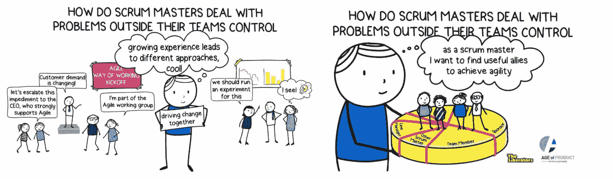
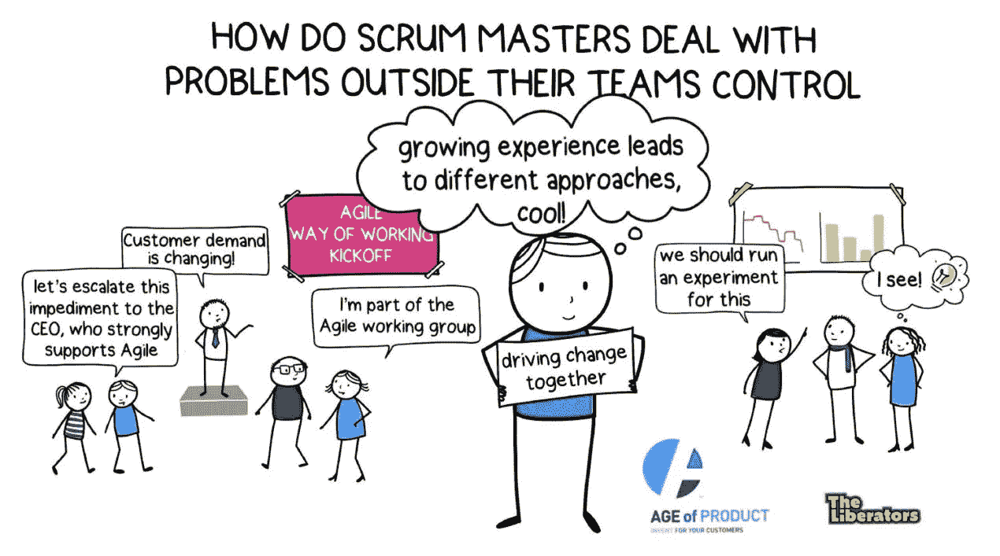

# 调查结果:Scrum 大师问题处理

> 原文：<https://medium.com/hackernoon/scrum-master-problem-dealing-2e6b892e3cc8>

## 调查结果

Scrum 大师问题处理:我们都知道；改变我们的工作方式极其困难。它要求我们找到新的解决方案来应对严峻的挑战，处理文化包袱(“我们在这里做事的方式”)，并带来成功变革所需的人才。然而，这个困难的挑战是 Scrum Masters 的核心责任:如果你的组织不考虑整个系统，它怎么能有效地与 Scrum 一起工作？

但是 Scrum 大师和敏捷教练是怎么做的呢？他们用什么策略来改变系统？谁是他们最重要的盟友？我们还能从他们身上学到什么？

我们与[解放者](https://theliberators.com/)合作，以确定在这个领域什么是有效的。我们从 200 多名参与者完成的调查中收集了定量和定性数据。

# Scrum 大师问题处理:关键发现

我们设法从不同规模、不同敏捷水平和不同行业的组织中获得了 201 位 Scrum 大师和敏捷教练的反馈。这些是我们的主要发现:

*   最常见的成功策略是让人们一起解决问题。虽然这听起来很明显，但它强调了建立能够共同推动变革的网络和团队的重要性——你无法独自做到这一点；
*   政治的运用——建立联盟、利用现有的权力结构和寻找赞助者——被认为是敏捷性得分低的组织的成功战略，无论其规模如何；
*   随着组织变得更加敏捷，政治让位于度量标准的使用，将人们聚集在一起，使用事实和论据来说服和推动变革；
*   团队成员、管理层和利益相关者被参与者视为最有用的盟友。令人惊讶的是，与我们的预期相反，其他 Scrum 大师和敏捷教练不太可能被认为是盟友。外部顾问很少被认为是有用的盟友和/或值得与之建立关系。

# 下载敏捷过渡指南

“[敏捷过渡——来自战壕的实践指南](https://age-of-product.com/download-agile-transition-hands-guide-trenches/)”电子书是我从 2015 年 10 月开始写的文章集。他们详述了将现有的超过 40 人的产品交付组织转变为敏捷实践的必要步骤。

# 关于调查

我们的样本包括 119 名 Scrum 大师和 82 名敏捷教练。平均而言，参与者表示其职位的工作经验为 4.4 年，总体而言，其所在行业的工作经验超过 15 年。

该调查设法吸引了各种不同规模的组织(92 个大型组织、86 个中型组织和 32 个小型组织)、不同部门(153 个面向信息技术的组织、48 个非信息技术组织)的答复。

在从 1 到 10 的范围内，公司的平均自我分类敏捷性水平大约在中间(4.8)。我们使用在线调查——Google Forms——邀请这些参与者与我们分享对他们有效的策略。请注意，调查软件的选择可能会影响调查结果，因为并非所有组织都授权从公司网络访问 Google 应用程序。

# Scrum 大师问题处理:最常见的策略

我们邀请参与者根据预先设定的策略对他们的成功策略进行分类，并在之后添加更详细的描述。从最频繁到最不频繁排列，我们发现了以下情况:

*【所用策略/解决方案(%)】*

*将人们聚集在一起解决问题 **82.1%**
有教养的人 **52.2%**
使用措施/衡量标准使问题的影响可见 **47.8%**
使用论据和事实说服 **42.8%**
改变结构或流程 **32.8%**
我们使用政治手段(例如，寻找盟友、形成联盟、施加压力)【关键词*

**根据我们调查的参与者(N=201)**

*很明显，对我们的参与者来说，最有效的策略是让人们团结起来解决问题。超过 82%的人报告了这一类别的方法。虽然这听起来很明显，但它强调了建立能够共同推动变革的网络和团队的重要性——你无法独自做到这一点。*

> *对我们的参与者来说，最有效的策略是让人们团结起来解决问题。*

*正如这一类别的许多参与者所提到的，领导的参与在这里尤其重要。一些参与者报告说，他们成功地将领导层的成员聚集到“过渡团队”或“敏捷工作组”中，解决了超出单个 Scrum 团队控制的组织障碍。一个参与者分享了这个团队如何使用由团队填充的“障碍积压”，有效地将他们转变为这些过渡团队的利益相关者。*

*其他成功的策略包括教育(52%)、使用衡量标准/措施使障碍的影响可见(48%)以及使用事实和论据进行说服(43%)。一位参与者提供了这些策略的一个很好的例子，即“可视化，显示影响整个系统流程的障碍，然后与所有利益相关者合作，提出一个解决方案。”*

*这些策略的另一个很好的例子被描述为“阐明完成的不足，这显示了外部问题(例如障碍或依赖性)对团队创造产品质量增量的能力的影响。”*

*有趣的是，技术或软件的使用，(外部)专家和政治的使用并不被认为是成功的，或者至少不经常被成功使用。*

> *“我们创建了一个‘敏捷工作组’,其中包括一些对提高敏捷性充满热情的第一/第二层领导。这个小组(5 名成员)的工作重点是直接帮助消除障碍，或者把它交给高层领导。”*

**

# *Scrum 大师问题处理:最有用的盟友*

*我们无法独自改变 Scrum 团队的环境。我们需要盟友的帮助，为新的工作方式创造空间，让人们突破传统和习惯——技术、程序或政治。我们邀请参与者从提供的一组选项中选择他们最有用的盟友:*

**【最有用盟友(%)】**

**团队成员: **34.8%**
发起人(C 级或高级管理层): **24.4%**
业务相关人员 **12.4%**
其他 Scrum 高手或教练 **9.0%**
直线经理 **8.0%**
工程经理 **7.5%**
外部顾问 **2.0%****

**根据我们调查的参与者，最常见的盟友。(N=201)**

**总的来说，团队成员是 Scrum 大师和敏捷教练在改变 Scrum 团队环境中最重要的盟友，超过三分之一的参与者(35%)报告说。一位与会者将此描述为将“对话和权威转移到信息所在的地方。对问题有最深入了解的人，往往也有最有效的持久解决方案建议。”**

**在团队成员之后，最重要的盟友是处于领导地位的发起人(25%)和商业利益相关者(13%)。一个有趣的发现是，只有 9%的参与者认为他们的同事(Scrum 大师和敏捷教练)是盟友。我们本以为这个数字会更高。**

> **极少数参与者(2%)认为外部顾问是有用的盟友**

**此外，极少数参与者(2%)认为外部顾问是有用的盟友。由于大多数组织都聘请了这样或那样的外部顾问，探究其中的原因是很有意思的。但是调查并没有给我们提供这样做的数据。也许顾问没有经常与 Scrum 大师和敏捷教练一起工作。此外，鉴于他们参与的暂时性，在寻求长期盟友时，他们可能不会被视为一项好的投资。**

**总而言之，寻找合适的盟友可能是一项具有挑战性的任务，尤其是在大型组织中。一名参与者将此描述为“进入丛林”，并解释了一种提问策略:“谁最了解 X？”在组织层级中向上或向下移动，以找到关键的盟友。**

****

# **Scrum 大师问题处理:组织间的差异**

**我们还采用了更先进的统计魔法来探索策略和联盟的使用是否取决于经验和/或组织的规模和敏捷性等因素。**

**我们发现，在不太灵活的组织中，政治被更频繁地用于制定变革。随着敏捷性的提高，使用事实和论据来说服驱动进一步的变化也是如此。这似乎符合支撑敏捷性的经验过程；收集数据以验证假设，并根据您所了解的情况做出决策。但是，要使组织朝着这种心态转变，政治可能在一开始就是必要的。一个有趣的额外观察是，更敏捷的组织倾向于更频繁地将人们聚集在一起以推动变革。**

> **我们发现，在不太灵活的组织中，政治被更频繁地用于制定变革。随着敏捷性的增加，使用事实和论据来说服和推动进一步的变化也在增加。**

**我们还发现，随着人们对自己的角色越来越有经验，他们越来越依赖于使用指标来实现变革。他们也更加注重教育他人。该调查没有告诉我们“教育”是什么样子，但人们当然希望使用度量标准是教育他人的一个重要策略。**

**公司的规模并没有显著影响策略或盟友的使用。**

# **那么这意味着什么呢？**

**最后，我们调查的结果将我们带回到任何变革的主要问题:什么样的模式成功地推动变革？我们是否需要一个有远见的领导者，相信敏捷是正确的道路，发起一个自上而下的变革计划？或者，在组织完全接受敏捷之前，我们需要从战壕中培养一种自下而上的方法，直到它交付证明敏捷有用的数据？或者，我们应该采取灵活的钳形运动，将自上而下和自下而上两种方法结合起来，绕过潜在的中层管理者，实现变革？**

**我们的调查结果表明，参与者认为“参与政治”在敏捷的早期阶段是一个有用的策略。但是随着敏捷的增加，对度量和共享决策的依赖也在增加，以创造一种越来越敏捷友好的文化。这支持了敏捷钳形运动作为变革手段的实用主义，在这种变革中，自下而上的变革得到了自上而下的支持。我们的结果还表明，管理层和领导层的支持对于成为敏捷组织的任何变革计划都是至关重要的。**

**我们的调查结果表明，参与者认为“参与政治”在敏捷的早期阶段是一个有用的策略。但是随着敏捷的增加，对度量和共享决策的依赖也在增加，以创造一种越来越敏捷友好的文化。**

**我们调查的目的是探索 Scrum 大师和敏捷教练使用什么策略来帮助组织更有效地使用 Scrum。我们在问题和分析中使用了粗略的方法来识别有趣的模式。我们很想进一步探索这些。用的是什么样的政治？使用什么样的度量标准？人们是如何找到盟友的？从政治到数据的转变何时发生，为什么会发生？我们希望在未来的研究中回答这些问题。**

# **结论:Scrum 大师问题处理——未来研究**

**在未来，我们会喜欢:**

*   **探索策略使用中的文化差异；**
*   **探索为什么 Scrum 大师不认为其他 Scrum 大师和/或敏捷教练是重要的盟友；**
*   **更深入地探究什么样的内部政治运作。政治的使用常常伴随着一种不好的味道。但是，许多种类的政治，如建立联盟、寻找盟友和建立联系，对改变努力至关重要。**

**你如何解决你控制之外的问题，你如何成功地处理组织内部的障碍？请在评论中与我们分享。**

**所有插图均由西娅·舒肯绘制。**

# **📺加入 Youtube 上 1450 多名敏捷同行**

**现已在 Youtube 产品年龄频道上发布:**

*   **[Scrum Sprint 回顾反模式](https://www.youtube.com/watch?v=HJdOIUd7xN8)。**
*   **[Scrum 大师反模式](https://www.youtube.com/watch?v=vZUU9AIZVyQ)。**
*   **Scrum Sprint 反模式。**

# **✋不要错过:加入超过 5550 人的“手把手的敏捷”Slack 社区**

**我邀请你加入[“手把手的敏捷”Slack 社区](https://goo.gl/forms/LObbRtSF9vvxN3CL2)，享受来自世界各地的敏捷实践者的快速增长、充满活力的社区带来的好处。**

****

**如果你现在想加入，你现在所要做的就是[通过这个谷歌表格](https://goo.gl/forms/LObbRtSF9vvxN3CL2)提供你的凭证，我会帮你注册。对了，**免费的。****

# **🎓你还想这样多读书吗？**

**好吧，那么:**

*   **📰*加入 22468 位同行和* [*报名我的每周简讯*](https://age-of-product.com/subscribe/?ref=Food4ThoughtMedium)**
*   **🐦*关注我的*[*Twitter*](https://twitter.com/stefanw)*并订阅我的博客* [*产品时代*](https://age-of-product.com)**
*   **💬*或者，免费加入* [*Slack 团队【动手敏捷】的 5550 多名同行*](https://goo.gl/forms/XIsABn0fLn9O0hqg2) *。***

**[调查结果:Scrum 大师问题处理](https://age-of-product.com/scrum-master-problem-dealing/)最早发表于 Age-of-Product.com。**