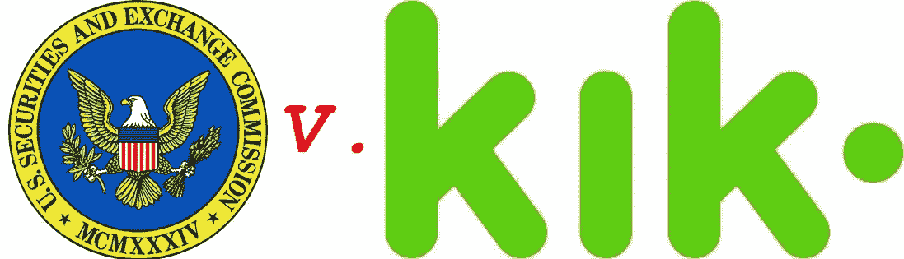

# SEC 诉 Kik 分析

> 原文：<https://medium.com/hackernoon/sec-v-kik-defining-the-efforts-of-others-c85778d08edd>

上周，美国证券交易委员会(SEC)向 Kik Interactive 提起联邦诉讼，指控 Kik 的数字“亲属”令牌 ICO 违反了《证券法》。我[在推特上发了我对这些指控的直觉判断](https://twitter.com/TBukher/status/1136313580897390592),承诺一旦我有机会消化，就会提供一个更微妙的印象。

几个旁白:

1.  我坚信，只有极少数的区块链项目会从引入他们自己的专有令牌中受益(我去年帮助运营了一家总部位于纽约的区块链加速器，我们对任何此类申请人的第一个挑战是捍卫他们对令牌的使用——迄今为止，除了一家以外，所有申请人都失败了)。
2.  我认为，极少数能够为专有令牌提供令人信服的理由的项目通常都有可怕的令牌经济学，需要重新思考。

也就是说，我确实认识到在某些有限的情况下需要专有令牌，但我不会在这里深入讨论。更重要的是，我认为以代币或其他形式出售数字许可证不一定构成出售未注册证券。

所以……我有机会聚焦于这起诉讼、诉状中的指控以及 [Kik 的非正式回应](https://www.prnewswire.com/news-releases/kik-responds-to-sec-complaint-300862114.html)中哪些是重要的，哪些不是那么重要。这是:

# TLDR:

*   假设案件在某种法院和/或陪审团判决之前没有解决，我们将最终获得关于“其他人的努力”(来自第三个豪威因素)在数字令牌销售上下文中的含义的更新。
*   Kik 似乎在这件事上犯了太多的错误，无法澄清是否有一种正确的方法来合法地发行数字令牌。

# 豪威是一个 70 岁的老测试，急需更新

美国证券法规定，出售未注册证券是非法的，除非在某些特定的例外情况下。注册证券以参与所谓的首次公开募股是一个极其耗时和昂贵的过程，需要律师、数年的财务审计和一家银行来承销销售——因此大多数初创公司都没有资格。

早在加密货币和 ico 出现之前，公司就一直在寻求通过向消费者出售各种金融产品来筹集资金，这些产品接近证券法对“安全”的定义。问题是,[证券法](https://www.law.cornell.edu/uscode/text/15/77b)实际上没有一个非常清晰的定义，它包括了一大堆东西:

> **任何票据、股票、库藏股、证券期货、基于证券的掉期、债券、信用债券、债务证明、利息证书或参与任何利润分享协议、抵押信托证书、预组织证书或认购、可转让股份、投资合同、投票信托证书、证券存款证书、石油、天然气或其他矿产权利的部分未分割权益、任何证券、存款证书或证券组或指数的任何看跌期权、看涨期权、多空期权或特权(包括其中的任何权益或基于其价值的权益)， 或在国家证券交易所签订的与外币相关的任何卖出、买入、跨售、期权或特权，或一般而言，任何通常称为“证券”的权益或工具，或任何前述权益或参与证书、临时或中期证书、收据、担保、认股权证或认购或购买权利。**

最终，这一切都要由美国法院来解释。进入*证券交易委员会诉豪威*，这个 70 年的老案件最终将“投资合同”(又名证券)定义为包含以下所有三个豪威因素的东西:

1.  金钱的投资；
2.  在一个共同的企业中；和
3.  期望主要从他人的努力中获利。

# 大多数 ico 将构成豪威的证券

> **“我见过的每一个 ICO 都是安全的。”**
> 
> **—证券交易委员会主席杰伊·克莱顿**

大多数 ico 的问题在于，在这些产品出现之前很久，他们就试图出售“访问许可证”(例如，可以用来访问或使用其所吹捧的软件产品的令牌)。换句话说，ICO 代币购买者通常:

1.  投入的资金；
2.  由公司为开发产品而筹集的资金；和
3.  代币购买者希望代币升值，这样他们就可以转手获利。

这完全符合豪威对证券或投资合同的定义。

# 如果证交会的指控属实，KIK 可能出售了未注册证券

美国证券交易委员会投诉的关键归结于这一指控:

> **简而言之，在 2017 年 9 月 26 日之前，Kik 出售代币时，Kin 没有购买任何东西。**

换句话说，如果 Kik 的 ICO 和$Kin 的出售是为了筹集资金建立一个用户可以使用$Kin 购买产品的生态系统，那么通过购买$Kin 用户(1)投资的钱，(2)Kik 汇集到软件/业务开发的共同企业中的钱，(3)用户预期$Kin 在生态系统启动时会升值，而$Kin 实际上会变得有用。

证交会提出的另一个致命点是:

> Kik 还向潜在买家保证，在分发代币后，买家将能够在二级交易平台上进行亲属交易

如果没有可供投机的市场，代币就不可能是投机的。通过承诺将代币上市，Kik 实际上承诺了这样一个市场。

# KIK 案不太可能对 HOWEY 因子 3 提供强有力的澄清

我在[推特上查阅的投诉](https://twitter.com/TBukher/status/1136313580897390592)引用了美国证券交易委员会提出的各种其他指控，旨在支持豪威的所有三个因素，所以我在这里就不赘述了。我要指出的是，如果 SEC 的事实指控是真的，那么这不是一个很好的测试案例，因为 Kik 可能会在没有澄清如何将 Howey 因素应用于数字代币的情况下败诉。

例如，如果法院裁定数字接入令牌(区块链或其他地方的)即使能够在交易所交易，也不构成证券，只要 X、Y 和 Z 可用性因素在最初向投资者发行这些令牌之前*已经到位，这将增加行业的透明度。*

人们可以交易某些流行的交易卡，甚至可以推测它们的价值，而不把这些卡视为证券。为什么数字代币不能做到这一点呢？

# 进入豪威因素 3:期望利润主要来自他人的努力

这里的问题是，交易卡公司通常拥有一些东西，据美国证券交易委员会称，Kik 没有:一个完全完整的、活生生的生态系统，从消费者第一次购买卡时起，卡就从中获得了价值。

在某种程度上，交易卡具有投机价值，这是因为市场的无形之手推动了某些卡的价值上升。

传统上，在豪威案之后的法院裁定，如果你不能确定资产升值的具体原因，那么这种升值就不是“主要来自他人的努力”。换句话说，您需要能够识别“其他人”，这通常意味着发行资产的公司的管理团队和其他相关发起人。

当然，你可以说公司管理层负责营销生态系统，从而推动信用卡销售，进而推动稀缺和价值增值。但是法院传统上并不认为这种一般的市场力量是资产投机的主要因素。所有企业都会努力让自己的产品变得令人满意，但这还不足以让产品成为投机资产。

当然，并不是所有的法院都走这条路——这因行业而异——因此，如果/当法院表示“其他人”的“管理和推广者”定义也适用于数字代币，这将是一件好事。不幸的是，如果证交会的指控全部属实，那么这就是法院在裁定 Kik 发布数字投资合同之前可能会说的全部内容。结束了。

# 理想的测试案例

理想的测试案例是将数字令牌作为现有技术的实际访问许可证出售。一个技术平台，不仅仅是一个概念证明，正如 Kik 案例中所声称的那样，而是一个被大量用户实际使用的平台。

更理想的是区块链生态系统，其中其他公司在该生态系统上构建 dApps 和业务，从而以分散的方式为基础访问令牌的价值做出贡献。这将给予法院一些实质性的东西来消化和阐述，在“其他人”对组织象征价值的贡献与豪威因子 3 不一致之前，需要从组织中分散或去除“其他人”。

不幸的是，我们在 SEC 诉 Kik 一案中没有这些事实，我认为 SEC 不太可能追究最终可能导致该机构败诉的案件。

*原文刊印* [*此处*](https://www.timbukher.com/blockchain-crypto/sec-v-kik-defining-the-efforts-of-others) *。*