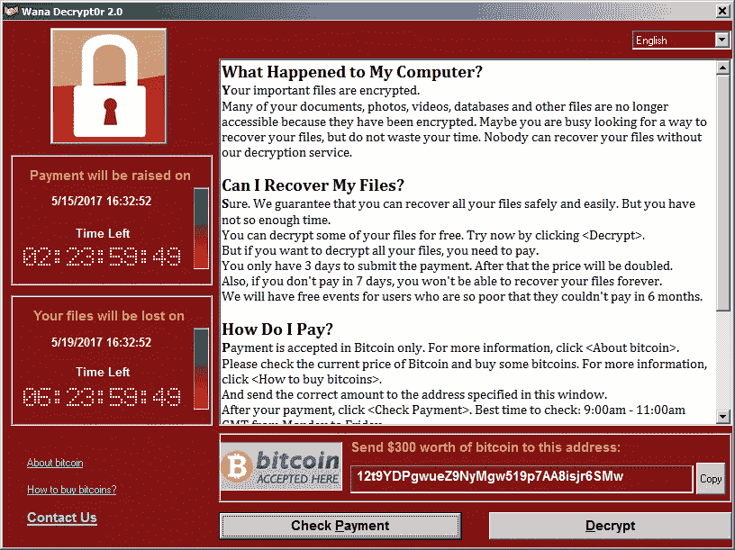
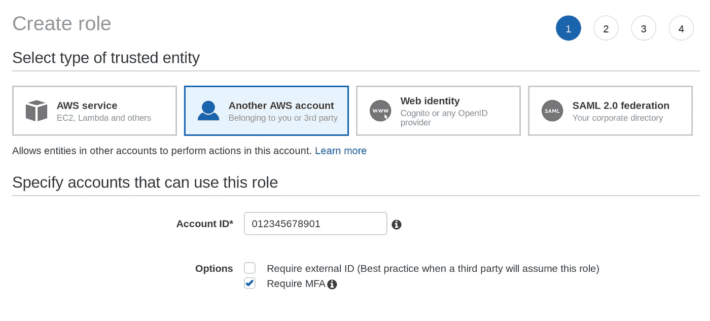
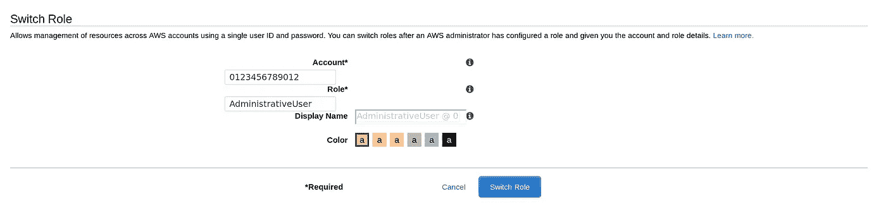

# 在开发环境中保护 AWS 凭证

> 原文：<https://medium.com/hackernoon/securing-aws-credentials-in-development-environments-132049c27fb2>

## 之前在脚本或应用程序中硬编码过 AWS 凭证的人请举手？

我的手现在在空中🙌

硬编码凭据是不好的做法，我们都知道这一点。但是作为开发人员，我们不断地试图走捷径来提高我们的生产力。凭证和机密的处理**不应该成为**我们寻求削减的一个角落；这最终会让我们引火烧身…而且非常严重。

> [AWS-Vault](https://github.com/99designs/aws-vault) 是一个 CLI 工具，用于在开发环境中安全地存储和访问 AWS 凭证。

这让我想到了 AWS CLI。您可能会认为官方的 AWS 工具会考虑负责任地处理凭证。不幸的是，你错了。AWS 文档指示我们在安装后直接运行的命令`aws configure`,将我们宝贵的 IAM 凭证以纯文本形式写入到`~/.aws/credentials`文件中，以供世人查看。在[文档中有一整页的配置文件，包括](https://docs.aws.amazon.com/cli/latest/userguide/cli-configure-files.html)纯文本示例！

> 你不会把你的银行密码贴在你的银行卡上；那么，为什么我们都把我们的 AWS 帐户凭证以纯文本的形式放在一个大家都希望它们在的地方呢？

让我描绘一幅可怕的画面…你可能记得最近发生的一些严重的 npm 漏洞；不幸的是，这在 Javascript 社区中经常发生，但这是另一个故事了。这里有一个 [eslint-scope](https://eslint.org/blog/2018/07/postmortem-for-malicious-package-publishes) 漏洞和一个下载量超过 **8 的最近的[事件流](https://snyk.io/blog/malicious-code-found-in-npm-package-event-stream/)漏洞。百万。时代周刊。**

现在想象一下，一个黑客决定更冒险一点，在 `**~/.aws/credentials**` **中**窃取** **你的明文秘密，而不是刮 npm 凭证，或者企图窃取你的比特币钱包。****

现在去跑`cat ~/.aws/credentials`，是空的吗？哦哦…那些是管理员的通行证吗？如果你现在没有流汗，你应该流汗。AWS 凭据是许多攻击的目标，我警告您…他们可能还没有得到您的凭据，但它即将到来，我不想成为说“我早就告诉过您”的人。

我们只要看看最近的 [DockerHub 凭证泄露事件](https://about.gitlab.com/2019/05/03/suspicious-git-activity-security-update/)就知道了，黑客劫持了 git 存储库以此来强调`~/.aws/credentials`泄露会有多严重。现在想象一下，你的 AWS 基础设施被绑架了，因为你把你的 AWS 秘密留给了任何人。当你访问你的主页时，你想看到这样的东西吗？ [WanaCry](https://en.wikipedia.org/wiki/WannaCry_ransomware_attack) 网络版《AWSGeddon**】**来了。



WanaCry exploit image. Source [Wikipedia](https://commons.wikimedia.org/wiki/File:%EA%B0%90%EC%97%BC%EC%82%AC%EC%A7%84.png)

现在我已经引起了你的注意，我们怎样才能把你从糟糕的一天中拯救出来呢？

幸运的是，99designs 的团队创造了一个令人惊叹的 CLI 工具，名为 [**AWS-Vault**](https://github.com/99designs/aws-vault) 。这个工具将会把我们从大量显示勒索软件页面而不是我们的甜蜜内容的互联网中拯救出来。

> AWS Vault 将 IAM 凭据存储在操作系统的安全密钥库中，然后根据这些凭据生成临时凭据，以向您的 shell 和应用程序公开。

那么这意味着什么呢？与`aws configure`命令不同，当您使用`aws-vault add`添加 AWS 凭证时，您的凭证存储在您的操作系统安全钥匙串中。您的密钥现在被加密到您的秘密后端，保护您免受偷窥者，更重要的是，冒险的 hax0r。

安装也很简单，你可以从 GitHub 下载[最新版本](https://github.com/99designs/aws-vault/releases)，或者 macOS 用户可以运行`brew cask install aws-vault`。你没有借口，你可以在 5 分钟内出发。

**AWS-Vault** 使用您刚刚添加的那些凭证，通过 [Amazon 的简单令牌服务](https://docs.aws.amazon.com/IAM/latest/UserGuide/id_credentials_temp.html)生成临时凭证。这些临时凭据可以配置为持续几分钟到几小时不等。即使这些凭证在任何地方都不会以纯文本的形式公开，相反，运行`aws-vault exec ${profile} --`会启动一个新的 shell，并将您的临时秘密导出为环境变量，供 AWS CLI 或您需要的任何东西读取。

该工具还很好地补充了您在`~/aws/.config`中现有的 AWS CLI 配置。它知道您已经设置的现有配置文件和配置。

所以首先，删除您的`script-that-needs-aws-credentials.sh`中的硬编码凭证，并重构它以从环境变量中提取这些值。您还需要确保包含`AWS_SESSION_TOKEN`变量。您可以在 [AWS 文档](https://docs.aws.amazon.com/IAM/latest/UserGuide/id_credentials_temp_use-resources.html)中找到更多关于 STS 和临时凭证的信息。现在您已经完成了更改，继续运行:

```
$ aws-vault exec ${profile} -- script-that-needs-aws-credentials.sh
```

如果你很想知道 **AWS-Vault** 在做什么，运行:

```
$ aws-vault exec ${profile} -j 
{"Version":1,"AccessKeyId":"AKIAI44QH8DHBEXAMPLE","SecretAccessKey":"wJalrXUtnFEMI/K7MDENG/bPxRfiCYEXAMPLEKEY","SessionToken":"AQoDYXdzEJr...<remainder of security token>","Expiration":"2019-06-26T16:01:48Z"}
```

这些是由亚马逊 STS 发布的临时凭证，现在由 **AWS-Vault** 安全存储以备将来使用。

## 我的申请怎么办？

如果您正在将凭证硬编码到您的应用程序中，有一个`.envfile`或类似的东西，那么看看 **AWS-Vault 服务器。**

```
$ aws-vault exec ${profile} --server
```

这个方便的工具将启动一个[本地 EC2 元数据实例](https://docs.aws.amazon.com/AWSEC2/latest/UserGuide/ec2-instance-metadata.html)并将你所有去往 169.254.169.254 的流量路由到你本地运行的 **AWS-Vault** **服务器**，抛出**临时**安全凭证。启动服务器后，您可以通过运行`curl 169.254.169.254`来测试这一点。

删除那些硬编码的凭证，应用程序中的 AWS-SDK 将自动使用 **AWS-Vault 服务器**在需要时刷新凭证。这意味着您的本地应用程序将开始以与您的 EC2 实例相同的方式运行，并具有您分配给 IAM 角色的实例概要。(至少我希望你在你的 AWS 环境中是这样做的。如果这不是你…请[立即阅读此文](https://docs.aws.amazon.com/AWSEC2/latest/UserGuide/iam-roles-for-amazon-ec2.html)。

## 开始使用角色假设和多因素身份验证

最佳实践是将您的 IAM 用户配置为对控制台具有只读访问权限。这意味着当您登录到控制台时，您不能更改任何内容，除非您承担了具有提升权限的角色。这种方法类似于在 shell 会话中使用“sudo”。希望它能鼓励你在操作控制台和进行更改时更加小心。您也可以对这些特权角色实施 MFA，如果您的凭据意外泄露，这将为您提供额外的一层保护。

让我们快速看一下 **AWS-Vault** 的角色假设是什么样子的。如果您熟悉配置角色假设，您可以向下滚动到下面的 **AWS-Vault** config。如果没有，请继续登录控制台。

首先，在你的用户上设置 MFA，如果你还没有这样做的话。在 IAM 服务中找到您的用户，单击安全凭据选项卡并设置 MFA 设备。我使用 [Authy](https://authy.com/) ，这样我就可以在我的所有设备上同步我的 MFA 代码(如果你像我一样有点笨拙，当你把手机留在家里时会有帮助)。 [Google Authenticator](https://play.google.com/store/apps/details?id=com.google.android.apps.authenticator2&hl=en_GB) 是另一个合适的选择，就在最近 **AWS-Vault** 增加了对 [YubiKeys](https://www.yubico.com/) 的支持；巨大的荣誉归于[约翰史密斯](https://github.com/j0hnsmith)因为[那个](https://github.com/99designs/aws-vault/pull/316)。一旦设置，记下 MFA ARN，你以后会需要这个。

接下来，您将需要创建一个新的 IAM 角色。我们将创建一个您将担任的**管理用户**角色。像下面的截图一样在框中输入您的帐户 ID，并勾选需要 MFA。



单击 next，在 attach permissions policy 屏幕上，找到 **AdministratorAccess** 策略，并将其附加到该角色。在下一个屏幕上，将其命名为**管理用户**并创建它。这将创建一个与您自己的帐户具有信任关系的新角色。这意味着，只有您的帐户中已通过 MFA 设备身份验证且您也已授予权限的用户才能担任此角色。回到您的角色并编辑信任关系，它应该看起来像这样。

```
{
    "Version": "2012-10-17",
    "Statement": [
        {
            "Effect": "Allow",
            "Principal": {
                "AWS": "arn:aws:iam::01234567809012:root"
            },
            "Action": "sts:AssumeRole",
            "Condition": {
                "Bool": {
                    "aws:MultiFactorAuthPresent": "true"
                }
            }
        }
    ]
}
```

现在转到 IAM 用户，在列表中找到自己。添加如下所示的内联策略。这允许您的用户承担您刚刚创建的**管理用户**角色。

```
{
    "Version": "2012-10-17",
    "Statement": [
        {
            "Effect": "Allow",
            "Action": [
                "sts:AssumeRole"
            ],
            "Resource": [
                "arn:aws:iam::0123456789012:role/**AdministrativeUser**",

            ]
        }
    ]
}
```

您可以通过点击顶部工具栏中的您的帐户并点击“切换角色”来测试切换角色。输入您的帐户 ID 和我们创建的新角色。



您应该注意到页面顶部的菜单已经改变了颜色，您现在应该可以看到您的姓名和当前担任的角色。

**那么，我们如何承担 AWS-Vault 的角色呢？**

在你最喜欢的编辑器中打开`~/.aws/config`,添加一个管理员档案，如下所示。您可以在 IAM 用户的安全凭据选项卡中找到您的 mfa_serial。您需要根据需要修改这些值。这个`source_profile`应该是你用`aws-vault add`命令创建的。

```
[profile readonly]
region=eu-west-1[profile administrator]
**source_profile=readonly
mfa_serial=arn:aws:iam::0123456789012:mfa/steve
role_arn=arn:aws:iam::0123456789012:role/AdministrativeUser**
```

现在运行下面的登录命令。您会注意到，它会提示您输入 MFA 令牌。如果这是成功的，您应该会发现自己在 AWS 控制台中具有管理员访问权限。

```
$ aws-vault login administrator
Enter token for arn:aws:iam::0123456789012:mfa/steve:
```

这也适用于交叉客户角色假设。对于那些管理多个 aws 帐户凭证的人，我建议您在这里看一下这篇 [AWS 交叉帐户角色假设文章](https://aws.amazon.com/blogs/security/how-do-i-protect-cross-account-access-using-mfa-2/)。

**好的，那么我如何在 AWS-Vault 中轮换我的凭据呢？**

碰巧有一个很棒的命令可以让你的 IAM 证书轮换。你不会相信这有多简单:

```
$ aws-vault rotate ${profile} 
Rotating credentials for profile "${profile}" (takes 10-20 seconds)
Enter token for arn:aws:iam::0123456789012:mfa/steve: 123456
Done!
```

有了 **aws-vault** ，在你的开发环境中没有理由不安全地处理秘密。您可以通过运行`aws-vault add new-profile`删除`~/.aws/credentials`中的凭证并将它们添加到 **aws-vault** 中，从而快速获胜。现在只需执行与之前相同的 AWS CLI 命令，但带有 **aws-vault** 前缀。

```
$ aws-vault exec new-profile -- aws s3 ls
```

我只想对 99designs 表示感谢，感谢它创造了一个工具来保护我们在本地的 IAM 证书。这应该是配置 AWS 概要文件以用于 AWS CLI 的标准方式。我希望 AWS 团队中有人正在阅读这篇文章；我希望看到 AWS 取消对从`~/.aws/credentials`或`~/.aws/config`获取凭证的支持。

你只需要阅读 AWS 的博客帖子和观看 re:Invent 视频就可以理解 AWS 确实是安全的先驱[，比如看看这个 twitter 帖子](https://twitter.com/colmmacc/status/1143569907369594881)。但是我们在基础方面有所欠缺，这使得工程师们太容易马虎了。我们看到 DevSecOps 的开发理念发生了巨大的变化，推动了“安全性即代码”的文化。让我们鼓励其他人一起采用最佳实践。

所以你已经看到了花几分钟阅读这篇文章使用 **AWS-Vault** 是多么容易。使用 **AWS-Vault** 很容易。等你没有被 WanaCry 网络版“AWSGeddon**”影响的时候再来感谢我吧。**

****感谢您的阅读。****