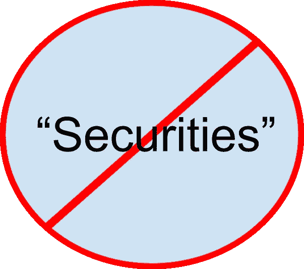

# “证券”不应该是一个脏字

> 原文：<https://medium.com/hackernoon/securities-should-not-be-a-dirty-word-c9f2d65640b6>

加密社区愿意采取极端的行动来避免可怕的“安全”指定，由于一个非常真实的担忧，证券法将大大增加企业家和加密交易公司的成本。因此，有一种强烈的动机将尽可能多的数字资产归类为证券以外的其他*。这导致[最近推出了令牌分类法法案](https://www.coindesk.com/lawmakers-reintroduce-bill-to-exempt-tokens-from-us-securities-laws)，这被许多人视为一大进步。*

*不幸的是，虽然这将有助于澄清哪些可以在不受美国证券交易委员会(SEC)监管的*市场上交易，但这种方法忽略了新兴的数字资产，即 ***是*** 证券，这可能导致美国在这个不断发展的市场中落后。这可能会非常麻烦，因为我相信在接下来的几十年里， ***所有的*** 资产最终都将进行数字化交易，以利用其真正的全球多货币能力。即使有人不同意我对数字资产的乐观看法，但可悲的是，由于一个致力于投资者保护的监管机构，整个行业都在努力避免被归类为“证券”。**

**在深入思考前进的道路之前，重要的是要了解当前形势是如何演变的。创立证券交易委员会(SEC)的法律，以及 SEC 制定的许多规则，都是为了直接应对引发大萧条的过度行为。那个时代的特点是难以置信的杠杆作用、猖獗的市场操纵、显著的信息不对称和各种各样的“快速致富”骗局。由此产生的规则完成了许多值得注意的事情，如证券交易所和自律组织(sro)的结构，规定个人获得保证金贷款的金额和条件的规则，以及建立监管资产管理公司的框架。然而，他们也设置了许多武断的限制，包括将公开交易限制在老牌公司的规则，以及将私人投资限制在富人专有的规则。(我经常觉得很奇怪，只有富人才被允许购买初创企业的股份，但每个人都可以买彩票或在体育赛事上赌博。)其他规则建立了与数字资产无关的保管和转移代理功能的要求，并创建了重要的报告要求，但这些要求通常未被阅读。**

**也就是说，重要的是要明白，美国证券交易委员会(SEC)认为其主要职责是保护投资者，同时促进资本形成。因此，当面对作为 2017 年 ICO 繁荣特征的欺诈时，没有人会对他们的极端负面反应感到惊讶。此外，当这些产品的交易场所自称为“交易所”时，尽管它们忽视了最佳执行义务，并迟迟没有接受“公平有序市场”的概念，但令人惊喜的是，证交会对它们的态度一如既往地慎重。**

**最后，我们不能忽视美国在监管管辖权方面的独特情况。我们对金融期货和商品(CFTC)和证券(SEC)有不同的监管机构，这使事情变得复杂，并鼓励游说者试图在两者之间进行监管套利。**

**考虑到这些事实，SEC 和 CFTC 面临的难题是如何为数字资产发行者(包括初创公司和新创建的资产)以及参与这些资产二级交易的公司提供更有效的前进道路。尤其重要的是要认识到，数字资产平台的*的一个特点是它们是全球性的，这意味着平台通常位于海外，为来自世界各地的投资者服务。这种类型的创新可以极大地降低成本，提高投资者和发行者的流动性，因此应该受到鼓励，而不是因为以美国为中心的规则而变得不可能。***

***要实现这一目标，有一条前进的道路，但它需要采用基于原则的监管，而不是强制执行当前的棘手规则。关键原则应该是所有人(不仅仅是富人)都能获得数字资产投资机会，发行人必须遵守一致且适用的披露标准，交易所、其他市场中心、场外交易柜台和代理交易柜台除了维护公平有序的市场原则之外，还必须履行最佳执行义务。***

***具体来说，如果让我为数字资产行业列出一份“愿望清单”，它将包括以下改革:***

*   ***简化 Reg ATS(替代交易系统)流程，允许快速指定“数字经纪人”来操作此类系统，包括外国所有和运营的实体。这将允许现有的加密交易所实现合规，并允许加密货币(那些被视为*而非*是“证券”的资产)在与证券相同的平台上交易。***
*   **允许所有完成适当问卷并确认收到风险披露的投资者投资数字资产。这种方法被用于期权交易，同样有风险，但效果很好。这比将数字证券限制在“合格”投资者手中要有意义得多，所谓“合格”投资者是指那些拥有足够净资产的人。**
*   **允许从事其他资产类别交易的经纪交易商为数字资产提供服务，而无需强制进行为期 4-6 个月的 FINRA 审查。这将有利于交易加密和安全令牌的公司，对两者采用相同的政策和程序，尊重最佳执行和其他关键原则。**
*   **帮助数字资产行业形成自己的 SRO(自律组织)来管理数字资产交易所、交易台和经纪人。重要的是，行业要明白这不是一个倡导组织，而是一个专注于投资者保护的监管机构。**
*   **重写/提出新的披露规则，以适用于新成立或非常新的公司以及新的资产支持证券。假设需要重要的运营历史的要求阻止公众投资早期公司或资产，或者迫使新公司收购没有实际用途的“壳”公司。**
*   **改革转让代理、保管和其他规则，以考虑数字资产。现行规则是在区块链技术存在之前很久就设计好的。(一个例子是荒谬的想法，即从数学上验证“连锁”交易的“矿工”应该作为经纪交易商受到监管。根据今天古老法律的条文，这可能是真的，但毫无意义，因为这些公司在他们验证的交易中完全没有自由裁量权。我相信，人们正在游说这样的指定，以将公共区块链排除在资本市场用途的考虑之外，这将是糟糕的公共政策。)**

**如果采取这种方法，它将大大有助于消除目前的白痴行为，即公司避免交易可能是证券的资产，或完全避免美国。另一方面，这一方针也有助于缓解当前可公开投资资产的危机，在这种情况下，由于家长式监管，私人公司仅限于富人，剥夺了普通投资者(无论其资质如何)的参与能力。我强烈怀疑，通过完全公开投票权和收入参与的数字资产从公众筹集资金的能力，将对发行者和投资者产生广泛的吸引力。**