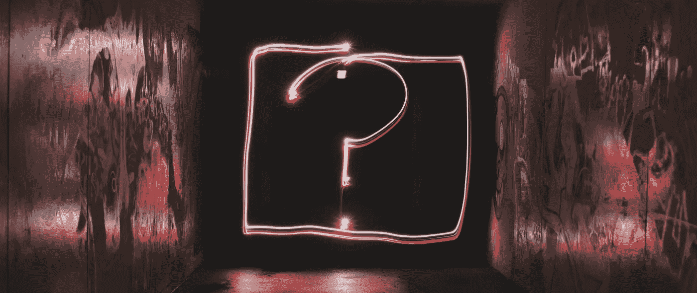

# 如何获得安全许可(以及 IT 专业人员的其他常见问题)

> 原文：<https://medium.com/hackernoon/security-clearance-faqs-4fb6691b2046>

继我们最近的博客[如何获得 DV 安全许可](https://www.evolutionjobs.com/uk/media/how-to-get-dv-security-clearance-177716/)和[安全许可如何促进你的 IT 职业](https://www.evolutionjobs.com/uk/media/how-security-clearance-can-boost-your-it-career-184273/)之后，我们收到了许多来自 IT 专业人士的问题，他们对在[国防](https://www.evolutionjobs.com/uk/jobs/it-security-defence/)、航空航天和国家安全行业寻找工作感兴趣。有什么比在安全许可 FAQ 博客中回答这些问题更好的方法呢？

安全审查是一种审查形式，如果通过，你就可以接触敏感的政府信息、系统、软件和人员。因此，这是许多 it 安全职位的要求。

不熟悉安全审查的 IT 专业人员自然会对要求、流程和维护安全审查有许多迫切的问题。那么，让我们深入了解一下。

# 有哪些不同类型的安全检查？

在英国有三种主要的安全检查:

1.  高级审查(DV) —这是对 IT 专业人员最常见的要求，对于那些长期、频繁且不受控制地接触绝密信息的人来说也是必要的。
2.  安全检查(SC) —对于涉及长期、频繁和受控访问敏感信息的职位，这是必需的。
3.  反恐怖检查(CTC) —这是那些与公众人物密切合作的人或那些需要在无人监督的情况下进入特别容易遭受恐怖袭击的军事、民用、工业或商业机构的人所需要的。

# 谁必须完成安全检查？

需要访问绝密信息的永久 IT 专业人员和承包商必须完成安全审查，才能担任特定角色或参与特定项目。这通常会在 IT 安全职位空缺中提及。

# 我需要什么级别的许可？

所需的安全许可级别将取决于您作为您的角色的一部分需要访问的信息，并将由雇主决定。

# 我能自己获得安全许可吗？

否——要通过安全审查，您必须由专门在国家安全和国防行业工作的雇主或负责特定项目的国防部(MoD) /情报机构负责人担保。这意味着你必须签约，或正在签约过程中，为中央政府机密项目或国防部情报机构工作。

# 谁决定我是否通过安全检查？

国家审查机构完成你的安全审查程序，决定是否批准你的审查。该决定将被传递给你的赞助商，他们将确认结果。

# 面试时会问我什么问题？

家庭暴力安全审查包括与政府审查机构 UKSV 进行面对面的面谈。面试中提出的问题将涵盖广泛的个人话题，如你的生活、性格、家庭背景、以前和现在的关系、吸毒经历、财务、爱好、旅行、政治观点等等。这些问题可能会打扰您，但不应让您感到不舒服，您只会被问到一些必要的问题，以了解您的忠诚度、判断力、诚实度以及对贿赂和勒索的脆弱性。

# 为什么我需要接受财务检查？

财务困难，无论是过去还是现在，都可能让你容易受到财务威胁。你将被要求完成一份财务调查问卷，并授权与征信机构进行核对，但你不应该担心用于每月生活支出的抵押贷款或信用卡。

# 我的推荐人会被问到什么？

你的推荐人将被邀请参加一次面对面的面试，他们将被问及关于你和你的性格的问题。这是为了向审查官提供你的整体情况。

# 犯罪记录会阻止我获得安全许可吗？

不一定。严重的定罪将导致你要么不及格，要么被建议不要申请，因为你将通不过预审问题。安全审查申请是逐案处理的，任何犯罪记录都将根据具体情况、犯罪年龄和你当时的年龄来考虑。然而，不披露犯罪记录将会阻止你获得安全许可。

# 我必须在英国住多久？

所需的英国居留权取决于安全审查的级别，从五年到十年不等，到在英国出生和长大。

# 我的安全许可持续多久？

大多数安全许可申请都有一段固定的时间，由担保人决定，前提是你仍在该职位范围内。如果您离职，DV 许可可以保持有效长达 12 个月，在此时间点过期，如果需要，许可流程必须重新开始。

# 我能把我的安全许可转让给另一个雇主吗？

根据所涉及的公司，在某些情况下，你的安全许可可能会被转移到另一个雇主。如果这是不可能的，那么你必须重新获得安全许可。

# 我可以对拒绝安全检查提出上诉吗？

否——政府审查团队决定您的申请结果，如果您失败，几乎没有理由(如果有的话)让您再次深入了解您提供的个人信息的深度和敏感性。

*原载于 2019 年 5 月 24 日*[*【https://www.evolutionjobs.com】*](https://www.evolutionjobs.com/uk/media/security-clearance-faqs-189261/)*。*