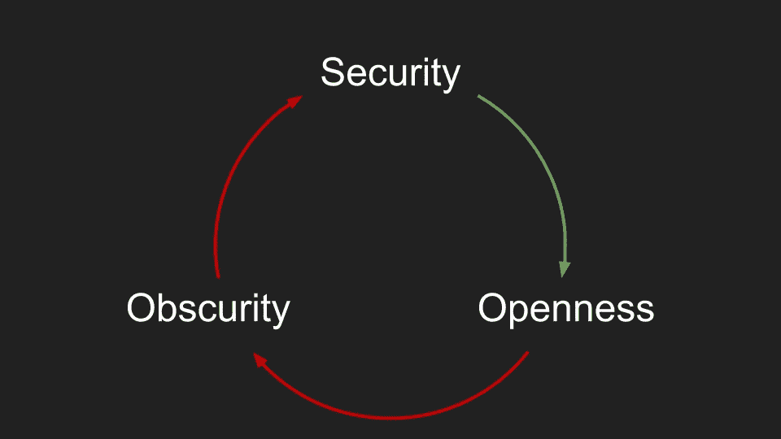
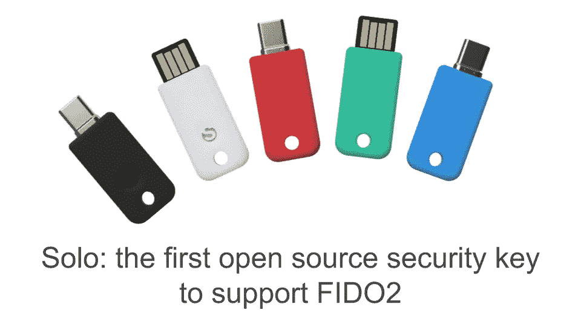
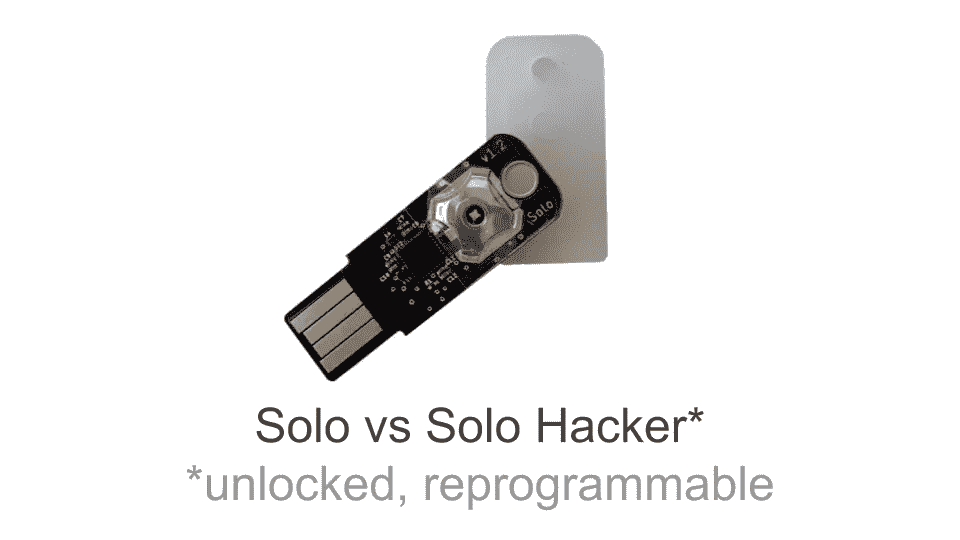

# 安全，默默无闻，开放

> 原文：<https://medium.com/hackernoon/security-obscurity-openness-55c14f7e9cc1>

## 做开源替代方案——# dev stories

这是我在[黑客正午#devstories @Github 事件](https://twitter.com/search?src=typd&q=%23devstories)上的一次演讲的文字记录，做了一些小的修改以提高可读性。我想指出的讽刺是，安全要求开放，但安全也是晦涩和专有实现的原因，尤其是在硬件领域。让安全更加开放是促使我们建立 [SoloKeys](https://solokeys.com/) ，并开源硬件安全密钥的原因。

我认为安全真正吸引人的是我试图在标题中捕捉到的开放和模糊之间的二元性。

借用密码学中的一个[定义](https://en.wikipedia.org/wiki/Kerckhoffs's_principle):

> 一个(加密)系统应该是安全的，即使除了密钥之外，关于该系统的一切都是公开的。

因此，安全要求开放。反之亦然，开放意味着信任。这可能是我们都爱开源项目的原因，因为本能上我们更倾向于信任它们。

就拿 iOS vs Android 的经典例子来说吧。如果我问哪个更开放？当然，每个人都同意这是安卓系统。即使如此，如果我们放大到 Android，我们知道并不是所有东西都是开源的。有些部分是专有的，通常我们越接近硬件。如果我们问为什么呢？而我们深挖，默默无闻的原因往往是……安全！

这是非常讽刺和矛盾的。安全需要开放，开放意味着信任，系统的某些部分不能开放，这是为什么！？因为安全。

这个循环显然有一个我们想要延续的好的部分，和另一个我们应该打断的部分。作为一个社区，我们应该努力开发开源替代方案。你能想象一个没有开源操作系统的世界吗？我并不是说一切都应该开放，当然那是不可能的。我的意思是，任何东西都应该有一个开放的选择，供用户选择。对我来说，这在我所关心的领域——安全——尤其重要，正如我们之前提到的，越接近硬件，情况就越不一样，例如硬件安全密钥。

2018 年 8 月，我们和一群朋友一起创立了 [SoloKeys](https://solokeys.com/) ，目标是做安全应用的开源硬件，从用户登录开始。

我们单飞了。Solo 是第一个开源的安全密钥，实现了最新的 FIDO2 标准，为双因素身份验证提供了最强的安全级别，可以与谷歌、脸书、Github 等许多公司合作。

10 月份，我们推出了一个 Kickstarter，从大约 12.3 万美元的 3K 支持者那里筹集了 12.3 万美元，这对于一个安全产品来说是惊人的，而几乎所有其他类似的活动都不幸失败了。

11 月，我们参加了 FIDO 联盟互操作性测试活动，通过了所有测试。我们在道德上是 FIDO2 认证的，只是需要支付认证费用。

12 月，我们运送了第一批产品，至少在美国，许多人在圣诞节前拿到了他们的 Solo key。

最后，一月份我们在 [Shmoocon](https://youtu.be/fVgUwHr2RUU) ，第一次展示了我们的旅程。

除了消费者安全密钥 Solo，我们还提供 Solo Hacker，一个具有相同开源硬件的密钥和一个解锁的固件，因此无论您是想了解嵌入式设备还是探索我们的安全功能，您都可以对其进行重新编程。

非常感谢两位活动主持人:HackerNoon 是我们第一次推出 Solo 的地方，GitHub 是我们托管开源固件和硬件的地方。

最后邀请[加入我们的社区](https://github.com/solokeys/solo)，帮助我们在硬件和软件上实现更加开放的安全性。

页（page 的缩写）s:如果你对 Solo 感兴趣，请查看折扣代码的[幻灯片](https://docs.google.com/presentation/d/1Eql6eD9naLEzF64Q3BaWjatNn_lbPvUc_KQAHTPBdDs/edit?usp=sharing)或[视频](https://youtu.be/ffGvNLM45F8)——我们已经将有效期延长一个月左右。一如既往，如果您有任何反馈或建议，请使用下面的评论或找到我 [@0x0ece](https://twitter.com/0x0ece) 。