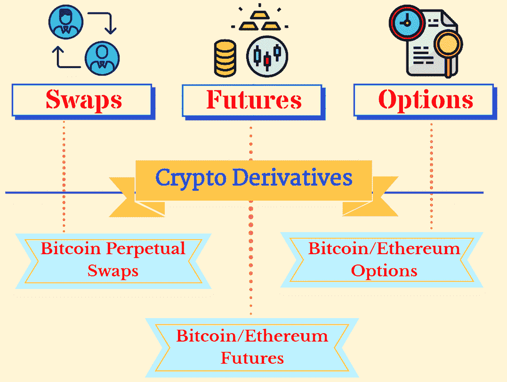
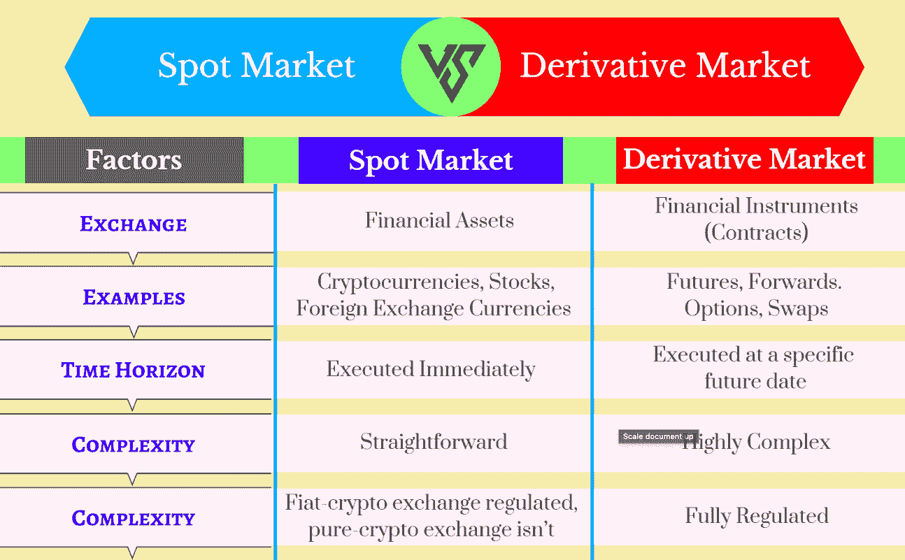
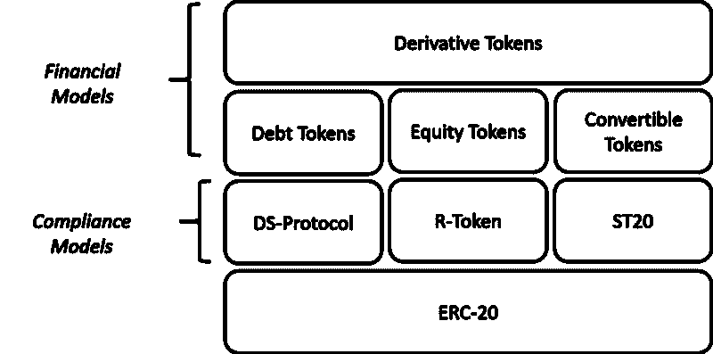

# 证券代币衍生工具概述

> 原文：<https://medium.com/hackernoon/security-token-derivatives-158758c6a301>

[衍生产品](https://hackernoon.com/tagged/derivative)是两方或多方之间的金融合同，其价值来自基础资产，即。股票、商品或加密货币。在未来特定时间以预定价格购买或出售特定资产的协议。衍生品本身没有内在或直接的价值。衍生合约的价值完全基于基础资产的预期未来价格变动。

加密货币令牌是一种特殊的虚拟货币令牌，驻留在自己的区块链上，代表一种资产或公用事业。通过区块链来标记资产正在走向成熟，我们已经看到了这个行业的巨大牵引力。您可以在以下文章中找到您需要的关于 sto 的所有信息:

*   [什么是安全令牌？](https://www.securities.io/what-are-security-tokens/)
*   [什么是安全令牌产品(STO)](https://hackernoon.com/security-token-offerings-stos-what-you-need-to-know-8628574d11e2)
*   [sto 不像 ico 那么简单](https://hackernoon.com/security-token-offerings-sto-is-not-as-simple-as-icos-ed5f1506da2c)

应用每天都在发生——最近脸书推出了他们的加密货币。实物交割的衍生品市场也是如此，实物交割实际上可以降低比特币价格的波动性，这是 18 世纪衍生品市场的初衷。

# 加密衍生品

衍生产品的主要形式有:

*   互换:互换是双方在未来交换一系列现金流的安排。它们通常以贷款、债券或票据等计息工具作为基础资产。最常见的互换形式是利息互换。它包括在两个不同的交易方之间将固定利率的未来支付流转换为浮动利率的支付流。
*   期货:一种金融合同，买方有义务以固定价格和预定的未来价格购买资产或出售资产。
*   期权:一种金融合约，其中买方有权(而非义务)购买资产，或卖方有权在特定时间内以预定价格出售资产。

# 易变资产的波动性

请记住，加密衍生品代表了已经不稳定的加密资产之上的第二层投机。推动加密货币价格的主要因素之一是新闻和市场投机。因此，没有简单的方法来预测这些。在 Moonwhale 撰写的一篇文章中，传统的市场交易/投资策略可能不适用。复杂的对冲策略或再平衡功能并没有阻止加密对冲基金经历巨额亏损。如果我们在此基础上添加一个数学模型(衍生品)，我们实际上是在一个不稳定的工具上添加了一个投机工具。

# 安全令牌是衍生品吗？

任何形式的[证券](https://hackernoon.com/tagged/security)都可以被视为衍生品，因为它从基础资产的表现中获得价值。然而，传统的衍生模型包括其他方面，如时间约束，义务对称或结算模型。它们不太符合安全令牌的特征。因此，安全代币可以表现得像衍生品，而其他代币的交易则更像一级资产类别。

# 证券代币衍生工具的类型和模型

随着证券代币市场的发展，有几种衍生产品可能会浮出水面。

*   **代表安全令牌的衍生品**

这些是数学模型，用于推测基础证券的价格，这些证券可以代表替代资产，如房地产、艺术品、股票、黄金或其他资产。

*   **代表市场衍生品的证券代币**

我们可以将所有东西令牌化，因此令牌可以代表市场衍生品，如期权或期货。

*   **远期期货模型**

智能合约可以指定在指定的未来时间以事先商定的价格购买或出售证券令牌的标准。它遵循金融市场中远期或期货衍生品的模型。如果在集中交易市场交易，这些证券衍生品可以遵循期货模型，如果在分散交易市场交易，则遵循远期模型。

*   **期权模型**

安全令牌期权的所有者将有权利但没有义务在特定日期以特定价格购买或出售基础安全令牌。

*   **ETF 模型**

交易所交易基金是可行的证券代币。ETF 类证券代币可以代表一组基础资产的价值，如房地产租赁、贷款或不同公司的私人股份。

*   **互换模型**

证券代币衍生产品可以类似于金融市场中的互换模型。它交换由两种不同的证券代币产生的股息或现金流。通过这样做，它可以作为对未来市场条件的对冲或保险。

*   **共同基金模式**

共同基金模式更适合企业。例如寻求发行他们自己的安全令牌的金融机构。就像 ETF 一样，共同基金代币将集合一个证券代币池。然而，与 ETF 不同，它们不会被积极交易，只会定期定价。

> "衍生品市场最重要的价值是隐含的风险信息，它可以帮助投资者做出配置决策."

# 结论

稳定债券的兴起为投资者提供了一种对冲投资的方式。大多数交易所已经将各种稳定币配对纳入比特币和替代币。然而，对于规模较大的基金来说，这仍然是一个障碍。加密衍生品可以满足大型机构的一个明显需求。加密货币真正被视为一个成熟的金融市场只是时间问题。

要阅读关于另外两种类型的安全令牌的更多内容，这里是我的另一篇文章

 [## 安全令牌—您应该知道的三种类型

### 安全令牌执行与传统安全相同的功能，除了它通过…

hackernoon.com](https://hackernoon.com/security-tokens-three-types-you-should-know-of-d8146e648be9) 

# 关于我:

**伊利亚·扎基是 moonwale Ventures**[**STO 咨询**](https://moonwhale.io/) **公司的营销&业务发展主管，该公司总部位于美国**

在我们的各种社交媒体平台上关注我们—

[推特](https://twitter.com/MoonwhaleBV) | [领英](https://www.linkedin.com/company/moonwhalebv) | [脸书](https://www.facebook.com/MoonwhaleBV/) | [电报](https://t.me/moonwhaler)