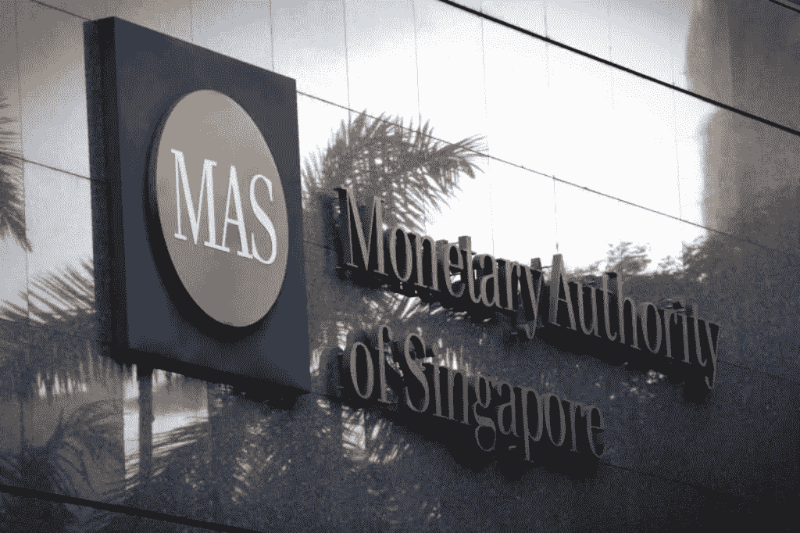

# 安全令牌产品—您应该聘请 STO 顾问吗？

> 原文：<https://medium.com/hackernoon/security-token-offering-should-you-engage-an-sto-advisory-25daa1fcda9b>

比特币似乎在挑战菲亚特。[区块链](https://hackernoon.com/tagged/blockchain)技术正在颠覆十年之久的行业。证券代币发行(STO)是筹资的新方法。最初，ico 被认为是空间的杀手，但由于诈骗的数量，法规很快解决了这个问题。简单地说，STO 就是 ICOs 的合法化版本。

推出一个 [ICO](https://hackernoon.com/tagged/ico) 已经是一个复杂的过程。再加上额外的法律合规性，以及完成 STO 所需的对投资者的适当持续 KYC 和反洗钱的必要性，你就有太多的事情要担心了。那么你应该聘请 STO 顾问吗？

# 什么是安全令牌产品(sto)？

但是让我们试着用一个简单的类比来理解它:**一个工厂。**

**首次发行硬币筹资(ICOs)** :创造一种公用事业代币或持有法定价值的手段。

*投资 ICO 或公用事业代币本质上意味着投资机器或制造机器的想法，以制造/包装/服务公司正在做的任何事情*。

如果工厂不生产产品会发生什么？这种产品没有任何需求。当拥有这些机器(用你的钱建造的)的公司倒闭或决定改变方向并离开这些机器时，你的钱将被卡在这些机器中，除非该公司找到一种方法将其纳入他们的下一个商业想法。

更大或更成熟的加密公司，如以太坊或 Stellar Lumens，已经在这个游戏中玩了很多年，并开发了一个成功的商业模式来产生收入。以太坊从来就不是用来储存价值的，所以以太坊的波动性并不重要。

**证券代币发行筹资**:股权或资产支持代币。

*投资 STO 或安全代币意味着你将投资于拥有机器和工厂的公司。*

在筹资之前，该公司必须通过适当的法律渠道与管理实体联系。理想情况下，如果该公司最终关闭，这将是一项失败的投资。如果所说的公司是一个骗局，他们可以被当局追踪和发现。

有关安全令牌产品的更多信息，请参考我在 Hackernoon 上的另一篇文章:

 [## 安全令牌产品(STOs 您需要了解的内容

### STO 是新的 IPO

hackernoon.com](https://hackernoon.com/security-token-offerings-stos-what-you-need-to-know-8628574d11e2) 

# 斯托没有捷径可走

参考[今日在线](https://www.todayonline.com/singapore/company-gets-warning-mas-after-it-planned-issue-securities-tokens)的这篇新闻文章，发行安全令牌的公司承受不起快速成功的代价。该公司还发现，“先令”(也称为推广)他们的项目可能会导致当局的警告。

希望通过安全令牌产品进行扩张的公司需要在这方面进行严格的尽职调查，尤其是因为每个国家都有不同的法律法规。

如果您的安全令牌提供没有按照代码执行，下面是您将遇到的一些问题。

*   交易所不会将任何有潜在法律问题的 STO 上市。即使是一次交易的损失也会稀释你品牌未来的流动性和价值
*   美国证券交易委员会或其他政府机构可以对你处以罚款，或者在最坏的情况下关闭你的业务
*   KYC 或反洗钱操作不当可能会危及未来的银行业务关系，并可能导致资金被没收
*   在业内人士看来，你可能显得不专业
*   潜在筹资金额的去优化

# 聘请安全令牌提供咨询公司

世界上大多数人对区块链或筹款有所了解，但下一步似乎是最难的——下一步是什么？我们应该去找谁？

**在这种情况下，您可以考虑聘请安全令牌顾问。**

咨询师或顾问是有技能的个人或团体，他们可以提供必要的步骤来推进未知的行业。雇佣顾问的主要好处是他们带来的*临时专业知识*。采用按服务付费的理念，从长远来看，聘用顾问比聘用全职员工更具成本效益——员工福利、人力资源问题。它们在某种程度上也是可消耗的，提供了一种简单的方法来清除无用的东西。

顾问还可以执行以下操作:

*   合适的法律顾问介绍
*   令牌发放者简介
*   潜在投资者介绍
*   关于纳入司法管辖区的建议
*   白皮书/商业计划的优化
*   在活动中联系，讨论项目
*   建议改变计划的公司结构

有一个随叫随到的顾问为组织提供了巨大的价值。顾问通常包含来自各种背景和专业知识的个人，使顾问能够客观地思考，并纯粹为了招聘公司的业务发展和收入增长而制定创新战略。顾问也可能比普通员工拥有必要的商业专业知识和经验。

一家好的 STO 咨询公司应该对区块链地区的现行法规和法律有很好的了解。由于各种 ico 带来的虚假承诺，当局终于开始赶上炒作，并带来新的立法和法律，这只会对行业有利。最重要的是，您的顾问要跟上不断变化的法律法规，以确保您与 s to 的旅程尽可能顺利。

提供安全令牌的话题仍然存在争议。但是从理论上来说，标记化可以为更大的事情铺平道路，就像 ico 一样。看着 ico 演变成 STO 是颠覆证券行业的第一步。

# 关于我:

**伊利亚·扎基是 Moonwhale Ventures 的营销&业务开发主管，是一家总部位于美国的** [**STO 咨询**](https://moonwhale.io/) **公司**

在我们的各种社交媒体平台上关注我们—

[推特](https://twitter.com/MoonwhaleBV) | [LinkedIn](https://www.linkedin.com/company/moonwhalebv) | [脸书](https://www.facebook.com/MoonwhaleBV/) | [电报](https://t.me/moonwhaler)