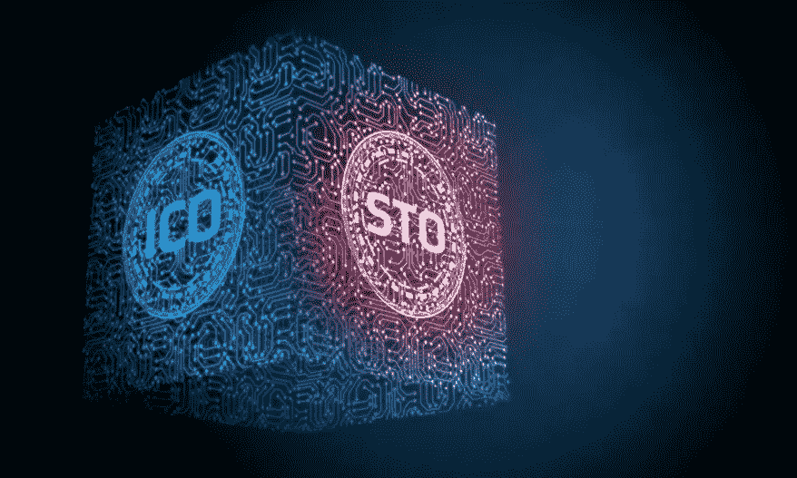

# 安全令牌产品(sto)

> 原文：<https://medium.com/hackernoon/security-token-offerings-stos-cddf965bd7a6>

Image Credits — [DATAFLOQ](https://datafloq.com/read/what-is-a-security-token-offering-sto-replace-ico/5983)

## 初级读本

**最后更新于-**2019 年 3 月 20 日

这一切都始于一个名为 [**【道】**](https://en.wikipedia.org/wiki/The_DAO_(organization)) 的投资者导向的风险基金。2016 年 5 月，它创下了历史上最大的众筹活动记录，有 18，000+利益相关者参与，筹集了 1，150 万以太(ETH)或 1.5 亿美元。它是由区块链技术实现的，其中 [**代码是法律**](https://harvardmagazine.com/2000/01/code-is-law-html) 或者至少是直到一些坏人利用了关于*DAO*智能合约代码中递归调用的漏洞，使他们能够将三分之一的资金转移到子公司账户。被盗资金被置于 28 天的持有期，以太坊社区就可能的解决方案进行了辩论，这导致了以太坊网络的分裂: [**以太坊经典** (ETC)](https://ethereumclassic.org/) 黑客仍然拥有资金和；他们不在的那个——[**以太坊** (ETH)](https://www.ethereum.org/) 。[1]

随后在 2017 年 7 月 25 日——美国证券交易委员会**(以下简称*SEC*)[发布了一份调查报告](https://www.sec.gov/news/press-release/2017-131)，认定*道*代币为证券。所以，一个分散的自治组织背后的计算机代码，实质上成了 SEC 眼中的安全，世界各地的政府机构开始注意到这一点；发布与 SEC 一致的声明，有时更具一般性，导致公众对加密货币和代币的立场不明确。[2]**

我们必须明白道是一个特殊的符号。它是[无国籍](https://en.wikipedia.org/wiki/Stateless_society)，不与任何特定的民族国家或国家绑定，在其结构中包含特定的权利主张，代码本身就是[的计划书](https://www.investopedia.com/terms/p/prospectus.asp)。如何与政府打交道的问题真的很难回答，现在依然如此。支持加密货币监管的专业人士欢迎 SEC 将大多数代币视为安全的立场，同时仍在探索豁免(如 [SEC Form D](https://www.investopedia.com/terms/s/sec-form-d.asp) )为其业务筹集资金。[法规 S](https://en.wikipedia.org/wiki/Securities_Act_of_1933) 为美国证券法规的发行人*提供了一个安全港*,如果美国境内没有针对美国居民/公司的直销活动。

一篇名为[加密证券法规](https://papers.ssrn.com/sol3/papers.cfm?abstract_id=3075820)的研究论文提出了两项政策来减少代币销售的法律不确定性-

> 首先，我们建议根据代币销售的代码驱动特性定制披露要求。这种特定于 ICO 的安全港将为怀疑其代币可能符合证券资格的代币卖家提供一条清晰、负担更轻的符合欧盟法律的途径。这只要求委员会修改其委托的 2004 年委员会章程条例。第二，我们建议，在国际层面上，各国政府应达成一项契约，以确保其各自的证券监管制度适用于代币销售。首先，这一方面是为了避免监管过度，另一方面是为了避免在线媒介全球代币销售中的监管空白。
> 
> 其次，重叠且部分矛盾的证券监管制度甚至会相互削弱。最终，面对新一代分散的区块链应用程序，只有联合的国际监管制度才能有效地平衡投资者保护和投资者准入。*【3】*

该文件还呼吁为加密证券制定一个国际公约，以帮助投资者和发行者清楚地了解监管情况。 [**436 & 442 东 14 街，曼哈顿**](https://medium.com/u/24a98351cc13#5da20f0d4895) -房地产；投资者提出通过[取消](https://medium.com/u/87864c241afc#msg20490395) ICO 原计划 2017 年 8 月 1 日。

*   在 ICO 事件发生几天后，在 SEC 的调查后，原星公司退还了所筹集的乙醚。*   承诺 13 倍利润的追加投资被证券交易委员会叫停。*   在他们的白皮书中， **Munchee 的**MUN 令牌被多次描述为*实用程序*，但是 [SEC 断定](https://www.sec.gov/litigation/admin/2017/33-10445.pdf)它是一个*安全*。Munchee 叫停了 ICO ( [筹集了 1500 万美元](https://www.coindesk.com/sec-halts-multimillion-dollar-munchee-ico-securities-violations))并返还了收益，同时配合调查。

# 最后

**斯托斯应该存在吗？**是的。初创公司和中小型企业经常面临资金短缺的障碍，这对于它们进入资本市场没有帮助。年轻和创新的公司不应该受到现有制度的限制。

安全令牌可以对金融系统和整个社会产生巨大影响，因为它们将区块链技术的要素，特别是透明度和安全性，与传统金融工具的法律确定性结合起来。这使得任何规模的公司都可以安全地进入这个新的不断发展的生态系统。证券代币有望为初创企业和中小企业提供另一种融资形式，催生一个全天候交易的新资本市场，不再需要经纪人和银行托管证券。[5]

**他们比 ICO 强吗？**或许吧。STO 项目通常是注册实体，这增加了项目的合法性，并使发行人对其行为负责。

*法规是否意味着安全令牌将* ***见只向上增长*** *？*

不尽然，但可以肯定的是，它们是一种受监管的众筹形式，具有改变证券市场的巨大潜力。一部关于中国骗局的网飞纪录片告诉我们，即使是高度管制的传统市场也受到炒作的驱动。投资者对 2007-2008 年的金融危机仍心有余悸。互联网泡沫应该是一个教训，即使企业有时是合法的，也应该极其谨慎地评估价值。仅仅因为该产品现在被称为 ICO 或 IEO 或 still 它仍然是有风险的，被告知是重要的。

有个老笑话说华尔街最大的谎言是——***这一次，不一样了。***

**【免责声明】**——*本文并非法律意见。这些视图是个人的，引用外部资源的视图属于他们。*

# **来源**

1.  道(组织)，维基-[https://en . Wikipedia . org/wiki/The _ DAO _(组织)](https://en.wikipedia.org/wiki/The_DAO_(organization))
2.  加密货币法规-[https://medium . com/@ rahulmanuwas/cryptocurrency-Regulations-a-complete-summary-912 e 6 de 0 C7 a 4](/@rahulmanuwas/cryptocurrency-regulations-a-complete-summary-912e6de0c7a4)
3.  Hacker，Philipp 和 Thomale，Chris,《加密证券监管:欧盟金融法下的 ICOs、代币销售和加密货币》( 2017 年 11 月 22 日)。欧洲公司和金融法评论即将出版。可在 https://ssrn.com/abstract=3075820[SSRN](https://ssrn.com/abstract=3075820)或 http://dx.doi.org/10.2139/ssrn.3075820[买到](https://dx.doi.org/10.2139/ssrn.3075820)
4.  安全令牌标准-【https://thesecuritytokenstandard.org 
5.  安特，伦纳特&费德勒，英戈。(2019).区块链上的安全令牌产品:中小企业的资本市场准入？。10.13140/RG
6.  invenium Capital Partners-[https://www . coin desk . com/6600 万-building-to-to-token ized-on-ether eum-in-record-deal](https://www.coindesk.com/66-million-building-to-be-tokenized-on-ethereum-blockchain-in-record-deal)
7.  Coindesk 关于 Templum 托管代币销售的报告—[https://www . coin desk . com/regulated-trader-Templum-hosts-security-token-sale-for-luxury-resort](https://www.coindesk.com/regulated-trader-templum-hosts-security-token-sale-for-luxury-resort)
8.  Sean Au & Thomas Power(2018)token omics-[https://www . packtpub . com/big-data-and-business-intelligence/token omics](https://www.packtpub.com/big-data-and-business-intelligence/tokenomics)
9.  Coindesk 关于 1 broker-[https://www . coin desk . com/sec-CFTC-charge-bit coin-futures-firm-1 broker-with-securities-law-violations](https://www.coindesk.com/sec-cftc-charge-bitcoin-futures-firm-1broker-with-securities-law-violations)