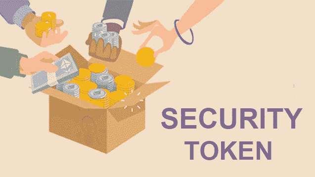

# 安全令牌超级用户—第 1 部分

> 原文：<https://medium.com/hackernoon/security-token-superpowers-part-1-b756ebcae6f9>

安全令牌的力量通常被描述为增加流动性、透明度和效率。虽然这些好处很有吸引力，但它们是令牌化版本的安全性到传统模拟版本的映射，但却忽略了更大的图景。

安全令牌的真正力量在于它们可以在当前以太坊上构建的开放金融系统中轻松使用。这种安全令牌和开放金融的结合解锁了在今天的系统中过于昂贵或不可能的金融选项。

> 证券代币为投资者开启金融选择。

这是一个由两部分组成的系列，深入挖掘这些超级力量，从个人投资者如何独特受益开始。

## 摘要

*   安全令牌代表区块链上的证券，是比纯加密货币波动性更低的数万亿资产
*   作为令牌，它们可在智能合约中使用
*   他们隐藏的超能力是当与开放金融产品(通常被称为分散金融或 DeFi 协议)一起使用时解锁的金融选项

## 什么是安全令牌？

它是一种受监管证券的代表，作为区块链上的一种象征。这可以是任何东西，从一家公司的股权到房地产投资(T2)。2019 年被称为“安全令牌年”，随着安全令牌交易所、发行平台和投资机会的出现，势头一直在增长。

Image credit: technoloader.com

证券代币在投资者之间的交易更加透明和高效，释放了资产的流动性溢价。此外，他们可以高效地管理法规要求，实现对交易和所有权的实时检查。对投资者来说，拥有证券代币比拥有传统的资产模拟版本更有吸引力，这是巨大的机遇。

孤立于更大的区块链金融生态系统而专注于代币，会忽略安全代币的真正力量。这种令人震惊的认识是如何将安全令牌与智能合约一起使用，以创建在当今金融系统中不可能实现的全新金融产品。特别是在与以太坊上建立的新兴协议类一起使用时。让我们深入了解一下。

## 什么是“基于协议的金融产品”？

它们是由运行在区块链上的代码(智能合约)驱动的金融产品。想象一下，一个透明的算法能够以令人难以置信的效率做同样的事情，而不是有人在电子表格中输入数据来确定借款人的贷款条款。

虽然这只是简化了财务协议的功能，但是查看一个具体的协议还是很有帮助的。 [MakerDao](https://makerdao.com/en/) CDP 是当今领先的协议之一。它使得任何人都可以使用以太坊作为抵押品来创建抵押债务头寸(CDP)。今天，1.5%的以太坊被锁定在 CDP 中，该协议的使用[每月增长 20%](/makerdao/dai-in-numbers-2710d8a5633a)。

今天，该协议使用户能够存款以太坊，以创建一个即时和高效的贷款。出于我将在下一篇文章中详述的原因，MakerDAO 正朝着多抵押品的方向发展，包括存放安全令牌作为抵押品。这对于协议和用户来说都是非常有价值的特性。

让我们深入了解一下。

## 安全令牌持有者如何受益？

假设你以传统形式拥有 50，000 美元的标准普尔 500。你是一个长期投资者，你想持有证券。然而，你有一个短期的现金需求。今天，最富有的人可以从一些经纪人那里获得股票贷款，但我们假设的投资者会被他们的 50k 头寸拒之门外。

现在，假设你以代币的形式持有等量的标准普尔 500。使用这些代币，你只需 5 分钟就可以通过 MakerDAO 获得抵押贷款。非常低的成本，没有最低限度和明确，透明的条款。难以置信。

这是一个简单的例子来说明一个观点。随着金融协议的发展，更多的选择将向令牌持有者开放，这在当今世界是没有类似的。当与具有全球吸引力、所有权和价值的证券——证券——搭配时，开放金融的力量就完全显现出来了。

跟我来看看[第二部](https://hackernoon.com/security-token-superpowers-part-2-30ffcdd4acac)！

***At***[***Fetch***](https://hellofetch.co/?utm_source=hackernoon&utm_medium=medium&utm_campaign=security-token-superpowers-part1)***我们正在为每个人简化代币投资。*** [***尝试一下***](https://hellofetch.co/download/?utm_source=hackernoon&utm_medium=medium&utm_campaign=security-token-superpowers-part1) ***并在 twitter 上关注我们***[***@ hello _ fetch***](https://twitter.com/hello_fetch)

*免责声明:我是 Fetch 的联合创始人兼 CEO！*