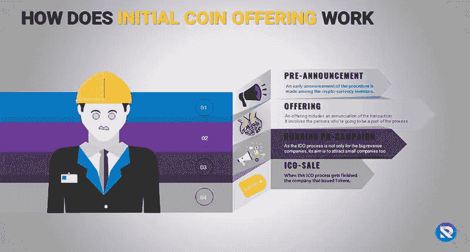
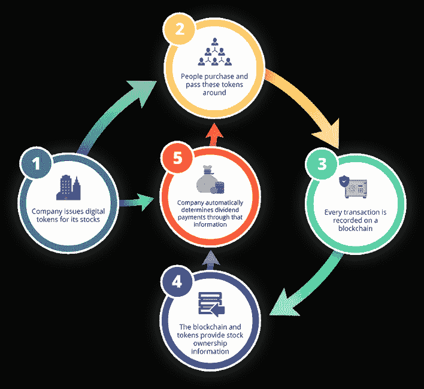
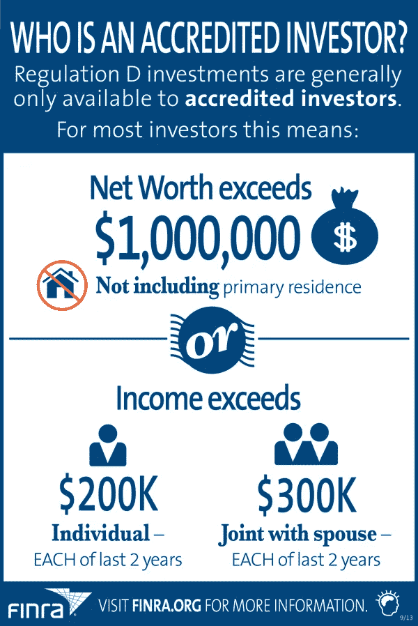

# 安全令牌:另一个泡沫还是真正的交易？

> 原文：<https://medium.com/hackernoon/security-tokens-another-bubble-or-the-real-deal-20c9373607c7>

加密货币市场让一些人变成了百万富翁，但代价是让许多人负债。

现在回想起来，ICOs 的陨落已经尘埃落定，分散财富的整个想法似乎是一场闹剧。一些幸运的投机者在 2018 年 1 月的高点出售了他们的 ICO 代币，将他们一周的薪水变成了财富。大多数人都拿着投机史上最腐败的袋子。ico 的问题是太多的项目推出了公用事业代币，却没有为代币创造真正的经济需求。与此同时，人们盲目地投入大量现金，只希望出售他们的 ICO 代币获利。当贪婪与异想天开的决策结合在一起时，血淋淋的银行账户就是产物。

Courtesy of Rilcoin

许多 ico 有不合理的硬性规定、缺乏经验的团队和不切实际的目标，但他们仍然获得了大量资本。现在，许多加密货币的坚定信仰者声称，ico 是如此灾难性，因为投资者在公用令牌销售的协议和法律地位下没有得到任何安全保障。加密货币领域越来越多的人认为，ico 正在变成一种更精致的代币销售手段，称为 sto。

越来越多的人相信，s to 将提供 ico 想要的东西:获得财富和以前无法获得的机会。然而，这种越来越流行的信念只是一个被大多数 ico 的可怕表现弄得崩溃的社区的一厢情愿吗？

**不完全是。**

# 什么是 STO？

证券代币发行(sto)是现代的首次公开发行(IPO)。如果一切都数字化了，为什么不把股权也数字化呢？

在很大程度上，股权已经被记录在数字筒仓中。sto 只是将所有权包装在令牌中。安全令牌销售问题，嗯，安全令牌。顾名思义，安全令牌是金融证券，其发行者必须遵守其总部所在国家的金融监管机构的规定。这样做的好处是，尽管 ICO 发行人可以随意使用募集资金，但 STO 发行人将有受托责任妥善处理投资者资本，并合理地将其分配给产品开发，否则将面临法律制裁。

这是个好消息。

ICO 有很多问题，但导致 ICO 市场如此痛苦地消亡的一个问题是，ICO 发行者不对他们对投资者资本的疏忽负责。STO 发行人的处境并不那么舒服。它们必须代表投资者的最大利益，这是任何发行证券的实体所要求的。

因此，sto 将通过象征性销售的众筹行为视为一种受监管的融资方式。虽然这涉及政府发行代币，但它实现了一个更令人满意的结果:为大众提供安全保障。欺诈项目将被阻止，不合格的投资者将被视为不适合融资；此外，对投资者资金的疏忽将导致严厉的处罚。

安全性并不是 sto 的唯一好处。这些代币真正提供了大多数人以前做梦也想不到的机会。

# **新机遇**

除非你年收入超过 20 万美元，或者净资产超过 100 万美元，不包括你居住的房地产，否则你不太可能成为那 1%的人。金融监管机构给这 1%的人起了一个不那么响亮的名字:合格投资者。

虽然合格投资者身份因国家而异，但它通常会根据一个国家的人均 GDP 进行调整，以确保只有少数人——超级富人——能够成为高风险但高利润投资机会的一部分。然而，并不是所有只有 1%的人能接触到的投资都是高风险的。房地产资产、中型私营企业的股份、稀有汽车等。是只有超级富豪才能投资的例子。可悲的是，由于无法获得这些投资，许多人成为通胀的受害者，因为他们最终持有的现金每年都会贬值。

虽然公用令牌在解决这一问题方面的价值接近于零，但安全令牌解决了支撑当前投资基础设施的每一个支柱，这些基础设施在大众面前关上了大门。

**解令牌**

通过 sto 发行的安全令牌使得任何资产都可以分割。

世界上的任何资产都可以被令牌化，只要代表资产所有权的法律文档被存放到一个实体，该实体可以代表所有者充当托管人，在这种情况下，资产支持的安全令牌的所有者数量不限。因此，无论是稀有的法拉利、曼哈顿的顶层公寓，还是养马场，只要有办法将资产所有权移交给托管人，就有可能将资产令牌化。

保管人仅应作为代表资产所有权或凭证的文件持有人。资产的所有权将存在于区块链上，由任何人都可以购买的代币来表示。通过这种方式，安全代币解决了高收益的问题，但安全的投资机会在很大程度上只属于富人。

# **发起者**

推出 STO 平台绝非易事。然而，一家名为 Mobu 的金融科技公司正在努力让每个人都可以使用 sto。虽然 Mobu 不是 STO 生态系统中的孤独者，但它是第一家在证券交易所获得股权的公司。这可以使公司将传统证券市场的功能扩展到安全令牌发射台和交易所。

Mobu 提供了一个平台，在这里任何资产都可以被令牌化；这一过程很简单，因为代表资产的法律文件需要通过金融监管机构批准的渠道存放到托管机构。Mobu 的平台提供了处理这些行话所需的法律支持。

一旦合法费用付清，资产的所有权就可以通过安全令牌在区块链上表示出来。拥有这些令牌的任何人都拥有令牌化资产的净所有权份额。这意味着这个人获得了资产收入流和价值增值的公平份额。因此，任何拥有象征性顶层公寓的人都有合法权利获得公寓赚取的租金、公寓的价格增值以及公寓面临的所有维护损失。

这个人对任何资产都有类似的权利，不管是奢侈品收藏品还是公司。

Mobu 通过创建充当安全的令牌来交付这些权利，因此 Mobu 支持安全令牌产品。为了遵守金融监管机构的要求以及 KYC/反洗钱对证券所有权、发行和销售的限制，Mobu 创建了自己的令牌标准 MOB20。

MOB20 令牌将是安全令牌，将在所有权批准的情况下进行编码。只有符合 KYC/反洗钱标准的人才能购买安全令牌。Mobu 目前正在举办自己开发的安全令牌销售活动，这些 MOBU 令牌的所有者将获得未来安全令牌所能提供的高峰。MOBU 代币提供收入流，投票权，所有权，等等。

私人金融科技公司的股权只有少数人可以参与。现在，任何人都可以购买一些可分割的令牌，成为平台所有权的一部分。

当然，sto 并不是无风险的，因为它们与任何投资都有相同的风险。ico 和 sto 之间的主要区别在于，金融当局有权规定提供 sto 的条件以及分配给投资者的权利证券令牌。因此，人们可以获得资产投资，而以前这只是超级富豪的投资渠道。

与 ico 不同，s to 真正提供了对有形资产的访问，而这些资产在过去可能是你无法接触到的。由于发行的代币是证券，发行者必须遵守证券法，在项目的进展和交付中遵守投资者的最大利益。