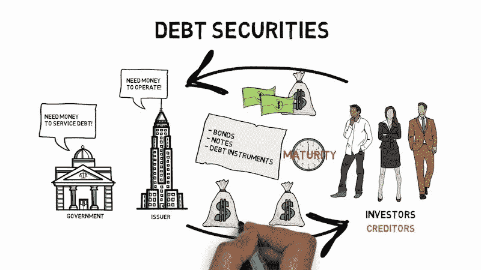
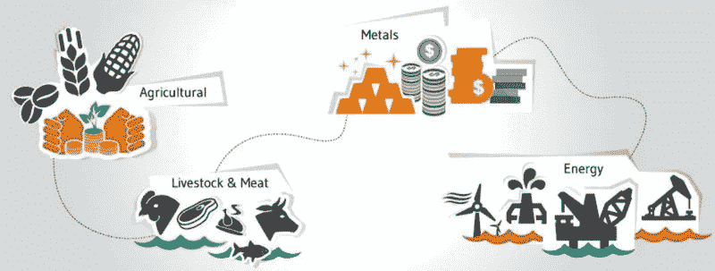

# 安全令牌—您应该知道的三种类型

> 原文：<https://medium.com/hackernoon/security-tokens-three-types-you-should-know-of-d8146e648be9>

与传统的[安全](https://hackernoon.com/tagged/security)类似，安全令牌执行相同的功能，只是它通过[区块链](https://hackernoon.com/tagged/blockchain)交易确认所有权，并使部分所有权成为可能。管理证券的联邦法律也适用于证券代币，目的是在某种程度上保护投资者。安全令牌是可编程的。理论上，证券令牌化通过使用智能合约消除了对第三方的需求。例如，在区块链上“令牌化”的贷款可以自动支付，而不需要像银行这样的传统中间人。在 Hackernoon 上一篇文章中，我们更深入地讨论了围绕[安全令牌](https://moonwhale.io/security-token-offerings-stos/)的各种监管要求。

 [## 安全令牌产品(STOs 您需要了解的内容

### STO 是新的 IPO

hackernoon.com](https://hackernoon.com/security-token-offerings-stos-what-you-need-to-know-8628574d11e2) 

最初，ico 最初被认为是空间的杀手。由于诈骗的数量，法规很快解决了这个问题。简单地说，STO 就是 ICOs 的合法化版本。根据 Securities.io 的一篇文章，ico 崩溃的一个关键原因是他们有缺陷的商业理念。与骗局和看似“宣称”要改革一个行业的项目相比，伟大而可信的项目数量非常少。因此，这些公司在合规问题和合理利用资金方面面临困难。这导致了斯托斯的崛起。在筹集资金之前，公司或项目必须通过适当的法律渠道与管理实体联系。理想情况下，如果该公司最终关闭，这将是一项失败的投资。如果所说的公司是一个骗局，他们可以被当局追查。

## 让我们来看看三种常见的安全令牌类型:

1.  **权益令牌**
2.  **债务令牌**
3.  **实物资产令牌**

# 股票代币

股票代币代表区块链公司发行的股票价值。股票代币和传统股票的区别在于它记录所有权的方法。传统的股票被记录到数据库中，然后用纸质证书来表示。然而，对于股票来说，它被记录在一个不可改变的区块链上，本质上是将传统的记录方式数字化。拥有一个股权象征着投资者有权分享公司的部分利润和投票权。值得注意的是，这些代币不仅限于早期融资阶段，尽管在种子期提供代币的公司更为常见。这个系统有三个好处:

*   使投资者能够在遵守证券法的同时投资区块链公司
*   早期创业公司的新融资模式
*   监管机构评估项目筹资的框架

ICOs 为早期创业公司提供了通过公用事业代币寻求资金的机会。然而，它受到了当局的严格审查，因为公用事业代币并不代表该公司的所有权。STO 确保他们的筹资活动符合证券法。股权代币发行的一个例子是 [Documo](https://www.documo.com/) 。他们将推出世界上首批股票代币发行，为其商业计划提供资金，以推动无纸化文档技术的大规模采用。他们的代币 DCMO 代表了 Documo 的实际股权。

# 债务代币

债务证券代表债务工具，如房地产抵押贷款和公司债券。这些代币的价格由两个因素决定:风险和股息。房地产抵押贷款中的中等违约风险不能以与上市前公司债券相同的方式定价。因此，模拟风险和股息后的证券价格是关键。按照区块链的说法，代表债务证券令牌的智能合约应该包括诸如还款条款等操作，这些条款规定了股息模型，但也包含了基础债务的不同风险因素。

债务令牌化的好处包括:

## **细分化**

债务工具的细分为更大范围的投资者带来了新的机遇

## **期货**

将期货合约和衍生品符号化可能会开启一个充满新机遇的世界。因此，由于其高杠杆特性，它们可以为令牌化市场带来大量流动性。它还提供了一个对冲投资组合的好方法。

## **市场规模**

目前包括债券和债务证券的公开市场价值 100 万亿美元。如果令牌化是金融工具的下一个进化步骤，基于债务的令牌的潜力可能是巨大的。

## **分红**

股票股利和债务股利的区别在于其规律性。债券股息通常比股票股息更频繁，因为股票股息在很大程度上取决于基础公司的业绩。

# 实物资产代币

这种类型的代币代表对某种资产(如房地产或商品)的所有权。商品支持的代币解决了信任问题、它们的低效率和交易的复杂性，交易通常涉及多方。区块链技术允许透明记录复杂的交易，跟踪商品，减少欺诈，这似乎使其成为商品业务的天然选择。

代币可以作为虚拟货币，它和任何商品(像黄金)一样，具有可以交易的获利意图。商品支持的加密货币包括与黄金、白银和石油挂钩的代币。每种商品都有自己优缺点。

商品支持的 stablecoins 是密码世界中最令人兴奋的发展之一。黄金或钻石等商品赋予代币稳定性和价值。

一些例子:

[香蕉](https://bananacoin.io/)——一种由香蕉支持的加密货币。

[大麻](https://cannabium.co/)——由合法来源的液体大麻提取物支持

[power ledger](https://www.powerledger.io/)——以太阳能可再生能源为后盾。

[El Petro](https://petro.gob.ve/)——油背。委内瑞拉的经济一落千丈。

钻石是一种易于赎回的商品，很有潜力成为一个即将开放的市场。在商品中，钻石是价值最稳定的商品之一。尽管黄金、白银和其他大宗商品容易受到金融市场和投机者的影响，但钻石在三十多年里一直保持稳定(正升值)。

# 今天的 STO 市场

关于这三种类型的安全令牌，大多数提供令牌的项目都缺乏质量。有几个很好的实物资产代币的例子，如 Inveniam Capital Partners 领导的项目[在房地产和债务交易中代币价值 2.6 亿美元](https://www.coindesk.com/66-million-building-to-be-tokenized-on-ethereum-blockchain-in-record-deal)。然而，买家必须持有至少 1000 万美元的 Crypto 才能参与，并购买至少 50 万美元的价值。很明显，安全令牌的世界从根本上更适合机构。

将最初硬币产品的真正魅力融入安全代币需要相当长的时间。首次发行硬币使只对大型机构和合格投资者开放的筹资过程民主化。想象一下，一个生活在阿根廷的学生只需通过手机就能拥有一家俄罗斯公司的股票。但是现在，阿根廷学生不得不等待，继续用当前的方式投资安全代币。随着我们试图改革金融市场，STO 市场肯定是未来几年值得关注的市场之一。

# 关于我:

**伊利亚·扎基是美国 STO 咨询公司**[**moonwale Ventures**](https://moonwhale.io/)**的营销&业务开发主管**

Moonwhale Ventures 是一家 [STO 金融咨询公司](https://moonwhale.io/sto-ico/)，为公司提供关于 STO 进程&结构的战略建议，以及代币发行，包括生命周期管理和项目的二级市场参与。Moonwhale 还在建立一个端到端证券令牌(STO)投资平台，该平台将迎合寻求投资 STO 项目的投资者，以及寻求通过 STO 筹集资金以资助业务扩张或新企业的公司。

在我们的各种社交媒体平台上关注我们。—

Twitter|[LinkedIn](https://www.linkedin.com/company/moonwhalebv)|[脸书](https://www.facebook.com/MoonwhaleBV/) |

