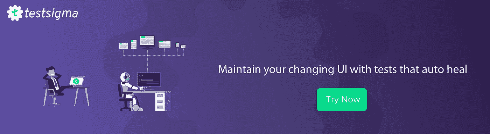

# Selenium 用于测试自动化——是还是不是？

> 原文：<https://medium.com/hackernoon/selenium-as-an-automation-testing-tool-aye-or-nay-fddb56527af1>

在本文中，我们将研究导致 Selenium 被广泛采用为 web 自动化事实上的标准的一些方面。我们还将检查基于 Selenium 的测试框架的进步和改进空间。

Selenium — Automation Testing tool

“Selenium 使浏览器自动化。就是这样！你用这种力量做什么完全取决于你自己。首先，它是为了自动化 web 应用程序的测试目的，但当然不仅限于此。无聊的基于网络的管理任务可以(也应该！)也要自动化。”

正如上面提到的，Selenium 的主要用途是为了测试的目的而自动化 Web 应用程序，这种情况已经持续了十年甚至更久。从 Selenium RC 和 Selenium IDE，它已经发展成为一个成熟的 Web 自动化库，支持多种浏览器和平台。

Selenium 已经存在很长时间了，毫无疑问，它是一个很好的工具。很长一段时间以来，它一直服务于全球测试人员的自动化测试需求。

# 赞成的意见

## 1.开源/无许可成本

由于 Selenium 是免费提供的，所以没有前期许可费用或支付费用。它也是一个开源项目，允许为个人或专业用途扩展和修改基础框架。

## 2.独立于语言

使用 Selenium，从事特定语言的开发人员或 QA 分析师不必为了开始自动化测试而学习一门新语言。除了可用于其他语言的非官方语言绑定之外，Selenium 还提供了与流行语言(如 C#、Java、Ruby、JavaScript、PHP 和 Python)的官方语言绑定。

## 3.第三方集成

Selenium 不限制 QA 对报告工具、构建系统或开发/测试堆栈的任何其他方面的选择。它与流行的工具集成得很好，比如 SauceLabs、Selenium-Grid、Extent、JUnit 等等。

## 4.平行测试

Selenium 通过与 Selenium Grid 集成支持并行测试执行，这有助于大大减少测试执行的反馈时间。

## 5.跨浏览器和独立于平台

Selenium 支持所有流行的 web 浏览器，如 Google Chrome、Firefox、Safari、Opera 等。并且可以在所有当前可用的操作系统平台上工作，例如 Windows、Mac 和 Linux。

## 6.社区支持

Selenium 得到了一个庞大的开发人员和测试人员社区的支持，他们积极地为该工具和文档做出贡献。

这些原因使得 Selenium 成为全球企业自动化测试人员的绝佳选择。然而，随着时间的推移和技术的进步，我们需要适应和采用更新的工具和技术来跟上步伐。

我们不能忽视的进步之一是人工智能的影响。人工智能在所有领域都被大量采用，软件测试自动化就是一个可以从中获益的领域。现代测试自动化框架需要更好地利用它们的能力。

现在，让我们看看促使我们寻找硒的更好替代品的其他一些原因。

# 骗局

## 1.初始设置时间和成本高

没错，Selenium 是免费的，绝对不涉及许可费用。然而，当谈到投资回报和初始成本时，我们需要考虑几个其他因素。

*   基于 Selenium 的测试框架的设置和配置需要相当长的时间。这加起来就是间接成本。
*   对于一个主要由人工测试人员组成的团队，成员需要学习编程，或者公司需要雇佣一群自动化专家来使用 Selenium 进行自动化。

**建议的解决方案:**无代码测试自动化工具可以帮助手动测试人员轻松进入自动化游戏。这些工具中的大多数都不需要初始设置时间，因为它们托管在云上。

## 2.不是一体化解决方案—需要第三方绑定

Selenium + TestNG/JUnit 不是完全自动化 web 应用程序测试的完整、全面的解决方案。您需要不同的库(POI API、GSON、Extent Reports)来使它成为一个测试框架的完整解决方案。管理多个依赖项是困难的，并且是每个人都想避免的额外维护工作。

**建议的解决方案:**一个好的依赖管理工具，如 Maven、Gradle 或 NPM，可以使这项任务变得更容易。Ant 现在已经过时了，我不会建议它，因为有更好的解决方案。

## 3.管理本地测试基础设施的困难

使用 Selenium Grid 进行并行测试是很有可能的——但是，建立和管理本地基础设施(测试机器)并不总是可行的，因为对设备的需求会随着项目的不同而不同。

**提议的解决方案:**为测试环境使用云平台(IaaS)可以避免麻烦。

## 4.最终成为并行开发解决方案

将多种事物结合在一起，创建一个基于 Selenium 的高效且高功能的测试自动化生态系统，这涉及到很多复杂性。这需要巨大的技术努力，并且需要不断更新、改进和维护完整的框架。最终，它成为一个并行开发项目，中小型公司在早期阶段负担不起。

**建议的解决方案:**使用现成的解决方案，将维护工作委托给外部团队，这样 QA 可以将更多的时间花在实际问题或 bug 上。

## 5.无法集成持续测试/冲刺自动化

由于其基于代码的方法和对 UI 的高度依赖，基于 Selenium 的项目很难将测试更多地转移到左边，这是连续测试所需要的。

**建议的解决方案:**坦率地说，我没有解决 Selenium 这个问题的方案，因为对 UI 的依赖是一个根本的缺点，而左移的方法之一是从一开始就依赖 API 测试。

## 6.没有非技术资源的参与

在持续交付和 DevOps 中，质量是每个人的责任。但是使用基于代码的神秘方法，只有程序员可以参与测试创建活动。

**建议的解决方案:**使用一个框架或工具，提供高度可读的测试(被理解为 BDD 或 TDD)并鼓励团队成员的合作。

## 7.缺乏对企业项目的专业按需支持

尽管 Selenium 社区非常有用，但对于要求最大隐私和快速解决时间的大型企业项目，您不能总是依赖社区支持。

**提议的解决方案:**类似于第 4 点。

## 8.解决自动化/维护挑战

由于动态用户界面、文件处理、API 级任务、基于操作系统的弹出窗口处理和基本身份验证等原因，没有针对特定任务的内置解决方案

由于 AJAX 和现代 web 开发技术的大量使用，测试并不总是非常稳定。此外，由于测试脚本是基于代码的，测试维护有点困难。

*建议的解决方案:添加回退逻辑，用原生 Javascript 代码处理这些挑战。*

## 9.有限的能力

没有内置的测试管理、测试数据管理或者测试报告功能。

**建议的解决方案:**集成第三方测试管理工具和第三方库，用于测试数据管理和测试报告。

这些是导致我们(我们在 [Testsigma](https://testsigma.com) 的团队)考虑一个可以解决所有这些挑战的新工具的一些原因。我们相信我们已经相当成功地做到了这一点。查看以了解更多信息:

[**免费注册**](https://testsigma.com/signup) **并立即试用 Testsigma**

*先看看*[*Selenium 作为自动化测试工具的利弊*](https://testsigma.com/blog/selenium-automation-testing-pros-cons/) *。*