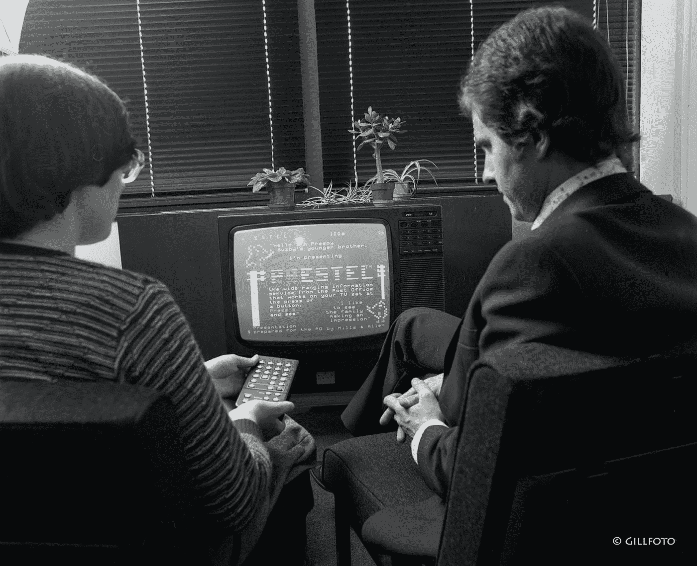

# 为什么自动驾驶汽车会失败

> 原文：<https://medium.com/hackernoon/self-driving-cars-will-fail-85e9710b0db9>

## 预测:无人驾驶汽车是自主交通的未来，就像 Prestel 图文电视系统是在线活动的未来一样。只是需求的预测，而不是最终被大规模采用来满足需求的东西。让我扩展一下…

[image source](https://commons.wikimedia.org/wiki/File:BT_Prestel_0057.jpg)

普雷斯特尔是由英国邮政局在 20 世纪 70 年代末建造的。与其他电传打字机不同，它有一个双向调制解调器，允许用户发送和接收数据。这实现了真正革命性的能力。网上银行、电子商务和电子邮件等等。在互联网出现之前…

就像自动驾驶汽车一样，它直接插入现有的基础设施:
—你的电视(通过机顶盒)与你的手机相连，变成了远程计算机的终端，可以访问一个数据库的图文电视页面。

最终，该系统没有得到大规模采用(主要归因于成本)，并且个人计算是一个完全独立的需求，几乎与 Prestel 推出的时间相同，它基本上被互联网根除了。

Prestel 只在法国等政府免费提供机顶盒的国家取得了小小的成功。但是毫无疑问，大量伟大的头脑开始在这个新的框架内创新。在新加坡，他们通过图文电视(不是电话)下载，因此获得了更高分辨率的图像等。

一个很好的提醒是，围绕一项技术的兴奋在最大程度上与它的成功潜力相关，但这两者之间可能没有因果关系。

在我看来，这就是 Prestel 失败的原因:

*   这是一个触及物理世界的大问题的短期解决方案。

我想不出一个需要大量原子运动的问题的成功的短期解决方案。我肯定有例外，但我打赌不会很多。

我相信自动驾驶汽车是一个短期的解决方案，在 100%的自动交通系统使当前的系统(汽车、道路和大多数相关技术)完全过时之前。

我想我们会看到的。当然，前提是在那之前，我没有被一辆(自动驾驶)汽车撞上。:P

这里有一段来自 BBC 档案馆的关于 Prestel 系统的视频(讽刺的是，在它的灭亡中起主导作用的是个人电脑):

*原本这个帖子以* [*推特风暴*](https://twitter.com/NikolayTsenkov/status/1145008406039859201) *的形式出现。对于这样或那样的随意漫谈——你可以在这里和在*[*Twitter*](https://twitter.com/NikolayTsenkov)*上关注我。*