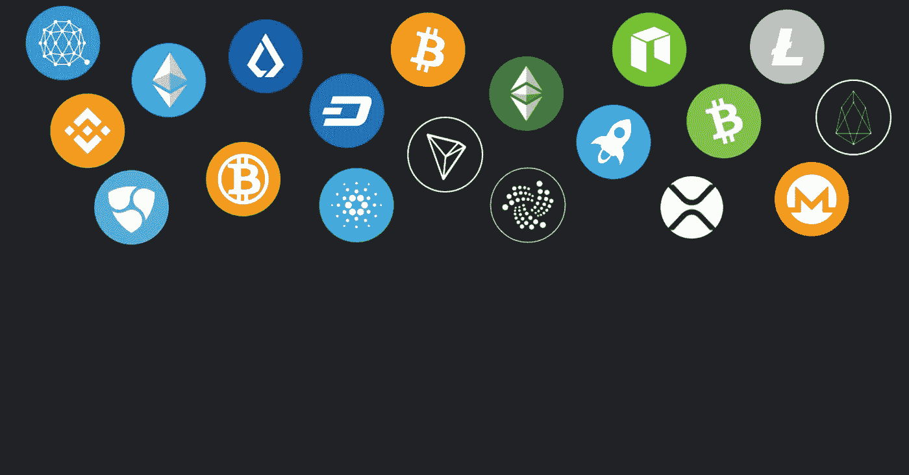
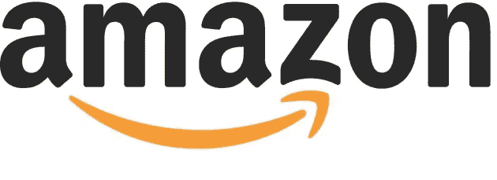

# 通过加密货币免费在线销售

> 原文：<https://medium.com/hackernoon/selling-something-online-without-fees-using-cryptocurrency-3b780cd9e55c>

# 如何在网上卖东西而不支付费用

开展网上业务并在网上免费销售是可能的。人们往往会忽略这样做的可能性，立即开始在一个收费很高的平台上销售。2019 年有新的解决方案和创新，让你可以在网上销售东西，而不用支付费用。让这一未来成为可能的关键创新是加密货币。利用区块链技术的交易效率，使我们的零费用电子商务平台得以存在和发展。我们的在线销售解决方案是为那些希望在开展业务时避免费用的人而设计的。

你可以在这里开始出售任何加密货币:[https://market.forra.io/signup](https://market.forra.io/signup)

Forra 的一个理念是，您的利润属于您自己。我们希望通过在商品售出后不强制收取过多的市场费、介绍费或交易费来帮助企业主经营他们的公司。

在 Forra.io 上销售是完全免费的，是免费在线销售的最佳方式。你可以点击[这里](https://market.forra.io/)开始免费出售你的物品。

# 免费卖东西的好处

免费销售东西是发展你的在线业务的最有利的方式之一。你不仅会在每次销售中获得更多利润，而且你会发现，由于你在我们的在线市场上免费销售而开发的新销售渠道，你的业务在整体上得到了发展。这也可以让你的商品定价更有竞争力，从而带来更多的销售。

仅仅担心加密货币价格的人很可能不了解这些区块链给普通人带来的真正力量。

# 易贝、亚马逊、Etsy 收费高得离谱

这是你在以下平台销售时所支付费用的明细。

# 通过易趣网购买

商店

*   起始价:4.95 美元/月，带年费
*   基本:21.95 美元/月，带年费
*   超值 59.95 美元/月，带年度订阅
*   主播 299.95 美元/月，带年费
*   企业版 299.95 美元/月，带年度订阅
*   年费为每月 2，999.95 美元

列表

*   每月免费 50 英镑，
*   除此之外，大多数类别的上市费用为 0.30 美元

终值

*   6.15%
*   如果账户在出售时没有达到易贝针对美国的最低业绩标准，最终价值费将从 6.15%增加到 10.15%

# 可选列表升级的费用

*   在多个类别中列出

支付处理费

*   Paypal 的 Premier 账户自动收取 30 美分，外加 3%的付款。这 3%不仅适用于物品的最终售价，也适用于他们已经支付给你的运费和任何其他费用(如销售税)。

船舶

*   免费送货，易贝不收任何费用
*   易贝收取 0.30 澳元的额外运费
*   运费计入总价

# 亚马孙

# 商店

*   专业卖家:39.99 美元/月，包年
*   一个“专业销售人员”每个月至少要卖出 35 件商品
*   个人卖家:没有订阅，卖家支付每笔交易 0.99 美元的费用

介绍费

*   介绍费基于产品类别。亚马逊将对每件商品收取这两个价格中较高的一个:
*   介绍费占销售价格的百分比。范围从 6%到 20%(亚马逊设备为 45%)，但通常是 15%。
*   最低介绍费为 1 美元。珠宝和手表是仅有的两个税率为 2 美元的类别。

售价 5.99 美元 24.9915%推荐费 0.89 美元

**不适用**，因为它少于 1 美元

$3.75

**应用**因为它大于 1 美元

最低介绍费为 1 美元，因为高于 0.89 美元/年

# Etsy

商店

*   常规:无订阅
*   etsy Plus:20.00 美元/月，带年费
*   Etsy Plus 用户可以选择免费注册”。存储“域名，并获得 50%的选择域扩展喜欢”。com“，”。净”，和”。ca”通过第三方提供商合作伙伴 Hover。
*   你在 Etsy.com 或 Etsy 的移动应用程序上列出的每件待售商品将被收取 0.2 美元的刊登费。
*   你必须每 4 个月更新一次列表

销售费用

*   我们会向你收取交易费，交易费为每件物品展示价格的 5%，外加你收取的运费和礼品包装费。

支付处理费

*   Paypal 的 Premier 账户自动收取 30 美分，外加 3%的付款。这 3%不仅适用于物品的最终售价，也适用于他们已经支付给你的运费和任何其他费用(如销售税)。

# 费用是卖家面临的一个大问题

收费瓶颈销售和抑制他们实现其全部潜力。作为一名在线卖家，不仅仅是在 Ebay、亚马逊、etsy 或 Forra 上列出你的待售商品。世界上一些最优秀的企业家是从在网上卖小东西开始的。我们在 Forra 的使命之一就是帮助这些人取得成功。

作为卖家，有时在亚马逊或易贝等平台上在线销售特定产品是不可行或无利可图的，因为费用高昂。

# 为什么网上免费销售很重要

免费销售很重要，原因有很多。有很多情况下，卖家和消费者都因为收费而受到伤害。卖家受到了不公平的伤害，他们被迫为自己的销售支付费用。即使有人在网上卖东西，自己在自己的网站上销售，他们也被迫支付某种加工费。在 Forra 上，你不需要支付任何费用。你的销售和金钱是你的，不管它来自哪里。

当网上销售涉及费用时，大多数企业主会通过略微提高价格来抵消这些费用。当做生意的正常方式是在网上免费销售商品时，商品的成本就会下降，因此价格也会下降。竞争将把那些以更高价格出售的产品推向新的更低的水平。

当你免费卖东西时，每个人都是赢家。消费者将得到更便宜的价格，而卖方将从销售中得到更多。

# 更少的费用，更多的收入，建立一个真正的企业

让我们回到为什么免费在线销售对企业家很重要。

理解下面的例子很重要:

如果你在亚马逊上卖了一件 100 美元的商品，如果你自己运送的话，你很可能最终实际上赚了大约 88 美元，这取决于商品的类别。如果你使用他们的履行服务亚马逊 FBA，你会赚得少得多。亚马逊的 FBA 收费因产品而异，而且有经常增加的趋势。

如果你使用 Forra 出售 100 美元的商品，你将获得 100 美元的加密货币。

因为我们的电子商务平台是零费用的，我们允许人们建立更高利润的业务。利润的增加使得企业主可以更快地行动，雇佣更多的人力，过上更富裕的生活。

# 支付最少的网上销售费用

这篇博客的主题是如何在网上免费销售。唯一可行的解决方案是我们的平台 Forra.io，我们允许用户免费向任何人出售任何东西。我们的平台使用加密货币来确保交易尽可能便宜。你可以点击这里的链接注册，或者加入我们的 discord 来和我们的用户以及创始人交流。

*最初发表于* [*forra.io*](https://forra.io/selling-online-without-fees/) *。*