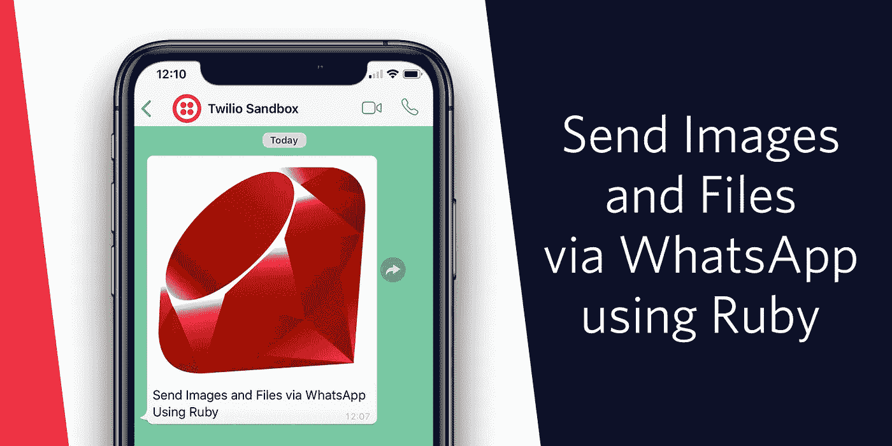

# 使用 Ruby 通过 WhatsApp 发送图像和文件

> 原文：<https://medium.com/hackernoon/send-images-and-files-via-whatsapp-using-ruby-773f900764f0>



有了 WhatsApp 的 Twilio API，我们可以向 WhatsApp 号码发送消息。这些消息可以是纯文本，也可以包含图像、音频甚至是最大 5MB 的 pdf 文件。让我们看看如何使用 Ruby 实现这一点。

# 你需要的东西

如果你想和这篇文章一起写代码，你需要一些东西:

*   Twilio 帐户([现在就注册一个免费帐户](https://www.twilio.com/try-twilio))
*   [安装红宝石](https://www.ruby-lang.org/en/downloads/)和[捆扎机](https://bundler.io/)
*   WhatsApp 沙盒频道已安装([了解如何激活您的 WhatsApp 沙盒](https://www.twilio.com/docs/sms/whatsapp/api))

明白了吗？让我们开始编码吧！

为您的项目创建一个新目录，并使用 Bundler 初始化一个新的`Gemfile`:

```
mkdir whatsapp-messages
cd whatsapp-messages
bundle init
```

打开新的`Gemfile`并添加`twilio-ruby`宝石:

```
# frozen_string_literal: true

source "https://rubygems.org"

gem "twilio-ruby"
```

通过在命令行运行`bundle install`来安装 gem。

# 发送您的第一条 WhatsApp 消息

在你的项目目录中创建一个名为`app.rb`的文件并打开它。我们将需要`twilio-ruby` gem 并用我们的账户 Sid 和认证令牌(你可以在你的 [Twilio 控制台](https://www.twilio.com/console)上找到)初始化一个 API 客户端。我们将使用 API 客户端从 WhatsApp 沙盒号向我们自己的 WhatsApp 帐户发送一条消息。

```
# app.rb
require 'twilio-ruby'

client = Twilio::REST::Client.new('YOUR_ACCOUNT_SID', 'YOUR_AUTH_TOKEN')
message = client.messages.create(
  to: 'whatsapp:YOUR_WHATSAPP_NUMBER',
  from: 'whatsapp:WHATSAPP_SANDBOX_NUMBER',
  body: 'Ahoy from Twilio!'
)
puts "Message sent.\nMessage SID: #{message.sid}."
```

确保用您自己的详细信息替换所有占位符。WhatsApp 号码采用“WhatsApp:e . 164-电话号码”的格式。一个 [E.164 格式的电话号码](https://en.wikipedia.org/wiki/E.164)以国家代码开始，后面是号码的其余部分，没有其他标点符号，例如“+15551231234”。

使用以下命令运行代码:

```
bundle exec ruby app.rb
```

你应该会在 WhatsApp 应用程序中收到你的消息。

> 注意:WhatsApp 和通过 Twilio API 的普通短信有一些区别。如果您与用户建立了活动会话，则只能发送自由格式的邮件。当用户回复[模板消息](https://www.twilio.com/docs/sms/whatsapp/api#sending-notifications)或[用户通过向你的 WhatsApp 号码发送消息来发起对话](https://www.twilio.com/docs/sms/whatsapp/api#conversational-messaging-on-whatsapp)时，会话就创建了。从用户向您发送的最后一条消息开始，会话将持续 24 小时。如果您没有收到消息，请尝试先向 WhatsApp 沙盒发送消息，然后再次运行脚本。

# 发送媒体消息

我们可以做得比短信更好。这次我们发个图。WhatsApp 的 Twilio API 支持发送 JPG、JPEG 或 PNG 图像。

要发送媒体消息，我们需要在创建消息的调用中再添加一个东西，一个`media_url`。`media_url`需要指向在线可用的图像文件，并且内容类型头应该与扩展名匹配。

将`media_url`添加到您现有的代码中。您可以使用下面的 URL 或选择您自己的图像。

```
# app.rb
require 'twilio-ruby'

client = Twilio::REST::Client.new('YOUR_ACCOUNT_SID', 'YOUR_AUTH_TOKEN')
message = client.messages.create(
  to: 'whatsapp:+447719532208',
  from: 'whatsapp:+14155238886',
  body: 'Ahoy from Twilio!',
  media_url: 'https://tinyurl.com/ahoy-whatsapp'
)
puts "Message sent. Message SID: #{message.sid}."
```

再次运行代码，你会收到一条短信和旁边的图片。

# 下一步是什么？

现在，您已经使用 Ruby 发送了带有文本和图像的 WhatsApp 消息。接下来，您可以尝试发送音频文件(MP3、OGG 和 AMR 格式)或 PDF 文件，只要它们的大小不超过 5MB。

想更多地参与 WhatsApp messages 和 Ruby 吗？了解如何[将 WhatsApp、Spotify 和 Rails 结合起来创建一个协作播放列表](https://www.twilio.com/blog/collaborative-playlist-whatsapp-rails-twilio-spotify)或者如何[从 WhatsApp 获取图像并使用 AWS Rekognition 来检查您照片中的名人](https://www.twilio.com/blog/celebrity-spotting-twilio-api-whatsapp-aws-rekognition-ruby)。

我很想看看你能用 Twilio API 在 WhatsApp 上建立发送和接收媒体的功能。请在评论中联系我，通过电子邮件联系 philnash@twilio.com，或者通过推特联系菲尔纳什，告诉我你的项目或问题。

*原载于*[*https://www.twilio.com*](https://www.twilio.com/blog/send-images-files-whatsapp-ruby)*。*