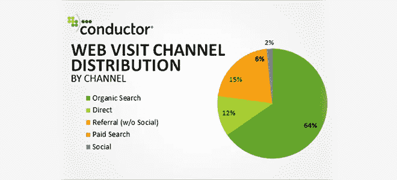
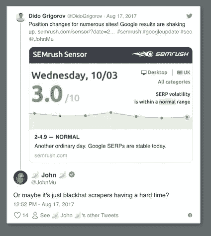
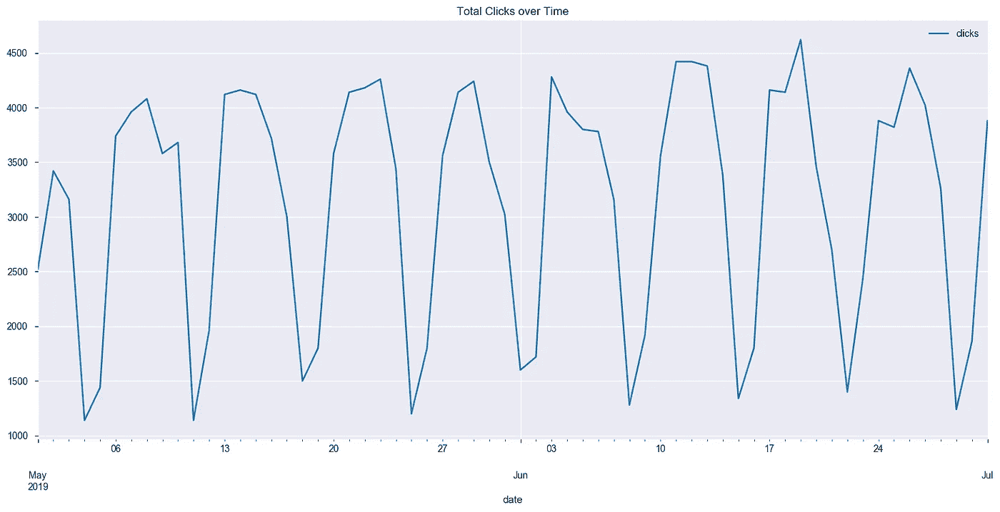
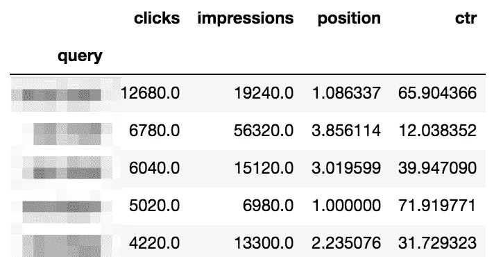
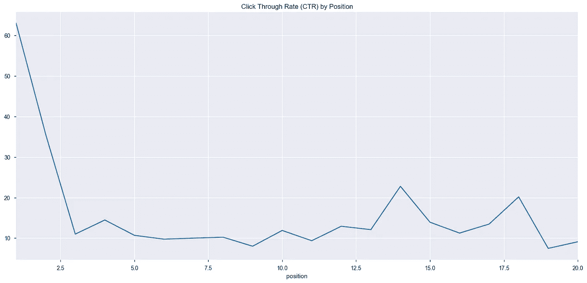
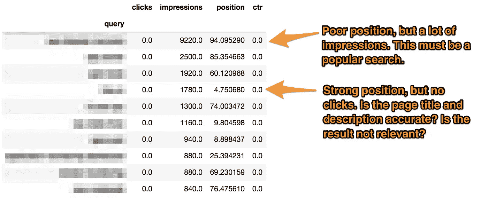
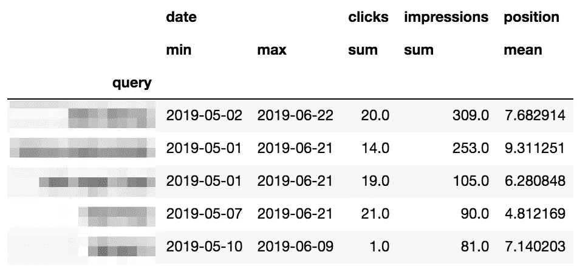
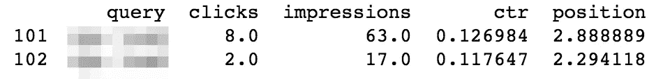

# 使用 Google 搜索控制台+Python 的 SERP 分析

> 原文：<https://medium.com/hackernoon/serp-analysis-with-google-search-console-python-bf8a2ab43fa9>

谷歌从付费搜索中赚取了数十亿美元，但你知道吗，那些没有广告拦截器的人只占了 6%的网页访问量。免费有机搜索万岁，几乎 2/3 的网络流量的主要来源！

Via [https://www.conductor.com/blog/2014/07/organic-search-actually-responsible-64-web-traffic/](https://www.conductor.com/blog/2014/07/organic-search-actually-responsible-64-web-traffic/)

如果你参加过 Google Adwords 活动，你就会知道他们的工具在分析付费流量方面有多复杂。相比之下，谷歌的有机搜索分析工具停留在度量标准的马车时代。**你的流量很大程度上取决于它在搜索引擎结果页(SERP)上的外观，你如何更好地了解你的网站是如何运行和变化的？**

在这篇文章中，我将向你展示如何快速下载你的谷歌搜索控制台(GSC)数据，并对其进行分析，以提高你的有机流量。

# SERP 工具的问题:合成材料

在谷歌上搜索“SERP 分析”，你会看到工具页面，但有一个大问题:几乎所有这些都依赖于在谷歌上手动运行搜索查询并抓取结果。然而，随着谷歌的搜索结果变得更加个性化，这种合成的监控变得不那么准确了[。](https://en.ryte.com/magazine/how-to-work-effectively-with-google-search-console-data-to-analyze-google-updates)

此外，谷歌不喜欢这种机器人流量。这是 Google 网站管理员趋势分析师 John Mueller 的回复:

谷歌估计 70%的搜索流量来自机器人。保持机器人存活需要大量的基础设施支出——谷歌受到极大刺激，让机器人更难削减成本。

# 谷歌搜索控制台怎么样？

谷歌提供了自己的 SERP 分析:它被称为[谷歌搜索控制台](https://search.google.com/search-console/about) (GSC)。GSC 的美妙之处在于，它的数据 100%来自真实的搜索，而不是合成的。

虽然我喜欢 GSC 的数据集，但它几乎没有提供任何指导。许多网站有数千个引用其网站的搜索查询。很难知道如何对数据采取行动，也很难识别出你历史上监控的少数关键词之外的关键词趋势。这些是我希望 GSC 给我指出的领域:

*   **速赢—** 根据关键词在搜索结果中的位置，哪些关键词的点击率(CTR)较低？
*   **最佳表现者—** 哪些关键词的点击率表现突出？这些都是营销团队可以效仿的好例子，因为他们做得比我们预期的要好。
*   **新关键词—** 在过去的 30 天里，出现了哪些新的重要关键词？自动检测新关键词——通常你不知道人们是如何找到你的网站的。
*   **消失的关键词—** 在过去两周内，有哪些重要的关键词消失了？见上，再反。
*   **异常行为—** 上周哪些重要关键词的关键指标(点击量、浏览量、位置和点击率)出现异常变化？这些指标的波动会对流量产生很大影响。虽然 GSC 可以比较时间段，但要检查几个时间范围内的每个指标需要大量的人工工作。

# 让我们用 Python 做我们自己的 SERP 分析

不要费口舌为 GSC 介绍上面的见解。他们通过付费搜索赚钱，而不是有机搜索。比起有机搜索，他们更有可能改进他们支持付费搜索的工具。

幸运的是，通过一些 API 争论和一些 Python 驱动的数据科学，我们可以进行自己的 SERP 分析。让我们开始吧！

# 下载谷歌搜索控制台数据

啊，机器学习的真实世界:95%的数据收集和清理，5%的每个人都在博客上谈论的酷东西。**谢天谢地，** [**本帖**](https://moz.com/blog/how-to-get-search-console-data-api-python) **来自 Moz，通过** [**一个脚本**](https://github.com/stephan765/Google-Search-Console-bulk-query) **将你的 GSC 数据下载到一个 CSV 文件集合中。在安装了所需的 Python 依赖项后，这个脚本就对我起作用了。你可能会花更多的时间浏览谷歌的云控制台，而不是运行脚本。**

 [## Stephan 765/Google-搜索-控制台-批量查询

### 一个脚本迭代通过谷歌搜索控制台上可用的过滤器，通过提取最小化采样问题…

github.com](https://github.com/stephan765/Google-Search-Console-bulk-query) 

## 将 CSV 加载到 Pandas 数据框架中

上面的 Python 脚本每天创建一个文件，每个关键字对应一行。**为了开始我们的魔术，我们需要将原始数据放入一个** [**熊猫数据框架**](https://pandas.pydata.org/pandas-docs/stable/reference/api/pandas.DataFrame.html) **，这基本上是一个超级充电的谷歌表，我们通过 Python 与之交互。**简单地将下面要点的内容粘贴到 Jupyter 笔记本单元格中，在第 44 行指定包含下载的 CSV 的文件夹的`path`。

# 探索数据集

为了明确方向，我们将从一些高级分析开始。

## 绘制一段时间内的总点击数

它会生成一个图表，如下所示:

我们可以看到搜索流量的季节性模式，点击量在周末减少。当然，你可以在 GSC 看到同样的图表。耐心点——我们才刚刚开始！

## 按查询列出的点击、展示、位置和点击率

它会生成如下数据帧:

同样，这与 GSC 提供的观点非常相似。别担心，事情会变得更有趣。

## 按位置绘制点击率

它会生成一个图表，如下所示:

这个图表非常类似于一条[幂律](https://russellnewquist.com/2015/03/power-law/)曲线。最高位置的点击率为 63%，然后从第五个位置开始稳定在 10%左右。**进入前两个职位之一有很大的价值。**

让我们继续我们的分析。

# 速赢

有很多印象但点击率在你的数据集的 20%以下的关键词是离群值——我们期望它们产生更多的点击。让我们来识别这些关键词:

它创建了一个数据帧，如下所示:

查找包含以下内容的关键字:

*   差的位置(≥20)——这表明你的网站是一个相对受欢迎的搜索。
*   强势地位(≤ 5) —为什么没有人点击这个链接？检查准确的页面标题和描述。

## 顶级表现者

这些关键词是一个小小的引擎，它们的平均位置在 60%以下，但点击率高于中值。

用户正在额外努力点击这些结果。想想你如何能提高这些。

## 丢失的关键字

知道你何时从谷歌搜索结果中消失，可以让你知道你的网站可能存在内容问题。

## 异常行为

GSC 中有太多的噪音——很容易包含成千上万个关键词——以至于无法注意到特定关键词有什么问题。让我们做一些数据科学。

首先，让我们按点击量列出前 10 个查询。我们最关心这些流量驱动查询中的异常行为:

接下来，我们将通过点击使用[单变量异常检测](https://towardsdatascience.com/a-brief-overview-of-outlier-detection-techniques-1e0b2c19e561)(大部分代码来自[本帖](https://towardsdatascience.com/anomaly-detection-for-dummies-15f148e559c1)作者@ [attractchinese](https://twitter.com/attractchinese) )来可视化我们的每个热门查询的异常印象:

这将为我们的每个热门查询生成一个图(因此总共十个图)。它们应该是这样的:

让我们看看在过去两周内，我们的热门查询每天是否有任何异常的印象:

它将粗略地打印:

# 摘要

你的有机流量值得额外关注，因为它可能是你最大的流量来源。使用 Python，我们可以从 Google 搜索控制台下载真实的(而不是合成的)数据，并进行我们自己的 SERP 分析。