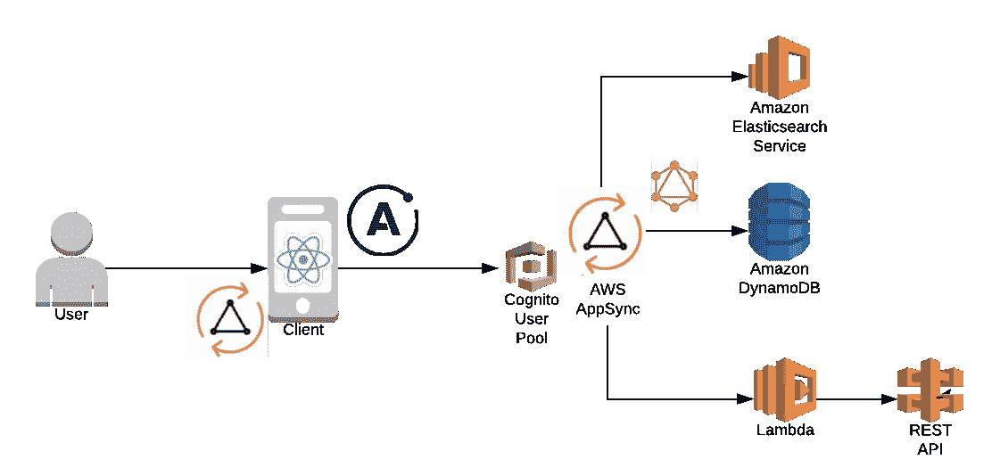

# 无服务器 AppSync 插件:十大新功能

> 原文：<https://medium.com/hackernoon/serverless-appsync-plugin-top-10-new-features-3faaf6789480>



*如果你还不熟悉 AppSync 或插件，我们建议你先阅读下面的帖子:*

> 第 1 部分:[简介:带 API 网关的 GraphQL 端点+ AWS Lambda](https://serverless.com/blog/running-scalable-reliable-graphql-endpoint-with-serverless/)
> 第 2 部分: [AppSync 后端:AWS 托管的 GraphQL 服务](https://hackernoon.com/running-a-scalable-reliable-graphql-endpoint-with-serverless-24c3bb5acb43)
> 第 3 部分: [AppSync 前端:AWS 托管的 GraphQL 服务](https://hackernoon.com/running-a-scalable-reliable-graphql-endpoint-with-serverless-db16e42dc266)
> 第 4 部分:无服务器 AppSync 插件:新特性(本博客)

# 介绍

[AWS AppSync](https://aws.amazon.com/appsync/) 是一个完全托管的无服务器 [GraphQL](http://graphql.org/) 服务，用于实时数据查询、同步、通信和离线编程功能。它非常适合快速构建可扩展的数据驱动的移动、web 或企业应用程序，并且没有管理复杂基础架构的麻烦。

[无服务器 AppSync 插件](https://github.com/sid88in/serverless-appsync-plugin/)允许您在工作站上本地开发和测试 AppSync GraphQL API。您可以将该插件作为持续集成和持续部署(CI/CD)框架的一部分，在生产中自动部署您的 GraphQL API。

该插件建立在[无服务器框架](https://serverless.com/)之上，自去年 2018 年推出以来，获得了开源 GraphQL 社区的极大欢迎。到目前为止，我们已经发布了 17 个版本的插件，在 GitHub 上有 450 多颗星，65K+总 npm 下载量，45+贡献者帮助关闭了 100+个公开的 GitHub 问题。甚至有一个 [youtube 视频](https://www.youtube.com/watch?v=eTUYqI_LCQ4)展示了它的行动。开源社区在过去的几个月里做了大量的工作来改进这个插件的特性，我们已经收到了几十个请求。

> 在本帖中，我们将概述在过去几个月中添加到这个插件中的一些重要特性…

# 什么是新的？

## 1) AppSync 离线支持

*你有没有梦想过通过在本地测试 AppSync 解析器来加快 AppSync 开发周期？*

**离线支持**已经成为 AppSync 用户中反复出现的[讨论话题](https://github.com/sid88in/serverless-appsync-plugin/pull/114)，感谢 [James](https://github.com/lightsofapollo) 和 [Andreas](https://github.com/aheissenberger) ，你的梦想实现了！建立在 AppSync 插件之上的 [AppSync 模拟器](https://github.com/ConduitVC/aws-utils/tree/master/packages/appsync-emulator-serverless)为您提供了在本地环境中测试和开发 AppSync API 的灵活性。现在，您不必在每次进行更改时都部署代码:)

这个[插件扩展](https://github.com/aheissenberger/serverless-appsync-offline)甚至会为你自动启动模拟器。

*样本代码(* [*参考*](https://github.com/serverless/serverless-graphql/blob/master/app-backend/appsync/dynamo/serverless.yml) *)*

```
plugins:
  - serverless-appsync-plugin
  - serverless-dynamodb-local
  - serverless-appsync-offline
  - serverless-offline

custom:
  appsync-offline:
    port: 62222
    dynamodb:
      client:
        endpoint: "http://localhost:8000"
        region: localhost
```

使用`serverless-offline`插件时可以自动触发`serverless appsync-offline start`命令。

## **2)自动生成的角色和策略**

*您是否曾经努力为您的数据源创建正确的 IAM 角色和策略？*

为 AppSync 数据源创建、更新和管理 IAM 策略、语句和操作并不是一件容易的事情。最重要的是，它通常会向无服务器的 yaml 文件添加额外的样板代码。该插件现在通过根据数据源及其目标的类型为您生成 IAM 角色和策略来解决这个问题。

例如，一个 lambda 数据源将被自动分配一个策略，允许它执行目标 lambda 函数，一组给定的 DynamoDB 数据源将被授权执行目标表上的所有读/写操作。除此之外，使用新的 iamRoleStatements 配置，定制策略变得更加容易。

*样本代码:*

```
dataSources:
  - type: AMAZON_DYNAMODB
    name: DynamoDBDataSource
    description:
    config:
      tableName: myTable
      #allow datasource to execute GetItem on "myTable"
      iamRoleStatements:
        - Effect: "Allow"
          Action:
            - "dynamodb:GetItem"
          Resource:
            - "arn:aws:dynamodb:{REGION}:{ACCOUNT_ID}:myTable"
            - "arn:aws:dynamodb:{REGION}:{ACCOUNT_ID}:myTable/*"
```

如果您想要对角色和策略进行更细粒度的控制，您仍然可以指定一个`serviceRoleArn`。当指定时，它将优先于`iamRoleStatements`使用。

> PR:[https://github . com/sid 88 in/server less-app sync-plugin/pull/141](https://github.com/sid88in/serverless-appsync-plugin/pull/141)

## 3) RDS 数据源

DynamoDB 很棒，但我真正需要的是一个好的老式关系数据库。支持吗？

AWS 在 2018 年 11 月推出了[关系数据库支持](https://aws.amazon.com/blogs/mobile/aws-appsync-releases-pipeline-resolvers-aurora-serverless-support-delta-sync/)。它允许直接从数据源和映射模板访问运行在 Aurora 上的关系数据库，如 MySQL。感谢[Alex](https://github.com/roznalex)**问题的答案是*是的！*。你现在可以告别你的 AWS Lambda 函数，减少一些延迟和费用！**

***样本代码:***

```
- type: RELATIONAL_DATABASE
  name: My relational DB resolver
  config:
    dbClusterIdentifier: { Ref: RDSCluster }
    awsSecretStoreArn: { Ref: RDSClusterSecret }
    databaseName: rds_db
    schema: mysql
```

**正如在前面的特性中所描述的，这个插件将为您自动生成 rds 数据源策略，除非您指定自定义的策略。**

> **PR:[https://github . com/sid 88 in/server less-app sync-plugin/pull/226](https://github.com/sid88in/serverless-appsync-plugin/pull/226)**

## **4)管道解析器**

***您是否期望最近推出的* [*管道解析器*](https://aws.amazon.com/blogs/mobile/aws-appsync-releases-pipeline-resolvers-aurora-serverless-support-delta-sync/) *添加到此插件中？***

**AWS 在带有关系数据库的 AppSync 中引入了管道解析器。它们支持在单个 GraphQL 字段上按顺序对多个数据源执行一个或多个操作。这允许通过将代码组合到单个解析器中或者在多个解析器之间共享代码来编排动作。**

**感谢 [C K](https://github.com/Foosballfan) ，这个插件现在支持了。**

***样本代码:***

```
custom:
  appsync: 
    mappingTemplates:
      - type: Query
        field: testPipelineQuery
        request: 'start.vtl'
        response: 'common-response.vtl'
        kind: PIPELINE
        functions:
          - authorizeFunction 
          - fetchDataFunction
    functionConfigurations:
      - dataSource: graphqlLambda
        name: 'authorizeFunction'
        request: './mapping-templates/authorize-request.vtl'
        response: './mapping-templates/common-response.vtl'
      - dataSource: dataTable
        name: 'fetchDataFunction'
        request: './mapping-templates/fetchData.vtl'
        response: './mapping-templates/common-response.vtl'
```

**有关管道解析器以及如何使用它们的更多信息，请参考 [AWS 文档](https://docs.aws.amazon.com/appsync/latest/devguide/pipeline-resolvers.html)。**

> **PR:[https://github . com/sid 88 in/server less-app sync-plugin/pull/181](https://github.com/sid88in/serverless-appsync-plugin/pull/181)**

## **5)多 API 支持**

**你的项目需要不止一个 GraphQL API 吗？这是给你的！**

**假设您的项目中有两个 API:一个用于公共访问(未经身份验证)，另一个使用自定义身份验证供内部使用。感谢[亚历克斯](https://github.com/ZY-Ang),`appsync`config 键现在支持接收一组对象，每个对象代表一个 API 的配置，这允许您在一个部署中部署多个 AppSync GraphQL 端点。**

***样本代码:***

```
custom:
  appsync:
    - name: public-api
      authenticationType: API_KEY
      schema: public.graphql
      # ...
    - name: private-api
      authenticationType: AMAZON_COGNITO_USER_POOLS
      schema: private.graphql
      # ...
```

**注意，在两个 API 之间共享资源没有任何限制，比如*映射模板*或*数据源*定义；或者甚至是模式定义，但是请记住，产生的 AppSync APIs 将是完全独立的，并部署在单个 CF 堆栈中。AWS Lambda 函数、DynamoDB 表等底层外部资源。可以由两个 API 共享。**

> **PR:[https://github . com/sid 88 in/server less-app sync-plugin/pull/155](https://github.com/sid88in/serverless-appsync-plugin/pull/155)**

## **6) GraphQL 模式拼接**

***因此，您的 API 正在增长，您有几十个查询、变化和订阅，这导致了巨大的 monolith schema.graphql 文件。***

**大文件对人不友好，很难阅读，维护起来可能是一场真正的噩梦。多亏了 [Ilya](https://github.com/trilliput) 和模式拼接，您现在可以将您的模式分割成几个文件，并且它们会在您的 AppSync API 部署之前被合并。**

***样本代码:***

```
custom:
  appSync:
  schema:
    - path/to/schema_base.graphql
    - path/to/schema_internal.graphql
```

> **PR:[https://github . com/sid 88 in/server less-app sync-plugin/pull/227](https://github.com/sid88in/serverless-appsync-plugin/pull/227)**

## **7)外部数据源和映射模板参考**

***如果您有一个大的 graphql 模式，那么很可能您也有巨大的数据源和映射模板配置文件……***

**就像您可以分割您的数据模式一样，您现在也可以将您的数据源和映射模板定义分割到单独的文件中。多亏了[哈里](https://github.com/lkhari)你现在可以这样做了:**

****在**之前**

```
appSync:
  datasources:
    - type: AMAZON_DYNAMODB
      name: posts
      description: "Posts table datasource"
      config:
        tableName: posts
    - type: AWS_LAMBDA
      name: users
      description: "Users lambda datasource"
      config:
        functionName: getUsers
    - # a long list of datasourcesmappingTemplates:
    - dataSource: posts
      type: Query
      field: getPost
      request: "Query.getPost.request.vtl"
      response: "Query.getPost.response.vtl"
    - dataSource: users
      type: Query
      field: getUsers
      request: "Query.getUsers.request.vtl"
      response: "Query.getUsers.response.vtl"
    - # a long list of mapping templates
```

**后**

****只需将数据源和映射模板定义移动到单独的文件中，并按如下方式引用它们。****

```
**appSync:
  datasources:
    - ${file(datasources/dynamodb.yml)}
    - ${file(datasources/lambda.yml)}
  mappingTemplates:
    - ${file(mapping-templates/posts.yml)}
    - ${file(mapping-templates/users.yml)}**
```

> ****PRs:[https://github . com/sid 88 in/server less-app sync-plugin/pull/216](https://github.com/sid88in/serverless-appsync-plugin/pull/216)和[https://github . com/sid 88 in/server less-app sync-plugin/pull/182](https://github.com/sid88in/serverless-appsync-plugin/pull/182)****

## ****8)简化的数据源功能配置****

****还记得您不得不在数据源中手动引用您的函数 ARN 吗？现在有一种更简单的方法。****

****不再需要通过数据源配置中的 ARN 来引用 AWS Lambda 函数。从`functions`无服务器配置中提供功能的*键*要容易得多。该插件将自动为您解析该函数的 ARNs。****

******在**之前****

```
**functions:
 getUser:
  ...
custom:
 appsync:
  datasources:
   - type: AWS_LAMBDA
     name: myLambdaDatasource
     config:
      lambdaFunctionArn: {Fn::GetAtt: GetUserLambdaFunction, Arn]}**
```

******在**之后****

```
**functions:
  getUser:
    ...
custom:
  appsync:
    datasources:
      - type: AWS_LAMBDA
        name: myLambdaDatasource
        config:
          functionName: getUser**
```

> ****PR:[https://github . com/sid 88 in/server less-app sync-plugin/pull/215](https://github.com/sid88in/serverless-appsync-plugin/pull/215)****

## ****9)映射模板的默认文件名约定****

*****您是否曾想进一步简化您的映射模板？我们现在又前进了一步……*****

****由于有了 [Carl-Johan](https://github.com/caki0915) ，您不需要显式地指定您的映射模板文件名。相反，您可以遵循以下命名约定:****

```
**{Type}.{Field}.request.vtl # for mapping template requests
{Type}.{Field}.response.vtl # for mapping template responses**
```

******在**之前****

```
**mappingTemplates:
  - field: getSomeData
    dataSource: myDatasource
    type: Query
    request: getSomeData.request.vtl
    response: getSomeData.response.vtl**
```

******在**之后****

```
**mappingTemplates:
  - field: getSomeData
    dataSource: myDatasource
    type: Query
    #request: defaults to Query.getSomeData.request.vtl
    #response: defaults to Query.getSomeData.response.vtl**
```

****插件将继续在 *mapping-templates* 文件夹中查找文件，或者从*mappingTemplatesLocation*配置中指定的路径中查找，但是使用默认名称。当然，仍然可以像以前一样指定一个自定义文件名。****

> ****PR:[https://github . com/sid 88 in/server less-app sync-plugin/pull/206](https://github.com/sid88in/serverless-appsync-plugin/pull/206)****

## ****10)增强的堆栈输出****

*****我的端点 URL 是什么？什么是 API 密钥？部署后，您是否问过自己这些问题？厌倦了进入 AppSync 控制台解决问题吗？继续读！*****

****在成功部署之后(或者在调用 [sls info](https://serverless.com/framework/docs/providers/aws/cli-reference/info/) 之后)，插件现在将在*服务信息*部分中输出关于已部署堆栈的有意义的信息。这包括生成的 API 密钥(如果您使用 API_KEY 身份验证类型)和 AppSync 端点。看看这个:****

```
**Service Information
-------------------
service: blogs-api
stage: dev
region: us-east-1
stack: blogs-api-dev
resources: 42
api keys:
  None
appsync api keys:
  da2-xxxxxxxxxx
endpoints:
  None
appsync endpoints:
  [https://xxxxxxx.appsync-api.us-east-1.amazonaws.com/graphql](https://loh5g2cyy5bi7h7xkfsxsuhjlu.appsync-api.us-east-1.amazonaws.com/graphql)**
```

> ****PR:[https://github . com/sid 88 in/server less-app sync-plugin/pull/215](https://github.com/sid88in/serverless-appsync-plugin/pull/215)****

# ****下一步是什么？****

****我们正在积极寻找这个插件的贡献者。请随时参与进来，提出您的想法、创意、缺陷修复或功能需求。敬请期待更多；)****

# ****特别感谢****

****感谢 [Sid](https://github.com/sid88in) 创建了这个插件，并围绕它建立了一个开源社区；[哈里](https://github.com/lkhari)、[卡尔-约翰](https://github.com/caki0915)、 [C](https://github.com/Foosballfan) K、[亚历克斯·昂](https://github.com/ZY-Ang)、[亚历克斯·罗兹](https://github.com/roznalex)、[安德里亚斯](https://github.com/aheissenberger)、[伊利亚](https://github.com/trilliput)和[詹姆斯](https://github.com/lightsofapollo)，感谢他们帮助开发了本文中展示的特性，并感谢所有其他[贡献者](https://github.com/sid88in/serverless-appsync-plugin/graphs/contributors)让这个插件物有所值。最后但并非最不重要的是 AWS AppSync 团队，他们的不断支持和反馈使这一成功。****