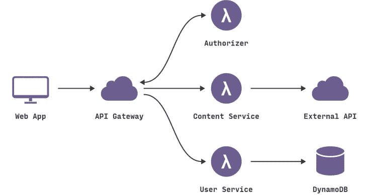

# 无服务器架构:为什么科技公司在 2019 年使用它

> 原文：<https://medium.com/hackernoon/serverless-architecture-why-tech-companies-are-using-it-in-2019-da7729fcfff6>

您是一名试图理解无服务器架构如何工作的开发人员吗？请在本指南中找到答案。

如果你听说过“无服务器架构”，但是你仍然不明白它的意思，不要担心。这个概念在过去几年里越来越受欢迎，而且看起来没有放缓的趋势。现在，越来越多的云计算公司正试图将[无服务器计算](https://www.apriorit.com/dev-blog/551-serverless-computing)用于他们的业务。

无论你是开始编程，还是编程专家，你都将使用无服务器架构来帮助创建高质量的应用程序。在本指南中，我们希望帮助您了解为什么您应该从今天开始使用它。

# 什么是无服务器计算？

无服务器计算是指开发人员使用基于云的服务器、操作系统和基础设施。尽管它被称为“无服务器计算”，但还是涉及到了服务器。但是托管服务、容量规划、服务器管理和设置是不可见的，因为它们是由云提供商处理的。

在传统环境中，开发人员必须创建和配置服务器，并管理整个基础架构。借助无服务器计算，您可以开发、部署和管理可随需求扩展的应用，而不必担心基础架构。

无服务器计算架构是高度可扩展的、事件驱动的，并且在特定功能发生时使用资源。这意味着您可以为保持服务器运行所需的资源或时间付费。

以下是构建无服务器架构时您将体验到的一些好处。

# 提供灵活性

与传统方法相比，您可以轻松实现无服务器应用。无服务器化让您可以更快地创新和完成项目。当你能立即看到结果时，你就能进入下一个项目。

就可以开始做下一个微服务或者 app 功能了。一旦你不再受约束，无服务器架构给你带来好处。这有助于您在需要重构应用程序的情况下进行调整。

# 改善客户体验

这将取决于公司，但无服务器架构可以带来更满意的客户。一家公司可以制造更多改进的服务器，这意味着客户将更快地获得新功能。

没有人想等一年的时间来解决小问题。您可以快速发布特性和逻辑，这有助于改善用户体验。

# 提高安全性

通过让开发人员在无服务器的上下文中只使用代码构造，开发人员将会开发出符合公司最佳实践的代码，并且它与治理和安全协议一起工作。

# 权力分离

无服务器计算的目标是通过在后台帮助引导、管理和依赖来提高开发人员的生产力。

这样，开发人员可以专注于他试图提供的重要功能。这有助于他更客观地思考，从而在面向对象的平台中制作代码，更容易将其划分为隔间，向上和向下扩展，然后细分为离散的功能。

# 结论

最后，无服务器架构可用于帮助更快地部署应用程序，增强客户体验，并允许您根据需求扩展应用程序。确保培训您的 it 团队，以便他们能够有经验地利用 IT 为您服务。通过这样做，你会发现在合理的时间框架内完成项目更容易。