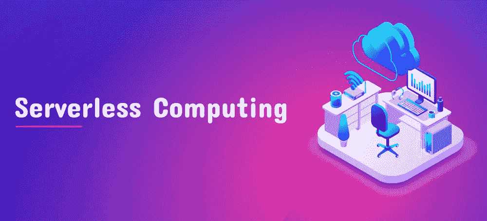
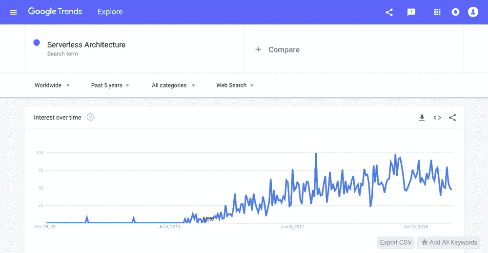

# 无服务器计算——新商业趋势背后的真相

> 原文：<https://medium.com/hackernoon/serverless-computing-the-truth-behind-the-new-business-trend-7426c9fa3105>

云计算唤起了企业和商业的新希望。大多数企业家(包括我)已经开始不那么担心 IT 基础设施了。嗯，这都要感谢云！

目前，无服务器计算是这方面谈论最多的话题。在 Google Trends 中，我们看到了在无服务器架构上的网络搜索的巨大峰值。每天至少有 100 次对无服务器架构的 web 搜索。

那么，为什么突然对无服务器计算感兴趣呢？这仅仅是一种时尚还是真正的游戏规则改变者？

让我们仔细看看！

# 什么是无服务器计算？

对于新手来说，无服务器这个术语可能会让他们感到震惊。这是否意味着没有服务器？是，也不是。在这样的架构中，您的应用程序仍然运行在服务器上。但是，你不拥有或管理他们。像其他云模型一样，您消费计算架构，并且只为它付费。

无服务器计算服务有两种方式:后端即服务(BaaS)和功能即服务(FaaS)。一些提供商向客户或 BaaS 提供数据库和存储服务，而另一些提供商则提供不将应用程序数据存储为服务的功能。一些主要的 FaaS 供应商是亚马逊— AWS Lambda、微软— Azure Functions、谷歌—谷歌云功能和 IBM — IBM OpenWhisk。

# 无服务器计算如何改变您的业务？

## 与微服务架构兼容

无服务器和微服务架构在特性上非常相似。这两种架构都旨在通过其有效性来提高业务敏捷性。正如我们已经知道的，一个[微服务架构](https://www.sayonetech.com/blog/microservices-architecture-the-new-business-enablers/)将整个应用程序分解成松散耦合的服务。

它如何与无服务器计算兼容？

随着整体被分散到单独的服务中，它提供了更好的资源虚拟化和高效的 API 可重用环境。因此，这些独立的服务被置于一个更好的位置来移动其架构中的无服务器。如果您不想过多关注基础设施和功能，那么您可以选择使用无服务器的微服务。

## 高度的可扩展性

*放大/缩小会自动发生！*

根据您的应用程序负载和服务器请求，该架构可以在几秒钟内扩展或缩小。它了解当前的情况，并进行自我调整以适应不断增长的基础架构需求。换句话说，无服务器计算具有灵活的事件驱动扩展能力。

## 低成本维护

无服务器计算架构的一个突出优势是维护成本低。它以现收现付的模式运作。您不仅可以节省购买基础设施的时间，还可以显著降低开发成本。

小额付费系统使你能够只为执行的代码付费。成本是根据内存和时间消耗计算的。你不必为闲置资源付费。由于资源扩展是自动和快速的，组织的运营成本也显著降低。

## 促进更快的发布周期

您可以更快地发布更新，并在最短的时间内得到反映。在我看来，当企业决定采用无服务器架构时，他们可以获得更好的灵活性和生产力。

您的开发团队可以构建、运行尽可能多的测试，并以敏捷的方式发布它。使用无服务器计算，无需担心基础设施的设置及其处理更新的准备情况。这些需求将由所选择的无服务器计算服务完美地处理。

随着团队的负担减轻，他们可以专注于其他重要的事情，比如应用程序本身。因此，我们可以肯定地说，无服务器架构提高了团队的生产力，增强了应用程序的质量。

## 更好的灾难恢复

尽管无服务器体系结构使您对基础设施的控制更少，但灾难恢复已相当好地集成到其服务中。基于云的灾难恢复服务能够恢复您的关键企业应用程序，而不会产生额外成本。

服务器部署在云上，使其在一天中的任何时间都可用。因此，如果您在半夜遇到问题，您不必等到第二天。这些服务器可以在不同的区域使用。简而言之，我们可以说，以极小的成本将恢复时间降低到几乎为零是无服务器架构的主要成果。

## 降低运营复杂性，增加开发工作量

无服务器计算在许多方面减轻了我们的负担。企业可以专注于核心竞争力，而不是担心构建及其发布。服务和产品的质量随着团队生产力的提高而显著提高。无服务器计算中的资源扩展和微计费导致低成本开销。

随着运营复杂性的降低，建立 [DevOps](https://www.sayonetech.com/blog/how-devops-will-play-crucial-role-your-business/) 文化的挑战开始减少。持续集成和持续开发(CI/CD)在这种类型的架构中被无限地推广，在这种架构中，代码的变化会自动地反映在应用程序中。

# 底线:无服务器计算高于“时尚”

无服务器计算给应用程序开发领域带来了巨大的变化。如果我说它已经根除了大部分 it 挑战，我不会夸大其词。由于广泛的商业利益，无服务器计算已经发展成为 IT 世界的一个主要的游戏规则改变者。

我个人最喜欢的无服务器计算的好处是它的高可扩展性。在不断发展的商业世界中，我们努力适应不断增长的客户需求和行业趋势。因此，应用程序总是倾向于更新和更多的数据。所以，如果我可以更轻松地拓展我的商业野心，那我为什么要犹豫呢！

在未来几年，我们可以期待更多的公司推进云计算和无服务器架构。在 SayOne，我们已经开始了进入无服务器世界的旅程。如果你需要一个，请随时与我们[联系](https://www.sayonetech.com/contact/)！

*最初发布于*[*https://www . sayone tech . com/blog/server less-computing-truth-behind-the-new-trend/*](https://www.sayonetech.com/blog/serverless-computing-truth-behind-the-new-trend/)*。*