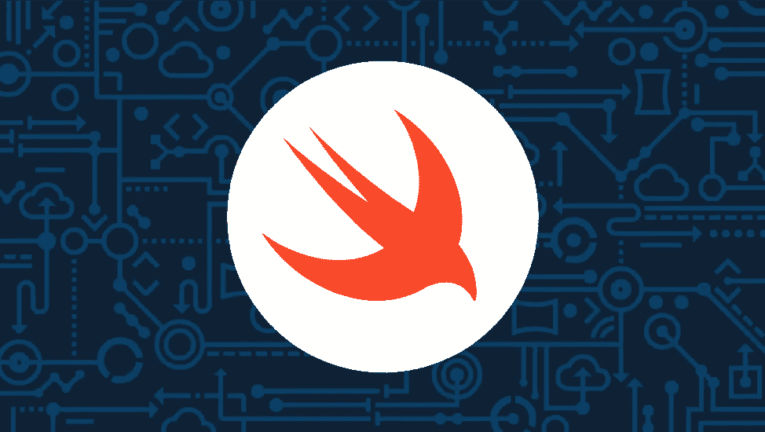

# 使用 Swift 进行无服务器计算

> 原文：<https://medium.com/hackernoon/serverless-computing-with-swift-4fa27ab36161>

## 第 2 部分:Apache OpenWhisk 和 IBM Cloud



你可能认为我会担心烤面包……

回想一下这篇文章的第一部分——[**Swift 的无服务器计算** : Swift 和 AWS Lambda](/capital-one-tech/serverless-computing-with-swift-f515ff052919)——我已经决定成立一家初创公司，*这是我能做的酵母*，一家专注于美食面包的在线面包店。我的 CLO ( *首席发酵官*)愿意同意我优先考虑云基础设施，而不是真正的烘焙产品。但她担心我们还没有充分探索我们的选择。在本文中，我将重写第 1 部分中的代码，以便在[Apache open whish](http://openwhisk.incubator.apache.org/)下运行。

OpenWhisk 是一个用于无服务器计算的开源平台。您可以在自己的服务器上托管它，有或没有容器(如 Docker)。你甚至可以在 AWS 上运行它。对于本文，我将使用 IBM Cloud，这是一个云服务基础设施，以前被称为 Bluemix。

(如果你在家跟进，你需要一个 IBM 账户。(可以在这里注册一个 [*免费试用*](https://www.ibm.com/cloud) *)注册账号后，安装 CLI 及其云功能插件；按照说明* [*这里*](https://console.bluemix.net/docs/cli/reference/ibmcloud/download_cli.html#install_use) *和* [*这里*](https://console.bluemix.net/docs/openwhisk/bluemix_cli.html#cloudfunctions_cli) *。为了避免以后出现含糊不清的错误消息，请确保在同一区域创建一个组织和空间。)*

OpenWhisk 为多种语言提供了开箱即用的直接支持，包括 JavaScript、Python、Java、Go 和 Swift。OpenWhisk 还通过 Docker 容器支持其他语言；您可以用 Lua、Forth、Rust 或几乎任何语言编写动作，甚至是 Bash 脚本。

OpenWhisk 不仅让你用 Swift 编程，而且基础设施直接支持[***【Codable】***](https://developer.apple.com/documentation/foundation/archives_and_serialization/encoding_and_decoding_custom_types)。在第 1 部分的 AWS 代码中，我必须从标准输入中读取数据，并使用 ***JSONDecoder*** 将其反序列化。然而，在 OpenWhisk 中，主函数被传递了一个反序列化的对象。

由于 Swift 的支持是内置的，编译代码*应该比我们使用 AWS 要容易。让我们看看这是否成立。*

## **一个例子**

在第 1 部分的[中，我创建了一个无服务器函数，它将接收客户订购的商品列表并返回收据。尽管新版本的代码将与原始版本非常相似，但为了简单起见，我将从头开始。](/capital-one-tech/serverless-computing-with-swift-f515ff052919)

一开始，我会做些错事，但很容易。首先，我为我的代码创建一个目录并切换到它:

```
mkdir yeastcd yeast
```

然后，我把， *Item.swift* ， *Order.swift* ，和*receive . swift*组合成一个文件，称之为 *Yeast.swift* 。这些与第一部分的[要点](https://gist.github.com/profburke/2e951f48542a9a1ff47051572d77584c)没有变化。

```
curl -o Item.swift [https://git.io/fh9Kg](https://git.io/fh9Kg)curl -o Order.swift [https://git.io/fh9K2](https://git.io/fh9K2)curl -o Receipt.swift [https://git.io/fh9Ka](https://git.io/fh9Ka)cat Item.swift Order.swift Receipt.swift > Yeast.swift
```

我需要在文件底部创建主函数， *Yeast.swift* 。这里是与 AWS 版本的区别:OpenWhisk 基础设施进行输入解码，但是动作的 main 函数必须具有以下签名:

```
main(input: Codable, completion: (Codable?, Error?) -> Void) -> Void
```

(*实际上，目前还有几个备选签名没有记录在案。可以阅读 OpenWhisk* [*源代码*](https://github.com/apache/incubator-openwhisk-runtime-swift/blob/master/core/swift41Action/epilogue.swift) *了解详情。*)

我编辑了 Yeast.swift，添加了一个主函数和几个辅助结构:

```
 public struct Output: Codable {
   let receipt: String
}public struct Input: Codable {
   let items: [Item]
}func main(param: Input, completion: (Output?, Error?) -> Void) ->                Void {
   let receipt = Receipt(with: param.items)
   completion(Output(receipt: “\(receipt)”), nil)
}
```

***注意—输入*** 和 ***输出*** 是必需的，因为字符串不允许作为顶级 JSON 对象，所以我将字符串包装在简单的结构中。

# 正在添加 open whish…

最后，我使用 IBM 的命令行工具创建了一个 OpenWhisk 动作(*相当于 AWS Lambda 函数*)。咒语如下:

```
ibmcloud fn action create yeast Yeast.swift — kind swift:4.1
```

这导致消息“ok:创建了行动酵母”

现在为了测试它，我创建了一个名为 *params.json* 的参数文件，内容如下:

```
{
  “items”: [
      {“amount”: 3, “style”: “rye”},
      {“amount”: 4, “style”: “naan”}
  ]
}
```

并像这样调用操作:

```
ibmcloud fn action invoke -r yeast — param-file params.json
```

我在控制台上打印了以下 JSON:

```
{“receipt”: “Receipt for Order on 2018–08–02 19:44:37 +0000\n — — — — -\n3 RYE @ 0.62 = 1.86\n4 NAAN @ 0.87 = 3.48\n — — — — -\nTotal: 5.34\n\n”}
```

*-r* 开关执行阻塞调用，并将响应限制为动作的输出。相反，如果我键入以下内容:

```
ibmcloud fn action invoke -b yeast — param-file params.json
```

我还获得了一个阻塞调用，但是除了动作的输出之外，我还获得了许多元数据，比如开始和结束时间戳以及持续时间。不带 *-r* 或 *-b* 开关调用动作会导致非阻塞调用。

阻塞调用和非阻塞调用之间有什么区别？这类似于同步和异步方法调用。当您使用一个阻塞调用时，您会得到您的结果(*有或者没有元数据*)。当您使用非阻塞调用时，您会立即得到一个返回给您的激活 ID。在将来的某个时候，您可以使用这个激活 ID 来查找结果和关于激活的其他信息。如果您想了解更多细节，请阅读[文档](https://console.bluemix.net/docs/openwhisk/openwhisk_actions.html#openwhisk_actions)。

# 减轻冷启动延迟

我上面说了，我做的是错的…

这里有两个问题。

●首先，除非你正在编写一个非常简单的动作，否则你不会想把所有代码放在一个文件中。

●第二，采用我们刚刚采取的方法，行动将有一个冷启动延迟。

注意，上面创建动作的命令使用了 Swift *源*。但是，当然，Swift 是一种编译语言，所以在您的操作可以运行之前，必须编译 Swift 源代码。直到第一次调用您的操作时，才会进行编译；这被称为冷启动，会导致动作运行延迟。在初始调用之后，编译后的程序被缓存，因此后续调用通常不会有延迟。“通常”，因为当您的应用程序水平扩展时，当额外的容器启动时，会偶尔出现冷启动。

如果可能，最好减少冷启动延迟。事实上，我可以通过将代码重新组织成更模块化的结构，并用预编译的 Swift 程序创建动作来避免这两个问题。

首先，我将重新组织代码。确保你在你的*酵母*目录中。以下是步骤:

创建 SPM 包。

```
swift package init — type=executable
```

在 *Sources* 目录中，添加 *YeastModels* 作为子目录。将文件 *Item.swift* 、 *Order.swift* 和 *Receipt.swift* 移动到*yeas models*中。

```
mkdir Sources/YeastModels
mv Item.swift Sources/YeastModels
mv Order.swift Sources/YeastModels
mv Receipt.swift Sources/YeastModels
```

编辑*来源/酵母*中的 *main.swift* 如下:

```
import YeastModelspublic struct Output: Codable {
   let receipt: String
}public struct Input: Codable {
   let items: [Item]
}func main(param: Input, completion: (Output?, Error?) -> Void) -> Void {
   let receipt = Receipt(with: param.items)
   completion(Output(receipt: “\(receipt)”), nil)
}
```

更新 *Package.swift* 以包含 YeastModels 的目标，并添加 YeastModels 作为主目标的依赖项。 *Package.swift* 将如下所示:

```
// swift-tools-version:4.0
import PackageDescriptionlet package = Package(
   name: “yeast”,
   targets: [
      .target(
         name: “yeast”,
         dependencies: [“YeastModels”]),
      .target(
         name: “YeastModels”,
         dependencies: []),
   ]
)
```

删除*酵母*目录中的 *Yeast.swift* )。

# 减轻交叉编译问题

现在我必须编译它。但是有两个小问题:OpenWhisk 基础设施需要在 Swift 程序中注入少量代码，以及交叉编译。

公平地说，如果你不是在 Ubuntu 上开发，交叉编译只是一个问题。我通常在 Mac 上编码，所以交叉编译对我来说是个问题，可能对你也是。所以，我需要以某种方式构建一个 Linux 二进制文件。最简单的方法是使用 Docker。确保您安装了最新版本的 docker，并且守护程序正在运行。

我们开始吧:

```
docker run — rm -it -v “$(pwd):/owexec” ibmfunctions/action-swift-v4.1 bashcp /swift4Action/spm-build/Sources/Action/_Whisk.swift /owexec/Sources/yeastcat swift4Action/epilogue.swift >> owexec/Sources/yeast/main.swiftecho ‘_run_main(mainFunction:main)’ >> owexec/Sources/yeast/main.swiftecho ‘_ = _whisk_semaphore.wait(timeout: .distantFuture)’ >> owexec/Sources/yeast/main.swiftcd owexec/swift build -c releasemv .build/release/yeast .build/release/Actionzip yeast.zip .build/release/Action
```

现在，退出停止 Docker 容器的 shell(类型 Control-D)。

我做了什么？第一个命令启动一个 Docker 实例并启动 Bash shell。该实例使用了 IBM 提供的一个图像， ***。该图包含 Swift 编译器和构建操作所需的基础设施。Docker 的[文档](https://docs.docker.com/engine/reference/commandline/run/#usage)给了你更多的细节，但是标志使得从你的主机外壳与容器交互成为可能，并且它们使得你的动作目录在 Docker 容器内部可见。***

接下来的四个命令将基础设施代码注入我们的 Swift 项目。最后，最后四个命令构建项目，并根据 OpenWhisk 的期望打包它。具体来说，OpenWhisk 假设 Swift 可执行文件被命名为 ***Action*** 。

更新操作以使用新编译的二进制文件:

```
ibmcloud fn action update yeast yeast.zip — kind swift:4.1
```

再次测试:

```
ibmcloud fn action invoke -r yeast — param-file params.json
```

您应该会得到与之前相同的结果(再次使用*，对时间戳*取模)。我将把它作为一个练习留给读者，让他们探索热启动与冷启动的加速对比。

当然，现在您会想要自动化构建过程。事实上，如果您通读 IBM 文档，他们会提供一个 shell 脚本来为您进行编译。但是，该脚本对您的操作的目录结构做了一些假设，这些假设可能不符合您组织代码的方式。更重要的是，它没有正确处理 *modern* SPM 文件结构；它希望您的代码直接位于 *Sources* 目录下，而 SPM 希望您的代码位于 *Sources* 的子目录下。

我建议手工构建几个，一旦有了建立环境的想法，就写一个脚本。

## **势如破竹**

既然基本的想法是可行的，那么接下来的步骤和第 1 部分一样。也就是说，将它集成到基础设施的其余部分。IBM Cloud 提供了一个 API 网关和几个其他机制来触发您的操作。自从我撰写第 1 部分以来，服务器端(和无服务器)Swift 继续发展。例如， [Smoke 框架](https://github.com/amzn/smoke-framework)似乎正在为 Swift 中的编写服务赢得一些支持。

与此同时，我将继续推迟经营我的面包店，转而探索新技术。也许我的面包店需要一个[斯威夫特](https://www.appcoda.com/blockchain-introduction/) [区块链](https://learnappmaking.com/blockchain-app-swift-how-to/)？