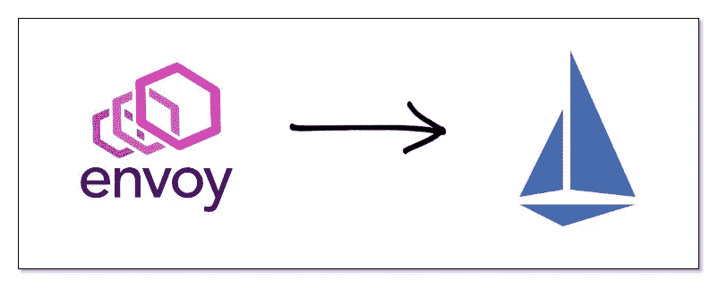
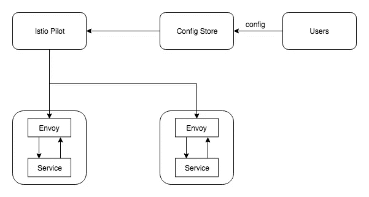
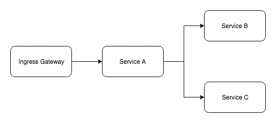
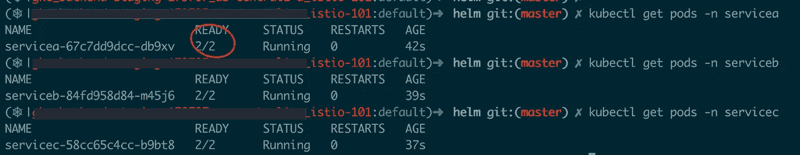
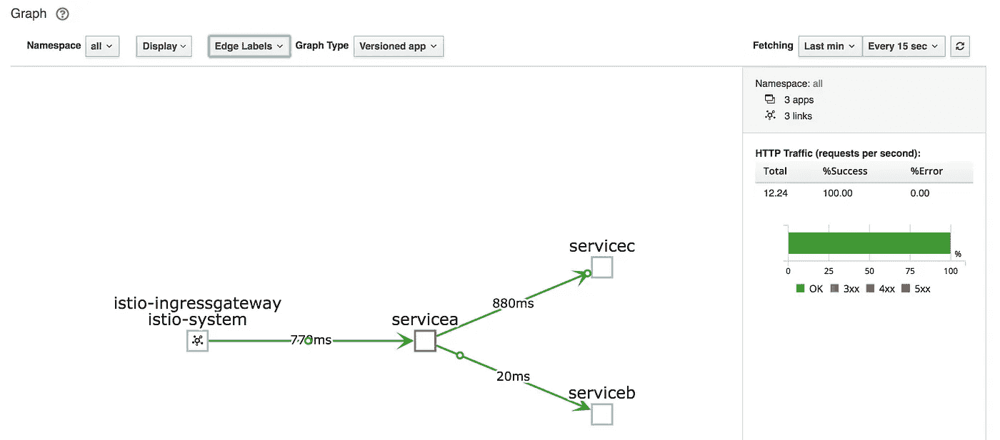
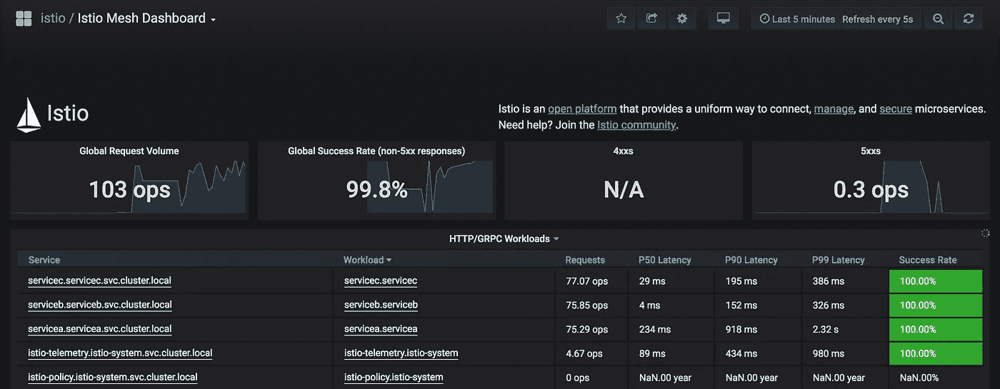

# 服务网:从基本的特使到 Istio

> 原文：<https://medium.com/hackernoon/service-mesh-moving-from-bare-bones-envoy-to-istio-e0fef88fc1e3>



Migrating from bare-bones Envoy to Istio

这篇文章是“服务网格”系列的一部分。如果你还没有阅读之前的文章，我强烈建议你这样做，这将有助于你更好地理解这篇文章。这里是以前的文章

*   [与特使 101 的服务网格](https://hackernoon.com/service-mesh-with-envoy-101-e6b2131ee30b)
*   [使用特使服务网格进行微服务监控，Prometheus & Grafana](https://hackernoon.com/microservices-monitoring-with-envoy-service-mesh-prometheus-grafana-a1c26a8595fc)
*   [带特使服务网的分布式追踪&耶格](https://hackernoon.com/distributed-tracing-with-envoy-service-mesh-jaeger-c365b6191592)

在之前的文章中，我们看到了将 Envoy 安装为我们服务的侧车代理，并看到了服务网格设置如何帮助管理服务之间的流量，以及如何收集和可视化大量关于流量的遥测数据。

虽然在设置中有一些恼人的事情

1.  手动安装特使侧车
2.  手动将流量路由到侧车代理
3.  管理所有特使侧车的配置

关于第三点，正如我们在之前的一篇文章中已经看到的，我们可以使用 Envoy 的 xDS 服务器来集中管理配置，并在不需要重启的情况下动态更新它们。是的，这在一定程度上减少了痛苦，但是你仍然需要维护所有侧车代理的配置。

# 数据平面与控制平面

在改进我们的设置之前，我们需要理解这些在服务网格环境中广泛使用的术语。

数据平面实际上完成所有基础工作，如路由流量、收集遥测数据并发送到指标存储(例如:statsd)、通过电路中断管理流量、速率限制等..数据平面的一个例子是我们的特使侧车。

控制平面是在服务网格中配置侧车代理的平面。到目前为止**我们一直手动充当控制平面**并配置侧车代理，但是我们可以使用工具充当控制平面并为我们配置侧车代理。控制平面的例子是 Istio。



Istio Control Plane

所以现在你不直接配置任何侧车代理，我们提交我们的配置(流量转移，故障注入等..)到配置存储器，Istio Pilot(Istio 中的一个组件)在配置存储器中寻找变化，然后将这些变化推送到侧车代理。

> 注意:上图只显示了 Istio Pilot，但 Istio 还有其他几个组件，如 Citadel、Galley 等…

# 演示

让我们看一个用 Istio 建立服务网格的例子。我们将在 Kubernetes 集群中部署我们的服务



Service Architecture

## 安装 Istio

先决条件:

1.  您需要启动并运行一个 Kubernetes 集群
2.  在集群中配置 Helm 客户端和 tiller。请参考此处的
3.  克隆官方 Istio [回购](https://github.com/istio/istio)

```
kubectl apply -f install/kubernetes/helm/istio/templates/crds.yamlhelm install install/kubernetes/helm/istio -name istio -namespace istio-system
```

> 注意:我使用的是 Helm 版本 2.9.1，Kubernetes 集群位于 GKE。你可以在这里找到其他环境[的安装说明。](https://istio.io/docs/setup/kubernetes/)

# 部署服务

当我们只处理 Envoy 时，我们必须手动将请求路由到侧车。这一次我们不会那样做，我们会让伊斯蒂奥变魔术。服务的源代码可以在[这里](https://github.com/dnivra26/istio_101)找到。没什么特别的，只是一个服务调用了几个其他服务。每个服务也没有特使配置，Istio 将负责侧车配置。服务 A 在调用服务 B 和服务 C 时，分别使用 Kubernetes 服务名“serviceb.serviceb”和“servicec.servicec”

我们正在为我们的服务创建 Kubernetes 名称空间，我们正在为每个名称空间添加一个特殊的标签，稍后我们将讨论为什么有必要这样做。我们使用 helm 管理我们的应用程序，您可以在“helm”目录下的同一个[存储库](https://github.com/dnivra26/istio_101)中找到应用程序的 helm 图表。如果一切顺利，你的吊舱应该已经启动并运行了



service pods running

如果您仔细观察，会发现每个服务都有两个容器(在每个 pod 中)在运行，但是在我们的 helm chart 定义中，我们只定义了一个容器。发生这种情况是因为 Istio 监视所有的部署，并将侧车容器添加到我们的 pod 中。这是通过利用所谓的 [**突变 adminssionweb hooks**](https://kubernetes.io/docs/reference/access-authn-authz/extensible-admission-controllers/)来实现的，这个特性是在 Kubernetes 1.9 中引入的。因此，在创建资源之前，web 钩子拦截请求，检查是否为该名称空间启用了“Istio injection ”,然后将 side car 容器添加到 pod。这就是 Istio 如何解决为我们的每个服务手动添加侧车代理的问题。

> 注意:名称空间标签并不是添加 side car 的唯一方式，您甚至可以使用“istioctl”命令行工具来生成规范并进行部署

接下来，我们创建一个入口规则，将流量路由到服务 a。

Istio Gateway Configuration

**网关**和**虚拟服务**是我们安装 Istio 时创建的 Kubernets CRDs(自定义资源定义)。我们将在下一篇文章中看到更多关于这些的内容，现在只需要理解我们要求所有的请求都被路由到服务 a。

让我们点击网关的公共 ip 来产生一些流量。

您可以通过以下方式找到网关的外部 ip

```
kubectl get services istio-ingressgateway -n istio-system
```

我们可以使用任何负载测试工具来产生一些流量，我正在使用[嘿](https://github.com/rakyll/hey)

```
hey -z 30s [http://x.x.x.x](http://x.x.x.x)
```

Istio 自带工具来监控服务网格中正在发生的事情，让我们看看 Kiali 和 Grafana。

> 注:当我们用 Helm 安装 Istio 时，Grafana，Prometheus，Zipkin，Kiali 等工具..会自动安装。您可以通过修改值[文件](https://github.com/istio/istio/blob/master/install/kubernetes/helm/istio/values.yaml)来控制安装的内容及其配置。

## 基亚利

```
kubectl port-forward service/kiali -n istio-system 20001:20001
```



Kiali service mesh visualisation

## 格拉夫纳

```
kubectl port-forward service/grafana -n istio-system 3000:3000
```



Grafana metrics

如您所见，我们的服务与 Istio 设置相结合，并且我们有所有的指标和可视化。但是需要注意的是**我们没有手动将流量路由到侧车代理，它是自动发生的**。Istio 首先使用 IP 表规则将传入和传出流量路由到侧车代理。更多关于规则[的细节在这里](https://github.com/istio/istio/blob/master/tools/deb/istio-iptables.sh)。

## 配置 Istio

我们看到您不直接用 Isito 配置侧车代理。那么我们如何配置流量控制规则呢？为此，当您安装 Istio 时，会创建许多 Kubernetes CRDs(自定义资源定义)，例如: **VirtualService** ， **DestinationRule** …我们在下面看到一个控制流量的配置示例:

Adding Trafic rules

上面的规则是 canary 部署的一个例子，将 10%的流量路由到新版本的服务。因此，我们将这些规则提交给配置存储，Istio Pilot 监视存储并将配置更改推送到适当的侧车代理。

# 结论

使用 Istio，服务开发人员几乎不需要修改代码就可以获得服务网格的所有好处。相反，他们可以专注于构建业务功能。事实上，开发人员甚至不知道有一个服务网格设置。

这篇文章只是想看看迁移到 Istio 如何解决我们与 Envoy 之间的一些恼人的问题。这也是我们没有深入研究 Istio 的原因。Istio 要大得多，有更多的东西。在下一篇文章中，我们将探索更多关于 Istio 的内容。

你可以在这里找到所有代码[。我做了一个关于这个话题的演讲，你可以在这里找到](https://github.com/dnivra26/istio_101)

[](https://github.com/dnivra26/istio_101) [## dnivra26/istio_101

### 通过在 GitHub 上创建帐户，为 dnivra26/istio_101 开发做出贡献。

github.com](https://github.com/dnivra26/istio_101)