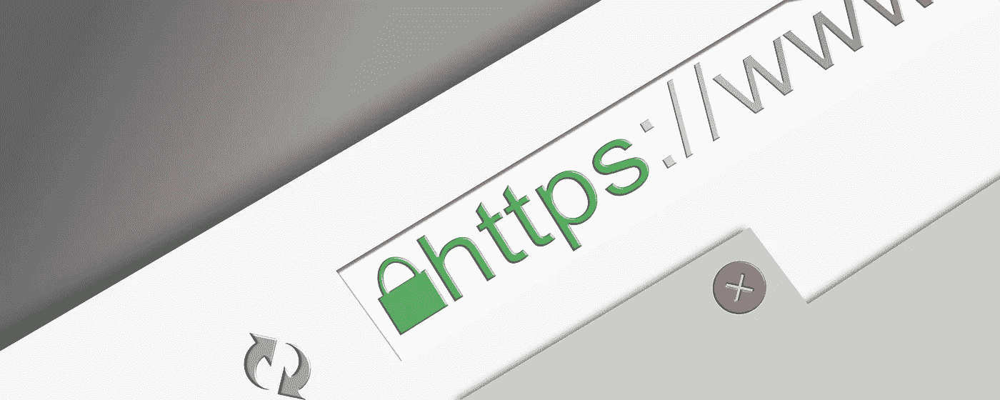

# 使用 OpenSSL 在 NodeJS 和 Express 中设置 SSL

> 原文：<https://medium.com/hackernoon/set-up-ssl-in-nodejs-and-express-using-openssl-f2529eab5bb>



这是一个简单、易于理解的教程，介绍如何使用 *Express* 框架在 *NodeJS* 中通过 *https* 提供页面服务。

我们将在本教程中使用的工具/框架有:

*   NodeJS:你应该对如何在 [NodeJS](https://nodejs.org/) 中编程有基本的了解。
*   OpenSSL:生成密钥和证书的工具。
*   ExpressJS ( `npm i express`):在 NodeJS 中编写 web 服务器的后端框架。更多关于[快递](https://expressjs.com/)。
*   `https`:自带 NodeJS。

让我们建立我们的项目目录。它不是一个有很多文件的目录。相反，它只包含 4 个文件，分别是`package.json`、`key.pem`、`cert.pem`和`server.js`。所以，创建一个新的目录*节点——https*、`cd node-https`并运行`npm init -y`来创建`package.json`文件。

现在使用`npm i --save express`安装 *express* 。创建一个`server.js`文件，并在其中键入以下代码。

我们的`server.js`应该是这样的:

```
const app = require('express')();
const https = require('https');
const fs = require('fs');

//GET home route
app.get('/', (req, res) => {
     res.send('Hello World');
});

// we will pass our 'app' to 'https' server
https.createServer(app).listen(3000);
```

就是这样。现在，如果您运行`node server.js`并访问`localhost:3000`，除了一个错误，您什么也看不到！是时候纠正这个错误了。

# 生成 cert.pem 和 key.pem

使用 OpenSSL( [？](https://www.openssl.org/))，我们会生成我们的`key`和`cert`。所以，你可以这样做:

```
openssl req -x509 -newkey rsa:4096 -keyout key.pem -out cert.pem -days 365
```

*   `-keyout`:该标志让`openssl`知道在哪里保存 *key.pem* 文件。我可以是一个绝对的文件位置。
*   `-out`:这个标志让`openssl`知道在哪里保存 *cert.pem* 文件。我也可以是一个绝对文件位置。
*   `-days`:该标志指定 SSL 有效的天数。

确保在`server.js`所在的目录下运行上述命令。回答所有问题。如果一切顺利，您应该在项目根中看到两个新文件，即`cert.pem`和`key.pem`。

打开`server.js`并将证书和密钥文件包含在您的`https.createServer()`函数中。就像下面的例子。

```
const app = require('express')();
const https = require('https');
const fs = require('fs');

//GET home route
app.get('/', (req, res) => {
    res.send('Hello World');
});

// we will pass our 'app' to 'https' server
https.createServer({
    key: fs.readFileSync('./key.pem'),
    cert: fs.readFileSync('./cert.pem'),
    passphrase: 'YOUR PASSPHRASE HERE'
}, app)
.listen(3000);
```

打开一个终端窗口，运行`node server.js`。它应该运行没有任何错误。打开你最喜欢的浏览器并访问`https://localhost:3000`，你应该会看到 **Hello World** 。

您可能会看到一些 SSL 警告。那是因为你的证书不是由任何认证机构签发的。您需要做的是，将证书作为例外添加到浏览器中。

日安！！