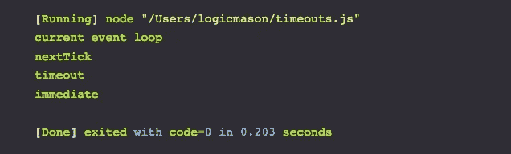

# setTimeout、setImmediate 和 process.nextTick 之间的区别

> 原文：<https://medium.com/hackernoon/settimeout-vs-setimmediate-vs-process-nexttick-ffafa3b36de2>



The Event Loop and Callbacks

`setTimeout(callback, 0)`和`process.nextTick(callback)`有什么区别？Node 的`setImmediate(callback)`怎么样？

从表面上看，这三个函数做的事情是一样的——它们在当前[事件循环](https://hackernoon.com/tagged/event-loop)之后执行回调，但在其他任何事情之前执行。自然要问的问题是，为什么有三种不同的功能？让我们做一个实验:

```
let racer = function() {
  setTimeout(() => console.log("timeout"), 0);
  setImmediate(() => console.log("immediate"));
  process.nextTick(() => console.log("nextTick"));
  console.log("current event loop");
}racer()
```

我们可以从输出中看到，这些回调没有按照它们在源代码中被编写的顺序执行。

```
[Running] node "/Users/logicmason/timeouts.js"
current event loop
nextTick
timeout
immediate[Done] exited with code=0 in 0.203 seconds
```

# 说明

第一个执行的是`process.nextTick`，它将其回调放在事件队列的前面。它将在当前正在执行的代码之后，但在任何 I/O 事件或计时器之前执行。

接下来是“暂停”。因为我们给`setTimeout`设置了 0 的超时，所以在它执行之前没有额外的强制延迟，它在下一个循环中被放入定时器队列。

最后我们还有`setImmediate`，显然没有它的名字那么立竿见影！它的回调被放在事件循环的下一个周期的检查队列中。由于检查队列发生在计时器队列之后，setImmediate 将比 setTimeout 0 慢。

总而言之，事件循环如下所示:

`timers`->-`IO`->-`poll`->-`check`->-`close`->-`timers`->...

**定时器**:来自`setInterval`或`setTimeout`的回调
或 **IO 回调**:来自 I/O 事件
的回调**空闲**:在 IO 和轮询阶段
之间由[节点](https://hackernoon.com/tagged/node)内部使用**轮询**:检索新的 I/O 事件
**检查**:来自 setImmediate 的回调在此执行
**关闭**:处理像套接字一样关闭的连接

# 挑战时间！

您期望 Node 中以下代码的输出是什么？

```
let racer1 = function() {
  setTimeout(() => console.log("timeout"), 0);
  setImmediate(() => console.log("immediate"));
  process.nextTick(() => console.log("nextTick"));
}let racer2 = function() {
  process.nextTick(() => console.log("nextTick"));
  setTimeout(() => console.log("timeout"), 0);
  setImmediate(() => console.log("immediate"));
}let racer3 = function() {
  setImmediate(() => console.log("immediate"));
  process.nextTick(() => console.log("nextTick"));
  setTimeout(() => console.log("timeout"), 0);
}racer1()
racer2()
racer3()
```

这是你所期望的吗？

*原载于 2019 年 4 月 22 日*[*https://logicmason.com*](https://logicmason.com/2019/settimeout-vs-setimmediate-vs-process-nexttick/)*。*