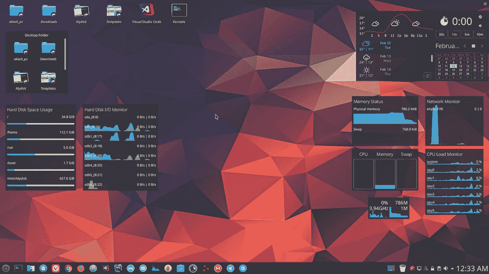
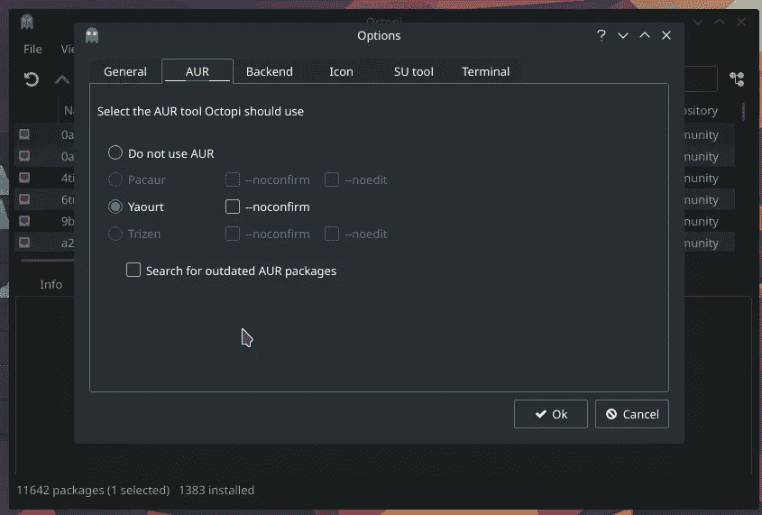
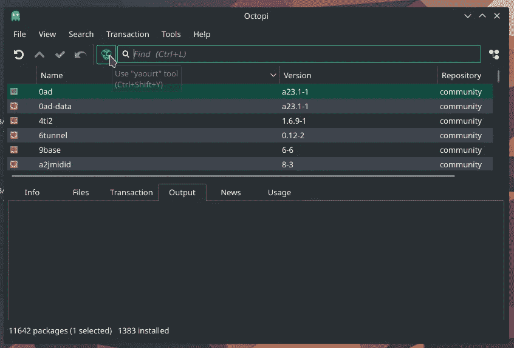
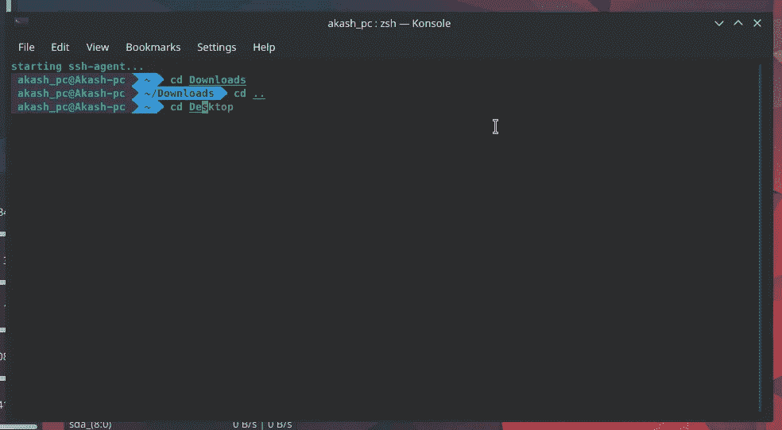

# 从头开始设置 Manjaro Linux！！

> 原文：<https://medium.com/hackernoon/setting-up-manjaro-linux-from-scratch-d9bdaa806596>



Desktop of My Manjaro

# **第一步**:下载**一个镜像文件**

从他们的 [***官网***](https://manjaro.org/download/kde/) 下载一个镜像文件，通过 Rufus 之类的任何引导软件安装这个镜像文件。

> **注意:**在**“DD”**模式下选择写入。(这个选项是特别为曼加洛 KDE 版本)和其他曼加洛版本选择“ISO 图像模式”

**推荐:曼哈罗 KDE** (如果你的 PC/笔记本有 i5 的话)。

**问题**:有时当你在*模式下写入你的 ***ISO*** 时，你的 u 盘显示空间变少。就像如果 USB 是 8gb，那么它只显示 4mb 大小的整个笔驱动器。*

***解决这个问题**:在 Linux 中插入 u 盘(只有 Linux 和 MacOS 可以解决这个问题)。*

*打开 ***KDE 分区管理器*** (在 Manjaro 中)删除当前 u 盘中存在的所有分区，并分配新分区(这将解决您的问题)。*

*现在通过 u 盘安装系统。*

# ***第二步:分区***

> *比如:—如果你和我一样有 250GB 的 SSD*
> 
> *否则，根据您的需要对驱动器进行分区。*

*根目录(/) —主目录(50–60 GB)*

*Home (/home) —主(根据需要)(在我的系统中(150 -160 GB)*

*Boot (/boot) —主(2–3gb)*

*扩展(/逻辑)—剩余空间(总计=250 Gb — 60Gb —150Gb — 3Gb = 37GB)*

*Var (/var) — 17GB(因为它存储所有的临时内存和缓存)*

*Swap(Linux Swap) — 20GB ***(主要是 2 X RAM)。****

# *第三步:在 Manjaro 中安装 ***Yaourt****

> *Yaourt 代表**又一个用户存储库工具***
> 
> *是一个命令行界面程序，完成了在 Archlinux 上安装软件的 pacman。*

## ***安装:-***

## ***1。使用自定义存储库。***

```
****sudo nano /etc/pacman.conf****
```

*在文件末尾添加以下内容。*

```
****[archlinuxfr]
SigLevel = Never
Server = http://repo.archlinux.fr/$arch****
```

*保存并关闭文件。*

*现在使用命令更新 Repo 数据库并安装 Yaourt。*

```
****sudo pacman -Sy yaourt****
```

## ***2。使用 AUR***

```
****sudo pacman -S --needed base-devel git wget yajl****
```

*在安装了必要的依赖项之后，我们必须安装软件包——允许构建和运行 yaourt 的查询。*

```
****git clone https://aur.archlinux.org/package-query.git******cd package-query/******makepkg -si******cd ..******git clone https://aur.archlinux.org/yaourt.git******cd yaourt/******makepkg -si******cd ..******sudo rm -dR yaourt/ package-query/****
```

> *逐行运行这些命令。(我没有在本文中解释每一个命令。如果你想了解更多请跟随 [**这个**](https://www.ostechnix.com/install-yaourt-arch-linux/) )*

*这将在系统中安装 Yaourt。*

****约尔特*** 的一些基本用法——*

*//更新 Arch Linux*

```
****yaourt -Syu****
```

*//安装一个包*

```
****yaourt -S <package-name>****
```

*//升级软件包*

```
****yaourt -U <package>****
```

**

*Enable Yaourt In Octopi*

**

*This Skeleton Button is Yaourt*

# ***第四步:申请***

> *安装一个系统后，我们会安装一些我们需要的基础 app。*
> 
> *启用 AUR : —打开 Octopi，然后转到工具并启用 AUR。*

****1。浏览器****

1.  ***Mozilla Firefox** —默认安装。*
2.  ***Google Chrome** —使用 AUR(包名— {{ google-chrome }}在 AUR)安装。*
3.  ***Vivaldi** —使用 Yaourt lib 安装(点击 Octopi 中的 Skeleton 按钮，然后搜索{{ Vivaldi }}*

****2。*代码 _ 编辑***

1.  *原子——AUR 著*
2.  ***网络风暴**——作者:约特*
3.  ***VS Code Studio** —作者 Yao URT(Search—{ { Visual-Studio-Code-bin } }*

****3。*供 _ 下载***

1.  *AUR 著*
2.  ***传输(Torrent _ Client)**—AUR { { Transmission-CLI } }*

*4. ***For_Email****

1.  ***MailSpring**——作者:Yaourt*

****5。*其他 _ 应用***

1.  ***电报 _ 桌面** —由 Aur 提供*
2.  ***弗朗兹**——作者雅乌尔{{弗朗兹-宾}}*
3.  ***MegaSync** —作者:Yaourt {{ megasync }}*
4.  ***Stacer(清理工具)** —作者 Yaourt {{ stacer }}*
5.  ***TimeShift(备份软件)**——AUR*
6.  ***清扫器(系统清洁器)**—AUR*
7.  *发现(软件经理) —作者 AUR*

> *现在我们已经有了我们需要的所有基本应用程序。*

# *第五步:获取 KDE 等离子的所有应用程序*

> *只有当你有高配置的 Pc 时才遵循这个步骤，否则它会降低你的系统速度或者安装它的小软件包。*

```
****Sudo pacman -S Plasma kio-extras****
```

*   **所有应用**

```
****Sudo pacman -S Kde-applications****
```

*   **精选应用**

```
****Sudo pacman -S Kdebase****
```

> *在这之后，其他一些设置是*
> 
> *kde 的默认显示管理器是 SDDM(更新)*

```
****Sudo Systemctl enable sddm.service --force
reboot****
```

> *更新当前用户*

```
****/usr/bin/cp -rf/etc/skel/.
reboot****
```

# *步骤 6:系统配置*

*   ****桌面主题*** —微风暗*
*   ****观感*** —微风暗*
*   ****光标*** —微风*
*   ****闪屏***—adaptea*
*   ****颜色*** —气息深沉*
*   ****字体*** — Noto sans 10*
*   ****图标*** — Breeze 或 La Captaine*
*   ****应用风格*** —微风*

## *小工具*

*   ****活动日历****
*   ****内存状态****
*   ****网络监视器****
*   ****系统负载查看器****
*   ****CPU 负载监视器****
*   ****资源监控器****
*   ****硬盘空间使用率****
*   ****硬盘 I/O 监视器****

## *一些重要的设置*

1.  ****转到系统设置，在*** 部分*

*   ****点击*** *—桌面会话{{恢复手动保存的会话}}**

*否则它会减慢你的电脑速度，并随时打开新的桌面。*

*   ****点击*** *—默认离开选项{{结束当前会话}}**
*   ****点击*** *—自动启动{{禁用所有应用程序}}**

# *步骤 7:安装第二个存储驱动器(以增加存储容量)*

> *此选项仅适用于系统中有第二个存储驱动器的情况。*
> 
> *我们的系统中有两个存储驱动器 **1 个固态硬盘+ 1 个硬盘***
> 
> *我们将系统安装在 SSD 中，并使用 HDD 来增加系统的存储容量。*

## *分区、格式化和安装*

*   ****分区****

```
****Sudo fdisk-l****
```

> *检查你的硬盘的 fs 格式是基于像
> **1TB my HDD on/dev/sda***
> 
> *但是我们现在不能挂载它，如果我们挂载会出现错误
> 我们需要先对它进行分区:*

```
****Sudo fdisk /dev/sda****
```

> ****注—*“m”为帮助(命令列表)
> 为检查分区表—“P”(输入 P)
> 为分区，输入“n”，然后输入“P”选择 primary 即可。
> 然后输入“1”仅表示一个分区号。***

*   ****格式****

*格式化新分区的硬盘(记住你硬盘的 fs 格式)*

```
****Sudo mkfs.ext4 /dev/sda****
```

*   ****安装****

*通常，驱动器安装在/mnt 中*

```
****Sudo mkdir /mnt/sda****
```

*然后我们可以安装它:-*

```
****Sudo mount /dev/sda /mnt/sda****
```

*每当我们重新启动它会自动安装。
我们用***nano/etc/fstab****

***注意** —将此登录终端保存为 Root。*

```
****/dev/sda  /mnt/sda  ext4  default  0  0****
```

> ***1。硬盘驱动器的路径
> 2 .已安装驱动器的目的地
> 3 .格式类型
> 4–6。保留为默认 0 和 0。***

# *步骤 8:通过 TimeShift 创建系统备份*

> *当你完成安装所有的应用程序，然后设置所有的设置。现在是时候创建系统的备份了。如果你不小心删除了任何系统文件或者中途发生了任何错误，这个备份会很有用。*
> 
> ***注意**-创建备份后，我们会将其文件保存在第二个存储驱动器或外部 hdd 中(因为我的 ssd 中没有空间来永久保存该备份。但是，如果您的 ssd 中有空间，则不要执行步骤 2 之后的步骤。*

*第一步。打开时移*

*第二步。创建快照*

*第三步。现在复制外部硬盘/第二硬盘中的所有备份文件。*

*以根用户身份打开终端*

```
****cp -a /timeShift/snapshots/{your snapshot name}/  /mnt/{Name of your 2nd storage drive}/backup****
```

> ****注*** —备份来自这个命令，因为没有这个系统不能给我们直接拷贝的权限。并创建您的备份压缩版本，然后您将能够保存在外部硬盘。*

***进行恢复** —打开 octopi，搜索 TimeShift，然后安装
，将整个快照复制到那个文件夹
***Root/timeShift/snapshot/***
下一步，timeShift 中会出现恢复选项。*

# *第九步:定期清洁 Tmp*

> *定期清理 **/Var/tmp** 文件夹，如果不定期清理，系统会崩溃(仅当 **var** 文件夹没有剩余空间时)。*

*   ****自然法****

*打开文件管理器，进入 ***Root/var*** 文件夹，根据需要清理文件夹，通过“Root Actions”选项删除。*

*我们将从终端检查 ***Var 文件夹中占用了多少空间。****

```
****df -h****
```

*   ****自动化方法****

*定期运行 ***清扫器*** 和 ***堆垛机*** 。*

# *步骤 10:配置 oh-my-Zsh(最佳终端)*

> *oh-my-Zsh 是我用过的最好的终端。*
> 
> *对于 Zsh，我们必须预先安装这些文件:1 . git 2 . curl 3 . wget*

*通过卷曲*

```
****sudo sh -c "$(curl -fsSL https://raw.githubusercontent.com/robbyrussell/oh-my-zsh/master/tools/install.sh)"****
```

*吃豆人*

```
****pacman -S Zsh****
```

*   ****从* — zsh 切换到 bash，反之亦然***

```
****exec bash (to bash) 
exec zsh  (to zsh)****
```

*   ****改变默认外壳****

```
****chsh -s /bin/zsh****
```

*   ****手动更新***—{ { upgrade-oh-my-zsh } }通过 zsh 终端*
*   ****通过 zsh 终端卸载 zsh***—{ { Uninstall-oh-my-zsh } }*
*   ****【插件(在我的系统中)****

```
*plugins=(git
       archlinux
       brew
       command-not-found
       github
       npm
       node
       ruby
       ssh-agent
       sublime
       sudo
       terminalapp
       vscode
       web-search
       gem
       rvm
       bundler
       copyfile
       zsh-syntax-highlighting
       zsh-autosuggestions
       )*
```

*   ****主题(在我的系统中)****

```
*ZSH_THEME=agnoster*
```

*   ****路径(Imp)****

```
*.Zshrc file in Home Directory1\. # Path to your oh-my-zsh installation.
  export ZSH="/home/{{ Pc_UserName }}/.oh-my-zsh"2\. source $ZSH/oh-my-zsh.sh3\. # If you come from bash you might have to change your $PATH.
# export PATH=$HOME/bin:/usr/local/bin:$PATH*
```

*   ****自定义插件****

1.  **添加语法高亮显示**

```
****git clone https://github.com/zsh-users/zsh-syntax-highlighting.git
${ZSH_CUSTOM:-~/.oh-my-zsh/custom}/plugins/zsh-syntax-highlighting****
```

*2.*自动建议**

```
****git clone https://github.com/zsh-users/zsh-autosuggestions ${ZSH_CUSTOM:-~/.oh-my-zsh/custom}/plugins/zsh-autosuggestions****
```

> *从 zsh_Terminal 运行这两个代码*

*现在，激活—转到。主目录中的 Zshrc 文件。
补充:*

```
*plugins=( zsh-syntax-highlighting
          zsh-autosuggestions
        )*
```

*   ****字体和配色方案设置****

***在空的 ***zsh_terminal*** 上点击**编辑当前轮廓**然后点击 ***外观。******

```
****Color-Scheme & background - Maia
font - Meslo LG S DZ for Powerline****
```

****安装-*** [***电力线字体***](https://github.com/powerline/fonts)*

*   **【安装在你的系统中的炮弹清单】**

```
*****cat /etc/shells*****
```

> ****Zsh 的文章****
> 
> **[**1 . agnoster**](https://github.com/agnoster)**/**[**agnoster-zsh-theme**](https://github.com/agnoster/agnoster-zsh-theme)**
> 
> **[**2.powerline/fonts**](https://github.com/powerline/fonts)**

****

**oh-my-zsh**

> ****学到了什么？按住👏来支持和帮助别人找到这篇文章。感谢阅读！！**
> ***在 Instagram 上关注我***[***@ hypnosiss _ _***](https://www.instagram.com/hypnosisss___/?hl=en)**