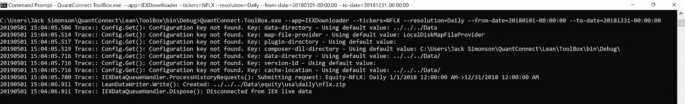
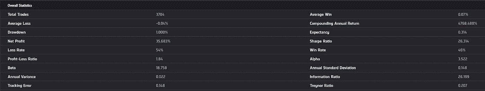

# 建立自己的算法交易服务器:操作指南

> 原文：<https://medium.com/hackernoon/setting-up-your-own-algorithmic-trading-server-4bbdf0766c17>

# 如何拥有自己完整的算法交易开发环境，提取数据并对策略进行回溯测试

众所周知，自营交易公司会花费数百万美元在为其组织提供动力的严密保护的技术上。本文向您展示了如何使用一种开源的替代方案，称为 LEAN(由 QuantConnect 开发)，它提供了与顶级华尔街机构相同的所有功能。

建立正确的基础设施对算法交易至关重要，以确保你的策略成功。有了实时资本，您需要确保您运行的是一个健壮的、经过良好测试的堆栈。精益已经由全球工程师社区开发和审查，这使您可以专注于有趣的部分，开发算法！

## 安装精益

由于 LEAN 是开源的，安装非常简单，只需在 [GitHub](https://github.com/QuantConnect/Lean) 上克隆主 repo，或者将其下载为. zip 文件并解压到您想要的目录中。要通过 git 命令安装，请导航到要将其解压缩到的目录，然后运行 clone 命令:

```
git clone https://github.com/QuantConnect/Lean.git
```

建议使用 Visual Studio 进行本地测试和开发，但这不是必需的。如果你的机器上还没有安装 Visual Studio，而你想使用它，你可以下载并安装免费版本，既可以用于 [Mac](https://visualstudio.microsoft.com/vs/mac/) 也可以用于 [Windows](https://visualstudio.microsoft.com/downloads/) 。Linux 用户需要安装 [Mono](https://www.mono-project.com/download/stable/#download-lin) ，下面会讲到。

## Windows 操作系统

要完成 Windows 的安装:

1.  打开 *QuantConnect。Visual Studio 中的 Lean.sln*
2.  通过点击 Build 菜单-> Build Solution 构建解决方案(这将触发 NuGet 包恢复，下载所有需要的依赖项)
3.  按 F5 运行

NuGet 包没有被恢复是最常见的构建问题。默认情况下，Visual Studio 包含 NuGet，但是如果您安装的 Visual Studio(或您的 IDE)找不到 DLL 引用，请安装 [NuGet](https://www.nuget.org/) ，在解决方案上运行 NuGet，然后重新构建解决方案。

如果您计划使用 Python，您需要:

1.  使用来自[python.org](https://www.python.org/downloads/release/python-366/)或 [Anaconda](https://repo.anaconda.com/archive/Anaconda3-5.2.0-Windows-x86_64.exe) 的 Windows x86–64 MSI 安装程序安装 Python **3.6** 。
2.  当要求选择要安装的功能时，请确保选择“将 python.exe 添加到路径”
3.  安装熊猫和其他[依赖](https://github.com/QuantConnect/Lean/blob/master/DockerfileLeanFoundation#L59-L71)

## 苹果个人计算机

要在 Mac 上完成安装:

1.  打开 *QuantConnect。Visual Studio 中的 Lean.sln* 。Visual Studio 会自动开始还原 NuGet 包。如果没有，在菜单栏中点击项目>恢复 NuGet 包。
2.  在菜单栏中，单击运行>开始调试以完成安装。

如果您计划使用 Python，您需要:

1.  使用来自 [Anaconda](https://repo.anaconda.com/archive/Anaconda3-5.2.0-MacOSX-x86_64.pkg) 的 macOS x86–64 包安装程序，并遵循 Anaconda 文档页面的“[在 MAC OS 上安装](https://docs.anaconda.com/anaconda/install/mac-os)”说明。
2.  安装[熊猫](https://pandas.pydata.org/)及其[依赖](https://pandas.pydata.org/pandas-docs/stable/install.html#dependencies)。

*注意:*如果遇到“系统。DllNotFoundException:python 3.6m "在 macOS 上运行 Python 算法时出现运行时错误:

1.  在您的 python 安装文件夹中找到 *libpython3.6m.dylib* 。如果您安装了 Python 和 Anaconda，那么可以在

```
/Users/{your_user_name}/anaconda3/lib/libpython3.6m.dylib
```

2.打开*Lean/Launcher/bin/Debug/Python。Runtime.dll.config* ，添加以下文本并保存:

## Linux 操作系统

Linux 用户需要:

1.  安装[单声道](http://www.mono-project.com/download/#download-lin)

如果您在最后一个命令中看到此错误:

```
Unable to locate package referenceassemblies-pcl
```

运行以下命令(它适用于当前版本的 Ubuntu — 17.10):

2.安装 NuGet

```
sudo apt-get update && sudo apt-get install -y nuget
```

3.恢复 NuGet 包，然后编译:

```
msbuild QuantConnect.Lean.sln
```

如果您得到:“初始化任务 Fsc 时出错:未注册任务 Fsc。”

```
sudo apt-get upgrade mono-complete
```

如果得到:“XX not found”->确保 NuGet 运行成功，必要时重新运行。

1.  运行编译的。 *exe* 文件:

精益在 Linux 中也支持 Python。默认情况下，miniconda 安装在用户的主目录($HOME)中:

注意:python 3.6.5 有一个[已知问题](https://github.com/pythonnet/pythonnet/issues/609)阻止 Pythonnet 安装，请将 python 升级到版本 3.6.6:

```
conda install -y python=3.6.6
```

## 快速算法测试

一旦完全安装了 LEAN，并且构建了解决方案，打开 *QuantConnect 中的 *config.json* 文件。Lean.Launcher* 并将*算法类型名称*更改为*基本模板算法*以运行一个测试算法。通过选择 F5 来运行。

要运行 Python 版本的 *BasicTemplateAlgorithm* ，将 *config.json* 中的算法语言和位置更改为“ *Python* 和“*../../../算法。python/basic template algorithm . py*”，分别为。然后，再次构建解决方案，并通过选择 F5 运行算法。运行 BasicTemplateAlgoriothm.py 会产生匹配的输出。

## 精益数据格式

LEAN 是为了从磁盘上的平面文件中读取财务数据而构建的。所有文件都是 CSV 或 JSON 格式，并压缩成 zip 格式。

## 文件夹结构

数据文件被分离并嵌套在几个可预测的层中:

*   分笔成交点、秒和分钟金融数据:/Data/security type/market name/resolution/ticker/date _ trade type . zip
*   小时，每日财务数据:/Data/security type/market name/resolution/ticker . zip

市场属性用于分隔具有相同报价机的不同可交易资产。例如，许多券商支持欧元兑美元，但价格略有不同。

## 核心数据类型

精益有一些核心数据类型，它们在所有支持的资产类别中都有体现。以下是他们在精益中实施的链接。

*   [TradeBar](https://github.com/QuantConnect/Lean/blob/master/Common/Data/Market/TradeBar.cs#L182) — TradeBar 代表一段时间内合并的资产的交易点。对于高分辨率(秒、分钟)和低分辨率(日、小时)，TradeBar 文件格式略有不同。
*   [报价栏](https://github.com/QuantConnect/Lean/blob/master/Common/Data/Market/QuoteBar.cs#L273) —报价栏表示在给定时间间隔内整合的图书报价数据(报价和要价栏)。
*   [分笔成交点](https://github.com/QuantConnect/Lean/blob/master/Common/Data/Market/Tick.cs#L216) —分笔成交点数据代表一项资产的单个交易记录(“交易分笔成交点”)或报价更新记录(“报价分笔成交点”)。

## 添加数据

既然您已经安装了 LEAN，并且对如何运行算法有了基本的了解，那么您需要导入数据。LEAN 允许您以与 LEAN 兼容的格式从众多来源下载数据。

1.  使用精益工具箱(可在*精益/工具箱*目录中找到)，您可以使用工具箱数据下载程序从 IEX 等来源下载数据。要从 IEX 下载数据，请打开一个命令窗口，并将目录设置为“*…/Lean/ToolBox/bin/Debug*”。从这里，您可以运行该命令

检索 IEX 历史数据需要一个 API 密匙，你可以在他们的 [IEX 云网站](https://iexcloud.io/)上免费获得。了解如何使用工具箱进行一般数据下载的信息。：

```
QuantConnect.ToolBox.exe --help
```



终端让您知道它被保存到的目录路径(在上面的例子中是在 *config.json* 中分配的默认路径)，现在这些数据已经准备好用于您的精益算法了。

2.使用 [*ApiDataProvider*](https://www.quantconnect.com/tutorials/open-source/using-the-api-file-provider) ，您可以访问存储在您的在线 QuantConnect 数据库中的任何数据。要实现这一点，请将 config.json 中的"*数据提供者*"字段更改为" *QuantConnect。lean . engine . data feeds . api data provider*"，以及“ *job-user-id* ”和“ *api-access-token* ”字段添加到您的 QuantConnect 帐户 id 和 API 令牌，可在网页上的“我的帐户”选项卡下找到。

## 连续数据下载

您可以设置一个每天运行的下载程序，使您的所有数据保持最新。IEX 在纽约/东部时间晚上 8:30 发布每日数据，因此计划在该时间或之后下载将为您提供最新数据。

## Windows 操作系统

1.  写一批(。bat)文件每天执行。下面的代码提供了一个模板，用户可以在其中定义适当的路径和开始日期参数。

2.打开[任务调度器](https://blog.netwrix.com/2018/07/03/how-to-automate-powershell-scripts-with-task-scheduler/)并点击创建任务。给它一个名称和描述，并打开触发器选项卡。单击新建创建一个新的触发器，您可以将其配置为在一天中所需的时间和指定的频率运行批处理脚本。

3.打开操作选项卡，然后单击新建。使用浏览按钮或输入要执行的批处理文件的路径。批处理文件每天执行，数据也相应地更新。

## Linux 操作系统

1.  写个壳(。sh)每天执行的脚本。下面的代码提供了一个模板，用户可以在其中定义适当的路径和开始日期参数。

2.打开终端并输入以下命令，创建一个 [crontab](https://help.dreamhost.com/hc/en-us/articles/215767047-Creating-a-custom-Cron-Job)

```
crontab -e
```

3.选择您的编辑器，然后输入 crontab 的参数，以便每天执行脚本(在本例中为晚上 9 点),并相应地更新数据。

```
0 21 * * * /bin/bash {USER PATH TO SHELL SCRIPT}
```

## 苹果个人计算机

1.  编写一个每天执行的 shell 脚本，如下所示:

2.Mac launchd 中的脚本由作业定义触发。plist 存储在特定目录中的文件。下面的 XML 文件给出了作业的名称、要启动的脚本，并确定了何时执行脚本。

3.将该文件保存在~*/Library/launch agents*下。

4.一旦创建了脚本并将代理保存到正确的位置，就需要将其加载到 launchctl 中。以后登录时会自动加载。

5.加载作业会将其放入启动队列，作业将在其启动条件中指定的时间运行。

## 编写算法代码

一旦安装和配置了精益，并且有了所需的数据，就可以运行算法了！精益在线有一个广泛的演示算法和其他算法的例子库。精益份额类均值回归算法提供了一个简单而强大的精益算法示例(你可以在这里查看完整的 Python 代码和 C#代码[这里](https://github.com/QuantConnect/Lean/blob/master/Algorithm.CSharp/Alphas/ShareClassMeanReversionAlpha.cs))。

这种算法交易同一家公司发行的不同类别的股票。公司发行不同类别的股票并不罕见，无论是允许投资者以不同的价格购买，还是提供不同级别的投票权。这两种双重股票类别有着相同的驱动价格变动的潜在因素，在理想情况下，它们的价格是相同的。

在一个完美的市场中，双重股票类别的定价是正确的。然而，如果这两个类别都以足够的流动性进行交易(A 类股票是普通股，其他类别的股票可能不受投资者的欢迎)，那么如果出现错误定价，就存在套利机会。

为了构建一个算法来实现这一策略，我们遵循以下步骤。

1.  选择维亚康姆 A 类和 B 类股票，因为两者都有足够的流动性和负担得起的。这些数据可以使用上面的 IEX 数据下载器下载。我们预计任何错误定价都是短期的，因此一般预计均值回归会很快发生，套利的利润很小。因此，需要活跃的交易和高分辨率的数据。

2.构建一个 Alpha 模型，它是一个与算法的其余部分交互的类。阿尔法模型是数据传入的地方，我们的交易逻辑执行。我们的目标是设计它，使它能够使用历史趋势来尝试和识别在任何给定时间高估和低估的股票类别。然后，该算法通过买入定价过低的股票类别并做空定价过高的股票类别，建立一个接近美元中性的头寸。一旦价格恢复到预期的均值，头寸就会被平仓。

3.创建一个 10 期简单移动平均线[指标](https://www.quantconnect.com/docs/algorithm-reference/indicators)(使用分钟分辨率数据)来跟踪价格变化差异的历史值，并创建一个[滚动窗口](https://www.quantconnect.com/docs/algorithm-reference/rolling-window)来跟踪该头寸的两个最近值。由于我们预期错误定价会频繁发生，并且会很快自我修正，10 期 SMA 指标允许我们跟踪我们头寸的最近历史变动，并快速检查短期错误定价。

精益有一个广泛的指标库，滚动窗口是精益独有的对象，类似于数组，但可以存储十进制值、交易条或报价条。

4.用 CalculateOrderQuantity 建立我们的初始多头和空头头寸规模，并将每个头寸的权重设置为 50%。在此之后，一旦 SMA 指标预热，我们计算多头/空头头寸的值，该值应该几乎为 0。请注意，长过孔和短过孔只是一个起点，如果我们最初使用短过孔和长过孔，我们可以运行该算法并获得相同的结果。

5.如果投资组合是空的，每次新的数据切片通过 Alpha 模型时，都会检查当前头寸值是高于还是低于其 SMA 值。如果在上面，那么我们预期多头的股票定价过高，空头的股票定价过低，我们对 VIA 发出向下的见解，对 VIAB 发出向上的见解。这些见解捕捉到了 VIAB 价格将会上涨而 VIA 价格将会下降的预期(我们将这些见解分组，因为两者的排放触发因素是相同的)。如果位置值低于 SMA，那么我们在 VIA 和 VIAB 中取相反的位置。

(在阿尔法模型中，我们希望发出[洞察力](https://www.quantconnect.com/docs/alpha-streams/overview#Overview-What-Is-An-Insight)，描述每只股票价格预期变化的方向和幅度。投资组合选择和执行模型使用这些见解来创建加权方案和进行交易。)

6.我们持有这个头寸，直到使用滚动窗口，我们看到多头/空头头寸值已经越过其 SMA 值。

7.如果这种情况发生，我们清算我们的立场，并采取我们的套利利润。

等权重投资组合构建模型确保我们在每个股票类别中保持相等的权重，而立即执行模型提供了我们所需交易的快速执行，以便套利机会不会在我们可以利用它之前消失。

要将算法添加到 VS 解决方案中，右键单击 *QuantConnect。Algorithm.Python* 项目，然后单击 Add - > Add Existing Item，并选择我们之前保存的算法。通过在 *QuantConnect 中添加算法，您可以在 C#中做同样的事情。Algorithm.CSharp* 项目。然后，点击 File - > Save All，重新构建解决方案。重新构建后，将 *config.json* 中的*算法类型名称*更改为*shareclassmeanversionalgorithm*，与算法类同名，并将算法位置路径更改为*../../../算法。python/shareclassmeanversionalgorithm . py*”。

现在算法已经可以运行了，只要按 F5 就可以了！



(注:我们使用了 2019 年 4 月 15 日至 2019 年 5 月 15 日的分钟数据。IEX 分钟数据仅适用于过去 30 天，因此个别回溯测试结果可能会有所不同)