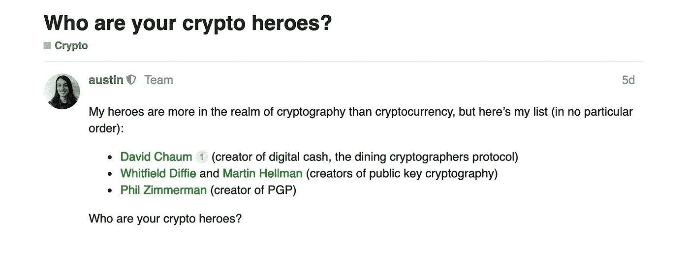
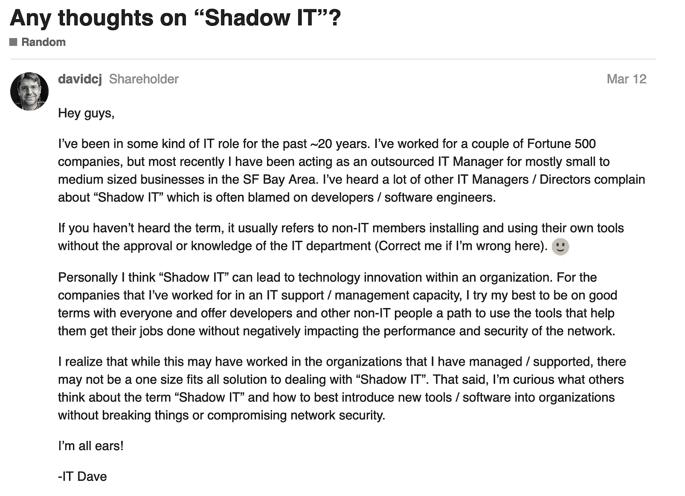
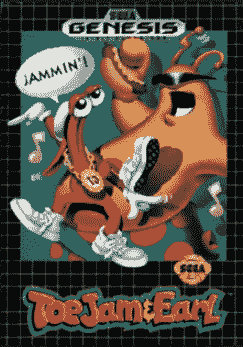

# 影子 IT 让开发者斗志昂扬

> 原文：<https://medium.com/hackernoon/shadow-it-makes-developers-scrappy-d194518c21f9>

## 其他 Sh*t 黑客说:黑客正午社区点击率最高的帖子的汇总([现已公测](https://hackernoon.com/where-hackers-hang-out-c43eb09e175a))

Join the conversation at [http://community.hackernoon.com/](http://community.hackernoon.com/)

在努力成为科技专业人士发表文章的最佳场所的过程中，我们还为科技专业人士创造了一种非常高效的拖延方式——黑客正午社区****，**这是科技行业的虚拟饮水机。**

**如果你还没有开始行动 *(Y U No* [*今天就报名吧*](http://community.hackernoon.com/) *..？)，*以下是我们几个热门类别中最受欢迎帖子的汇总。**

## **/ [加密](https://community.hackernoon.com/c/Crypto)**

# **做空 shitcoins 的最好方法是什么？**

****

**为[贡献者](https://community.hackernoon.com/t/whats-the-best-way-to-short-shitcoins/729/2)[喊出来韩](https://hackernoon.com/@hanyoon)为指引我们:**

> **[gate . io 1](http://gate.io/)
> [bitmax . io 1](http://bitmax.io/)
> Huobi Pro
> Poloniex**
> 
> **都是顶级交易所用屎币来做空的。Bitfinex 也有一些，但他们在一年多的时间里没有增加任何新的保证金交易对。**
> 
> **当然，Bitmex 是行业的最爱，只是不要让 rekt 做空 TRX 100 倍:)**

# **[你用的最多的去中心化 app 是什么？](https://community.hackernoon.com/t/what-decentralized-app-do-you-use-the-most/645)**

*****TL；*博士:****

*   **乳齿象**
*   **大卫·乔姆的[elix sir 项目](https://elixxir.io/)**
*   **感觉.聊天**
*   **公民的**
*   **勇敢的浏览器(一种 dApp w/ BAT 令牌)**
*   **勇敢，网络浏览器**
*   **信号、文本+视频**
*   **斯蒂姆**
*   **周围有什么**
*   **[https://beta.cent.co/](https://beta.cent.co/)**
*   **勇敢的浏览器**
*   **[帕累托。网络](https://pareto.network/about)**
*   **[https://compound.finance/ 1](https://compound.finance/)**
*   **[https://makerdao.com/en/](https://makerdao.com/en/)**

# **[谁是你的秘密英雄？](https://community.hackernoon.com/t/who-are-your-crypto-heroes/1413)**

****

**不要惊慌——聪聪[也获得了提名](https://community.hackernoon.com/t/who-are-your-crypto-heroes/1413)。**

## **/ [产品](https://community.hackernoon.com/c/product)**

# **[你希望在黑客正午 2.0 中看到哪些杀手级特性？](https://community.hackernoon.com/t/what-are-the-killer-features-youd-like-to-see-in-hacker-noon-2-0/68)**

**如果要投票的话，亚瑟·特卡琴科的建议目前领先**

1.  ***编辑日历，能够查看待定文章队列。比如，我的帖子在哪里？***
2.  **某种时事通讯摘要。请查看 ProductHunt 的 TechMemo 或 Sip。**
3.  ***你可以和 ProductHunt 的制作者合作。他们有一个独立的地方，与博客的目标相关。我认为在 HN 出版是很多人的梦想。***
4.  **像 Medium 这样的统计已经有了——但是可能会有更多的统计。**
5.  **某种 API，可能还有 React 组件，这将有助于获取所有作者的文章，并显示带有文章链接的“卡片列表”。(我发现很难在 Medium 上找到我所有的东西，并在我的 Gatsby/Docusaurus 网站上放置链接)**

**在这个帖子里有将近 100 个回复；这真的是众所周知的[产品](https://community.hackernoon.com/c/product)的冰山一角。**

**查看其余部分，并在此发表您的意见。**

## **/ [随机](https://community.hackernoon.com/c/random)**

# **对“影子 IT”有什么想法吗？**

****

# **你最喜欢的老派电子游戏是什么？**

**仅仅怀旧的海报设计就让[这个帖子](https://community.hackernoon.com/t/whats-your-favorite-old-school-video-game/752/3)非常值得你去看看。我个人的最爱:**

************

## **/ [软件开发](https://community.hackernoon.com/c/Software-Development)**

# **[让你抓狂的代码味道或反模式是什么？](https://community.hackernoon.com/t/what-are-the-code-smells-or-antipatterns-that-drive-you-nuts/1214)**

> ***我不太关心代码的美观(基本上是任何代码翻译器或调试器会提出警告的东西)——对我来说，这是很小的事情，以后可以很容易地改变。***
> 
> **我最担心的是类或模块没有清晰明确的职责。如果开发人员不能用简单的术语解释一个类或模块是做什么的(对理解业务领域的人来说)，那么这就是代码味道。如果一个类或模块是高内聚的，那么它的每一部分都应该以一种简单明了的方式联系起来，因此，对于一个不理解底层细节的新开发人员来说，这应该很容易解释。**
> 
> **[-乔纳森·格罗-杜布瓦](https://hackernoon.com/@jonathangrosdubois)**

**[在这里添加你最喜欢的代码味道。](https://community.hackernoon.com/t/what-are-the-code-smells-or-antipatterns-that-drive-you-nuts/1214/4)**

# **一点激励:你在业余时间都在做些什么？**

**黑客正午社区里没有人有时间让一个朝九晚五的人妨碍他们的激情项目。**

**从基于机器学习的 NSFW 探测到老派的角色扮演游戏，[点击这里，从黑客伙伴们正在开发的游戏中获得灵感](https://community.hackernoon.com/t/a-little-motivation-what-are-you-hacking-on-in-your-spare-time/1238/2)。**

**加入话语@[community.hackernoon.com](http://community.hackernoon.com)！**