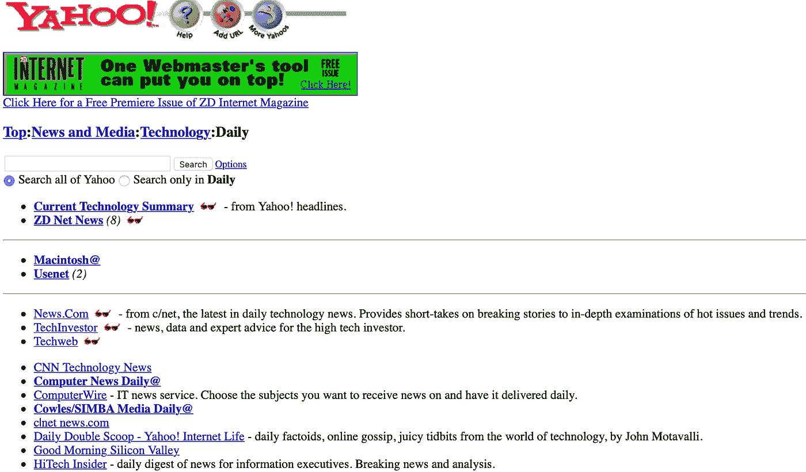

# 购物媒体将电子商务带入 21 世纪

> 原文：<https://medium.com/hackernoon/shoppable-media-catapults-commerce-mikmak-benja-instagram-623e1bc8419a>

互联网鲜为人知的故事之一是由脸书带来的内容分发和访问的主流转变。

这不是一个热门话题——大多数人都会同意这是事实——但这种转变是根本性的，大多数人都没有意识到。

向大众灌输内容的脸书已经不再需要曾经神圣的 NYT.com 主页:主要出版商超过三分之二的流量直接流向内容页面，否定了世界各地主页编辑所做的工作。

脸书大大削弱了 T2 的新闻机构，产生了可疑的暴发户，并控制了新闻馈送算法，塑造了用户的世界观。

这都是因为他们让事情变得简单了。**他们还没有完成:电子商务是下一个目标。**

## 首先，简短的历史课。

在 1995 年拨号上网后，大多数用户遵循同样的流程:进入一个网络目录(像 Jerry 和 David 的万维网指南，后来改名为 Yahoo！)并点击类别和主题来找到由人类管理的网站列表。回想起来，这很容易被称为笨拙，但这是必要的——你不能假设任何给定的企业都有网站。

Ah, 1996.

到 2005 年，网络目录变得过时了，因为你*可以*安全地假设一家新闻媒体或企业——从强大的《纽约时报》到 minescule Caledonia Record——有一个网站。随着这种无处不在，用户流发生了变化:对于商业新闻，人们可以打开浏览器，满怀信心地键入“wsj.com”。

**转换漏斗，从想“我要看商业新闻”到看一篇文章从 7+缩水到 3。**转换漏斗和带宽的提高意味着消费速度增加了几倍。

这是一个巨大的飞跃，但却无法与接下来的十年相提并论。

2007 年，当社交媒体领导者脸书推出脸书页面时，这一火花就产生了。新闻媒体和公司纷纷涌入这个平台，到 2015 年，用户可以放心地假设一个新闻媒体或企业——从强大的《纽约时报》到 minescule Caledonia Record——拥有脸书页面。

**有了*那个*，用户流量又变了:对于商业新闻，你可以打开脸书，知道新闻在等着你。**

没有更多的目录或浏览器。没有搜索内容，甚至没有*打字*。如果用户完成了跟随页面的一次性操作，脸书承诺会让双方保持联系。其他工具也支持类似的行为:消息传递应用程序和电子邮件时事通讯的复兴都是为了将内容直接传递给用户。

**随着这一转变，转换漏斗缩小到 1:看到它，点击它。就是这样。**

内容交付已经取得了*另一个*巨大的飞跃，到 2018 年，近 70%的美国成年人从社交媒体接收大部分新闻。

电子商务没有迈出这一步。

用户可以在许多不同的地方找到《纽约时报》的内容，并以许多不同的方式欣赏它，但当涉及到电子商务时，用户有两个选择:搜索 Amazon.com 的网络目录，或去 JCrew.com 访问 J. Crew 的内容。

***多么 90 后的我们。***

## 电子商务正在迎头赶上。最后。

遵循内容提供商开辟的道路，MikMak 和 Benja 努力缩小电子商务转换漏斗。两家公司都建立了可购物的媒体体验:MikMak 内置于视频，Benja 内置于在线展示广告和原生手机。

Benja 抓住了这个机会，与耐克、巴塔哥尼亚、李维斯和 Lululemon 等主要品牌合作。我们预订了大量的业务，并取得了有意义的结果(销售额)，但相对于电子商务和广告的整体规模来说，这还很小。

> “你在棒球场上准备打一个大满贯，我认为你会，但我认为你在二月挖击球手箱。这位投手还在佛罗里达进行春训。”
> 
> *—某风投，2019 年 1 月*

然后熟悉的事情发生了:脸书出现了。
见见新老板，和老老板一样。

今年 3 月，脸书宣布他们将把本土商务引入 Instagram。这家社交媒体巨头为一次飞跃创造了条件，类似于 2007 年脸书页面在内容分发方面所做的。

行业巨头采用购物媒体意味着我们即将成为主流。在 MikMak、Benja 和 Instagram 之间，消费者将能够在他们在线生活的任何地方完成交易——视频内容、侧栏广告、游戏和社交媒体订阅。

**商业无处不在。**

看起来购物媒体季来了。**面糊上来了。**

[*Andrew j . Chapin*](http://andrewjchapin.com)*是* [*Benja 商业网*](http://benja.co) *的联合创始人& CEO。*