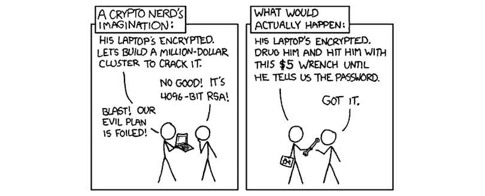
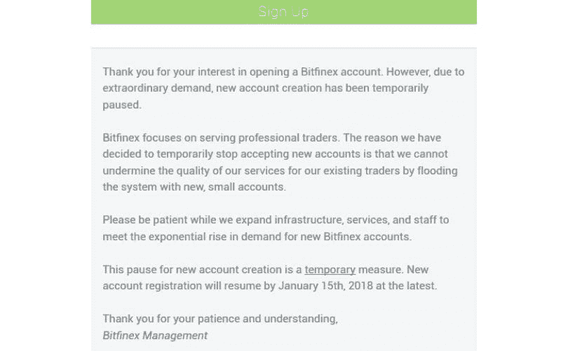
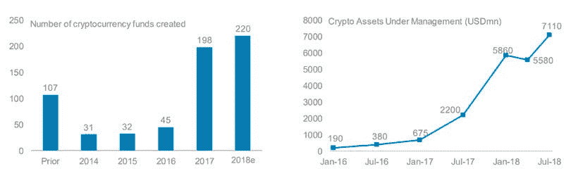
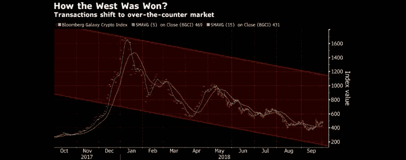
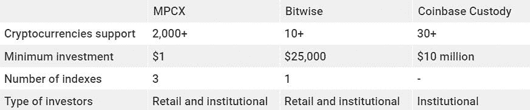
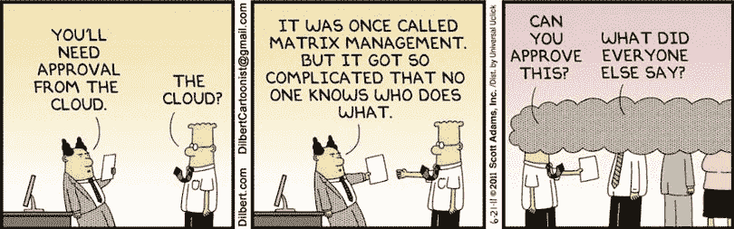

# 金融机构和散户是否应该管理自己的加密货币？

> 原文：<https://medium.com/hackernoon/should-financial-institutions-and-retail-investors-manage-their-own-cryptocurrency-f9cd1b815954>

除了彻底改变支付行业，加密货币注定会让每个人都可以投资。2017 年，是散户最大的投资机会。2019 年，不仅散户投资者数量迅速增加，对冲基金、银行和大型金融机构也在加入这一市场。

所有这些市场参与者应该如何管理他们的数字资产？现在风险很大，因为黑客将机构加密货币基金视为“蜜罐”。他们是否都有足够的资源来独立处理安全需求？

像 [MPCX](https://mpcx.co/?utm_source=hackernoon&utm_medium=article&utm_campaign=1) 、 [Bitwise](https://www.bitwiseinvestments.com/) 和[比特币基地](https://custody.coinbase.com/)这样的公司认为，将加密货币管理外包给能够监督所有安全问题并应用传统财富管理原则以实现利润最大化的专家是最佳选择。

来源:[https://xkcd.com/](https://xkcd.com/)

很难否认，仅在 2018 年，就有价值17 亿美元的加密货币被盗，2019 年的情况可能会更糟，今年上半年已经有12 亿美元被盗。

# 是什么阻止了新投资者加入加密货币市场？

快速回顾一下加密货币市场的资本总额，就会发现仅在一年内就实现了 4，500%的指数级增长；从 2017 年初的 177 亿美元到 2018 年的 8000 亿美元。投资的可能回报会让任何人震惊。

德意志银行全球金融策略师 Masao Muraki、Hiroshi Torii 和徐涛[提到](https://masterthecrypto.com/cryptocurrency-new-asset-class-institutional-investors/)，“尽管机构投资者认识到股票和其他资产估值可能已经进入泡沫区域，但他们忍不住继续冒险。现在，越来越多的机构投资者正在将加密货币视为评估资产价格可持续性的风险承担前沿。”

然而，尽管加密货币投资的回报超过了股票或房地产等其他投资类别，但它也伴随着与管理数字资产的方式相关的额外风险。购买和保护加密货币的过程目前比购买和持有普通股票更难。

无论投资金额是多少，个人或金融机构都必须通过复杂的技术流程，以确保资金在交易期间及之后保持安全。目前，新投资者必须:

*   设置一个钱包，接受他们希望投资的加密货币
*   找一个列出它的交易所
*   参与漫长的验证过程
*   通过受支持的支付方式之一存入资金
*   下正确的购买订单
*   取出他们钱包里新获得的硬币

而这只是购买过程。从这一点来说，适当的安全方法应该到位，以防止恶意方的访问。

[https://steemit.com/bitcoin/@kingscrown/register-to-more-exchanges-more-and-more-are-closing-doors-for-new-users](https://steemit.com/bitcoin/@kingscrown/register-to-more-exchanges-more-and-more-are-closing-doors-for-new-users)

虽然这肯定是可行的，但这一过程的复杂性对寻求加密货币的零售和机构投资者来说是一个重大障碍。

MPCX 的创始人兼首席执行官 Iurii Riabykin 指出:“即使对于更有经验的投资者来说，监督管理多样化的加密资产组合的所有可能问题也可能很快变得难以应对。没有正确的知识或已建立的关系，在漫长的验证过程、缺乏透明度和缓慢的数字化中导航，会大大降低您的获胜机会，尤其是如果您刚刚进入市场。”

随着加密货币吸引更多的市场参与者，对旨在帮助投资者管理其加密投资组合的简单工具的需求也在增加。随着相关投资者需求的增加，新的解决方案已经开发出来。

在这篇文章中，我们精心挑选了一系列项目，这些项目可以满足大多数正在考虑进入加密货币市场的零售和机构投资者的需求。

[MPCX](https://mpcx.co/?utm_source=hackernoon&utm_medium=article&utm_campaign=1) ，一体化金融加密服务解决方案，采用 DLT 技术，提供独特的数字财富管理方法。该平台运用传统财富管理原则为投资者创造价值。在这个数字空间中，它有两个独特的特点:

*   可投资加密指数旨在为希望投资加密货币的用户提供被动管理解决方案。
*   数字智能投资委托(DSIM)使用户能够在几分钟内创建智能、多样化的投资组合。

虽然 MPCX 为投资者提供金融加密服务，但 [Bitwise Asset Management](https://www.bitwiseinvestments.com/) 是一只加密货币指数基金，持有按 5 年稀释市值加权的前 10 种加密货币，并每月进行再平衡。对于那些寻求多样化的加密资产和中等回报的投资者来说，Bitwise 降低了准入门槛。

[https://news.bitcoin.com/institutional-investors-crypto-investments/](https://news.bitcoin.com/institutional-investors-crypto-investments/)

谈到入学要求，[比特币基地托管](https://custody.coinbase.com/)发现自己处于另一个极端。比特币基地通过使用成熟、安全的基础设施来存储和保护金融机构的投资，从而为金融机构提供帮助。他们的服务对任何人开放，但鉴于 10 万美元的启动费和每月 0.01%的资产管理费，我们可以有把握地假设，这并不适合所有人，目前只有大型机构和对冲基金才能负担得起他们的优质服务。

# 机构投资者已经在这里了

尽管市场起伏不定，机构对加密货币的投资仍将稳步增长。全球第五大资产管理公司富达投资公司[调查了](https://www.fidelity.com/bin-public/060_www_fidelity_com/documents/press-release/institutional-investments-in-digital-assets-050219.pdf) 441 家养老金、对冲基金和其他机构投资者对加密货币的参与情况。

其中，22%已经拥有加密货币。这是一个令人印象深刻的数字，因为在 2016 年，拥有任何加密货币的机构比例接近于零。此外，47%的人已经在考虑在未来五年内将数字资产加入他们的投资组合。

机构资金大量涌入。当亿万富翁对冲基金经理迈克·诺沃格拉茨(Mike Novogratz)开始他的加密货币基金时，他将上限设定为 5 亿美元。他的声明是，“这个空间的制度化正在到来。它来得相当快。”

去年，彭博[报道](https://www.bloomberg.com/news/articles/2018-10-01/institutional-investors-are-using-back-door-for-crypto-purchases)对冲基金和捐赠基金等大型买家一直在通过私人交易购买价值超过 1 亿美元的数字资产。除了来自全球散户投资者的数十亿美元，所有这些流入的资金都是额外的。

继之前的[调查](https://www.fidelity.com/bin-public/060_www_fidelity_com/documents/press-release/institutional-investments-in-digital-assets-050219.pdf)之后，目前:

*   18%的受访者使用第三方托管机构
*   13%执行自我监护
*   6%使用非托管交换

无论如何，由于机构必须遵守的法规和法律义务，以及所有外部风险，机构的自我监管不会持续太久。

我们开始考虑存储加密货币的技术过程背后的法律问题，这一事实表明市场正在成熟，因为知识渊博的投资者可以涉足其中。那么，谁来欢迎他们呢？

[https://www.bloomberg.com/news/articles/2018-10-01/institutional-investors-are-using-back-door-for-crypto-purchases](https://www.bloomberg.com/news/articles/2018-10-01/institutional-investors-are-using-back-door-for-crypto-purchases)

资产管理工具在更传统的金融市场已经很常见。为加密资产提供这种服务的公司的出现可以被认为是市场发展的下一个自然步骤。

Bitwise Asset Management 是一种基金，除了管理之外，还代表客户进行投资。在它成立后的四个月里，已经有[报道了](http://www.businessinsider.com/cryptocurrency-fund-bitwise-up-by-50-in-4-months-2018-3) 51%的回报率。令人印象深刻！但那是去年的事了。

今年，投资者希望也需要更多的控制。他们需要一个托管解决方案，具有适当、安全的基础设施，符合监管机构规定的安全标准。

# 谁在为新投资者服务？

当然，最先提出令人信服的解决方案的是交易所。他们已经为自己的平台准备了类似的基础设施，因此将它作为第三方服务进行扩展是很自然的事情。

这就是为什么全球最大的比特币经纪商比特币基地推出了比特币基地托管公司，这是一家机构级的合格托管公司，为离线持有的资产提供托管服务。

正如[比特币基地公关部总监 Elliott Suthers 所说](https://cointelegraph.com/news/major-us-crypto-exchange-coinbase-launches-otc-crypto-trading-for-institutional-investors)，“机构是我们增长最快的业务之一，机构客户目前正在推动我们的增长。我们目前服务于广泛的机构，一端是资产发行者和加密基金，另一端是大学捐赠基金和养老基金。”

对于那些想要品尝加密货币收益的人来说，按位是一种简单的方式。对于那些负担得起的人来说，比特币基地托管是一个顶级的解决方案。但是对于任何层次的散户和机构投资者来说，什么是一体化的解决方案呢？

我们相信 [MPCX 平台](https://mpcx.co/?utm_source=hackernoon&utm_medium=article&utm_campaign=1)是一个完美的工具，它为加密货币提供了更容易的进入途径和更好的管理解决方案，而不是专属于特定的投资者群体。MPCX 是一个区块链驱动的平台，它把所有的金融加密服务放在一个地方。

投资者可以在平台上直接在一个集中或分散的交易所买卖大范围法定货币的加密货币。

从监管的角度来看，MPCX 平台是控股公司，在英格兰和威尔士注册为公司。该平台作为一家子公司在直布罗陀运营，利用当地银行业务处理和结算客户的法定货币和加密货币交易。

它提供三种加密可投资指数作为被动管理解决方案，以及数字智能投资委托，可以在五分钟内从数千个选项中创建智能、多样化的投资组合。

MPCX 平台与区块链技术完全集成，因此有一个 XDMC 令牌将用于支付平台内的服务。任何想尝试一下的人都可以获得交换的演示。不需要真实的数据或资金。

# 重大的责任

随着加密货币领域基础设施的进一步发展，投资兴趣似乎也在增加。散户投资者的数量已经在快速增长，预计机构将在未来五年提供新的资本流入。它们的存在可以带来更多的流动性，并推动加密货币的进一步采用。

[https://dilbert.com/](https://dilbert.com/)

现在评估机构资金在这一领域的确切影响还为时过早，但很明显，他们已经在这里了，他们需要一条清晰的路径来进入生态系统，以及一种简单而更方便的方式来管理他们的投资。

通过支持和推广加密资产管理平台，加密货币市场将最终向更广泛的受众开放。下一代数字资产管理工具可能是加密货币投资网关的整合。