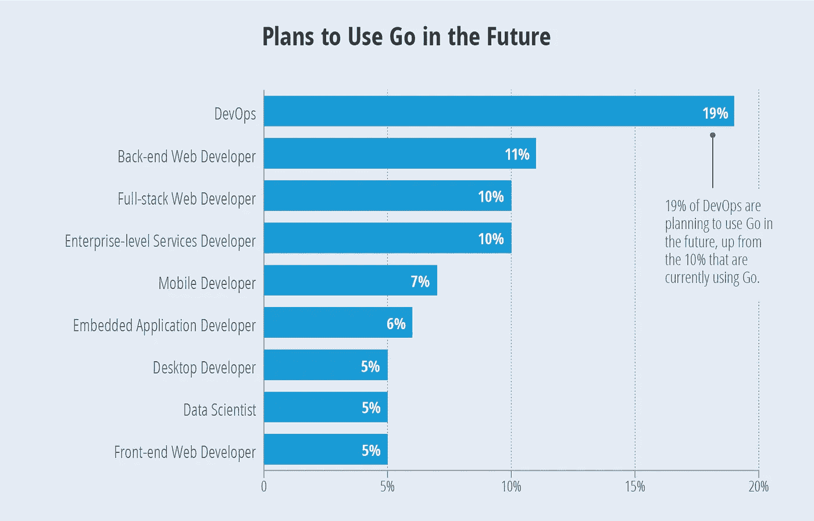
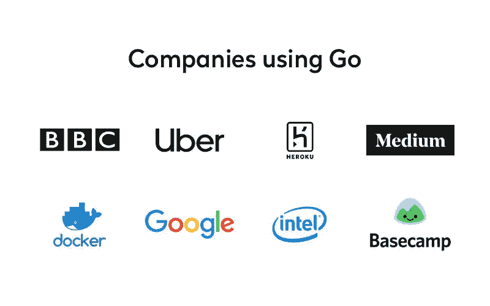

# 我应该去吗？使用 Go 编程语言的利与弊

> 原文：<https://medium.com/hackernoon/should-i-go-the-pros-and-cons-of-using-go-programming-language-8c1daf711e46>

对于大多数人来说，谷歌推出他们自己的 T2 编程语言并不奇怪。该公司一直在积极地进入几乎所有可以想象的技术领域——通常情况下，他们最终会彻底改变他们希望开发的领域。自 Go 投入生产以来已经过去了十多年，虽然它可能还没有 Python 和 JavaScript 等语言的安装基础，但谷歌的专有语言已经提供了很多。在你决定学习这门语言之前，以下是你需要考虑的一切。

## ***Pro:易用性***

虽然 Go 可能不如 JavaScript 或 Python 流行，但它确实有一个重要的共同点:非常容易理解。语法很简洁，新手也很容易理解，也没有太多复杂的函数需要学习。但是这种简洁明了的语法给不仅仅是新手带来了好处。这是因为它也是一种易于阅读的语言，这使得它成为可能涉及多个编码人员迭代彼此代码块的遗留代码的最佳选择。与 C 风格语言非常相似，这意味着对于精通 C++或 C#的程序员来说，这是一门简单的语言。

## 反对意见:有时过于简单

Go 的主要优势之一[也是它最大的弱点之一。Go 可能是一种容易掌握的语言，但是它缺乏通用性。市场上一些最热门的语言以其复杂性而自豪。像 Swift 和 Haskell 这样的选择可能更难学习，但它们通过打包大量智能抽象来找到自己的粉丝，这些抽象允许编码人员以更少的资源实现复杂而聪明的结果。通过剥离这种高级功能，Go 也牺牲了范围。](https://yalantis.com/blog/golang-vs-nodejs-comparison/)

## Pro:智能标准库

Go 用户无需导入或学习复杂的二级库就可以完成很多工作。Go 附带的标准库非常复杂，但又不至于让人不知所措，它降低了因函数名冲突而出错的风险。以切片为例。这是 Go 对编程世界最聪明的补充之一，它们为将数据结构合并到代码块中提供了一种更简单的方法。许多在其他语言中需要复杂变通方法的任务，可以通过 Go 接口用一行代码完成。

## 缺点:它仍然是一门年轻的语言

围棋很有前途，但它仍处于青春期，这意味着在许多方面它无法与它的兄弟姐妹竞争。Go 的原生库可能设计巧妙且高效，但它正在与 Java 等语言竞争，这些语言由大量内置代码和由热情参与的社区创建的新库家庭工业提供支持。虽然 Go 最终可能会赶上它的同行，但在库支持方面，它还有很长的路要走。

## 优点:强大的内置安全性

[简单的代码一般比复杂的代码](https://nvisium.com/blog/2014/11/26/developing-secure-applications-with.html)更安全，Go 绝对是这种情况。作为一种静态类型的语言，您不必担心复杂和难以识别的错误，这些错误来自于更多动态语言中存在的大量变量类型。然后是包含的垃圾收集器，它有助于防止代码中的内存溢出。虽然缺乏泛型意味着编码人员需要更加勤奋地运行测试，但是识别错误比在许多替代方案中更容易，并且这通常促进了编写干净代码的更彻底的方法。

## 缺点:缺少虚拟机

虽然不将 Go 基于虚拟机的决定是一个有意识的选择，并且它具有一些为易用性而设计的独特优势，但这里的坏处很可能大于好处。今天如此多的流行语言都是基于虚拟机的，这是有原因的。虚拟机提供了更高效的代码，这意味着 Go 文件的大小通常会让那些与之竞争的编程语言相形见绌。虽然谷歌在过去几年里一直在慢慢提高这种语言的效率，但你仍然可以期待用 Go 编写的更复杂的程序会快速啃噬你的内存。

## 利:谷歌在行业中的突出地位

谷歌短期内不太可能去任何地方。在不久的将来，他们不太可能在通用搜索引擎领域找到挑战者，而且他们已经设法将微软推到一边，成为办公室应用程序的卓越和无可挑战的统治者。虽然谷歌经常对他们的大型和雄心勃勃的产品失去兴趣(见谷歌眼镜或社交媒体平台的广阔墓地)，但看起来他们不会很快放弃 Go。可以肯定的是，在很长一段时间内，Go 将在谷歌的架构中扮演重要角色。

## 缺点:它还没有找到自己的位置

[Go 是谷歌](/google-design/what-i-learned-from-interviewing-and-receiving-offers-from-google-two-times-e1d1a7b715bc)设计的，用来完成谷歌程序员需要更高效完成的一些特定任务。如果你在谷歌工作，这使得围棋编程成为一项非凡的技能，但它仍未能在更广阔的世界中找到自己的名字。JavaScript 已经成为复杂前端编程的流行语言，Python 也在数据可视化和分析领域找到了一席之地，但 Go 还没有很好地证明它在更广泛的编程生态系统中的位置。再加上其他公司对投资一种本质上属于竞争对手的语言会犹豫不决，很明显 Go 很大程度上可能仍然是谷歌工程师使用的谷歌语言。

## Pro:智能文档

虽然 Go 是一种读写都非常简单的语言，但这并没有消除编写程序文档的需要。标准政策已经到位，用于记录所有包含的函数和库，当您忘记将文档放置到位时，Google 的语言甚至会提醒您。对于年轻的程序员来说，这是一个特别有价值的资产，他们很容易在早期就陷入草率的文档习惯。

## 缺点:没有 GUI 库

Go 是单页应用的绝佳选择。不过， [Go 没有 GUI 库](https://hackernoon.com/how-to-add-a-gui-to-your-golang-app-in-5-easy-steps-c25c99d4d8e0)，这意味着你需要大量的时间和知识来将一个库连接到你的应用程序，而不是像 Python 或 Java 那样使用原生解决方案。

没有一种全面完美的编程语言。语言能做的最好的事情就是希望比周围所有的语言做得更好。对于围棋来说，最明显的优势是显而易见的。它的易用性，加上它在谷歌的高采用率，使它成为一种有前途的年轻语言。但它不会适合每个项目或每个程序员。在将它作为一门新的语言来学习或试图将其融入您组织的基础设施之前，请仔细考虑它的优点和缺点。