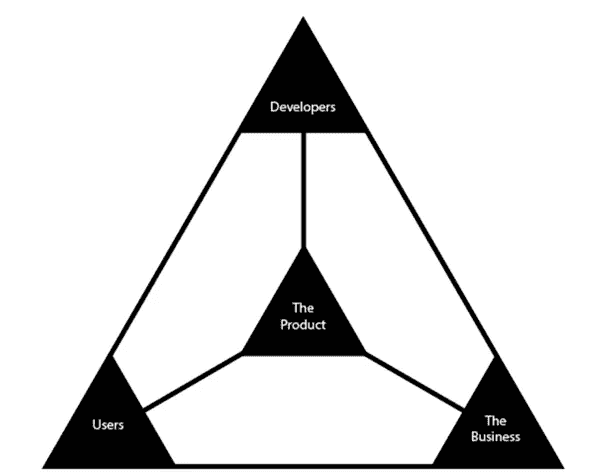
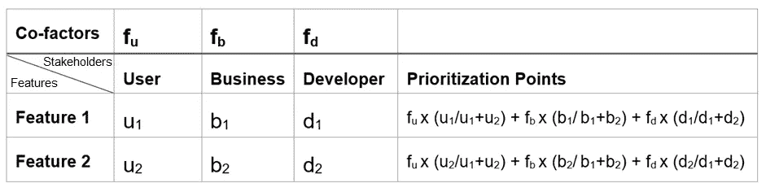
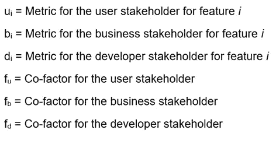
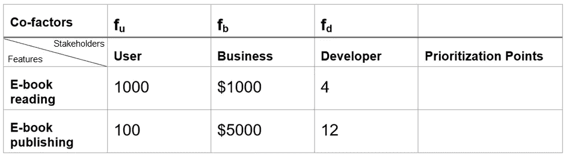
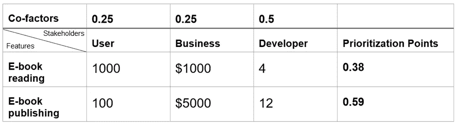
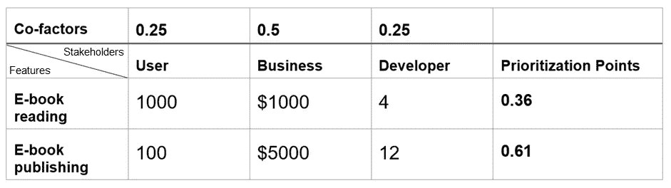
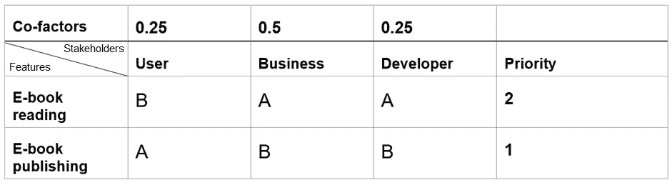

# 产品经理的简单优先排序技术

> 原文：<https://medium.com/hackernoon/simple-prioritization-technique-for-product-managers-4ccfff20b2c7>

作为产品经理的一个重要任务就是分清主次。对于产品经理来说，决定做什么(以及什么时候做)是一项至关重要的工作。

这篇文章不是关于优先化的重要性，也不是为什么优先化对于产品经理来说是一个长期的挑战。

这篇文章讨论了一个通用框架，产品经理可以很容易地应用这个框架来确定优先级。

有许多技术和框架可用于优先级排序，如**赖斯框架**、**莫斯科技术**、**价值与复杂性象限**、**卡诺模型**等。但是有些情况下，我们没有足够的数据来使用特定的框架，或者特定的框架本身并不完全适用。我们倾向于在框架中寻找答案，而不是使用框架。这让我开始寻求一个简单的通用优先级框架，它可以在大多数场景中使用。

为了达到这一点，我回到绘图板，从软件产品环境中的基本元素开始。作为参考，我看了丹尼尔·施密特的[产品管理三角](/@danielfschmidt/introducing-the-product-management-triangle-4a5b9b02532c)，其中谈到了产品的三个主要利益相关者:*用户、企业和开发者。*

Figure 1: The Product Network — By Daniel Schmidt

因此，在确定优先级时，我们需要考虑这三个利益相关方。

# **步骤 1:为每个利益相关者选择一个指标**

第一步是选择代表每个利益相关者的指标。现在，这个度量标准可能会因情况而异，但是对于需要优先化的特性的涉众来说，这是很常见的。

1.  **用户:**对于利益相关方*用户*，选择一个衡量特性对用户影响的指标，例如 NPS、平均访问时间、粘性比率、应用商店排名、留存率等。
2.  **业务:**对于利益相关方*业务*，选择一个衡量对业务目标影响的指标，如收入、MAU/DAU、每用户平均收入、平均订单价值、客户终身价值等。
3.  **开发人员:**对于利益相关者*开发人员*，选择一个度量标准来衡量开发人员的努力，例如复杂性、实现的容易程度、故事点等。

# **第二步:为每个利益相关者分配一个辅助因素**

下一步是为每个利益相关者分配一个辅助因子，这取决于该利益相关者对产品的整体愿景、当前目标和目的的贡献。假设目标是尽早将产品推向市场以获得先发优势，那么开发者利益相关者的协因子将是最重要的。

# **第三步:计算优先级点数**

最后一步是将每个因素乘以利益相关者指标，并计算优先顺序点。**根据当前目标，可以根据更高或更低的优先级来决定优先级**

Figure 2: The Prioritization Matrix

在哪里，

> **请注意，度量值可以是精确值，也可以是相对值。重点应放在优先考虑功能上，而不是获得优先考虑点的值**

让我们举一个简单的例子。

假设我们想要建立一个电子书应用程序，允许用户阅读和发布电子书。

功能 1:电子书阅读——允许用户通过下载电子书来发现和阅读电子书的功能

功能 2:电子书出版——该功能允许用户在旅途中撰写回忆录，并最终将其编译为电子书，并允许在平台上出版电子书

让我们为每个利益相关者选择一个指标

用户:预期的用户数量

业务:预期收入(美元)

开发者:故事点

# 绝对优先级

优先级矩阵如下所示:

Figure 3: The prioritization matrix for the case

假设当前的目标是尽早将应用带给用户。因此，开发涉众在优先级决定中起着最重要的作用。

Figure 4: The prioritization matrix if the goal is to take the market earliest

在这种情况下，**优先级越低，功能的优先级越高。因此，我们将首先建立电子书阅读功能。**

现在假设当前的焦点是收入。因此，业务涉众在优先级决定中起着最重要的作用。

Figure 5: The prioritization matrix if the goal is higher revenue

在这种情况下，**优先级越高，功能的优先级越高。**因此，我们将首先构建电子书出版功能。

# 相对优先级

有时，由于缺乏可用数据或指标本身的性质等原因，很难用绝对值来定义指标。在这种情况下，仍然可以使用优先化矩阵，但是可以计算相对优先级，而不是计算优先化点。让我们以上面的例子为例

Figure 6: The prioritization matrix with relative metrics

这里 A 表示较高，B 表示较低。由于当前的目标是更高的收入，业务利益相关者的贡献最大，因此电子书出版功能更为重要。

> **确定优先级的最简单方法是记住在构建该特性时对产品的每个利益相关者的影响；总体目标/目的以及每个利益相关方实现该目标的促成因素。**

我使用这种技术已经有一段时间了，令人惊讶的是，它对我几乎所有的用例都有效。如果你觉得这项技术有用，请留下你的评论。如果您有任何反馈，请不要隐瞒，以使这项技术变得更好、更有用。