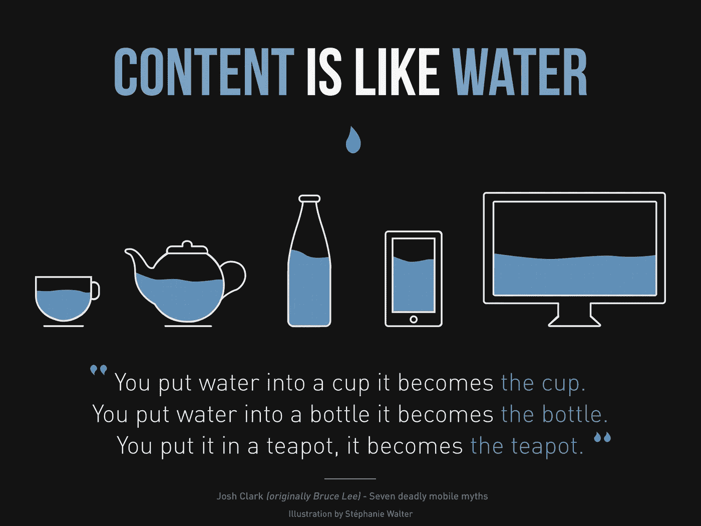
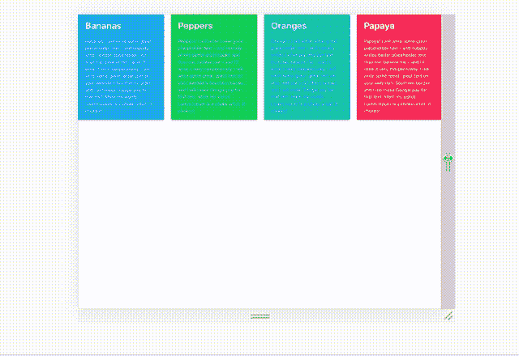
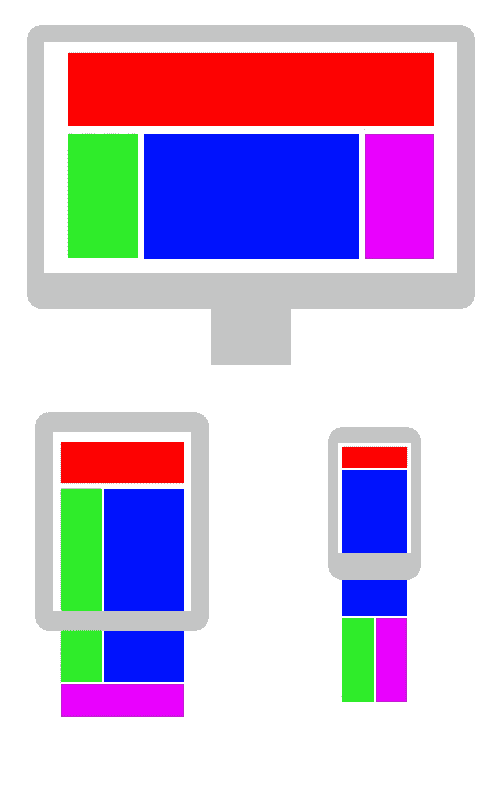

# 使用 React 挂钩简化响应布局

> 原文：<https://medium.com/hackernoon/simplifying-responsive-layouts-with-react-hooks-19db73893a7a>



By Stéphanie Walter — [https://blog.stephaniewalter.fr/en/download-illustration-content-is-like-water/](https://blog.stephaniewalter.fr/en/download-illustration-content-is-like-water/)

自从 React 16.8 发布以来，我一直喜欢使用[钩子](https://hackernoon.com/tagged/hooks)来创建可组合和可重用的逻辑，并用显式生命周期方法编写更少的类组件。这不仅会带来更愉快的开发体验，而且(在我看来)会带来可读性更好的代码库。

今天我将介绍几个钩子，并用它们来构建一个简单的响应布局。使用上下文 API，我们可以确保所有组件都可以访问最新的窗口维度，而不需要依赖生命周期来附加和清理事件侦听器。

## 成品



v responsive

完成的代码可以在 [github](http://github.com/pdeona/responsive-layout-hooks) 上找到。

## 第一步

首先，我们将用`create-react-app`搭建一个新的 react 应用，并添加精彩的`bulma` css 库:

```
$ create-react-app my-responsive-app
$ cd !$
$ yarn add bulma node-sass
$ yarn start
```

入门到此为止。我们将为一些好看的组件使用`bulma`，但是我们将使用 React 和 JS 处理所有的响应设计。

## 关于响应



Handling different device sizes is pretty important from what I hear.

什么是响应式网页设计？根据互联网:

> 响应式网页设计 ( **RWD** )是一种[网页设计](https://en.m.wikipedia.org/wiki/Web_design)的方法，可以让网页在各种设备和窗口或屏幕尺寸上呈现良好
> 
> —维基百科

好吧！这似乎是我们可以在 CSS 中处理的事情，使用相对单位和媒体查询，对吗？

嗯，是也不是。大多数时候，如果工作只是简单地在页面上安排内容，CSS 可以处理这项工作。然而，有时你可能想根据页面大小改变渲染行为，为此，你几乎肯定需要一些 Javascript(或其他黑魔法)。

## 反应过来道

所以 React 就是创建可重用的表示逻辑(组件)并使用它们来组成视图。现在我们有了钩子，我们实际上可以进一步简化这种组合:钩子允许我们将某些行为(通常由多个钩子组成)封装到函数中，这些函数直接集成到 React 的渲染器中(使用新的`React Fiber`，我们不会在这里深入讨论)，以使用它们自动更新组件。

## 那又怎样？

所以，这个老东西(`/clap`如果你已经在你的一个 React 应用中写了这个):

```
class NavBar extends Component {
  state = { open: false }

  setOpen = open => this.setState({ open }) render() {
    return (this.state.open ?
      <NavMenu /> :
      <HamburgerButton onClick={() => this.setOpen(true)} />
    )
  }
}
```

现在已经变成了:

```
function NavBar() {
  const [open, setOpen] = useState(false)
  return (open ?
    <NavMenu /> :
    <HamburgerButton onClick={() => setOpen(true)} />
  )
}
```

如果这还不算什么，你可以在这里看看人们用钩子做的一些很酷的东西:[https://codesandbox.io/react-hooks](https://codesandbox.io/react-hooks)

关键是，钩子很好。我们不需要输入太多，而且我们几乎再也不用担心`componentDidMount/componentDidUpdate/setState`或者类属性提议的状态(谢谢 babel)。

现在我们知道了什么是响应式网页设计(某种程度上)和钩子(也是某种程度上)，让我们用它们来做点什么吧！首先，让我们实现我们的基本构建块(对于本文):组件`ResponsiveLayout`。

首先，我们将创建一个很好的旧功能组件(在`src/components/ResponsiveLayout/index.js`中)，它接受三个道具:`renderDesktop`、`renderMobile`和`breakpoint`。

```
import { useState, useEffect } from 'react'const ResponsiveLayout = ({ breakpoint, renderMobile, renderDesktop }) => {
  const [width, setWidth] = useState(window.innerWidth)
  useEffect(() => {
    const handleResize = () => {
      setWidth(window.innerWidth)
    }
    window.addEventListener(‘resize’, handleResize)
    return () => { window.removeEventListener(‘resize’, handleResize) }
  }, [])
  return (width > breakpoint ? renderDesktop() : renderMobile())
}
```

我们只是在创建组件时读取窗口的宽度，并使用`useState`钩子存储它，然后在我们的`useEffect`钩子中建立一个事件监听器。

## 使用状态

`useState`允许我们拥有有状态的功能组件！你调用`useState(initialValue)`，它返回一对`[state, setState]`。因为它返回一个数组而不是一个对象，所以您可以随意命名这些引用。最重要的是，当您使用从 React DOM 返回的`setState`函数时，`useState`挂钩到 React DOM 并触发呈现，因此它的工作方式就像`this.setState`对类组件的工作方式一样。

## 使用效果

`useEffect`通常会在每次组件重新渲染时运行它的代码，但是它接受第二个参数，一个变量数组，通知`useEffect`它应该只在数组内的值改变时才重新运行。当提供一个空数组时，它将永远不会重新运行，所以它的行为完全像`componentDidMount`！如果需要的话，`useEffect`的返回值应该是一个清理函数，这样它就可以在效果重新运行或者组件从 DOM 中删除之前运行。这里我们指定了一个匿名函数，它将在卸载这个组件时删除事件监听器(听起来很熟悉吧？这就是我们在`componentWillUnmount`中一直在做的事情。

这看起来很好，但是如果页面上有多个地方需要基于断点进行渲染，会发生什么呢？我们不应该在每次安装这些组件时都为同一个事件设置新的事件监听器，特别是因为我们只有一个窗口大小调整监听器。

## 输入使用上下文

钩子让事情变得更好的一个方法是使用上下文 API。以前，使用上下文需要使用消费者和提供者组件，并在任何需要访问值的组件中使用消费者。这导致开发人员创建更高阶的组件来提供上下文作为道具(例如，`react-redux`的`connect`)或简单的非常冗长的代码。现在，有了`useContext`，我们不再需要使用`Context.Consumer`组件让孩子们从上下文中意识到价值。

让我们使用上下文和应用程序范围的`WindowDimensionsProvider`重写上面的组件。

在`src/components/WindowDimensionsProvider/index.js`中:

```
import React, { createContext, useContext, useState, useEffect } from 'react'const WindowDimensionsCtx = createContext(null)const WindowDimensionsProvider = ({ children }) => {
  const [dimensions, setDimensions] = useState({
    width: window.innerWidth,
    height: window.innerHeight,
  })
  useEffect(() => {
    const handleResize = () => {
      setDimensions({
        width: window.innerWidth,
        height: window.innerHeight,
      })
    }
    window.addEventListener(‘resize’, handleResize)
    return () => { window.removeEventListener(‘resize’, handleResize) }
  }, [])
  return (
    <WindowDimensionsCtx.Provider value={dimensions}>
      {children}
    </WindowDimensionsCtx.Provider>
  )
}export default WindowDimensionsProvider
export const useWindowDimensions = () => useContext(WindowDimensionsCtx)
```

这个组件应该在`src/App.js`中被调用，就像这样:

```
import React from 'react'
import Content from './components/Content'
import WindowDimensionsProvider from './components/WindowDimensionsProvider'
import items from './data.json'
import 'bulma/css/bulma.css'*const* App = () *=>* (
  <WindowDimensionsProvider>
    <div *className*="App">
      <Content *items*={items} />
    </div>
  </WindowDimensionsProvider>
)*export* *default* App
```

注意:在现实世界的应用程序中，你应该*也*写一个高阶组件，用于类组件；请在此处查看示例实现[。](https://github.com/pdeona/responsive-layout-hooks/blob/master/src/components/withWindowDimensions/withWindowDimensions.js)

不要担心`Content`和`items`，我们稍后会谈到它们。重要的是，`Provider`组件在应用程序的渲染树中比任何想要从其`Context`中读取数据的组件显示得更高。(这很重要，以便 React 知道提供哪个上下文值，以防您的应用程序中呈现同一类型`Provider`的多个实例。)

通过这样做，我们确保了以下几点:

*   页面上只有一个活动的“调整大小”事件侦听器
*   只要 React 正在呈现我们的应用程序组件，它就会保持活动状态
*   我们的应用程序中的所有组件(这里只有`Content`组件)都可以访问 WindowDimensionsProvider 的上下文

设置好这个管道后，让我们重写我们的响应式布局处理组件:

```
import { useWindowDimensions } from '../WindowDimensionsProvider'const ResponsiveLayout = ({ breakpoint, renderMobile, renderDesktop }) => {
  const { width } = useWindowDimensions()
  return (width > breakpoint ? renderDesktop() : renderMobile())
}
```

哇！我们不仅有了一个性能更好的实现(因为每个实例都不必设置/拆除事件侦听器)，而且组件中发生的事情也少得多。从语义上来说，每一行代码都完美地描述了它在做什么:

*   使用窗口尺寸获得宽度。
*   如果宽度大于断点，则呈现桌面视图。否则，渲染移动视图。

非常简单。

现在我们有了这个工具，让我们用它来做一个响应式布局。

## 需要更多内容

因此，让我们建立我们的两个布局。对于我们的移动视图，我们将呈现一个选项卡式视图:

```
*import* React *from* 'react'
*import* TabbedView *from* './TabbedView'*const* MobileView = ({ items }) *=>* (
  <div *className*='container box'>
    <TabbedView *items*={items} />
  </div>
)*export* *default* MobileView
```

对于 TabbedView，我们将使用`useState`来跟踪活动选项卡，这样它就可以接收正确的样式，并且我们知道在内容框中呈现什么。

```
*import* React, { useState } *from* 'react'*const* TabbedView = ({ className, items, renderItem }) *=>* {
  *const* [active, setActive] = useState(0)
  *return* (
    <div *className*='tabs-container'>
      <nav *className*='tabs is-centered'>
        <ul>
          {items.map(({ title }, idx) *=>* (
            <li
              *className*={idx === active ? 'is-active' : ''}
              *key*={title}
            >
              <a *onClick*={() *=>* setActive(idx)}>{title}</a>
            </li>
          ))}
        </ul>
      </nav>
      <div>
        <p *className*='content'>
          {items[active].content}
        </p>
      </div>
    </div>
  )
}*export* *default* TabbedView
```

在这里，我们简单地在顶部(在一个`nav`内)为选项卡设置一个容器，并根据活动选项卡呈现内容。

对于桌面，我们将为每个项目提供自己的磁贴。

```
*import* React *from* 'react'
*import* Tile *from* './Tile'
*import* { useWindowDimensions } *from* '../WindowDimensionsProvider'*const* DesktopView = ({ items }) *=>* {
  *const* { width } = useWindowDimensions()
  return (
    <div
      *className*={‘tile is-ancestor ‘
        .concat(width < 1088 ? ‘is-vertical’ : ‘’)}
    >
      {items.map((item, idx) *=>* (
        <Tile
          *key*={item.title}
          {...item}
        />
      ))}
    </div>
  )
}*export* *default* DesktopView
```

我们的桌面视图甚至还可以处理宽度，只需要很小的改变(比如添加一个类名)，而不会变得太复杂。

我们的瓷砖只有几格宽:

```
import React from 'react'const Tile = ({ title, content }) => (
  <div className='tile is-parent notification box'>
    <div className='tile is-child'>
      <p className='title'>{title}</p>
      <span className='content'>{content}</span>
    </div>
  </div>
)export default Tile
```

在`src/Content/index.js`中，我们将为响应式布局编写一个基本的包装器:

```
import React from 'react'
import ResponsiveLayout from '../ResponsiveLayout'
import MobileView from './MobileView'
import DesktopView from './DesktopView'*const* Content = ({ items }) *=>* (
  <ResponsiveLayout
 *breakPoint*={767}
 *renderDesktop*={() *=>* (
      <DesktopView *items*={items} />
    )}
 *renderMobile*={() *=>* (
      <MobileView *items*={items} />
    )}
  />
)*export* *default* Content
```

## 包扎

现在我们已经定义了我们的`Content`组件，我们只需要一些数据来呈现。在`src/data.json`中，我们可以创建一些占位符数据，看看我们目前做得如何:

```
[
  { title: "Bananas", "content": "Bananas! I will write some great placeholder text – and nobody writes better placeholder text than me, believe me – and I’ll write it very inexpensively. I will write some great, great text on your website’s Southern border, and I will make Google pay for that text. Mark my words. Lorem Ipsum is a choke artist. It chokes!" },
... more data
]
```

一切就绪后，我们应该能够通过调整窗口大小来确认视图从选项卡式视图切换到一组平铺视图。

我希望这个演练已经展示了在 React 应用程序中使用钩子的一些方法。以下是我最近在应用程序中使用钩子的一些好方法:

*   用`IntersectionObserver`创建一个`OnScrollIntoView`组件
*   创建可重用的动画组件(使用神奇的`react-spring`包)
*   构建一个延迟加载的图像组件，用于在慢速连接上呈现图像

本指南到此为止！如果你喜欢这篇文章，如果你想让我写些别的东西，或者如果你有问题，请在评论中告诉我。