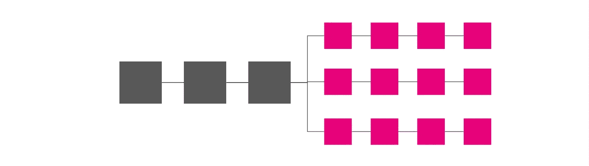
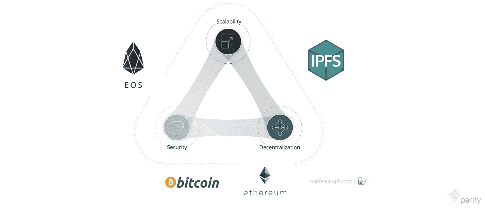
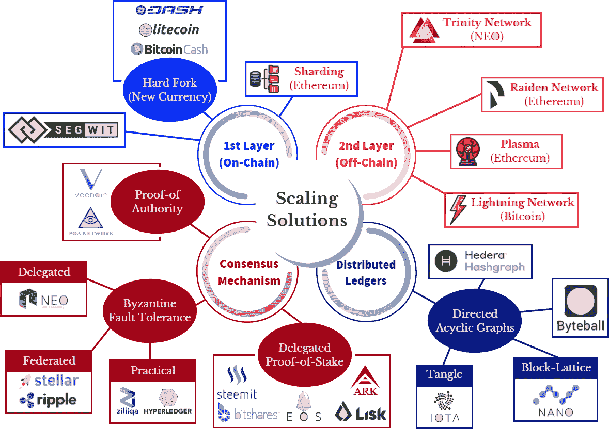
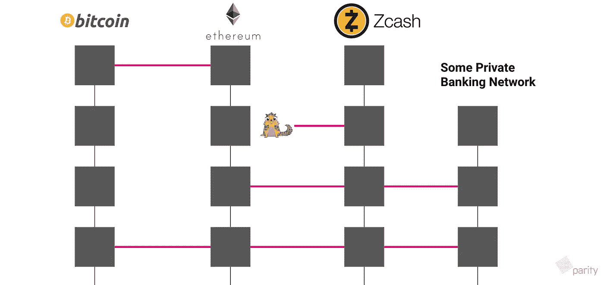
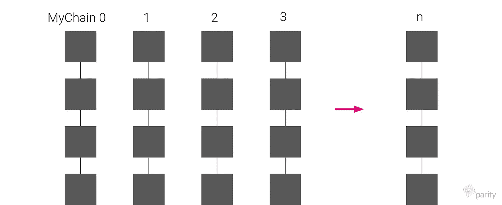
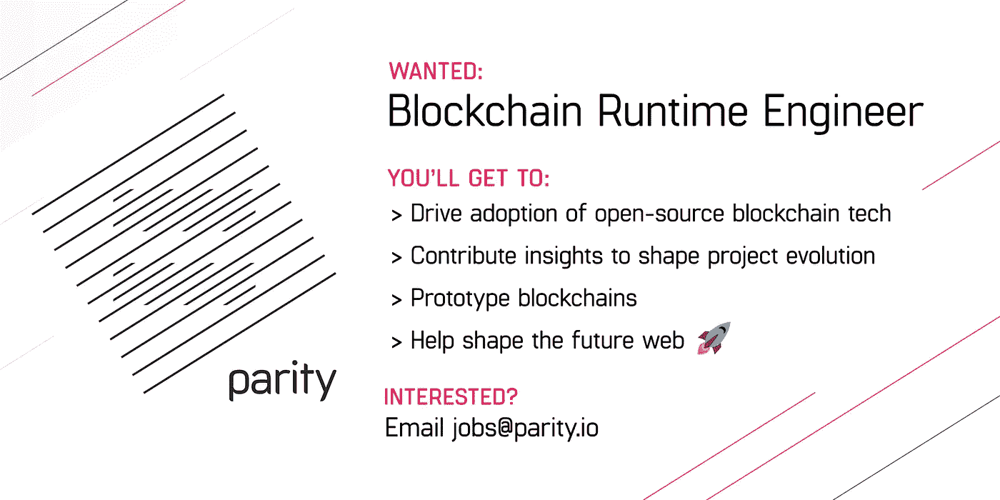

# 简单解释:区块链可扩展性解决方案——过去、现在和未来

> 原文：<https://medium.com/hackernoon/simply-explained-blockchain-scalability-solutions-past-present-and-future-1bc4d5c309b6>

## 以及波尔卡多特& Substrate 如何融入这个生态系统

我最近在 Cogx 做了一个关于区块链如何扩展的演讲。在那里，我们还讨论了 Polkadot 如何适应未来的生态系统，在这个生态系统中，许多区块链正在规模化经营。

本着同样的精神，本帖转述:

*   **区块链缩放解决方案简史**
*   **波尔卡多特&基质在这个生态系统中的作用**
*   **Polkadot &基板的第 1 层和第 2 层缩放溶液**

*注意:许多更好的文章已经讨论了区块链缩放问题。如果这个题目是国外的，建议在这里阅读 Crypto Canon 的* [*缩放入门*](https://a16z.com/2018/02/10/crypto-readings-resources/#scaling) *。*

*注意:我在这篇文章中的观点不代表雇佣我的公司的观点。欢迎反馈和改进建议。*

# 攀登区块链的简史

当比特币在 2009 年首次推出时，很明显，在设计上，它以交易速度为代价换取了去中心化和安全性。

每个块包含大约 1mb 的事务。制作每个新积木大约需要 10 分钟。又过了 45-60 分钟，你才确定你的交易通过了。

> 比特币去中心化愿景背后的哲学推动了定义工作证明的权衡。10 分钟的延迟和较小的数据块大小是强制约束，使得在加德满都的笔记本电脑上运行的节点有机会找到数据块。
> 
> 您希望任何人都有可能克服网络延迟和旧规范，从而能够维护网络的完整性。

**关键是我们通过确保*任何人都可以处理交易*实现了去中心化&安全性。**

这限制了我们可以要求网络处理的事务数量。比特币的目标是每秒 20 次交易，实际上达到了约 4 次交易。

## 通过简单的参数调整进行缩放

自然，第一个可伸缩性解决方案家族是围绕这样的想法发展起来的:我们可以在每个块中填充更多的事务。

Bigger blocks! Smaller transaction sizes!

要做到这一点，我们可以简单地让块更大。或者，我们可以减少每笔交易。

**这种实现的例子**是莱特币和比特币现金，它们分别从比特币硬分叉为较小的交易和较大的区块。实际上，这些努力产生了 2–10 倍的 tps 优化。

**这些扩展解决方案的根本问题**是每个变化都需要一个硬分叉。这要求社区团结起来支持新连锁店，随后导致[有限采用](https://thenextweb.com/hardfork/2019/01/17/bitcoin-cash-block-size/)。在确保去中心化的同时，我们可以在多大程度上调整这些刻度盘也有一个实际的上限..

## **通过链外计算进行缩放**

下一轮的解决方案是认识到并非所有的事务都同等重要。

例如，处理一份土地契约协议可能比请朋友吃饭更重要。

许多交易类型，如小额支付，可以离线处理。主链可以是沉降层。例如，您可以在一个状态通道或一个侧链中以您希望的速度处理 20k 事务。然后，在链上批量验证它们，只需一次交易[如下图]。

Transactions can be processed off-chain and then reconciled on-chain

在链外做事情减少了主链上的计算和存储负载。同时，随着时间的推移，它仍然为您提供了交易的链上协调的好处。

**这种实现的例子包括**闪电网络，比特币的非链交易计算解决方案，理论上解决超过 100 万 tps。还有雷电。其在以太坊之上提供支付状态通道，理论上处理超过 100M tps。值得注意的是，等离子体从主区块链产生子链，理论上可以处理无限的 tps。

**在链外做事情的一些问题**是:I)您将这些链外计算卸载到集中式服务，以及 ii)因此，您无法获得整个生态系统的安全保证来维护网络&遵守不变的安全协议。

## 通过链上分片进行扩展

额外的解决方案来自于**交易聚集在不同的社交社区。**

例如，新加坡的运输网络、墨西哥的电子商务市场和柏林的自由职业者社区中发生的交易通常不会重叠。

采用传统的数据库分片概念是有意义的。其中，在一个区块链中，您可以拥有不同的计算资源和节点，并行处理不同的事务。

All transactions are processed on-chain but in different nodes

理论上，事务通常包含在网络集群中，易于并行化。

**这种实现的例子包括** Zilliqa，它开发了一种复杂的分片算法。

在实践中，并行化非常困难。挑战包括如何安全地分配每个节点的事务，确保节点间的数据可用性，以及解决网络异步问题...

一个简单的边缘情况是，节点 C 中有一个事务 C，它依赖于节点 A 中的一个事务 A 和节点 B 中的一个事务 B，这反过来又有其他依赖关系，再加上网络延迟的现实……变得难以解决。

## 以及更多解决方案…

Dags

出色的区块链可扩展性解决方案不胜枚举。从看起来不像链而更像有向无环图的区块链[如上图]，到 PoS、PoA 等更快的共识算法，特别是联邦 bft 和委托 bft 的变体，它们保证了更快的块终结和生产…用户现在有太多的解决方案可供选择。

**未来的挑战可能围绕着采用。**

除了比特币、以太坊和 Eos 等规范链之外，大部分区块链仍然严重利用不足。

展望未来，生态系统中的每个链都需要找到适合市场的产品，因为它们已经做出了规模权衡。

## 这里重要的一点是，**区块链做尺度**。

可以说，区块链的可扩展性并不是消费者采用的最大障碍之一，正如许多[专家](https://technorely.com/blog/blockchain-adoption-challenges/) [会](https://hackernoon.com/just-1-blockchain-adoption-expected-where-is-the-other-99-53b3b225c46b) [认为的那样](https://blog.softwaremill.com/blockchain-adoption-challenges-to-overcome-20a65e14f8f4)。

# 区块链的未来是一个完全不同的生态系统，在这里，收养将是非常部落化的。

区块链扩展三元图有助于我们描绘这个未来生态系统的样子。

Blockchain Scaling Trilemma: image courtesy cointelegraph.com

三难困境假设，没有解决区块链问题的灵丹妙药。在最好的情况下，可以满足可伸缩性、安全性和分散性这三个标准中的两个。

每个区块链解决方案总是会根据其预期的用例及受众进行某种程度的权衡。

在许多方面，我们已经看到这些决策变得更加正式，并被机构群体所理解:

*   **比特币&以太坊 1.0 优化安全性&去中心化**:如前所述
*   **以太坊 2.0 优化了规模和安全性:**正如 Vitalik 在[的演讲中所证实的那样](https://www.youtube.com/watch?time_continue=1176&v=vRqJK16t4-I) Eth 2.0 是关于“针对那些正在构建许多不同的小规模应用程序的人，这些应用程序可以在以太坊的同质层之上相互对话”。这也是关于“确保大量交易”。
*   **IPFS 优化规模和去中心化:** IFPS 为了更快的数据传输和完全去中心化的网络，牺牲了安全性(或者说一致性)方面，比如交易排序。这适用于其传输文件和视频的特定用例。
*   **EOS 优化规模和安全性:**其委托 PoS 意味着令牌持有者民主选举一个中央团队来代表他们的利益，这背离了纯粹的去中心化。

在未来，每个链可能会继续落在三难图上的某个地方。**最好的区块链将是那些为其用例高度定制的。**

A myriad of blockchain scaling solutions. Image Courtesy: Masterthecrypto.com

## 区块链的采用从根本上来说也是部落的。

我们已经看到以太坊在西方做得更好，因为它是民主的和抵制审查的，这是一个相当西方的概念。

但是如果你看看亚洲，EOS 是一个正在获得显著发展的协议。这是由于文化原因、本地营销优势以及将我们的资源投入到我们理解的、最能反映我们文化意识形态的事物中的基本人性。

我认为，在未来，我们的日常需求由区块链解决方案满足，我们可能会采用许多独立的连锁店。这些链在主要地理区域之间也将有所不同。

# 波尔卡多特&基质在这个生态系统中的作用

如果你已经走了这么远，你可能会发现攀登区块链不会是未来的主要挑战。

这些协议本身已经做了很好的扩展工作，做出了对其特定用例有意义的三元悖论权衡。

但最终，所有这些链都需要相互沟通。

**展望未来，克服区块链互操作性可能是一个更紧迫的问题。**

这就是波尔卡多特和基板的用武之地。

> "波尔卡多特是一个连接区块链的网络."

当有无数解决方案专注于扩展单链时，Polkadot 试图扩展这些单链的生态系统。

Polkadot as the connector & security guarantee between these heterogenous blockchains

**这是一个网络接口，让一个链与另一个链对话，尽管有不同的共识算法和令牌经济。**

例如，如果你拥有一个比特币 UTXO，你将能够在 ZCash 协议中使用它。如果你在以太坊 Dapp 中发送一个交易，比如说 CryptoKitties，你将能够在 Eos 中触发一系列其他动作。而且，如果你是一个私人的区块链网络，你将能够与以太坊协调你的记录。

Polkadot 没有替换这些区块链，而是将这些同质协议相互桥接起来。这使得最终用户可以访问整个异构区块链生态系统。

> 这里打个比方:如果说以太坊和比特币是世界的伦敦和纽约，那么波尔卡多特就是连接这些大都市的信息高速公路。而 [Substrate](https://substrate.dev/) 是一个开源框架，让你建造未来的城市。

# **波尔卡多特&基板的第一层和第二层缩放溶液**

在这最后一部分，我想深入了解 Polkadot 和 Substrate 如何扩展单链的细节。

有趣的是，在 Polkadot 中，可伸缩性是解决互操作性的副作用。

## 互操作性的副作用是可伸缩性

一旦单个区块链加入波尔卡多特网络，它就获得了水平扩展自身的能力。

在链达到峰值容量后，它可以创建自己的新实例，从而实现并行执行。

这个新的链默认连接到生态系统，享受网络的共享安全性和互操作性的好处。

对用户来说，什么也没发生。在幕后，单个企业将能够在最短的时间内无限地横向扩展。

*你可以在这里阅读更多关于* [*这是如何工作的*](https://wiki.polkadot.network/en/latest/)

# 额外的可扩展性优化

Polkadot 背后的开源区块链构建器 Substrate[也在单个链级别提供了一些开箱即用的缩放优化。](https://github.com/paritytech/substrate)

## 共识；一致

值得注意是，底物被张贴并提供了一种快速、杂交的共有机制。爷爷是一个近乎即时阻止终结的小工具，这意味着它可以迅速断定你的交易是有效的。相反，贝贝是一个快速块生产小工具，这只是意味着你很快获得新的块。我相信贝比目前被调整为每 6 秒产生一个新的区块。

*你可以在这里* 阅读更多关于 [*如何运作的信息*](/polkadot-network/grandpa-block-finality-in-polkadot-an-introduction-part-1-d08a24a021b5)

## 精明的经济学

Substrate 提供默认激励结构，帮助您阻止降低网络速度的用户行为。

网络使用交易权重来计算交易费用。用户将根据计算资源和存储需求直接付费。更精细的费用结构不鼓励对链上存储进行不必要的写入，也不鼓励通常会影响区块链的其他坏习惯。

*你可以在这里阅读更多关于* [*如何运作*](http://research.web3.foundation/en/latest/polkadot/Token%20Economics/#relay-chain-transaction-fees)

## **离线计算**

Substrate 为运行时间比单个块间隔更长的繁重计算提供了一个特殊的离链工作者服务。这对于处理密集型计算、oracle 查询、加密算法非常有用，并且通常可以减轻链上的负载。该功能是区块链默认运行时的一部分。

*你可以在这里阅读更多关于* [*这是如何工作的*](https://substrate.dev/docs/en/overview/off-chain-workers)

## 可升级运行时

最后，值得注意的是，Substrate 构建了元协议。这意味着在创世纪发射的任何东西都不一定是最终的。您可以随后引入优化，如任何状态通道解决方案、参数调整，甚至量子共识。

*你可以在这里阅读更多关于* [*这是如何工作的*](https://slides.com/benjaminkampmann/2018-11-07-wasm-in-the-wild#/) *(感谢 WAsm)*

## 喜欢你读的书吗？

我们雇佣开发者来建造区块链，并与世界分享！来加入开发者自由 [@ParityTech](http://twitter.com/ParityTech) ，为 Web 3.0 构建开源。

Want to do something else? Check out more roles [here](https://www.parity.io/jobs).

试用一下开源区块链构建器 Substrate，[这里](https://github.com/paritytech/substrate)。

有合适的人选吗？与你的网络分享这篇文章！

## 引文

*   来自 [Pexels](https://www.pexels.com/photo/architecture-buildings-business-city-325185/?utm_content=attributionCopyText&utm_medium=referral&utm_source=pexels) 的[亚历山大·帕萨里克](https://www.pexels.com/@apasaric?utm_content=attributionCopyText&utm_medium=referral&utm_source=pexels)拍摄的封面照片