# 检测图像中最大物体的 ML 模型——第 1 部分

> 原文：<https://medium.com/hackernoon/single-object-detection-e65a537a1c31>

## 1 -围绕图像中最大的对象绘制边界框。这是为了准备好图像数据进行分析。

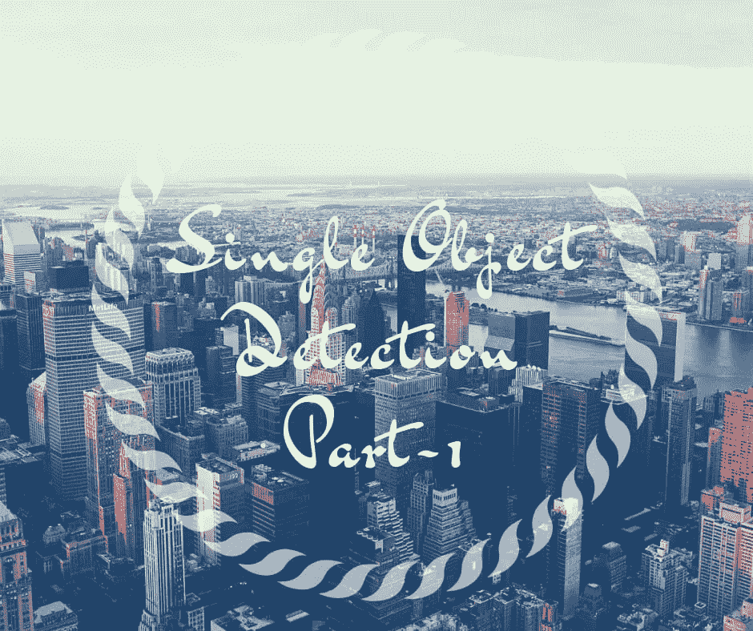

欢迎来到 fast.ai 的第 2 部分，在这里我们将处理**单个物体检测。**在我们开始之前，我要感谢[](https://twitter.com/jeremyphoward)**和 [**瑞秋·托马斯**](https://twitter.com/math_rachel) 为 AI 民主化所做的努力。**

**本部分假设您已经很好地理解了第 1 部分。以下是链接，请按以下顺序随意探索本系列的第一部分。**

1.  **[狗 Vs 猫图像分类](https://towardsdatascience.com/fast-ai-season-1-episode-2-1-e9cc80d81a9d)**
2.  **[犬种图像分类](https://towardsdatascience.com/fast-ai-season-1-episode-2-2-dog-breed-classification-5555c0337d60)**
3.  **[多标签图像分类](https://towardsdatascience.com/fast-ai-season-1-episode-3-a-case-of-multi-label-classification-a4a90672a889)**
4.  **[使用神经网络的时间序列分析](https://towardsdatascience.com/fast-ai-season-1-episode-4-1-time-series-analysis-a23217418bf1)**
5.  **[对 IMDB 电影数据集的 NLP 情感分析](https://geneashis.medium.com/nlp-sentiment-analysis-on-imdb-movie-dataset-fb0c4d346d23)**
6.  **[电影推荐系统基础](https://towardsdatascience.com/fast-ai-season-1-episode-5-1-movie-recommendation-using-fastai-a53ed8e41269)**
7.  **[从零开始协同过滤](https://towardsdatascience.com/fast-ai-season-1-episode-5-2-collaborative-filtering-from-scratch-1877640f514a)**
8.  **[使用神经网络的协同过滤](https://towardsdatascience.com/fast-ai-season-1-episode-5-3-collaborative-filtering-using-neural-network-48e49d7f9b36)**
9.  **[像尼采一样写哲学](https://geneashis.medium.com/fast-ai-season-1-episode-6-1-write-philosophy-like-nietzsche-using-rnn-8fe70cfb923c)**
10.  **[不同神经网络在 Cifar-10 数据集上的性能](https://geneashis.medium.com/fast-ai-season-1-episode-7-1-performance-of-different-neural-networks-on-cifar-10-dataset-c6559595b529)**
11.  **[ML 模型检测图像中最大的物体 Part-1](/hackernoon/single-object-detection-e65a537a1c31)**
12.  **[检测图像中最大物体的 ML 模型 Part-2](/hackernoon/single-object-detection-part-2-2deafc911ce7)**

**这篇博文分为两部分。**

*   **第一部分从熟悉对象检测到对象定位的数据格式开始。**
*   **第二部分处理图像中的最大项目分类器。**

**我们将使用的数据集是 PASCAL VOC (2007 版)。**

**让我们用编码部分来弄脏我们的手。**

**与所有机器学习项目一样，有三件事需要关注**

1.  ***提供数据。***
2.  ***挑选一些合适的架构。***
3.  ***选择一个损失函数。***

****第 1 步**将集中于以适当的形式获得数据，以便在此基础上进行分析。**

****步骤 1:-** 它包括对每幅图像中最大的物体进行分类和定位。该步骤包括:-**

*   **对对象进行分类。**
*   **定位物体。**
*   **标记定位的对象。**
*   **然后我们会尝试一次完成以上三个步骤。**

*****1.1。安装软件包*和****

**让我们使用如下所示的命令安装软件包并下载数据。**

```
# Install the packages
# !pip install [https://github.com/fastai/fastai/archive/master.zip](https://github.com/fastai/fastai/archive/master.zip)
!pip install fastai==0.7.0
!pip install torchtext==0.2.3
!pip install opencv-python
!apt update && apt install -y libsm6 libxext6
!pip3 install [http://download.pytorch.org/whl/cu80/torch-0.3.0.post4-cp36-cp36m-linux_x86_64.whl](http://download.pytorch.org/whl/cu80/torch-0.3.0.post4-cp36-cp36m-linux_x86_64.whl) 
!pip3 install torchvision# Download the Data to the required folder
!mkdir data
!wget [http://pjreddie.com/media/files/VOCtrainval_06-Nov-2007.tar](http://pjreddie.com/media/files/VOCtrainval_06-Nov-2007.tar) -P data/
!wget [https://storage.googleapis.com/coco-dataset/external/PASCAL_VOC.zip](https://storage.googleapis.com/coco-dataset/external/PASCAL_VOC.zip) -P data/
!tar -xf data/VOCtrainval_06-Nov-2007.tar -C data/
!unzip data/PASCAL_VOC.zip -d data/
!rm -rf data/PASCAL_VOC.zip data/VOCtrainval_06-Nov-2007.tar%matplotlib inline
%reload_ext autoreload
%autoreload 2!pip install Pillowfrom fastai.conv_learner import *
from fastai.dataset import *from pathlib import Path
import json
import PIL
from matplotlib import patches, patheffects 
```

**让我们检查一下我们的数据中有什么。我们将使用 python 3 标准库`pathlib`进行路径和文件访问。**

*****1.2。使用*** `***Pathlib***` ***对象了解你的数据。*****

**`data`文件夹包含不同版本的 [Pascal VOC](http://host.robots.ox.ac.uk/pascal/VOC/voc2007/) 。**

```
PATH = Path('data')
list((PATH/'PASCAL_VOC').iterdir())
**# iterdir() helps in iterating through the directory of PASCAL_VOC**
```

**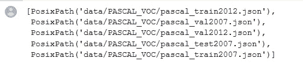**

*   **`PATH`是对目录或文件的面向对象的访问。它是 python 库`pathlib`的一部分。要了解如何利用`pathlib` 功能，请做一个`PATH.TAB`。**
*   **因为我们将只使用`pascal_train2007.json`，所以让我们来看看这个文件的内容。**

```
training_json = json.load((PATH/'PASCAL_VOC''pascal_train2007.json').open())
**# training_json is a dictionary variable.
# As we can see Pathlib object has an open method .
# json.load is a part of Json (Java Script Object Notation) library that # we have imported earlier.**training_json.keys()
```

**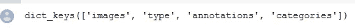**

**该文件包含**图像、类型、注释和类别**。为了使用*制表完成*，将其保存在适当的变量名中。**

```
IMAGES,ANNOTATIONS,CATEGORIES = ['images', 'annotations', 'categories']
```

**让我们详细看看每一个都有哪些细节:-**

**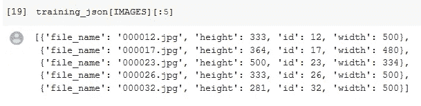**

*   ****图像**由**图像名称、高度、宽度和图像 id** 组成。**

**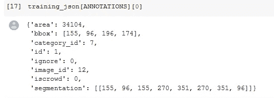**

*   ****注释**由**区域、bbox(边界框)、category_id** 组成(每个类别 id 都有一个与之相关的类或名称)。**
*   **一些图像具有多边形分割，即图像中对象周围的边界框。这对我们的讨论不重要。**
*   **如果**忽略标志=1(真)，忽略标志表示忽略图像中的对象。****

**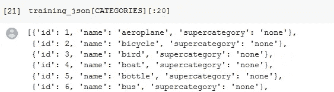**

*   ****类别**由类(名称)和与之相关的 ID 组成。**

**为了更容易理解所有这些，让我们把重要的东西转换成字典理解和列表理解。**

```
FILE_NAME,ID,IMG_ID,CATEGORY_ID,BBOX = 'file_name','id','image_id','category_id','bbox'categories = {o[ID]:o['name'] for o in training_json[CATEGORIES]}
**# The categories is a dictionary having  class and an ID associated with # it.**
**# Lets check out all of the 20 categories using the command below**
categories
```

**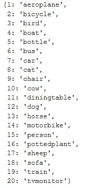**

```
**training_filenames = {o[ID]:o[FILE_NAME] for o in training_json[IMAGES]}
training_filenames** 
# contains the id and the filename of the images.
```

**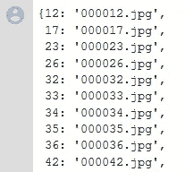**

```
**training_ids = [o[ID] for o in training_json[IMAGES]]
training_ids** # This is a list comprehension.
```

**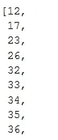**

**现在，让我们看看存放所有图像的文件夹。**

```
list((PATH/'VOCdevkit'/'VOC2007').iterdir())
**# The JPEGImages in red is the one with all the Images in it.**
```

**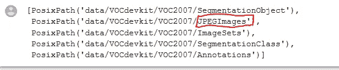**

```
JPEGS = 'VOCdevkit/VOC2007/JPEGImages'
IMG_PATH = PATH/JPEGS
**# Set the path of the Images as IMG_PATH** list(IMG_PATH.iterdir())[:5]
**# Check out all the Images in the Path**
```

**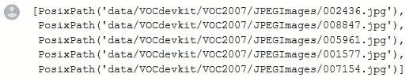****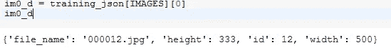****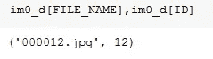**

****注意:-如上所示，每个图像都有一个与之相关联的唯一 id。****

*****1.3。边界框*****

**这里的主要目的是将我们的边界框转换成合适的格式，以便用于绘图。边界框坐标出现在注释中。**

> **边界框是图像中对象周围的框。**

**早先边界框坐标表示(列，行，高度，宽度)。看看下面的图片。**

**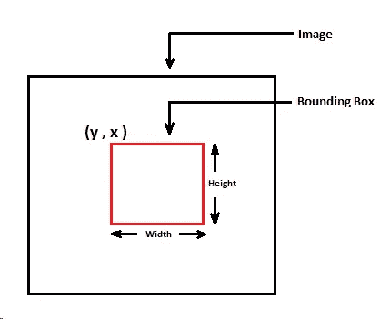**

*   **通过 **hw_bb()** 函数将坐标转换为 height_width 到 bounding_box，得到左上角和右下角的坐标，并以(行和列)的形式表示。**

```
**def hw_bb(bb): return np.array([bb[1], bb[0], bb[3]+bb[1]-1, bb[2]+bb[0]-1])**
```

*   **现在，我们将**创建一个字典，该字典将图像 id 作为*键*，其边界框坐标和类别 id 作为*值*** 。**

```
**# Python's defaultdict is useful any time you want to have a default     # dictionary entry for new keys. If you try and access a key that doesn’t # exist, it magically makes itself exist and 
# it sets itself equal to the return value of the function you specify   # (in this case lambda:[]).**
training_annotations = collections.defaultdict(lambda:[])
for o in training_json[ANNOTATIONS]:
    if not o['ignore']:
        bb = o[BBOX]
        bb = hw_bb(bb)
        training_annotations[o[IMG_ID]].append((bb,o[CATEGORY_ID]))
```

**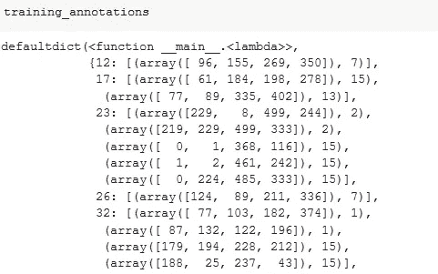**

*   **在上面的代码块中，我们检查了所有的注释，并考虑了那些没有说 ignore 的注释。之后，我们将它添加到一个**字典中，字典中的值是边界框(bbox)和类别 id(class ),对应的图片 id 是关键字。****
*   **一个问题是，如果还不存在字典条目，那么我们不能向它附加任何 bbox 和 class 列表。为了解决这个问题，我们使用了 Python 的 defaultdict，代码如下。**

```
training_annotations = collections.defaultdict(lambda:[])
```

*   **它是一个字典，但是如果我们正在访问一个不存在的键，那么`defaultdict`会神奇地创建一个字典，并设置它自己等于函数返回的值。在这种情况下，它是一个空列表。因此，每次我们访问训练注释中的键时，如果它不存在，`defaultdict`会创建一个新的空列表，我们可以向它追加内容。**

****有用图像相关信息的汇总****

**让我们深入了解特定图像的注释细节。正如我们在下面的快照中看到的。**

*   **我们拍一张特定的照片。**
*   **获取其注释，即 BBox 中对象的**边界框和类**。它表示类中存在哪些对象以及这些对象的坐标。**
*   **在下面的例子中检查这个类指的是什么。在这种情况下，类别是汽车。**

**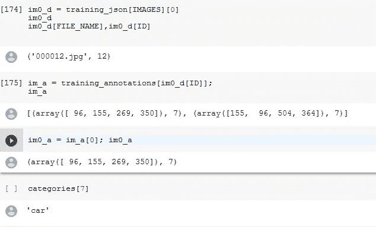**

**有些库采用 VOC 格式的边界框，因此 ***bb_hw()*** 函数有助于将尺寸重置为原始格式:**

```
bb_voc = [155, 96, 196, 174]
bb_fastai = hw_bb(bb_voc) **# We won't be using the below function for now .**
def bb_hw(a): return np.array([a[1],a[0],a[3]-a[1]+1,a[2]-a[0]+1])
```

****1.4*。围绕对象*绘制边界框****

**现在，我们将重点放在创建一个图像周围的边界框。为此，我们将逐步或在单独的函数中创建图。每一步都有明确的目的来创造一个情节。让我们看看每一步的目的。发帖说我们会把重点放在流量上。**

*   ****下面的代码用于获取轴，我们将在其上绘制图像。****

```
def show_img(im, figsize=None, ax=None):
**# The ax is used to pass in an axis object.** 
   if not ax: fig,ax = plt.subplots(figsize=figsize)
   ax.imshow(im)
   ax.get_xaxis().set_visible(False)
   ax.get_yaxis().set_visible(False)
   return ax
```

*   ****使用以下代码在图像中的对象周围绘制一个矩形。****

```
def draw_rect(ax, b):
    patch = ax.add_patch(patches.Rectangle(b[:2], *b[-2:], fill=False, edgecolor='white', lw=2))
    draw_outline(patch, 4)**# *b[-2:] in the argument list is the splat operator . It passes b[-2],b[-1] as parameters. Its a shortcut.**
```

*   ****`**draw_outline()**`**用于使文本可见，不受背景影响。因此，这里我们使用黑色轮廓的白色文本，反之亦然。******

```
**def draw_outline(o, lw):
    o.set_path_effects([patheffects.Stroke(
        linewidth=lw, foreground='black'), patheffects.Normal()])**# foreground='black' means to create a black stroke around it.****
```

*   ****在边框附近以文本的形式写下图像所属的类别。****

```
**def draw_text(ax, xy, txt, sz=14):
    text = ax.text(*xy, txt,
        verticalalignment='top', color='white', fontsize=sz, weight='bold')
    draw_outline(text, 1)**# Add text and draw outline around it.****
```

*   ****下面是如何在图像中的物体周围创建一个边界框的流程。****

```
****# Step 1 :- Returns the axis the image is on by calling the function     # show_img().**
ax = show_img(im)
**# Step 2 :- Convert the bounding box coordinates into proper format by   # calling the function bb_hw().**
b = bb_hw(im0_a[0])
**# Step 3:- Draw a rectangle /Bounding box around the object by calling   # the function draw_rect().**
draw_rect(ax, b)
**# Step 4:- Draw the text near the top left corner b[:2]** .
**# And it contains two things , the bounding box  and the class ,
# im0_a[1] is the class and to get the text , pass it into               # categories[im0_a[1]]
# by calling the function draw_text().**
draw_text(ax, b[:2], categories[im0_a[1]])** 
```

****让我们用如下所示的函数来总结流程步骤****

```
**def draw_im(im, ann):
    ax = show_img(im, figsize=(16,8))
    for b,c in ann: **# Destructure the annotations into bbox and class**
        b = bb_hw(b) **# Convert it into appropriate coordinates**
        draw_rect(ax, b) **# Draw rectangle bbox around it.**
        draw_text(ax, b[:2], categories[c], sz=16) 
 **# Write some text around it**def draw_idx(i):
    im_a = training_annotations[i] **# Grab the annotations with the help of the image id.**
    im = open_image(IMG_PATH/training_filenames[i]) **# Open that Image**
    print(im.shape) **# Print its shape**
    draw_im(im, im_a) **# Call the draw and print its text**draw_idx(17) 
**# Draw an image of a particular index.****
```

****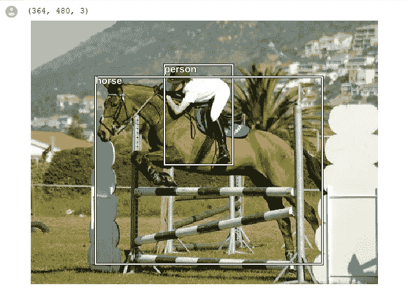****

****让我们在这里详细总结一下流程:-****

*   ****`**draw_idx(17)**` 调用`**def draw_idx(i)**:`函数，该函数获取已传递给该函数的 17 号图像的注释。****
*   ******注意:-对象的注释是该图像中对象的边界框以及该对象所属的类。******
*   ****在`**def draw_idx(i)**` 函数中，获取注释后，我们打开图像，打印出它的形状。****
*   ****然后我们用图像及其标注调用`**def draw_im(im, im_a)**` 函数。****
*   ****在这个`**def draw_im(im, im_a)**` 函数中，首先我们打印图像。****
*   ****然后在 for 循环中，我们遍历每个注释，将边界框和类分别存储在 b 和 c 中。这也称为赋值的析构。****
*   ****使用此`**bb_hw(b)**` 功能将边界框坐标转换成合适的坐标，即左上角和右下角坐标。****
*   ****`**draw_rect(ax, b)**` **:-** 使用这个函数，我们在边界框周围画一个矩形。****
*   ****`**draw_text(ax, b[:2], categories[c], sz=16)**` **:-** 使用这个功能，我们正在写一些文字。****

****这就是我们在图像中定位物体的方式。下一步是对图像中最大的项目进行分类。我们将在[下一篇博文](https://medium.com/p/2deafc911ce7/edit)中详细讨论下一步。****

****大声疾呼 [Anwesh Satapathy](/@anweshsatapathy) 和 [Sharwon Pius](https://twitter.com/shar1pius) 用简单的方式说明了这个问题。请查看他的 [github Repo](https://github.com/AI6-Bangalore-Chapter/2018-cycle-2/tree/master/Sessions/Session_12) 和单个对象检测的简化路线图。****

****如果您有任何疑问，请随时在 twitter 上提出 [@ashiskumarpanda](https://twitter.com/ashiskumarpanda) 或在 fastai 论坛上查看。****

*******如果看到了👏 👏按钮，如果你喜欢这篇文章，请随意做你需要做的😄😄😄😄😄。*******

****被杰瑞米·霍华德赏识的感觉真的很好。看看他对我的 Fast.ai 第一部分博客的看法。一定要看一看。****