# 检测图像中最大对象的 ML 模型第 2 部分

> 原文：<https://medium.com/hackernoon/single-object-detection-part-2-2deafc911ce7>

## 2-在包围盒的帮助下对图像中的对象进行分类和定位。


([此处阅读第 1 部分](https://medium.com/p/e65a537a1c31/edit))

欢迎来到 fast.ai 的第二部分。这是 [Fastdotai](http://www.fast.ai/) 的第 8 课，我们将处理**单个物体检测。**在我们开始之前，我想感谢 [**杰瑞米·霍华德**](https://twitter.com/jeremyphoward) 和 [**雷切尔·托马斯**](https://twitter.com/math_rachel) 为 AI 民主化所做的努力。

第二部分假设对第一部分有很好的理解。以下是链接，请按以下顺序随意探索本系列的第一部分。

1.  [狗 Vs 猫图像分类](https://towardsdatascience.com/fast-ai-season-1-episode-2-1-e9cc80d81a9d)
2.  [犬种图像分类](https://towardsdatascience.com/fast-ai-season-1-episode-2-2-dog-breed-classification-5555c0337d60)
3.  [多标签图像分类](https://towardsdatascience.com/fast-ai-season-1-episode-3-a-case-of-multi-label-classification-a4a90672a889)
4.  [利用神经网络进行时间序列分析](https://towardsdatascience.com/fast-ai-season-1-episode-4-1-time-series-analysis-a23217418bf1)
5.  [对 IMDB 电影数据集的 NLP 情感分析](https://geneashis.medium.com/nlp-sentiment-analysis-on-imdb-movie-dataset-fb0c4d346d23)
6.  [电影推荐系统的基础](https://towardsdatascience.com/fast-ai-season-1-episode-5-1-movie-recommendation-using-fastai-a53ed8e41269)
7.  [从无到有的协同过滤](https://towardsdatascience.com/fast-ai-season-1-episode-5-2-collaborative-filtering-from-scratch-1877640f514a)
8.  [使用神经网络的协同过滤](https://towardsdatascience.com/fast-ai-season-1-episode-5-3-collaborative-filtering-using-neural-network-48e49d7f9b36)
9.  [像尼采一样写哲学](https://geneashis.medium.com/fast-ai-season-1-episode-6-1-write-philosophy-like-nietzsche-using-rnn-8fe70cfb923c)
10.  [不同神经网络在 Cifar-10 数据集上的性能](https://geneashis.medium.com/fast-ai-season-1-episode-7-1-performance-of-different-neural-networks-on-cifar-10-dataset-c6559595b529)
11.  [ML 模型检测图像中最大的物体 Part-1](/hackernoon/single-object-detection-e65a537a1c31)
12.  [ML 模型检测图像中最大的物体 Part-2](/hackernoon/single-object-detection-part-2-2deafc911ce7)

这篇博文关注的是**对图片**中最大的物体进行分类。我们将使用的数据集是 PASCAL VOC (2007 版)。这是[上一部](/@GeneAshis/single-object-detection-e65a537a1c31)的延续。请登录查看

1.  [单个物体检测](/@GeneAshis/single-object-detection-e65a537a1c31)

希望你们记得我们之前讨论的内容。

***1.5。找到图像中最大的物体***

*   众所周知，每个图像都有多个对象，而多个对象都有多个与之相关联边界框。我们的目标是找到图像中最大的对象，这可以从图像中对象周围的包围盒区域中得到。为此，我们将利用以下最大的项目分类器函数。

```
**# get largest**
def get_largest(b):
    if not b: raise Exception()
    b = sorted(b, key=**lambda x:** **np.product(x[0][-2:]-x[0][:2])**, reverse=True)
    return b[0]
```

*   让我们分解上面的函数。假设我们对特定图像的注释是`x = ([96, 155, 269, 350],16)`。在我们继续之前，让我提醒您，注释是一个元组，包含边界框和边界框所属的类。边界框代表左上角和右下角的坐标。如下图。

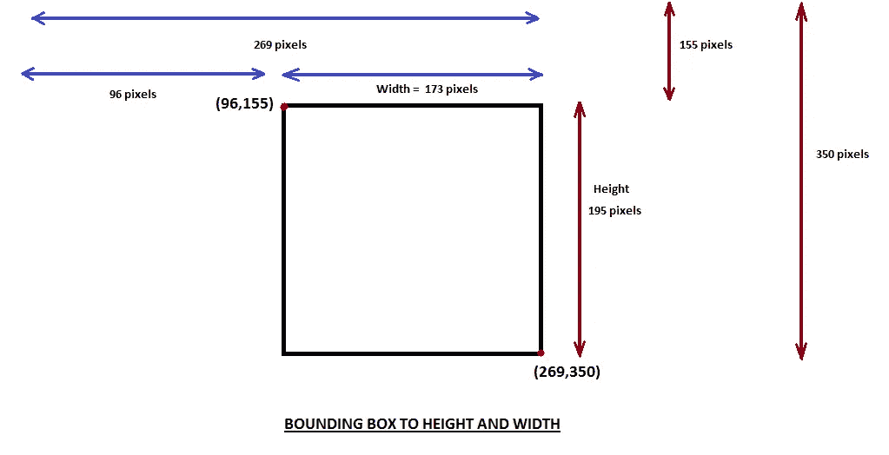

下面的快照详细解释了上图。

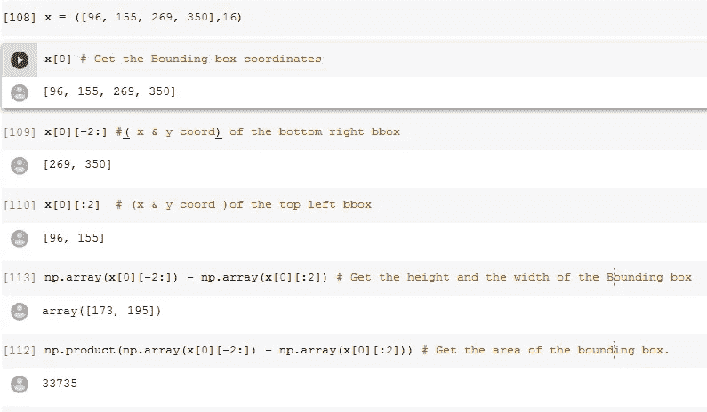

在上面的函数中，我们使用了下面的代码

```
b = sorted(b, key=lambda x: np.product(x[0][-2:]-x[0][:2]), reverse=True)
```

获取图像中所有边界框的面积，然后按面积排序。`b[0]`返回第一个边界框，即最大的一个。

现在，让我们创建一个字典，其中的键是 Image ID，值是一个包含最大边界框及其类的元组。

```
training_largest_annotations = {a: get_largest(b) for a,b in training_annotations.items()}
**training_annotations[17]**
```

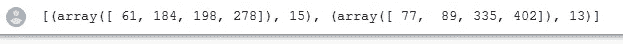

**图像 ID 17** 包含两个属于类别 15 和 13 的边界框。为了获得这两个中最大的边界框:-

```
training_largest_annotations[17]
```

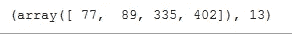

***1.6。绘制图像中最大的对象***

因为我们有一个图像及其相应的 bbox 和它的类的字典。让我们画出这个。

```
b,c = training_largest_annotations[17]
b = bb_hw(b)
ax = show_img(open_image(IMG_PATH/training_filenames[17]), figsize=(5,10))
draw_rect(ax, b)
draw_text(ax, b[:2], categories[c], sz=16)
```

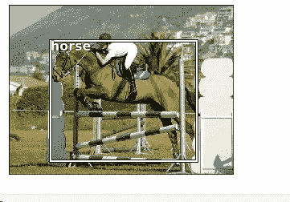

这个字典包含了我们将从中获取图像文件名和图像中最大的类的数据。在这里，我们得到了图像中的**马**和**人**。马是最大的物体，正在被绘制。利用这些信息，我们可以进行建模。因此把它转换成一个`**.CSV**`文件数据。我们用熊猫来做这件事。

***1.7。为建模获取适当格式的数据。***

*   设置 CSV 文件应该存在的路径。

```
(PATH/'tmp').mkdir(exist_ok=True)
CSV = PATH/'tmp/lrg.csv'
```

*   CSV 文件有两列，一列包含图像文件名(fn ),另一列包含图像中的对象所属的类别/类。

```
df = pd.DataFrame({'fn': [training_filenames[o] for o in training_ids],
    'cat': [categories[training_largest_annotations[o][1]] for o in training_ids]}, columns=['fn','cat'])
df.to_csv(CSV, index=False)
```

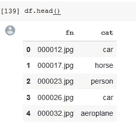

**步骤 2 :-为最大项目分类器的建模获得合适的架构。**

在这一步中，我们训练我们的模型来寻找图像中最大的物体。

```
f_model = resnet34
sz=224
bs=64
```

从这里开始，它就像狗和猫的分类器。

```
tfms = tfms_from_model(f_model, sz, aug_tfms=transforms_side_on, crop_type=CropType.NO)
md = ImageClassifierData.from_csv(PATH, JPEGS, CSV, tfms=tfms, bs=bs)
```

*   在`tfms_from_model(...)`函数中，我们没有裁剪`crop_type=CropType.NO`。我们不是裁剪，而是挤压图像。
*   我们通常如何调整大小？？将最小的边设置为 224，然后在训练期间随机进行方形裁剪。除非我们使用数据扩充，否则在验证过程中采取中间裁剪。对于边界框来说，这与 Imagenet 不同，在 Imagenet 中，我们关心的东西主要在中心，而且非常大，对象检测中的许多东西非常小，可能也更接近边缘。
*   使用`ImageClassifierData.from_csv()`,我们正在创建模型数据，即格式化数据，以便它可以按照 fastai 格式使用。

使用下面的代码片段可以可视化图像的挤压

```
show_img(md.val_ds.denorm(to_np(x))[0]);
```

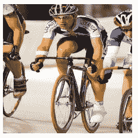

现在让我们检查一下我们的数据加载器:-

```
x,y=next(iter(md.val_dl))
```

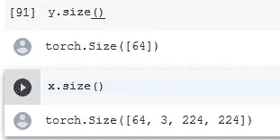

因此，数据加载器抓取一批 64 个图像，其中`x`包含这 64 个图像，`y`包含这 64 个图像所属的类。

如果我们查看一下`x` 的值，我们会发现这些值不在 0 和 1 之间。这是因为对输入做了大量的处理，以使其准备好传递给预训练的模型。它使用硬编码的图像统计做一些标准化。要了解更多，请使用`?? tfms_from_model`查看转换函数。

现在，当我们想要可视化来自验证数据加载器的图像时，我们必须去规格化图像，因为它已经在`tfms_from_model`中被规格化了。这就是为什么我们使用:-

```
show_img(md.val_ds.**denorm**(to_np(x))[0]);
```

反规格化不仅对图像进行反规格化，还修正了维数顺序。Denorm 是一种撤销已经应用到`**md.val_ds**` **的每一个变换。通过小批量，但你必须先把它变成小批量。**

让我们建立神经网络。这里的`f_model=resnet34`，前面描述过。使用的优化器是 Adam。

```
learn = ConvLearner.pretrained(f_model, md, metrics=[accuracy])
learn.opt_fn = optim.Adam
lrf=learn.lr_find(1e-5,100)
learn.sched.plot()
```

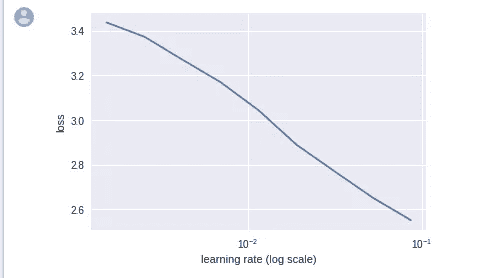

我们没有看到上升的原因是因为我们已经默认删除了前几个和最后几个点。这是由于最后几个点实际上射向无穷大的原因，即它们的损失太大，所以我们基本上看不到任何东西。因此删除它。要撤消这一操作并使上升可视化，请使用下面的代码:-

```
learn.sched.plot(n_skip=5, n_skip_end=1)
```

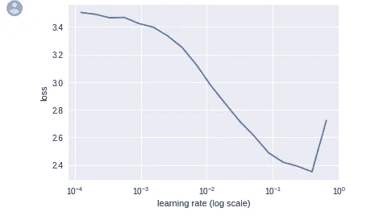

上面的代码所做的是，它从开始跳过 5 个点，从结尾跳过 1 个点，这样除了这些点之外的所有点都可以被可视化。

让我们在这个模型的基础上用`lr=2e-2`做一些训练，如图所示。

```
lr = 2e-2
learn.fit(lr, 1, cycle_len=1)
```

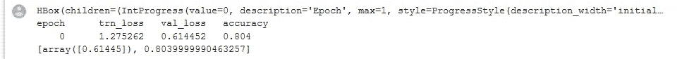

只要训练最后一层，我们就能得到 80%的准确率。

**解冻几层并训练**

```
lrs = np.array([lr/1000,lr/100,lr])
learn.freeze_to(-2)
lrf=learn.lr_find(lrs/1000)
learn.sched.plot(1)
```

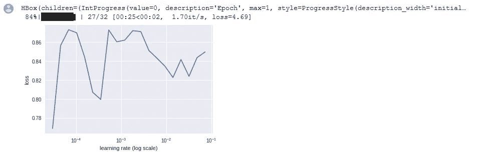

```
learn.fit(lrs/5, 1, cycle_len=1)
```

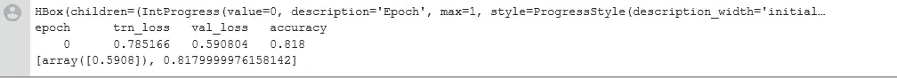

现在我们已经达到了 81%的更好的准确率。

解冻所有层并训练:-

```
learn.unfreeze()
learn.fit(lrs/5, 1, cycle_len=2)
```

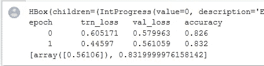

为什么准确率没有提高到 83%以上？

不像狗对猫或 ImageNet，每个图像有一个主要的东西。这是我们被要求去寻找的一件重要的事情。但是在 Pascal 数据集中，我们有很多小东西。所以即使是最好的分类器也不一定能做得很好。让我们来看看结果。

```
fig, axes = plt.subplots(3, 4, figsize=(12, 8))
for i,ax in enumerate(axes.flat):
    ima=md.val_ds.denorm(x)[i]
    b = md.classes[preds[i]]
    ax = show_img(ima, ax=ax)
    draw_text(ax, (0,0), b)
plt.tight_layout()
```

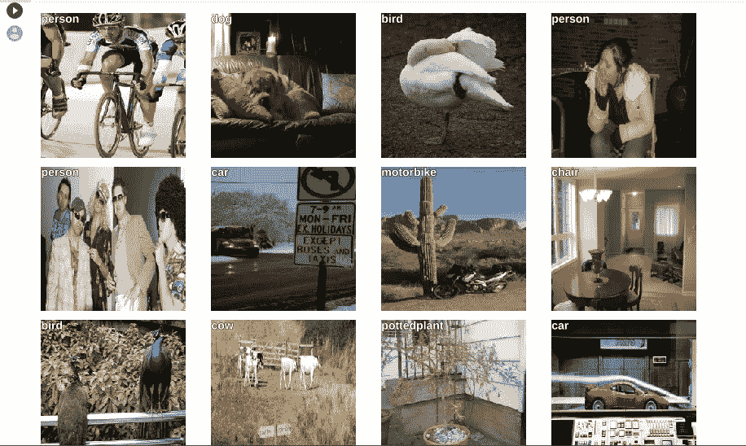

在上面的例子中，我们的模型可以找到图像中最大的物体。现在让我们在图像中最大的物体周围放置一个边界框。

**步骤 3:-获得一个合适的架构，用于对图像中最大对象周围的边界框进行建模。**

*   **如何创建包围盒？**

为此，只需要弄清楚两件事

1.  创建一个有四个激活的神经网络，预测四个数字，即最大对象的边界框边缘(左上坐标和右下坐标)。这是一个有四个输出的回归问题。
2.  以这样一种方式决定损失函数，当它最小化时，我们的四个预测数字相当好。让我们看看如何做到这一点。

```
BB_CSV = PATH/'tmp/bb.csv'
bb = np.array([training_largest_annotations[o][0] for o in training_ids])
**# Pick largest item in the image.**
bbs = [' '.join(str(p) for p in o) for o in bb]
**# Create bounding boxes separated by space.**
df = pd.DataFrame({'fn': [training_filenames[o] for o in training_ids], 'bbox': bbs}, columns=['fn','bbox'])
**# Put the image filename in one column 'fn' and bounding box of the largest object in that image in the 'bbox' column** df.to_csv(BB_CSV, index=False)
**# Write it in a .csv file**
BB_CSV.open().readlines()[:5]
**# Check out how the data is stored in the below snapshot.
# To do multiple label classification , the multiple labels should be space separated and file name should be comma separated.**
```

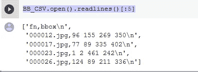

**注意:-当我们对图像进行缩放或数据扩充时，也需要对边界框坐标进行缩放或数据扩充。**

但是为什么呢？

在前面的分类案例中，我们使用来扩充数据集中的图像。但是在边界框的情况下有一个小的变化。这里我们得到了图像和图像中物体的边界框坐标。在这种情况下，我们必须增加因变量，即边界框坐标以及图像。所以让我们看看如果我们只放大图像会发生什么。

```
augs = [RandomFlip(), 
        RandomRotate(30),
        RandomLighting(0.1,0.1)]
tfms = tfms_from_model(f_model, sz, crop_type=CropType.NO, aug_tfms=augs)
md = ImageClassifierData.from_csv(PATH, JPEGS, BB_CSV, tfms=tfms, continuous=True, bs=4)
idx=3
fig,axes = plt.subplots(3,3, figsize=(9,9))
for i,ax in enumerate(axes.flat):
    x,y=next(iter(md.aug_dl))
    ima=md.val_ds.denorm(to_np(x))[idx]
    b = bb_hw(to_np(y[idx]))
    print(b)
    show_img(ima, ax=ax)
    draw_rect(ax, b)
```

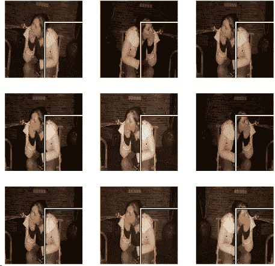

如我们所见，当我们增大图像而不是边界框坐标时，图像被增大，而表示图像中对象坐标的边界框保持不变，这是不正确的。这使得数据是错误的。换句话说，当增强图像改变时，表示图像中的对象的边界框保持不变。因此，我们需要增加因变量，即边界框坐标，因为这两者是相互关联的。边界框坐标应该像图像坐标一样经历所有的几何变换。正如在下面的粗体代码中可以看到的，我们使用了`**tfm_y=TfmType.COORD**` 参数，这明确意味着无论对图像进行什么样的放大，也应该对边界框坐标进行放大。

```
augs = [RandomFlip(**tfm_y=TfmType.COORD**),
        RandomRotate(3,p=0.5, **tfm_y=TfmType.COORD**),
        RandomLighting(0.1,0.1, **tfm_y=TfmType.COORD**)]
# **RandomRotate** **parameters:- Maximum of 3 degree of rotations .p=0.5 means rotate the image half of the time.**tfms = tfms_from_model(f_model, sz, crop_type=CropType.NO, **tfm_y=TfmType.COORD,** aug_tfms=augs)# **Adding (tfm_y=TfmType.COORD) helps in changing the bounding box coordinates in case the model is squeezing or zooming the image**md = ImageClassifierData.from_csv(PATH, JPEGS, BB_CSV, tfms=tfms, **continuous=True**, bs=4)**# Note that we have to tell the transforms constructor that our labels are coordinates, so that it can handle the transforms correctly.**
idx=4
fig,axes = plt.subplots(3,3, figsize=(9,9))
for i,ax in enumerate(axes.flat):
    x,y=next(iter(md.aug_dl))
    ima=md.val_ds.denorm(to_np(x))[idx]
    b = bb_hw(to_np(y[idx]))
    print(b)
    show_img(ima, ax=ax)
    draw_rect(ax, b)
```

`**TfmType.COORD**` 基本上代表了如果我们对图像应用翻转变换，我们需要相应地改变包围盒坐标。因此，我们将`**TfmType.COORD**` 添加到应用于图像的所有变换中。

如果我们看到下图，这是有道理的。边界框随着图像不断变化，并在正确的位置表示对象。

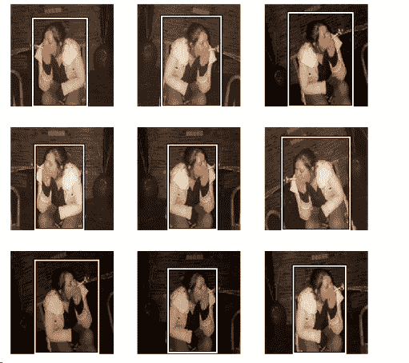

现在，基于 resnet34 创建一个 ConvNet，但是这里有一个变化。我们不希望在已经创建了分类器的最后有任何标准的 FC 层集，而是希望添加具有四个输出的单个层，因为这是一个回归问题。

```
**head_reg4** = nn.Sequential(Flatten(), nn.Linear(25088,4))
**# Append head_reg4 on top of resnet34 model which will result in creation of regressor that predicts four values as output as shown in the code below.
# Here it is creating a tiny model that flattens the previous layer of the dimensions 7*7*512 =25088 and brings it down to 4 activations**learn = ConvLearner.pretrained(f_model, md, custom_head=head_reg4)
learn.opt_fn = optim.Adam
**# Use Adam optimizer to optimize the loss function.**learn.crit = nn.L1Loss()
**# The loss function here is L1 loss.**
```

`**ConvLearner.pretrained(...)**` 中的`**custom_head**` 参数添加在模型顶部。它阻止创建任何完全连接的层和自适应最大池层，这是默认情况下完成的。相反，它会用我们要求的任何型号来取代那些型号。这里我们想要四个代表边界框坐标的激活。我们将把这个`**custom_head**` 放在预训练的模型上，然后训练一段时间。

检查最后一层:-

```
learn.summary()
```

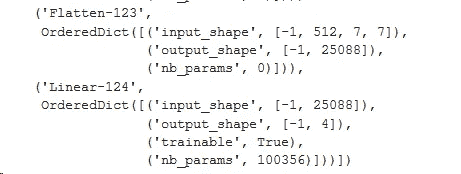

在这一步之后，同样要找到一个最佳的学习率，并使用这个学习率来训练你的神经网络模型。让我们看看这是怎么做到的

```
learn.lr_find(1e-5,100)
learn.sched.plot(5)
```


```
lr = 2e-3
learn.fit(lr, 2, cycle_len=1, cycle_mult=2)
lrs = np.array([lr/100,lr/10,lr])
learn.freeze_to(-2)
lrf=learn.lr_find(lrs/1000)
learn.sched.plot(1)
learn.fit(lrs, 2, cycle_len=1, cycle_mult=2)
learn.freeze_to(-3)
learn.fit(lrs, 1, cycle_len=2)
learn.save('reg4')
learn.load('reg4')
x,y = next(iter(md.val_dl))
learn.model.eval()
preds = to_np(learn.model(VV(x)))fig, axes = plt.subplots(3, 4, figsize=(12, 8))
for i,ax in enumerate(axes.flat):
    ima=md.val_ds.denorm(to_np(x))[i]
    b = bb_hw(preds[i])
    ax = show_img(ima, ax=ax)
    draw_rect(ax, b)
plt.tight_layout()
```

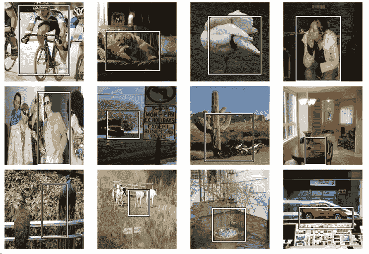

从上面预测的输出快照可以看出，它做得非常好。虽然它在孔雀和牛的例子中失败了。

在我们的下一篇博文中，我们将结合步骤 2 和步骤 3。**这将帮助我们预测图像中最大的对象，同时预测该最大对象的边界框。**

这篇博文涵盖了很多东西。你可能会有这样的感觉

不过没关系！！！我强烈建议您回到上一部分，检查流程。我已经用**粗体**点标出了重要的东西，它将帮助你理解中间的重要步骤。

感谢你坚持这一部分。

在我的下一篇博文中，我们将会看到如何将第二步和第三步结合起来。从计算机视觉的角度来看，这并不是什么新鲜事，但这正是我们将要深入探讨的 Pytorch 编码之美。

在那之前再见..

被杰瑞米·霍华德赏识的感觉真的很好。看看他对我的 Fast.ai 第一部分博客的看法。一定要看一看。